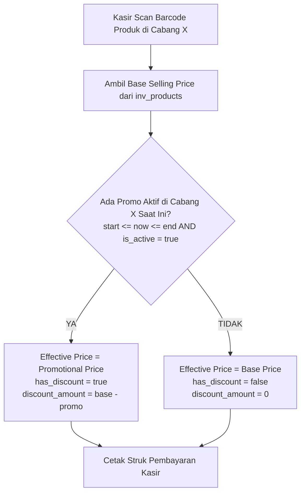

# Kamus & Jurnal Belajar Arsitektur ERP Retail Modular

Dokumen ini adalah buku catatan belajar (_learning companion_) yang merangkum konsep-konsep teknis, pola kode, dan arsitektur backend/frontend pada proyek ini menggunakan **analogi sederhana dunia nyata**.

---

## 🏬 1. Pondasi Arsitektur Makro

### 1.1 Modular Monolith

- **Konsep Teknis:** Satu repositori dan satu binary server yang sama, tetapi kode di dalamnya dipisah secara tegas menjadi modul-modul independen (`inventory`, `purchasing`, `sales`, `finance`).
- **Analogi Dunia Nyata:** **Sebuah Gedung Mall Besar dengan Toko-Toko Tersekat Tembok Rapi.**
  - _Bukan Monolith Spaghetti (Pasar Tradisional Kumuh):_ Di mana semua barang pedagang campur aduk tanpa batas.
  - _Bukan Microservices (Ruko Terpisah di Kota Berbeda):_ Yang butuh biaya sewa jalan tol, jaringan telepon rumit, dan rawan macet/gagal jaringan hanya untuk saling menyapa.
  - _Modular Monolith:_ Semua berada di bawah atap yang sama (efisien, cepat), namun setiap toko memiliki kunci pintu dan pembukuannya sendiri.

---

### 1.2 Bounded Context (Konteks Terisolasi)

- **Konsep Teknis:** Setiap modul memiliki model datanya sendiri dan tidak boleh menggunakan definisi milik modul lain secara serampangan.
- **Analogi Dunia Nyata:** **Beda Bahasa Antar Divisi Perusahaan.**
  - Bagi orang gudang (**Inventory**), kulkas adalah _"Stock Item"_ dengan ukuran dimensi dan nomor seri fisik.
  - Bagi orang kasir (**Sales**), kulkas adalah _"Item Menu"_ dengan harga diskon dan tombol klik.
  - Bagi orang akuntan (**Finance**), kulkas adalah _"Asset Persediaan"_ senilai nominal rupiah.
  - Mereka tidak perlu saling memaksakan definisi. Yang terpenting cukup bertukar nomor kode referensi saja (`product_id`).

---

### 1.3 Lisensi Berbasis Modul (_Feature Gating_)

- **Konsep Teknis:** Modul yang tidak dibeli oleh klien tidak boleh terpasang sama sekali di memori saat aplikasi dijalankan (`main.go`).
- **Analogi Dunia Nyata:** **Saklar Listrik Kamar Sewa.**
  - Jika penyewa gedung tidak menyewa lantai 2 (misal modul `purchasing`), maka saklar lantai 2 dimatikan dari panel utama (`main.go`).
  - Lampunya padam, lift tidak berhenti di lantai itu, dan tidak ada satpam yang berjaga. Sangat hemat energi dan tidak ada pengunjung yang bisa nyasar masuk.

---

## 🧱 2. Jeroan Modul: 4 Layer DDD (Domain-Driven Design)

Setiap modul di dalam `/internal/modules/` memiliki 4 lapisan dapur internal:

```text
[Interfaces]     -> Pelayan & Meja Kasir (Menerima Tamu)
     ↓
[Application]    -> Koki Eksekutor (Mengolah Pesanan)
     ↓
[Domain]         -> Buku Resep & Standar Rasa SOP (Aturan Murni)
     ↓
[Infrastructure] -> Gudang Lemari Es & Truk Suplai (Database & Jaringan)
```

| Layer                 | Fungsi Teknis                                                                                        | Analogi Dunia Nyata (Restoran)                                                                                                                                                           |
| :-------------------- | :--------------------------------------------------------------------------------------------------- | :--------------------------------------------------------------------------------------------------------------------------------------------------------------------------------------- |
| **`domain/`**         | Entity bisnis, aturan validasi, dan interface repository. Bebas dari database atau framework apapun. | **Buku Resep Rahasia & SOP Murni.** Menentukan bahwa _"Nasi goreng tidak boleh pakai gula pasir"_. Buku resep ini tidak peduli apakah koki memasak pakai kompor gas atau kompor listrik. |
| **`application/`**    | Use Case / Command Handler. Mengatur langkah kerja dan alur bisnis.                                  | **Koki yang Memasak.** Membaca buku resep (Domain), meminta bahan dari lemari es (Infrastructure), lalu menghasilkan masakan.                                                            |
| **`infrastructure/`** | Query SQL (PostgreSQL), koneksi database, integrasi pihak ketiga.                                    | **Gudang Bahan Mentah & Lemari Es.** Tempat fisik barang disimpan secara nyata di rak/lemari (Database).                                                                                 |
| **`interfaces/`**     | HTTP Handlers, URL Routes, JSON DTO (Data Transfer Object).                                          | **Pelayan Meja & Kasir Depan.** Menyapa tamu (request dari browser), mencatat pesanan tamu ke kertas nota (DTO), lalu mengantar nota ke koki.                                            |

---

## ⚙️ 3. Komponen & Pola Kunci di Backend Go

### 3.1 `module.go` (Facade & Composition Root)

- **Konsep Teknis:** File utama di akar modul yang merakit (_wiring_) seluruh layer via fungsi `New(...)` dan mengekspos fungsi `Register(...)` serta interface publik (`InventoryService`).
- **Analogi Dunia Nyata:** **Meja Front Desk / Resepsionis Khusus Divisi.**
  - Tamu dari divisi lain (modul lain) tidak boleh masuk ke dapur atau membuka lemari arsip sembarangan.
  - Mereka cukup datang ke Meja Front Desk (`module.go`) dan berbicara lewat formulir resmi (`InventoryService`).

---

### 3.2 `http.ServeMux` (Router Standar Go)

- **Konsep Teknis:** Multiplexer bawaan Go (package `net/http`) yang mencocokkan pola HTTP Method dan URL dengan fungsi handler yang sesuai.
- **Analogi Dunia Nyata:** **Polisi Pengarah Lalu Lintas di Perempatan.**
  - Mobil datang dengan plat `GET /api/v1/inventory/products`.
  - Polisi (`ServeMux`) meniup peluit dan mengarahkan mobil ke jalur kanan (fungsi `handler.List`).
  - Jika jalurnya belum pernah didaftarkan (misal lisensi modul mati), polisi langsung pasang plang penutup jalan: **404 Not Found**.

---

### 3.3 Dependency Injection (DI) Manual

- **Konsep Teknis:** Menyusun komponen dari bawah ke atas dengan mengoper objek dependensi melalui parameter konstruktor `New(...)` tanpa framework/library refleksi.
- **Analogi Dunia Nyata:** **Merakit Komputer PC dengan Kabel Bening.**
  - Anda memasang motherboard, lalu mencolokkan prosesor dan kabel power secara jelas satu per satu dengan tangan sendiri.
  - Anda tahu persis kabel mana tersambung ke komponen mana. Tidak ada "sihir gelap" (_magic container_), sehingga ketika ada masalah, sangat mudah dilacak!

---

### 3.4 In-Process Event Bus

- **Konsep Teknis:** Jalur komunikasi asinkron antar modul untuk efek samping yang _eventually-consistent_.
- **Analogi Dunia Nyata:** **Pengeras Suara (Paging System) di Mall.**
  - Kasir toko selesai memproses pembayaran, lalu mengumumkan di mikrofon: _"Perhatian, Transaksi #123 telah lunas!"_
  - Kasir **tidak perlu** berjalan kaki mendatangi divisi gudang dan divisi akuntansi satu per satu.
  - Bagian Gudang yang mendengar suara langsung menyiapkan barang; bagian Akuntansi yang mendengar langsung mencatat buku kas.

---

### 3.5 Tanpa Foreign Key Lintas Modul

- **Konsep Teknis:** Modul `sales` menyimpan `product_id`, tetapi tidak ada constraint `FOREIGN KEY` di level database ke tabel `inv_products`.
- **Analogi Dunia Nyata:** **Menyimpan Nomor Kontak Teman di Buku Telepon.**
  - Anda hanya mencatat nomor teleponnya. Buku telepon Anda tidak terikat secara gaib dengan fisik teman Anda.
  - Jika teman Anda pindah rumah atau ganti model pakaian, buku telepon Anda tetap aman dan tidak rusak.

---

### 3.6 Standar ID: UUIDv7

- **Konsep Teknis:** ID unik 128-bit yang menggabungkan stempel waktu milidetik (_unix timestamp_) di bagian depan dan keacakan (_entropy_) di bagian belakang.
- **Analogi Dunia Nyata:** **Nomor Resi Pengiriman Barang Berstempel Tanggal.**
  - _Kenapa bukan Auto-Increment (1, 2, 3...)?_ Supaya orang luar tidak bisa menebak: _"Oh, toko ini hari ini baru ada 3 pesanan!"_
  - _Kenapa bukan UUIDv4 biasa (acak total)?_ Karena jika acak total, arsip lemari database akan berantakan seperti menaruh berkas di laci sembarangan. UUIDv7 terurut rapi berdasarkan waktu pembuatan, sehingga pencarian di database tetap secepat kilat!

---

## 📌 Ringkasan Cepat: Cheat Sheet Analogi

| Istilah Teknis               | Analogi Sederhana Dunia Nyata                              |
| :--------------------------- | :--------------------------------------------------------- |
| **Modular Monolith**         | Gedung Mall dengan toko-toko tersekat dinding rapi         |
| **Bounded Context**          | Kamus bahasa dan sudut pandang khusus tiap divisi          |
| **Lisensi / Feature Gating** | Saklar listrik kamar yang dimatikan jika belum disewa      |
| **Domain Layer**             | Buku resep rahasia & standar SOP murni                     |
| **Application Layer**        | Koki yang memasak mengikuti resep                          |
| **Infrastructure Layer**     | Lemari es bahan mentah (Database) & kurir                  |
| **Interfaces Layer**         | Pelayan ramah penerima pesanan tamu                        |
| **`module.go`**              | Meja resepsionis/front-desk pintu masuk modul              |
| **`http.ServeMux`**          | Polisi pengarah lalu lintas jalur rute jalan               |
| **Dependency Injection**     | Merakit PC rakitan dengan susunan kabel transparan         |
| **Event Bus**                | Pengeras suara (paging system) di pusat mall               |
| **UUIDv7**                   | Nomor resi berstempel waktu yang aman dari intipan pesaing |

---

## 🚦 4. Anatomi HTTP Handler (`interfaces/product_handler.go`)

### 4.1 Pelayan Restoran (`ProductHandler.Create`)

- **Konsep Teknis:** Method HTTP handler bertugas sebagai _entry point_ request luar. Tugasnya murni **3M**: **M**enerima (decode JSON), **M**endelegasikan (ke use case/command), dan **M**embalas (encode JSON response).
- **Analogi Dunia Nyata:** **Pelayan Meja Tamu di Restoran.**
  - Tamu datang menyodorkan kertas pesanan.
  - Pelayan memeriksa apakah kertas bisa dibaca (`json.NewDecoder.Decode`). Jika sobek/rusak, pelayan bilang: _"Kertas pesanan rusak"_ (`400 Bad Request`).
  - Pelayan menyalin pesanan ke tiket dapur resmi (`DTO` → `Command`), lalu menyerahkan tiket ke Koki (`useCase.Execute`).
  - Saat masakan selesai, pelayan mengantar pesanan ke meja tamu dengan senyuman dan nomor bon terbit (`201 Created`).

### 4.2 Mengapa DTO dan Command Dipisah? (DTO vs Command)

- **Konsep Teknis:** `CreateProductRequest` (DTO di layer Interfaces) disalin manual ke `CreateProductCommand` (di layer Application).
- **Analogi Dunia Nyata:** **Saringan / Corong di Leher Botol.**
  - Bayangkan botol kaca bersih (Use Case). Cairan bisa dituangkan dari teko teh (HTTP JSON), ember air (File Excel Bulk Import), atau cangkir kecil (Terminal CLI).
  - Di leher botol dipasang saringan corong presisi (`DTO -> Command`).
  - Saringan ini menyaring kotoran teknis dan memastikan cairan yang masuk ke dalam botol selalu bersih, murni, dan sesuai ukuran leher botol, tidak peduli dari wadah mana cairan itu dituangkan.
  - Jika koki dapur langsung menenggak dari teko teh (langsung pakai DTO HTTP), dapur akan rusak saat pesanan datang dari ember (Excel) atau cangkir (CLI).

### 4.3 Mengambil Parameter URL di Go Modern (`r.PathValue` vs `r.URL.Query`)

- **`r.PathValue("id")` (Go 1.22+):** Digunakan untuk mengambil nilai dari path URL (misal: `/products/{id}`).
  - _Analogi:_ **Mencari nomor rumah.** Nomor rumah menempel langsung pada alamat fisik jalan.
- **`r.URL.Query()`:** Digunakan untuk mengambil query string di belakang tanda tanya (misal: `/products?search=tv&page=2`).
  - _Analogi:_ **Permintaan filter tambahan.** Tamu yang datang bertanya: _"Ada menu apa saja yang harganya di bawah 50 ribu?"_.

### 4.4 Komunikasi Antar Modul: Telepon Interkom vs Pengeras Suara Mall

Ada 2 jenis kebutuhan saat modul berbicara dengan modul lain:

| Kebutuhan Modul                                | Jalur Komunikasi        | File Kunci                       | Analogi Dunia Nyata                                                                                                                                                                                                                                                                                       |
| :--------------------------------------------- | :---------------------- | :------------------------------- | :-------------------------------------------------------------------------------------------------------------------------------------------------------------------------------------------------------------------------------------------------------------------------------------------------------- |
| **Butuh Jawaban Detik Itu Juga (Sinkron)**     | Facade Interface publik | `module.go` (`InventoryService`) | **Telepon Interkom.** Kasir menekan tombol interkom ke gudang: _"Halo, kulkas #123 masih ready dan berapa harganya?"_ Orang gudang langsung menjawab saat itu juga sebelum transaksi diketik.                                                                                                             |
| **Efek Samping / Kejadian Selesai (Asinkron)** | In-Process Event Bus    | `events.go` (`eventBus.Publish`) | **Pengeras Suara Mall.** Setelah pembeli bayar lunas, kasir teriak di mikrofon: _"Perhatian, Order #999 Lunas!"_ Kasir tidak menunggu gudang selesai angkat barang; kasir langsung tersenyum melayani antrean pembeli berikutnya. Gudang dan Finance mendengar pengumuman lalu bekerja di belakang layar. |

### 4.5 HTTP Method: PUT vs PATCH vs DELETE

- **`PUT` (Update Menyeluruh):** Mengganti informasi formulir secara utuh (misal mengedit nama, harga beli, harga jual, spesifikasi).
- **`PATCH` (Tambal Parsial):** Mengubah satu status khusus secara instan (misal sekadar mengubah status produk menjadi non-aktif / diarsipkan tanpa harus mengirim ulang seluruh spesifikasi produk).
- **`DELETE`:** Menghapus data kategori yang sudah tidak digunakan.

---

## 🌳 5. Struktur Pohon & Invariant Kategori (`Category`)

### 5.1 Pohon Kategori (Parent - Child)

- **Konsep Teknis:** Tabel `inv_categories` memiliki kolom `parent_id` yang mereferensikan `id` kategori lain untuk mendukung sub-kategori tak terbatas (misal: _Elektronik_ -> _Audio_ -> _Headphone_).
- **Analogi Dunia Nyata:** **Pohon Silsilah Keluarga.**
  - "Headphone" adalah anak dari "Audio", dan "Audio" adalah anak dari "Elektronik".
  - **Invariant Cegah "Kakek Menjadi Cucunya Sendiri" (Circular Reference):** Di method `SetParent`, domain menolak jika kategori A menunjuk dirinya sendiri sebagai induk. Seseorang tidak bisa menjadi ayah kandung bagi dirinya sendiri!

### 5.2 Menangani Data Kosong/NULL SQL di Go (`sql.NullString` vs `*string`)

- **Konsep Teknis:** Di database SQL, kolom seperti `parent_id` dan `image_url` bisa bernilai `NULL`. Di Go, `string` biasa tidak bisa bernilai `nil`.
- **Solusi Arsitektur:**
  - Di layer **Infrastructure (SQL)**: Kita gunakan `sql.NullString` untuk membaca data aman tanpa panik runtime.
  - Di layer **Domain / DTO**: Kita gunakan pointer `*string` (jika `nil` artinya kosong, jika ada alamat memori artinya bernilai string).
- **Analogi Dunia Nyata:** **Kotak Surat Kosong vs Surat Kosong.**
  - `""` (string kosong) adalah amplop yang isinya kertas putih polos tanpa tulisan.
  - `nil` (pointer kosong / NULL) adalah tidak ada amplop sama sekali di dalam kotak pos.

---

## 💎 6. Keputusan Desain Master Data (Best Practices & Gotchas)

### 6.1 Uang Wajib `int64`, Haram Pakai `float64`

- **Konsep Teknis:** Seluruh nilai mata uang (`PurchasePrice`, `SellingPrice`) disimpan sebagai integer 64-bit (`int64`) dalam satuan terkecil (Rupiah utuh atau Sen), bukan desimal `float64`.
- **Mengapa? (Perangkap Floating-Point):**
  - Di komputer, pecahan float biner tidak presisi: `0.1 + 0.2 = 0.30000000000000004`.
  - Dalam sistem retail & akuntansi, selisih 1 rupiah saja akan membuat laporan audit neraca keuangan ditolak dan bermasalah!
- **Analogi Dunia Nyata:** **Menghitung Koin Logam Fisik vs Menimbang Timbangan Dapur.**
  - Menghitung koin Rp100 satu per satu itu pasti (1 koin, 2 koin, 3 koin).
  - Menimbang uang dengan timbangan jarum dapur bisa goyang sekian miligram karena hembusan angin. Untuk urusan kasir dan pembukuan, kita wajib hitung koin pasti!

### 6.2 Validasi Domain vs Validasi Use Case

- **Validasi Domain (Aturan Logika Murni):**
  - Memastikan entitas selalu dalam keadaan valid secara internal tanpa butuh koneksi luar.
  - _Contoh:_ "Harga jual tidak boleh negatif", "Nama produk tidak boleh kosong", "Kategori tidak boleh menjadi parent untuk dirinya sendiri".
  - _Analogi:_ **Hukum Biologi Tubuh Manusia.** Jantung harus memompa darah. Ini aturan internal tubuh, tidak peduli orangnya ada di rumah atau di kantor.
- **Validasi Use Case (Orkestrasi Alur Kerja):**
  - Memastikan langkah-langkah kerja terpenuhi dengan berkoordinasi ke pihak luar (database/repository).
  - _Contoh:_ "Apakah SKU ini sudah pernah dipakai di database?", "Apakah Parent Category ID yang dikirim benar-benar ada di tabel kategori?".
  - _Analogi:_ **Pemeriksaan Dokumen di Pintu Imigrasi Bandara.** Petugas imigrasi membuka komputer pusat database untuk mencocokkan nomor paspor.

### 6.3 Atribut Varian Generic (`map[string]any` / JSON)

- **Konsep Teknis:** Spesifikasi barang (warna, ukuran, watt, kapasitas) disimpan di kolom JSON fleksibel `atribut_varian`, bukan membuat kolom tabel SQL spesifik.
- **Mengapa?** Modul Inventory dibuat generic untuk segala jenis retail. Toko elektronik butuh _watt_, toko baju butuh _ukuran baju (S/M/L)_, toko sembako butuh _berat beras_.
- **Analogi Dunia Nyata:** **Laci Sekat Fleksibel vs Cetakan Patung Semen.**
  - Jika membuat kolom tabel SQL khusus (`kapasitas_liter`), itu seperti mencetak lemari semen kaku yang cuma bisa diisi kulkas. Saat toko menjual baju, kolom itu jadi sia-sia dan mengotori database.
  - Kolom JSON adalah laci fleksibel bersekat yang bisa diatur isinya sesuai kebutuhan barang.

---

## 📜 7. Jembatan Backend ke Frontend: Standar Dokumentasi & Type Safety

### 7.1 Tiga Lapisan Dokumentasi Ideal untuk Frontend

1. **Lapisan Visual & Interaktif (OpenAPI Spec / Swagger UI / Scalar):**
   - FE developer bisa melihat daftar endpoint, parameter URL, bentuk JSON request/response, dan langsung mencoba klik _Execute_ di browser.
2. **Lapisan Kode & Type Safety (OpenAPI -> TypeScript Generator):**
   - Tipe data request dan response digenerate otomatis ke `/packages/types`.
   - FE developer **dilarang keras** menulis `interface` atau `type` manual ganda di frontend (aturan _Zero-Warning & Strict Type-Safety_).
3. **Lapisan Eksekusi Nyata (`requests.http` / Bruno / Postman):**
   - Kumpulan file skenario HTTP nyata yang siap dijalankan langsung di VS Code / IDE.

---

### 7.2 Analogi Dunia Nyata: "Buku Menu Restoran" vs "Nampan Bersekat Bento"

- **Dokumentasi Manual (Chat WA / Catatan Notion Lepas):**
  - _Analogi:_ Koki dapur menceritakan resep secara lisan lewat telepon ke pelayan. Sangat rawan salah dengar! Ketika koki mengganti garam dengan kecap, pelayan tidak tahu dan makanan salah saji ke tamu.
- **OpenAPI / Swagger UI:**
  - _Analogi:_ **Buku Menu Cetak Resmi Berwarna di Meja Restoran.** Lengkap dengan foto makanan, daftar alergen, harga, dan level kepedasan. Tamu dan pelayan membaca dari buku yang sama.
- **TypeScript Type Generator (`/packages/types`):**
  - _Analogi:_ **Nampan Bersekat Khusus Bento Box.**
  - Sekat nampan diukir presisi sesuai mangkuk sup, kotak nasi, dan lauk dari dapur.
  - Jika koki di dapur mengubah mangkuk sup bundar menjadi mangkuk kotak (BE mengubah tipe kolom dari string ke array), pelayan di depan langsung tahu seketika karena mangkuk tidak muat di nampan (**TypeScript Compile Error**). Error dicegah sebelum pesanan sempat disajikan ke pengunjung!

### 7.3 Format File `.http` (_Executable Living Documentation_)

- **Konsep Teknis:** File `.http` adalah dokumen teks standar yang bisa dibaca manusia sekaligus dieksekusi langsung oleh ekstensi IDE (seperti _REST Client_ di VS Code).
- **Fitur Kunci:**
  - **Variabel (`@baseUrl`, `@token`):** Memusatkan konfigurasi agar tidak perlu mengetik ulang token atau alamat server berkali-kali.
  - **Pemisah Request (`###`):** Tiga tanda pagar menandai batas antara satu aksi API dengan aksi lainnya.
  - **Living Document:** Menjadi dokumentasi yang tidak pernah usang karena tim developer bisa langsung memencet tombol _Send Request_ untuk memvalidasi apakah server masih merespon sesuai ekspektasi.
- **Analogi Dunia Nyata:** **Kupon Tiket Uji Coba Berstempel Otomatis.**
  - Bukan brosur kertas biasa yang cuma bisa dibaca.
  - Ini seperti tiket uji coba interaktif: saat Anda menekan tombol di tiket tersebut, mesin di depan Anda langsung menyala dan mengeluarkan struk respon secara otomatis!

### 7.4 Postman Collection (_Visual GUI Dashboard_)

- **Konsep Teknis:** File JSON standar (`*.postman_collection.json` v2.1) yang merangkum seluruh endpoint, folder, skenario request body, header auth, dan environment variables. Bisa di-import ke aplikasi Postman, Thunder Client, Bruno, atau Insomnia.
- **Mengapa Sangat Populer?**
  - Tampilan ramah pengguna (_user-friendly_): Memiliki panel folder di kiri, tab body/headers yang rapi, dan tombol **"SEND"** besar berwarna mencolok.
  - Menjadi bahasa kolaborasi standar antara backend engineer, frontend developer, dan QA tester di seluruh dunia.
- **Analogi Dunia Nyata:** **Dashboard Mobil dengan Layar Sentuh Besar (Touchscreen).**
  - Jika file `.http` adalah saklar manual di balik kap mesin, maka Postman Collection adalah dashboard kemudi dengan tombol-tombol berwarna terang.
  - Siapa pun (bahkan orang baru) yang duduk di kursi kemudi langsung tahu mana pedal gas dan bagaimana cara menyalakannya tanpa perlu membaca buku manual yang rumit.

### 7.5 Mengapa Postman Saja TIDAK CUKUP bagi Backend Engineer Profesional?

- **Fakta Industri:**
  - Postman sangat bagus sebagai **alat uji coba (Playground)** dan sarana demonstrasi cepat.
  - Namun di perusahaan teknologi modern / skala enterprise, **Postman saja dianggap belum cukup** karena memiliki beberapa kelemahan fatal:
    1. **Dokumentasi Basi (_Documentation Drift_):** File Postman adalah file manual. Ketika BE mengubah skema tabel atau validasi di Go, developer sering lupa memperbarui Postman. Akibatnya FE tertipu oleh contoh JSON lama.
    2. **Tidak Ada Type Safety Otomatis:** Developer FE harus mengetik ulang tipe data secara manual di TypeScript. Rawan salah ketik (_typo_ antara camelCase dan snake_case) yang berujung bug di produksi.
    3. **Tidak Menjelaskan Aturan Bisnis Ketat:** Postman hanya menampilkan satu contoh JSON, tanpa aturan eksplisit: field mana yang wajib, berapa batas karakter, atau apa saja nilai enum yang sah.
- **Standar Lengkap Dokumentasi BE Profesional:**
  1. **OpenAPI 3.0 / Swagger UI:** Kontrak resmi mesin (_Machine-Readable Contract_) yang bisa diakses di `/docs`.
  2. **TypeScript Type Generator:** Kontrak diekspor otomatis ke file `.d.ts` di frontend sehingga FE bebas dari mengetik manual.
  3. **Postman Collection / File `.http`:** Pelengkap untuk mencoba request secara visual.

---

## 📖 8. Implementasi Nyata: OpenAPI 3.0, Scalar, Swagger UI & `//go:embed`

### 8.1 Arsitektur Dokumentasi di Server Go Kita

- **File Kontrak (`docs/openapi.yaml`):** Menyimpan seluruh spesifikasi kontrak OpenAPI 3.0.3 untuk modul Inventory (kategori, produk, filter, pagination, status).
- **Paket Platform (`internal/platform/docs`):** Bertugas melayani dokumentasi tanpa mencampuri logika bisnis modul.
  - `GET /openapi.yaml` : File mentah YAML untuk dibaca mesin / generator TypeScript.
  - `GET /docs` : Dokumentasi interaktif modern menggunakan **Scalar** (mendukung _dark mode_, pencarian kilat, dan _code generator_ multi-bahasa).
  - `GET /swagger` : Dokumentasi klasik menggunakan **Swagger UI**.

### 8.2 Fitur Kunci Go: `//go:embed` (Menanam File Statis ke Binary)

- **Konsep Teknis:** Fitur bawaan Go (sejak Go 1.16) yang mengompilasi file eksternal (seperti `.yaml`, `.html`, `.sql`, atau gambar) langsung menjadi bagian dari binary executable (`.exe` di Windows atau binary ELF di Linux).
- **Mengapa Sangat Kuat?**
  - Binary Go menjadi **100% mandiri (Self-Contained Single Binary)**.
  - Saat aplikasi dideploy ke server VPS / Docker, kamu tidak perlu khawatir file `openapi.yaml` tertinggal atau salah path `FileNotFound`!
- **Analogi Dunia Nyata:** **Buku Manual yang Tercetak di Balik Pintu Lemari Es.**
  - Bukan lembaran kertas brosur lepas yang bisa hilang tertiup angin saat lemari es dipindahkan ke rumah baru.
  - Buku manualnya sudah dicetak timbul permanen langsung di dinding mesin lemari es itu sendiri!

### 8.3 Apakah `/docs` (Scalar) dan `/swagger` (Swagger UI) Fungsinya Sama?

- **Jawaban:** **Ya, 100% fungsinya sama persis!**
- Keduanya membaca sumber data yang sama, yaitu file kontrak `openapi.yaml`. Keduanya menampilkan daftar endpoint, method, parameter, dan tombol coba request yang sama.
- **Perbedaannya Hanya di "Generasi & Kenyamanan Tampilan":**
  - **Swagger UI (`/swagger`):** Pelopor legendaris (generasi 2011). Tampilan kotak-kotak accordion klasik (hijau GET, biru POST, oranye PUT). Sangat dikenal luas oleh developer senior, namun belum ada dark mode bawaan.
  - **Scalar (`/docs`):** Generasi modern (2023-2024). Desain minimalis elegan ala Stripe/Vercel, otomatis dark mode, pencarian kilat (Ctrl+K), dan otomatis membuat contoh kode (_Code Snippets_) siap pakai dalam JavaScript, Python, Go, cURL, PHP, dll.
- **Analogi Dunia Nyata:** **Windows Media Player Classic vs Netflix Web Player.**
  - File film videonya persis sama (`openapi.yaml`).
  - Yang satu memakai pemutar klasik tahun 2000-an (Swagger), yang satu memakai pemutar modern sinematik (Scalar). Fungsinya sama-sama untuk menonton film!

---

## 🏬 9. Master Lokasi & Pola Integritas Data Multi-Cabang

### 9.1 `ON DELETE RESTRICT` vs `ON DELETE CASCADE`

- **`ON DELETE RESTRICT` (Gembok Penahan):** Database menolak penghapusan baris data induk jika masih ada baris data anak yang merujuk kepadanya.
  - _Digunakan pada:_ Relasi `inv_stocks` -> `inv_locations`. Lokasi toko tidak boleh dihapus jika masih ada stok barang yang tercatat di sana.
  - _Analogi Dunia Nyata:_ **Tali Pengaman Anak di Mall.** Anak kecil memegang erat tangan orang tuanya. Saat ada orang asing yang mau menarik orang tua pergi, anak itu menahan kuat dan berteriak menolak: _"Jangan bawa orang tuaku! Aku masih di sini!"_.
- **`ON DELETE CASCADE` (Hancur Bersama):** Database otomatis menghapus semua baris data anak jika baris data induknya dihapus.
  - _Digunakan pada:_ Relasi `inv_barcodes` -> `inv_products`. Jika produk dihapus dari katalog, semua barcode pabrik milik produk tersebut ikut terhapus otomatis.
  - _Analogi Dunia Nyata:_ **Rantai Petasan / Kartu Domino.** Saat kartu pertama jatuh, seluruh kartu anak di belakangnya ikut tumbang serentak.

### 9.2 Mengapa `ON DELETE` Ditulis di Tabel Anak, Bukan Tabel Induk?

- **Konsep Teknis:** Dalam SQL relasional, aturan `FOREIGN KEY ... ON DELETE` selalu ditempelkan pada tabel anak (_Child_) yang membawa kolom referensi, bukan di tabel induk (_Parent_).
- **Analogi Dunia Nyata:** **Gantungan Kunci & Label Nama.**
  - Gedung Induk (`inv_locations`) tidak mencatat siapa saja penghuni di dalamnya.
  - Setiap barang/anak (`inv_stocks`) membawa kartu gantungan bertuliskan: _"Aku disimpan di Gedung Cabang #123"_.
  - Maka tali pengaman dipasang di gantungan kartu anak tersebut, bukan di tembok gedung!

### 9.3 Soft Delete (Deaktivasi) vs Hard Delete di Sistem ERP

- **Hard Delete (`DELETE FROM ...`):**
  - Menghapus baris fisik secara permanen dari piringan database.
  - _Kapan Boleh Dipakai?_ Hanya saat data baru dibuat dan **belum pernah memiliki relasi** (misal: admin baru salah ketik nama cabang 5 menit lalu, belum ada stok dan belum ada transaksi).
  - _Analogi:_ Membatalkan kertas formulir pendaftaran yang baru salah ditulis sebelum sempat disahkan.
- **Soft Delete / Deaktivasi (`is_active = false`):**
  - Menandai status bahwa entitas sudah tidak aktif lagi beroperasi, namun seluruh riwayatnya tetap utuh.
  - _Mengapa Wajib di ERP?_ Jika cabang yang sudah pernah bertransaksi di-hard delete, laporan keuangan masa lalu, nota belanja kasir, dan audit stok masa lalu akan rusak karena mengarah ke ID hantu yang sudah hilang!

### 9.4 Mengapa `fk_inv_stocks_product` Wajib `ON DELETE RESTRICT`?

- **Problem Awal (`CASCADE`):** Jika query `DELETE FROM inv_products` dieksekusi, MySQL secara diam-diam akan menghapus semua baris stok barang tersebut di seluruh cabang gudang. Barang fisik kulkas ada di gudang, tapi catatan sistem hilang total tanpa jejak!
- **Solusi Arsitektural (`RESTRICT`):** Mengunci relasi stok-ke-produk dengan gembok `RESTRICT`. Produk tidak akan pernah bisa dihapus selama masih ada baris stok di cabang manapun.
- **Perintah SQL untuk Update DB Lokal yang Sudah Terlanjur Dibuat:**
  ```sql
  ALTER TABLE inv_stocks DROP FOREIGN KEY fk_inv_stocks_product;
  ALTER TABLE inv_stocks ADD CONSTRAINT fk_inv_stocks_product FOREIGN KEY (product_id) REFERENCES inv_products(id) ON DELETE RESTRICT;
  ```

### 9.5 Alur Lengkap End-to-End Fitur Master Lokasi

Berikut adalah jejak langkah (_blueprint_) bagaimana sebuah fitur utuh dibangun di proyek ini:

```text
1. [Domain]         : location.go (Entity + Rules) + repository.go (Kontrak)
2. [Infrastructure] : location_repository.go (Query SQL MySQL)
3. [Application]    : location_usecases.go (Orkestrasi alur kerja, cek duplikat, UUIDv7)
4. [Interfaces]     : dto.go (Format JSON) + location_handler.go (HTTP ServeMux)
5. [Module Root]    : module.go (Wiring Dependency Injection & daftarkan rute)
6. [Dokumentasi]    : openapi.yaml (Scalar/Swagger) & api.http (Living test scenarios)
```

---

## 🔌 10. Dependency Injection, Konstruktor Go, dan Polimorfisme Interface

### 10.1 "Merekrut Koki" vs "Membuat Kue" (`NewUseCase` vs `NewEntity`)

- **`NewCreateLocationUseCase(...)` (Application):**
  - _Merekrut Koki Kerja._ Dijalankan **hanya 1 kali** saat aplikasi pertama kali menyala (`main.go` / `module.go`). Koki ini standby di memori server menunggu ada perintah kerja (`Execute`).
- **`NewLocation(...)` (Domain):**
  - _Mencetak Kue Fisik._ Dijalankan **berkali-kali** di dalam method `Execute` setiap kali admin mendaftarkan cabang baru. Hasilnya adalah data yang disimpan ke database.

### 10.2 Janji Tipe Data di Header (`*`) vs Penyerahan Benda Nyata di Return (`&`)

```go
func NewCreateLocationUseCase(repo domain.LocationRepository) *CreateLocationUseCase {
    return &CreateLocationUseCase{repo: repo}
}
```

- **`*CreateLocationUseCase` (di Header):** Adalah **Janji Kontrak Tipe**. Berjanji bahwa fungsi ini PASTI mengembalikan alamat memori (pointer `*`) dari struct tersebut.
- **`&CreateLocationUseCase{repo: repo}` (di Return):** Adalah **Benda Nyatanya**. Mencetak struct baru di memori, lalu simbol `&` mengambil alamat memorinya untuk melunasi janji di header. Jika lupa tanda `&`, compiler Go akan error karena ketidakcocokan antara benda biasa vs alamat pointer.

### 10.3 Stopkontak Dinding & Colokan Listrik (Dependency Inversion Principle)

- **Konsep Teknis:** Field `repo domain.LocationRepository` di dalam use case adalah sebuah **Interface**, bukan struct database fisik.
- **Analogi Dunia Nyata: Stopkontak Dinding Kamar.**
  - Stopkontak di dinding (field `repo`) tidak peduli apakah alat yang dicolokkan adalah Kipas Angin, Blender, atau Charger Laptop.
  - Yang penting colokannya punya 2 kaki standar (`Save`, `FindByID`, `FindByCode`, dll).
  - _Manfaat Nyata:_
    - Saat server jalan normal: dicolokkan ke **MySQL** (`mysqlLocationRepository`).
    - Saat unit testing: dicolokkan ke **Mock RAM** (`mockLocationRepository`).
    - Jika 3 tahun lagi migrasi ke **PostgreSQL**: kode use case **sama sekali tidak perlu diubah 1 baris pun**!

---

## 📦 11. Ruang Lingkup Package di Go & Error "Redeclared in this block"

### 11.1 Package Scope: Satu Folder = Satu Ruangan Besar Tanpa Sekat

- **Konsep Teknis:** Di bahasa Go, semua file `.go` yang berada di dalam folder yang sama dan memiliki baris pembuka yang sama (misal `package interfaces`) **melebur menjadi satu kesatuan ruang lingkup (_package-level scope_)**.
- **Analogi Dunia Nyata:** **Satu Ruangan Kantor Bersama Tanpa Sekat Dinding.**
  - File-file terpisah (`product_handler.go`, `location_handler.go`, `response.go`) hanyalah **meja-meja kerja berbeda di dalam satu ruangan yang sama**.
  - Siapapun yang duduk di ruangan itu bisa langsung meminjam stapler (`writeJSON`) yang ditaruh di meja tengah (`response.go`) tanpa perlu permisi lewat telepon luar (`import`).
  - **Aturan Mutlak:** Di ruangan itu tidak boleh ada 2 orang atau 2 benda dengan nama identik di level ruangan (_package scope_). Jika ada 2 fungsi bernama `func writeJSON(...)`, compiler Go akan bingung dan berteriak: _"redeclared in this block!"_ (nama ini sudah ada pemiliknya di ruangan ini!).

### 11.2 Mengapa Error Ini Bisa Muncul Saat Refactoring?

- Saat memindahkan fungsi `writeJSON` dari file lama (`handler.go`) ke file baru (`response.go`), kita menghapus `handler.go` dari harddisk.
- Namun, editor/IDE (seperti VS Code melalui `gopls` / Go Language Server) sering kali masih menyimpan tab file lama di memori (_in-memory editor buffer_).
- Akibatnya, `gopls` menganggap file lama dan file baru masih hidup berdampingan di dalam ruangan yang sama, sehingga memunculkan garis merah `writeJSON redeclared in this block`.
- **Solusi Nyata:**
  1. Tutup tab file lama di editor (jangan disimpan ulang).
  2. Reload window IDE atau restart Go Language Server (`Ctrl + Shift + P` -> `Go: Restart Language Server`).
  3. Jalankan `go build ./...` di terminal untuk memastikan harddisk sudah 100% bersih dan lulus kompilasi.

---

## 📦 12. Manajemen Stok Fisik, Reservasi, dan Pencegahan Race Condition (`StockItem`)

### 12.1 Anatomi Tiga Jenis Kuantitas Stok di Sistem ERP

Dalam sistem retail profesional, stok barang **tidak boleh** hanya dicatat sebagai satu angka kuantitas tunggal. Ada 3 kuantitas yang wajib dipisahkan:

1. **`Quantity` (Kuantitas Fisik):** Jumlah barang nyata yang ada di atas rak gudang atau etalase toko.
2. **`ReservedQuantity` (Kuantitas Reservasi / Booking):** Jumlah barang yang sudah di-booking oleh pelanggan (misal: order online menunggu pembayaran 15 menit atau pesanan kantor menunggu pelunasan DP). Barang fisiknya masih ada di toko, tetapi sudah tidak boleh dijual ke orang lain.
3. **`AvailableQuantity = Quantity - ReservedQuantity` (Stok Bebas):** Jumlah stok nyata yang siap dijual oleh kasir kepada pengunjung yang datang.

- **Analogi Dunia Nyata: Kursi Bioskop di Studio Film.**
  - _`Quantity` (50 kursi):_ Total seluruh kursi fisik empuk yang terpasang di dalam ruangan bioskop.
  - _`ReservedQuantity` (10 kursi):_ Ada 10 orang yang sedang memilih kursi di aplikasi Cinema XXI di ponsel mereka. Warnanya berubah jadi oranye (sedang di-booking selama 15 menit waktu pembayaran). Barangnya masih ada di dalam studio, tetapi tidak boleh diambil orang lain.
  - _`AvailableQuantity` (40 kursi):_ Pembeli yang antre langsung di depan loket kasir hanya boleh memilih dari 40 kursi hijau yang masih bebas!
  - _`DeductReserved`:_ Ketika pembayaran aplikasi lunas, penonton masuk bioskop. Kursi fisik dan status booking sama-sama ditutup.
  - _`ReleaseReservation`:_ Jika waktu 15 menit habis tanpa pembayaran, warna oranye hilang dan kursi otomatis kembali hijau siap dijual lagi.

---

### 12.2 Bahaya _Race Condition_ (Stok Minus / Overselling)

- **Masalah Nyata:** Bayangkan kulkas LG di cabang Bandung tersisa **1 unit**.
  - Kasir A di toko fisik melayani pembeli langsung dan menekan tombol _"Bayar"_.
  - Di detik dan milidetik yang sama, pembeli di web online menekan tombol _"Checkout"_.
  - Jika sistem tidak dilindungi, kedua proses membaca stok yang sama: `stok = 1`. Keduanya mengizinkan transaksi! Kulkas terjual 2 kali padahal barang cuma ada 1! Toko terancam komplain hukum karena tidak bisa mengirim barang.
- **Analogi Dunia Nyata: Dua Orang Menarik Uang Terakhir di 2 Mesin ATM Berbeda Secara Bersamaan.**
  - Saldo tabungan tinggal Rp100.000. Suami di ATM Jakarta dan Istri di ATM Surabaya memencet tarik tunai Rp100.000 di detik yang sama. Tanpa sistem penguncian brankas, bank akan rugi Rp100.000!

---

### 12.3 Solusi Arsitektural: `SELECT ... FOR UPDATE` (Row-Level Locking)

- **Konsep Teknis:** Saat proses mutasi stok dimulai, database MySQL diperintahkan untuk mengunci baris stok produk & cabang tersebut:
  ```sql
  SELECT id, quantity, reserved_quantity FROM inv_stocks
  WHERE product_id = ? AND location_id = ?
  FOR UPDATE;
  ```
- **Efek Penguncian:**
  - Transaksi pertama masuk dan mengunci baris data.
  - Transaksi kedua yang datang **otomatis dibuat mengantre (standby)** di tingkat database sampai transaksi pertama selesai melakukan `COMMIT` atau `ROLLBACK`.
  - Saat transaksi kedua akhirnya giliran masuk, ia melihat data stok terbaru yang sudah berkurang menjadi `0`, sehingga transaksi kedua ditolak secara tertib: _"Stok tidak mencukupi"_.
- **Analogi Dunia Nyata: Lampu Indikator Merah di Pintu Toilet Kereta Api.**
  - Saat orang pertama masuk ke toilet dan memutar kunci pintu, lampu di luar menyala merah (_Locked_).
  - Orang kedua yang ingin masuk harus berdiri tertib di lorong menunggu sampai orang pertama keluar dan membuka kunci pintu. Tidak ada orang yang saling tabrakan di dalam toilet!

---

### 12.4 Pola Arsitektur Bersih: `AtomicMutate` dengan Closure Callback di Go

- **Problem Desain:**
  - Di DDD Clean Architecture, Use Case dan Domain **dilarang keras** meng-import `database/sql` atau memegang objek `*sql.Tx`.
  - Lalu bagaimana caranya use case bisa mengendalikan transaksi database tanpa mengotori domain?
- **Solusi Go: Closure Callback Pattern (`AtomicMutate`):**
  ```go
  // Di layer Application (Use Case):
  item, err := uc.stockRepo.AtomicMutate(ctx, productID, locationID, func(item *domain.StockItem) error {
      // Aturan bisnis murni dijalankan di sini:
      return item.AdjustQuantity(cmd.NewQuantity)
  })
  ```
- **Bagaimana Cara Kerjanya di Dapur Infrastructure?**
  1. `AtomicMutate` membuka transaksi database (`tx.BeginTx`).
  2. Menjalankan `SELECT ... FOR UPDATE` untuk mengunci baris.
  3. Memanggil fungsi bisnis `mutateFn(item)` yang dikirim oleh Use Case.
  4. Jika aturan domain menolak (misal kuantitas minus), fungsi mengembalikan error dan Infrastructure otomatis membatalkan (_Rollback_) transaksi database!
  5. Jika aturan domain lolos, Infrastructure menyimpan data ke database dan melakukan _Commit_.
- **Analogi Dunia Nyata: Petugas Keamanan Brankas Bank Membukakan Pintu untuk Akuntan.**
  - **Petugas Keamanan (Infrastructure):** Memegang kunci gembok brankas baja dan memastikan tidak ada orang lain yang boleh masuk saat brankas terbuka.
  - **Akuntan (Domain):** Hanya membawa buku kalkulator dan pulpen. Akuntan tidak perlu tahu kode rahasia brankas; ia cukup menghitung uang yang ada di hadapannya.
  - Jika akuntan bilang: _"Ada selisih uang palsu!"_, petugas keamanan langsung menutup brankas dan membatalkan seluruh transaksi serah terima saat itu juga!

---

## 🏷️ 13. Multi-Barcode Pabrik, Aggregate Root vs Child Entity (`ProductBarcode`)

### 13.1 Mengapa Barcode Masuk ke Produk dan Bukan Jadi Domain Terpisah?

- **Konsep Teknis (DDD):**
  - **`Product` = Aggregate Root (Induk Utama):** Entitas mandiri yang menjadi pusat kendali bisnis.
  - **`ProductBarcode` = Child Entity (Entitas Anak):** Entitas yang tidak memiliki arti atau eksistensi independen tanpa induknya.
- **Analogi Dunia Nyata: Koper Baju dan Stiker Bagasi Bandara.**
  - _Koper Baju (Product):_ Adalah barang aslinya.
  - _Stiker Bagasi (Barcode):_ Menempel pada permukaan koper. Stiker ini tidak bisa bepergian naik pesawat sendirian tanpa koper.
  - Jika koper Anda hancur terbakar, otomatis stiker bagasi yang menempel ikut musnah (**`ON DELETE CASCADE`** di database).
  - Koper Anda bisa ditempeli 2 atau 3 stiker (misal stiker penerbangan lama dan stiker baru), tetapi kopernya tetap satu (**Relasi 1-to-Many / Multi-Barcode**).

---

### 13.2 Mengapa Satu Produk Butuh Banyak Barcode (_Multi-Barcode_)?

- **Problem di Retail:**
  - Satu model barang yang sama persis (misal _Smart TV LG 43 Inch_) bisa diproduksi di 2 pabrik berbeda (Pabrik Cikarang vs Pabrik Vietnam).
  - Masing-masing pabrik mencetak kode barcode EAN-13 yang berbeda di kardus.
  - Atau pabrik mengubah desain kardus kemasan tahun 2026 dan menerbitkan barcode baru.
- **Solusi Arsitektur:**
  - SKU Toko tetap satu: `TV-LG-43-UQ7500`.
  - Tabel `inv_barcodes` menampung seluruh variasi barcode pabrik tersebut:
    - `8806091234567` (Primary - Pabrik Utama)
    - `8806099999999` (Secondary - Pabrik Cadangan)
  - Apapun barcode yang ditembak laser oleh kasir, kasir langsung menemukan produk yang sama!

---

### 13.3 Fast Lookup Table & Index B-Tree untuk Scanner Kasir

- **Tuntutan Kasir:**
  - Antrean kasir di supermarket/toko elektronik menuntut respon sistem di bawah **1 milidetik** saat barcode ditembak pemindai.
  - Kasir tidak boleh menunggu loading berputar-putar.
- **Solusi Teknis:**
  1. Kolom `barcode` di tabel `inv_barcodes` diberi **INDEX B-Tree** dan **UNIQUE constraint**.
  2. Query menggunakan `JOIN` satu langkah:
     ```sql
     SELECT p.*, b.* FROM inv_barcodes b
     JOIN inv_products p ON b.product_id = p.id
     WHERE b.barcode = ?;
     ```
  3. Database MySQL langsung melompat ke daun index B-Tree $O(\log N)$ dan mengembalikan data produk seketika tanpa membaca seluruh isi tabel (_Full Table Scan_).

---

## 📱 14. Pelacakan Fisik Unit Spesifik, Serial Number / IMEI, dan State Machine (`SerialUnit`)

### 14.1 Mengapa Perlu Melacak Unit Spesifik (Bukan Cuma Angka Kuantitas)?

- **Barang Biasa (Kabel, Casing, Baut):**
  - Cukup dicatat sebagai angka: _"Ada 50 kabel di rak"_.
  - Ketika kasir menjual 1 kabel, sistem cukup mengurangi stok dari 50 menjadi 49. Toko tidak peduli kabel mana yang diserahkan ke pembeli.
- **Barang Bernilai Tinggi (Smartphone, Laptop, Smart TV, Kulkas):**
  - Membawa risiko finansial dan garansi yang tinggi.
  - Toko wajib tahu: _"Unit fisik nomor berapa yang diserahkan ke pembeli A pada nota #123?"_.

---

### 14.2 Perbedaan Kunci: Barcode Produk vs Serial Number / IMEI

| Aspek            | Barcode Produk (EAN-13 / UPC)                                    | Serial Number / IMEI (`SerialUnit`)                              |
| :--------------- | :--------------------------------------------------------------- | :--------------------------------------------------------------- |
| **Pertanyaan**   | _"Barang jenis/tipe apa ini?"_                                   | _"Benda fisik spesifik yang mana ini?"_                          |
| **Cakupan**      | Mewakili **seluruh model/tipe** yang sama.                       | Mewakili **1 buah benda fisik tunggal di dunia**.                |
| **Contoh Nilai** | `8806091234567` (Semua kardus kulkas LG tipe ini sama nomornya). | `SN-LG-2026-X001` (Hanya ada 1 kulkas dengan nomor ini).         |
| **Tabel DB**     | `inv_barcodes` (relasi ke `inv_products`).                       | `inv_serial_units` (relasi ke `inv_products` & `inv_locations`). |

- **Analogi Dunia Nyata: Jenis Mobil vs Nomor Rangka Mesin & BPKB.**
  - _Barcode Produk:_ "Honda Brio RS Merah". Semua 100 brosur mobil di dealer sama.
  - _Serial Unit:_ Nomor Rangka Mesin yang diketok di rangka baja. Polisi dan asuransi hanya mengenali mobil Anda lewat nomor rangka ini, bukan sekadar bertanya _"Apakah ini mobil Brio merah?"_.

---

### 14.3 State Machine Siklus Hidup Unit Fisik

Sebuah unit fisik memiliki siklus hidup (_State Machine_) yang dikawal ketat oleh Domain Invariant:

```text
[ Pabrik / Supplier ]
        │
        ▼
   ┌─────────┐
   │ TERSEDIA│  (Unit tiba di gudang/toko, siap dipajang atau dipindah cabang)
   └────┬────┘
        │
        │ Kasir memproses pembayaran (MarkAsSold)
        ▼
   ┌─────────┐
   │ TERJUAL │  (Unit dibawa pulang pelanggan, garansi toko mulai berjalan)
   └────┬────┘
        │
        │ Pelanggan komplain barang rusak / cacat pabrik (MarkAsReturned)
        ▼
   ┌─────────┐
   │  RETUR  │  (Unit ditarik kembali ke toko, siap diklaim garansi ke distributor)
   └─────────┘
```

#### Aturan Domain (_Invariants_):

1. **Unit belum terjual dilarang diretur:** Seseorang tidak bisa meretur unit yang statusnya masih `tersedia` di gudang toko.
2. **Unit yang sudah terjual dilarang dijual dua kali:** Mencegah penjualan ganda (_double-selling fraud_).
3. **Unit yang sudah terjual tidak bisa dipindah cabang:** Hanya unit `tersedia` yang boleh dimutasi antar gudang.

---

### 14.4 Perlindungan Toko dari Penipuan Garansi (_Warranty Fraud_)

- **Masalah Lapangan:** Pembeli membeli HP second rusak di pasar loak, lalu datang ke toko Anda menuntut ganti baru: _"HP ini baru saya beli di sini kemarin, layarnya mati!"_.
- **Solusi Sistem:** Petugas service center menembak laser ke IMEI HP tersebut lewat endpoint:
  ```http
  GET /api/v1/inventory/serials/lookup?sn=356891234567890
  ```

  - Jika IMEI tidak ada di database ➔ **Penipuan tertolak seketika!**
  - Jika IMEI ada ➔ Sistem langsung menampilkan tanggal pembelian, nama pembeli, dan status garansi purna jual.

---

### 14.5 Pola Batch Insert Transaksional di Go (`PrepareContext` & `ExecContext`)

Saat satu truk kontainer datang membawa 50 unit kulkas baru, admin toko menembak 50 barcode serial secara beruntun.

- Mengirimkan 50 query `INSERT` terpisah ke database adalah tindakan lambat dan boros koneksi (_N+1 problem_).
- **Solusi Infrastructure Go:** Menggunakan **Prepared Statement** di dalam satu transaksi database:

  ```go
  tx, err := r.db.BeginTx(ctx, nil)
  stmt, err := tx.PrepareContext(ctx, "INSERT INTO inv_serial_units (...) VALUES (...)")
  defer stmt.Close()

  for _, u := range units {
      _, err := stmt.ExecContext(ctx, u.ID, u.ProductID, ...)
  }
  return tx.Commit()
  ```

- **Manfaat:** Query hanya di-compile 1 kali oleh MySQL, lalu 50 data disuntikkan sekaligus dalam hitungan milidetik secara atomik. Jika ada 1 nomor seri yang duplikat, seluruh 50 data otomatis dibatalkan (_Rollback_) tanpa merusak integritas database.

---

## 🐘 15. Portabilitas Database: Mengapa Mengganti ENUM Database Menjadi `VARCHAR` + Validasi Domain (Go)?

### 15.1 Jebakan Sintaks ENUM di MySQL vs PostgreSQL

- **Di MySQL (Sifatnya _Inline_):**
  - Kolom bisa langsung ditulis: `status ENUM('active', 'inactive', 'discontinued')`.
- **Di PostgreSQL (Sifatnya _Custom Data Type_ Global):**
  - PostgreSQL **TIDAK BISA** menerima sintaks inline MySQL di atas. Menjalankan query tersebut di Postgres akan langsung melempar `Syntax Error`.
  - Postgres mewajibkan pembuatan tipe terpisah via `CREATE TYPE status_type AS ENUM (...)`, yang membuat script migrasi menjadi kaku dan sulit di-maintain.

---

### 15.2 Solusi Arsitektural: `VARCHAR(20)` + Domain Value Object (DDD)

Daripada mengunci skema database ke fitur spesifik MySQL yang merusak portabilitas, kita menerapkan standar industri:

1. **Di Database:** Kolom didefinisikan sebagai `VARCHAR(20) NOT NULL DEFAULT '...'`.
   - Skema ini **100% universal**: bisa dijalankan langsung di MySQL, PostgreSQL, SQLite, maupun SQL Server tanpa ubah 1 baris SQL pun!
2. **Di Domain Layer Go:** Validasi nilai enum dijaga ketat oleh tipe Go (_Type Safety_):
   ```go
   type ProductStatus string
   const (
       ProductStatusActive       ProductStatus = "active"
       ProductStatusInactive     ProductStatus = "inactive"
       ProductStatusDiscontinued ProductStatus = "discontinued"
   )
   ```
3. **Analogi Dunia Nyata: Satpam Kompleks vs Kotak Surat.**
   - **Database itu Kotak Surat:** Kotak surat tidak perlu memeriksa apakah amplop surat yang dimasukkan asli atau palsu; kotak surat hanya bertugas menyimpan kertas (`VARCHAR`).
   - **Domain Go itu Satpam Kompleks:** Satpam di gerbang depan yang memeriksa KTP tamu sebelum diizinkan masuk ke kotak surat. Tamu tanpa identitas valid (`active`, `inactive`) langsung diusir di gerbang!

---

## 🏷️ 16. Price Override: Manajemen Promo Khusus Cabang & Algoritma Harga Kasir POS (Effective Price)

### 16.1 Mengapa Toko Retail Membutuhkan Price Override?

Bayangkan sebuah jaringan toko retail elektronik memiliki 50 cabang di seluruh Indonesia:

- Di tabel produk (`inv_products`), harga TV 55 Inch tercatat **Rp 10.000.000** (Harga Acuan Nasional).
- Cabang Surabaya baru saja dibuka (_Grand Opening_) dan ingin memberikan diskon spesial menjadi **Rp 8.500.000** selama 7 hari.
- Cabang Medan sedang cuci gudang (_Clearance Sale_) unit display dengan harga **Rp 9.000.000**.
- **Masalah Besar Jika Mengubah `inv_products.selling_price`:**
  Jika admin mengubah harga langsung di master produk, maka 48 cabang lainnya di Jakarta, Bali, dan Makassar harganya ikut anjlok jadi Rp 8.500.000! Ini tentu merugikan perusahaan.
- **Solusi Domain-Driven Design (DDD):**
  Master produk dibiarkan suci dan utuh (`selling_price` tetap Rp 10.000.000). Harga khusus cabang disimpan di entitas terpisah: `inv_price_overrides`.

---

### 16.2 Invariant Bisnis: Pencegahan Promo Tumpang Tindih (_Anti-Overlap Formula_)

Sebuah produk pada satu cabang yang sama **TIDAK BOLEH** memiliki dua promo aktif yang saling bertabrakan dalam rentang tanggal yang sama. Jika dibiarkan bertabrakan, kasir POS akan bingung: _"Konsumen harus bayar pakai promo A atau promo B?"_.

#### Formula Matematika & SQL Overlap Rentang Tanggal:

Dua rentang waktu `[Start_A, End_A]` dan `[Start_B, End_B]` saling bertabrakan jika dan hanya jika:
$$\text{Start}_A < \text{End}_B \quad \text{DAN} \quad \text{End}_A > \text{Start}_B$$

Dalam implementasi repository Go / MySQL:

```sql
SELECT id FROM inv_price_overrides
WHERE product_id = ?
  AND location_id = ?
  AND is_active = TRUE
  AND start_date < ?
  AND end_date > ?
LIMIT 1;
```

Jika query ini mengembalikan baris data, domain layer langsung melempar error **`ErrOverlappingPromo` (HTTP 409 Conflict)**, mencegah input data salah sebelum masuk ke database.

---

### 16.3 Algoritma Kasir POS: Menghitung Harga Jual Riil (`GetEffectivePrice`)

Ketika kasir menembak scanner ke barcode produk, sistem POS membutuhkan harga riil yang harus ditagihkan ke pelanggan pada detik transaksi itu berlangsung.



#### Keunggulan Arsitektur Ini:

1. **Otomatis Tanpa Intervensi Manual:** Begitu jam 00:00 tengah malam tiba di hari terakhir promo, promo otomatis tidak berlaku lagi tanpa admin harus begadang klik tombol mati/nyala.
2. **Transparansi Struk:** Kasir langsung tahu berapa nilai potongan diskonnya (`discount_amount`), sehingga struk belanja bisa mencetak:
   ```text
   Samsung Galaxy S24       Rp 19.999.000
   Diskon Grand Opening     -Rp 1.500.000
   TOTAL                    Rp 18.499.000
   ```
3. **Public Facade Antar Modul:** Fungsi `GetEffectivePrice` diekspos melalui `module.go (InventoryService)`, sehingga modul **Sales/POS** dan modul **Ecommerce Storefront** kelak tinggal memanggil interface ini tanpa perlu tahu detail tabel internal inventory.

---

### 16.4 Analogi Dunia Nyata: Label Rak Supermarket vs Brosur Promo

- **Harga Master (`inv_products`):** Seperti **label barcode cetak permanen** di rak supermarket. Label ini tidak pernah diganti setiap hari karena mahal dan merepotkan staf toko.
- **Price Override (`inv_price_overrides`):** Seperti **brosur promo mingguan / spanduk promo cabang**. Komputer kasir yang canggih sudah diprogram: jika barang dari rak diskon dibawa ke meja kasir selama periode brosur masih berlaku, scanner kasir otomatis menerapkan harga miring brosur!

---

## ⚡ 17. Flash Sale & Promo Kuota Terbatas (`max_quantity` & `claimed_quantity`)

### 17.1 Kebutuhan Bisnis: Promo "Siapa Cepat Dia Dapat"

Dalam bisnis retail elektronik, toko sering mengadakan event spesial:

- _"Diskon Kulkas 2 Pintu Rp 1.500.000 hanya untuk 5 pembeli pertama!"_
- _"Flash Sale Smart TV 55 Inch hanya untuk 10 unit pertama!"_
- **Tujuan Toko:** Menarik massa pengunjung datang ke toko di awal pembukaan (_loss leader marketing_), tetapi sekaligus membatasi risiko kerugian agar barang murah tidak diborong oleh calo/tengkulak.
- **Solusi Desain Kolom:**
  - `max_quantity INT NULL`: Batas kuota unit (jika `NULL`, berarti promo _unlimited_ untuk seluruh stok).
  - `claimed_quantity INT NOT NULL DEFAULT 0`: Menghitung berapa unit yang sudah berhasil dibeli di kasir.

---

### 17.2 Siklus Hidup Kuota & Fallback Otomatis ke Harga Normal

Sistem yang cerdas tidak boleh merepotkan admin toko:

1. **Saat Kuota Masih Ada (`claimed < max`):**
   - Kasir men-scan produk ➔ `GetEffectivePrice` mengembalikan `effective_price` diskon.
   - Respon API menyertakan `remaining_quota` (misal: sisa 3 unit lagi).
2. **Saat Kasir Memproses Pembayaran:**
   - Modul Sales memanggil `POST /price-overrides/{id}/claim` (atau via facade `InventoryService.ClaimPromoQuota`).
   - `claimed_quantity` bertambah.
3. **Saat Kuota Habis (`claimed >= max`):**
   - Begitu unit ke-5 terjual, promo otomatis dianggap tidak berlaku lagi.
   - Ketika pembeli ke-6 datang membawa kulkas ke kasir, endpoint `GetEffectivePrice` otomatis mengembalikan **harga normal (`base_price`)**!
   - Admin toko tidak perlu begadang untuk mengklik tombol nonaktif manual.

---

### 17.3 Proteksi Konkurensi: Menghindari _Race Condition_ di Kasir

Bayangkan kuota diskon tersisa **1 unit terakhir**, dan di toko ada **2 kasir** yang menekan tombol _Selesaikan Transaksi_ pada detik dan milidetik yang sama.

#### ❌ Cara Salah yang Sering Dibuat Pemula (TOCTOU Bug):

```go
// 1. Ambil data
promo := repo.FindByID(id)
// 2. Cek di Go
if promo.ClaimedQuantity < promo.MaxQuantity {
    // 3. Update
    repo.Update(...) // BAHAYA: Kasir A dan Kasir B sama-sama lolos cek if!
}
```

Pola di atas menghasilkan kuota bocor menjadi 6 dari 5 (_overselling bug_).

#### ✅ Cara Benar: _Atomic Conditional Update_ di Level Database

Kita menyerahkan kontrol ke database engine (MySQL/Postgres) menggunakan satu instruksi SQL atomik:

```sql
UPDATE inv_price_overrides
SET claimed_quantity = claimed_quantity + ?, updated_at = NOW()
WHERE id = ? AND is_active = TRUE
  AND (max_quantity IS NULL OR claimed_quantity + ? <= max_quantity);
```

- MySQL otomatis mengunci baris data (_row-level lock_) selama eksekusi query tersebut.
- Kasir pertama yang query-nya tiba akan berhasil meng-update baris (`RowsAffected = 1`).
- Kasir kedua yang tiba sepersekian milidetik kemudian akan mendapati kondisi `claimed + delta <= max` tidak lagi terpenuhi, sehingga `RowsAffected = 0`.
- Sistem Go mendeteksi `RowsAffected == 0` dan langsung melempar error **`ErrPromoQuotaExhausted` (HTTP 409 Conflict)**, melindungi kuota toko dari kebocoran 100%!

---

### 17.4 Analogi Dunia Nyata: Kupon Fisik Bertempel Stempel

- Bayangkan manajer toko mencetak **5 lembar kupon kertas** bertuliskan diskon Rp 1.500.000 dan menaruhnya di meja kasir.
- Setiap kali ada pelanggan yang membeli kulkas promo, kasir mengambil 1 kupon dan menyobeknya ke tempat sampah (`claimed_quantity++`).
- Begitu kupon ke-5 disobek, wadah kupon kosong melompong.
- Pelanggan ke-6 yang datang tidak mendapatkan kupon, sehingga kasir dengan sopan langsung menagihkan harga normal di layar komputer.

---

## BAB 18: Mutasi Stok Antar Cabang (Stock Transfer), State Machine Surat Jalan & Pelacakan Fisik Barang

---

### 18.1 Kebutuhan Bisnis: Mengapa Mutasi Stok Butuh Dokumen Formal Multi-Item?

Dalam jaringan retail dengan banyak cabang (misal: Gudang Pusat Cikarang, Toko Surabaya, Toko Bandung):

- Toko Surabaya kehabisan stok Kulkas 2 Pintu, sementara Gudang Pusat memiliki kelebihan stok.
- Pengiriman barang antar cabang melibatkan transportasi darat (truk boks / ekspedisi) yang memakan waktu perjalanan berjam-jam hingga berhari-hari.
- **Risiko Fatal Jika Mutasi Dilakukan Secara Asal (Langsung Potong Tambah):**
  1. _Barang 'Gaib' di Tengah Jalan:_ Jika stok pusat dipotong dan stok Surabaya langsung ditambah saat truk baru keluar gerbang, kasir di Surabaya bisa langsung menjual barang tersebut padahal fisiknya masih berada di jalan tol!
  2. _Stok Terjual Ganda:_ Jika staf gudang sedang mengangkat 2 kulkas ke atas bak truk, tetapi di kasir toko asal ada pembeli yang membayar kulkas tersebut karena stok belum dibooking.
  3. _Barang Hilang Tanpa Penanggung Jawab:_ Jika 1 truk membawa berbagai item (kulkas, TV, blender), tanpa surat jalan resmi (_Surat Jalan / Transfer Document_), sopir truk atau admin gudang tidak bisa dimintai pertanggungjawaban jika ada barang yang hilang di perjalanan.
- **Solusi Arsitektur:** Dokumen agregat `StockTransfer` (Header + Line Items Multi-Barang) dengan pelacakan status bertahap (_State Machine_).

---

### 18.2 State Machine Siklus Mutasi Stok

```text
[ Admin Cabang Asal ]
        │ Membuat permohonan mutasi multi-item
        ▼
 ┌──────────────┐
 │PENDING_APPR  │  Stok cabang asal DIBOOKING (ReservedQuantity++)
 └──────┬───────┘  Kasir cabang asal tidak bisa menjual barang ini
        │
        ├─────────────────────────────┐
        │ Superadmin Menyetujui       │ Superadmin / Cabang Menolak
        ▼                             ▼
 ┌──────────────┐              ┌──────────────┐
 │   APPROVED   │              │   REJECTED   │ Reservasi stok cabang asal
 └──────┬───────┘              └──────────────┘ LANGSUNG DILEPAS!
        │
        │ Truk boks berangkat (Ship)
        ▼
 ┌──────────────┐
 │  IN_TRANSIT  │  Stok fisik asal DIPOTONG (DeductReserved).
 └──────┬───────┘  Stok tujuan BELUM bertambah (masih di jalan tol).
        │
        │ Admin gudang tujuan menghitung & menerima barang (Receive)
        ▼
 ┌──────────────┐
 │   RECEIVED   │  Stok cabang tujuan BERTAMBAH.
 └──────────────┘  Lokasi fisik nomor seri (S/N / IMEI) otomatis PINDAH CABANG!
```

---

### 18.3 Mengapa Menggunakan `AtomicMutate` (SELECT ... FOR UPDATE)?

Saat memproses mutasi stok:

- Banyak usecase yang bersinggungan: kasir sedang checkout POS, admin gudang sedang approve mutasi, admin lain sedang stock opname.
- Jika kita membaca stok, mengubah angka di memori Go, lalu menyimpan balik secara naif, akan terjadi **Lost Update Anomaly**.
- **Solusi DDD & Infrastructure:**
  Metode `AtomicMutate` membuka transaksi database, mengeksekusi `SELECT ... FOR UPDATE` untuk mengunci baris spesifik produk di cabang tersebut, mengeksekusi validasi domain (`Reserve`, `ReleaseReservation`, `DeductReserved`, atau `AdjustQuantity`), lalu menyimpan dan meng-commit transaksi.
- Seluruh operasi perpindahan stok dijamin 100% konsisten tanpa risiko angka stok negatif atau selisih kuantitas.

---

### 18.4 Otomatisasi Perpindahan Unit Fisik Berserial (Serial Number / IMEI)

- Barang elektronik mahal (seperti kulkas inverter atau smartphone) memiliki identitas fisik unik (`inv_serial_units`).
- Ketika membuat dokumen transfer, admin mencantumkan daftar `serial_unit_ids`.
- **Sistem memvalidasi ketat:**
  - Apakah unit fisik tersebut benar-benar berada di cabang asal?
  - Apakah unit fisik tersebut berstatus `available` (belum terjual dan tidak rusak)?
- **Saat barang tiba dan status menjadi `received`:**
  - Use case secara otomatis mengeksekusi `unit.TransferLocation(toLocationID)` untuk setiap unit yang ada di dalam surat jalan.
  - Ketika kasir di cabang tujuan menembak scanner barcode ke nomor seri tersebut, sistem langsung mengenalinya sebagai milik cabang tujuan!

---

### 18.5 Analogi Dunia Nyata: Sopir Truk Ekspedisi & Surat Jalan 3 Rangkap

- **1. Lembar Permohonan (Pending Approval):**
  Staf toko Surabaya menelepon Cikarang meminta 2 kulkas. Manajer Cikarang memberi label kertas _"JANGAN DIJUAL - PESANAN SURABAYA"_ pada 2 kardus kulkas di gudang (`ReservedQuantity`).
- **2. Surat Jalan Diteken (Approved):**
  Direktur operasional membubuhkan tanda tangan persetujuan pengiriman antar kota.
- **3. Truk Ekspedisi Berangkat (In Transit):**
  Kulkas dinaikkan ke bak truk. Kulkas resmi keluar dari gudang Cikarang (`DeductReserved`). Namun kulkas ini masih di atas aspal jalan tol Cipali—belum sampai di Surabaya, sehingga belum bisa dijual di etalase Surabaya.
- **4. Berita Acara Penerimaan (Received):**
  Truk tiba di Surabaya. Satpam dan kepala gudang Surabaya mencocokkan nomor seri di kardus dengan surat jalan. Setelah cocok, mereka meneken lembar serah terima, kulkas dipajang di toko Surabaya, dan siap dibeli oleh warga Surabaya!

### 18.6 Validasi Dual-Mode: Barang Serial vs Barang Non-Serial pada Surat Jalan

Sistem kasir dan inventaris modern wajib menerapkan perilaku yang berbeda tergantung atribut master produk (`flag_serial_tracking`):

1. **Barang Bernomor Seri (Smartphone, Laptop, Kulkas, TV):**
   - **Wajib Input Satu per Satu:** Setiap 1 unit fisik yang diangkut wajib discan barcode serialnya. Jika transfer 2 kulkas, wajib ada 2 nomor seri unik yang dilampirkan.
   - **Validasi Lokasi & Status:** Sistem memastikan unit fisik tersebut berstatus `available` dan benar-benar sedang berada di cabang pengirim (`LocationID == FromLocationID`).
   - **Cegah Scan Ganda:** Sistem menolak jika ada 1 nomor seri yang discan 2 kali dalam dokumen yang sama.
2. **Barang Non-Serial (Kabel HDMI, Baut, Dudukan TV, Aksesoris):**
   - **Cukup Isi Kuantitas:** Admin gudang tidak perlu (dan dilarang) menginput nomor seri, cukup masukkan kuantitas (misal: 50 pcs).
   - **Efisiensi:** Menghemat waktu staf gudang agar tidak perlu membuat barcode buatan untuk barang-barang kecil bernilai rendah.

---

## 19. Bab 19: Kebijakan Garansi Toko & Garansi Resmi Pabrik (Warranty Policies & Invariant Auto-Replace)

### 19.1 Latar Belakang Bisnis: Mengapa Retail Elektronik Butuh 2 Jenis Garansi?

Saat seorang pembeli membeli barang elektronik berharga tinggi (contoh: Smart TV atau Kulkas), pembeli biasanya mendapatkan **dua lapis perlindungan garansi**:

1. **Garansi Toko (Store Warranty):**
   - Dikeluarkan langsung oleh toko ritel kita sendiri.
   - Durasi cenderung pendek (misal: 7 hari atau 14 hari).
   - Bentuk klaim: **Ganti unit baru (1-to-1 replacement)** jika barang cacat pabrik saat unboxing.
   - Prosedur: Pembeli cukup datang membawa nota dan dus ke toko cabang terdekat kita.
2. **Garansi Pabrik / Distributor Resmi (Manufacturer Warranty):**
   - Dikeluarkan oleh prinsipal manufaktur (contoh: PT Samsung Electronics Indonesia, PT LG Electronics Indonesia).
   - Durasi lebih panjang (misal: 12 bulan, 24 bulan, bahkan 10 tahun untuk kompresor kulkas).
   - Bentuk klaim: **Perbaikan servis gratis & pergantian sparepart** di bengkel resmi (_Authorized Service Center_).
   - Prosedur: Pembeli membawa barang ke bengkel resmi Samsung/LG dengan kartu garansi dan bukti nota pembelian.

---

### 19.2 Invariant Kunci: Maksimal Satu Garansi Aktif per Tipe per Produk

Aturan bisnis inti (_Domain Invariant_) yang ditegakkan sistem adalah:

> **"Sebuah produk maksimal hanya boleh memiliki SATU garansi toko yang aktif, dan SATU garansi pabrik yang aktif."**

**Mengapa tidak boleh ada 2 garansi toko yang aktif bersamaan pada 1 produk?**
Jika produk TV dipasangi "Garansi Toko Tukar Baru 7 Hari" dan sekaligus "Garansi Toko Tukar Baru 14 Hari", kasir dan pembeli akan bingung mana aturan klaim yang berlaku.

**Solusi Arsitektural (Auto-Replace Atomik):**
Saat admin toko menetapkan kebijakan garansi baru (misal upgrade dari garansi reguler 7 hari menjadi promo "Garansi Toko Member VIP 14 Hari"), sistem tidak boleh menolak atau melempar error membingungkan.
Sebaliknya, sistem **secara atomik dan transaksional menonaktifkan garansi toko yang lama**, lalu mengaktifkan garansi toko yang baru:

```sql
-- Dijalankan dalam satu DB Transaction (ACID):
-- Langkah 1: Nonaktifkan garansi sebelumnya dengan tipe yang sama
UPDATE inv_product_warranties
SET is_active = FALSE, updated_at = NOW()
WHERE product_id = ? AND type = 'toko' AND is_active = TRUE;

-- Langkah 2: Daftarkan garansi baru yang aktif
INSERT INTO inv_product_warranties (id, product_id, warranty_policy_id, type, is_active, created_at, updated_at)
VALUES (?, ?, ?, 'toko', TRUE, NOW(), NOW());
```

Dengan mekanisme ini, integritas data selalu terjamin 100%, tanpa risiko _race condition_ atau data ganda!

---

### 19.3 Perhitungan Tanggal Kedaluwarsa Dinamis (`CalculateExpiryDate`)

Kartu garansi master tidak menyimpan tanggal mati (misal 31 Desember 2026), melainkan menyimpan durasi relatif:

- `DurationMonths` (durasi dalam bulan)
- `DurationDays` (durasi dalam hari)

Pada domain entity Go:

```go
func (p *WarrantyPolicy) CalculateExpiryDate(startDate time.Time) time.Time {
    return startDate.AddDate(0, p.DurationMonths, p.DurationDays)
}
```

Ketika pembeli melakukan transaksi di kasir pada tanggal **22 September 2026**:

- Untuk garansi toko 7 hari: tanggal kedaluwarsa jatuh pada **29 September 2026**.
- Untuk garansi pabrik 12 bulan: tanggal kedaluwarsa jatuh pada **22 September 2027**.
  Staf kasir POS bisa langsung mencetak tanggal-tanggal ini tepat di bawah struk belanja pelanggan!

---

### 19.4 Analogi Dunia Nyata: Stiker Distributor vs Kartu Garansi Toko

Bayangkan saat Anda membeli sebuah laptop di toko komputer:

1. **Stiker Hologram Distributor di Kotak Dus (`type: pabrik`):**
   Ini adalah stiker garansi resmi dari distributor resmi (misal Asus/Lenovo). Masa berlakunya 2 tahun. Jika laptop rusak di bulan ke-8, Anda membawanya ke service center resmi Asus.
2. **Kupon Nota Stempel Toko (`type: toko`):**
   Kasir membubuhkan stempel merah di lembar struk: _"Garansi Toko Tukar Baru 7 Hari Pertama"_. Jika laptop mati total besok pagi, Anda tidak perlu ke service center Asus—cukup balik ke meja kasir toko untuk langsung ditukar dengan unit laptop baru yang masih segel.
3. **Pemberian Kupon Baru Menggantikan Kupon Lama (Auto-Replace):**
   Jika toko memperbarui promosi garansi tokonya menjadi promo _Imlek 14 Hari Tukar Baru_, kasir mengambil kupon 7 hari yang lama dan menggantinya dengan kupon 14 hari yang baru. Anda tidak memegang dua kupon toko yang kontradiktif!

---

### 19.5 Database Seeder & Konsep Idempotensi Data Awal (Anti-Duplikasi)

Dalam pengembangan aplikasi enterprise ritel, menyuruh admin atau tester menginput puluhan template kartu garansi satu per satu lewat UI/API setiap kali database di-reset adalah hal yang sangat merepotkan.

Oleh karena itu, kita membuat alat **Seeder (`cmd/seed/main.go`)**:

- **Konsep Idempotensi:** Seeder yang baik **wajib idempoten**—artinya jika dijalankan 1 kali, 10 kali, atau 100 kali, hasilnya harus tetap sama tanpa menciptakan data ganda atau error duplikat.
- **Cara Kerja di Balik Layar:**
  ```go
  // Periksa dulu apakah template dengan nama ini sudah ada
  var existingID string
  err := db.QueryRowContext(ctx, "SELECT id FROM inv_warranty_policies WHERE name = ? LIMIT 1", item.Name).Scan(&existingID)
  if err == nil {
      continue // Sudah ada, jangan masukkan lagi! (Skip secara elegan)
  }
  ```
- **Cara Menjalankan Seeder:**
  ```bash
  cd backend
  go run cmd/seed/main.go
  ```
  Sistem akan langsung menyuntikkan template garansi standar siap pakai (Garansi Toko 7 Hari, VIP 14 Hari, Cuci Gudang 3 Hari, Garansi Resmi Samsung, LG, Apple TAM, Sony, Asus 2 Tahun, Xiaomi, hingga Kompresor 10 Tahun).

---

## 20. Fondasi Frontend: Design System, Tailwind CSS v4, dan Component-First Architecture

### 20.1 Mengapa Wajib "Component-First" Sebelum Membuat Halaman?

- **Konsep Teknis:** Semua elemen UI (tombol, input form, kartu kontainer, alert, modal) dibuat sebagai komponen mandiri yang dapat digunakan ulang (_reusable_) di dalam paket `@erp/ui`. File halaman (`+page.svelte`) hanya bertugas merakit komponen-komponen tersebut, bukan menulis elemen HTML mentah `<button>` atau `<input>` secara bebas.
- **Analogi Dunia Nyata: Pabrik Batu Bata Cetak vs Mengaduk Semen Manual di Setiap Tembok.**
  - _Tanpa Komponen (Mengaduk Semen Manual):_ Setiap kali tukang ingin membuat dinding kamar mandi, dapur, atau teras, ia mengaduk semen dengan perbandingan pasir yang berbeda-beda. Hasilnya: warna tembok belang-belang, ukuran dinding tidak rata, dan jika ada instruksi "perkuat semua semen bangunan", tukang harus membongkar seluruh tembok satu per satu!
  - _Component-First (Pabrik Cetakan Presisi):_ Semua batu bata dicetak dengan standar ukuran dan mutu yang sama di pabrik (`@erp/ui`). Di lapangan (halaman rute), tukang tinggal menyusun bata rapi. Jika suatu saat ukuran tombol atau warna hover ingin diubah, kita cukup mengubah satu cetakan di pabrik, dan seluruh gedung otomatis ikut terbarui seketika!

---

### 20.2 Tailwind CSS v4 `@theme` (CSS-First Token)

- **Konsep Teknis:** Pada Tailwind CSS v4, seluruh variabel desain (warna, font, border radius, bayangan) didefinisikan langsung di dalam file CSS (`theme.css`) menggunakan blok `@theme`, bukan lagi lewat file JavaScript konfigurasi (`tailwind.config.js`).
- **Mengapa Dilarang Hardcode Kode Hex di Komponen?**
  - Jika programmer menulis `class="bg-[#2563eb]"` di 50 halaman berbeda, ketika direksi memutuskan untuk mengganti warna biru brand ke biru navy yang lebih pekat, programmer harus melakukan _find-and-replace_ berisiko tinggi di 50 file.
  - Dengan token semantik `class="bg-primary-600"`, kita hanya perlu mengubah 1 baris hex di `theme.css`.
- **Analogi Dunia Nyata: Buku Kode Cat Resmi Pabrik Mobil.**
  - Pabrik mobil mencantumkan nama warna resmi di katalog: _"Royal Blue"_ (`primary-600`).
  - Seluruh robot di jalur perakitan hanya mengenali perintah: _"Semprot mobil ini dengan Royal Blue"_. Robot tidak perlu tahu kode kimia pigmen warna cat; bagian peracikan cat di laboratorium pusat yang mengatur formula warnanya.

---

### 20.3 Nol Emoticon, Nol Sparkle, dan Standar Tunggal Heroicons

- **Mengapa Dilarang Memakai Emoticon dan Icon Sparkle di Sistem ERP?**
  - Sistem ERP Retail adalah alat kerja operasional yang digunakan oleh staf kasir, kepala gudang, dan akuntan profesional untuk mengelola perputaran uang miliaran rupiah dan puluhan ribu inventaris fisik.
  - Tampilan yang berlebihan dengan emoji atau efek sparkle mengurangi tingkat keterbacaan (_scannability_), menimbulkan distraksi visual, dan merusak citra enterprise yang presisi dan stabil.
- **Mengapa Standar Tunggal Heroicons?**
  - Seluruh icon digambar di atas grid koordinat standar yang seragam (24x24 px dengan ketebalan garis 1.5 atau 2.0).
  - Menjaga keselarasan ritme visual sehingga mata pengguna tidak terganggu oleh ketebalan garis yang berbeda-beda antar menu.
- **Analogi Dunia Nyata: Rambu-Rambu Petunjuk di Bandara Internasional.**
  - Di bandara, seluruh papan petunjuk arah (Pintu Keberangkatan, Pengambilan Bagasi, Toilet) menggunakan simbol piktogram resmi dengan garis dan proporsi yang identik.
  - Bayangkan jika papan petunjuk toilet diganti stiker kartun lucu atau bintang berkilau; pengunjung akan bingung dan bandara kehilangan standar keselamatan serta keprofesionalannya.

---

## 21. Arsitektur Autentikasi (Login Flow) & Clean Layering SvelteKit + Go Backend

### 21.1 Alur Autentikasi End-to-End (Dari Form Kasir ke Token JWT)
Ketika staf kasir atau admin membuka sistem ERP dan login:
1. **User Input di Browser:**
   - Kasir mengetik username (`superadmin`) dan password (`superadmin123`) pada komponen `<Input>` di `src/routes/login/+page.svelte`.
   - State ditampung secara reaktif menggunakan Svelte 5 runes:
     ```typescript
     let username = $state('');
     let password = $state('');
     ```
2. **Form Submission Interception:**
   - Form dikirim lewat event `onsubmit={handleLogin}`.
   - Panggilan `e.preventDefault()` mencegah browser melakukan reload halaman penuh (khas aplikasi Single Page Application / SPA).
3. **Pendelegasian ke Auth Store (Application Layer):**
   - Halaman UI tidak memanggil `fetch()` secara langsung. UI memanggil fungsi use case: `login(username, password)` yang ada di `src/lib/stores/auth.svelte.ts`.
4. **Pengiriman Paket HTTP via API Client (Infrastructure Layer):**
   - `@erp/api-client` mengemas data ke dalam JSON sesuai kontrak `LoginRequest` dari `@erp/types`.
   - Mengirim request `POST /api/v1/auth/login` ke Go backend (port 8088).
5. **Verifikasi di Go Backend:**
   - Go backend mencocokkan password hash bcrypt dari tabel database `users`.
   - Jika cocok, Go menerbitkan JWT token yang berisi identitas user (`id`, `username`, `role`).
6. **Penyimpanan Sesi & Redirect:**
   - Token JWT dan data user disimpan di memory reaktif `$state` sekaligus di `localStorage` browser (`TOKEN_KEY = 'erp_auth_token'`).
   - SvelteKit mengeksekusi `goto('/dashboard')` untuk memindahkan kasir ke halaman dashboard utama tanpa reload browser!

---

### 21.2 Pemisahan 4 Layer pada Fitur Login

```text
┌──────────────────────────────────────────────────────────────┐
│  1. CONTRACT LAYER (@erp/types/src/auth.ts)                  │
│     LoginRequest, LoginResponse, UserResponse                │
│     (Single Source of Truth, sinkron 1:1 dengan Go DTO)      │
└──────────────────────────────┬───────────────────────────────┘
                               ▼
┌──────────────────────────────────────────────────────────────┐
│  2. INFRASTRUCTURE LAYER (@erp/api-client/src/auth.ts)       │
│     login(req: LoginRequest): Promise<LoginResponse>         │
│     (Menangani HTTP fetch, base URL, status code, JSON parse)│
└──────────────────────────────┬───────────────────────────────┘
                               ▼
┌──────────────────────────────────────────────────────────────┐
│  3. APPLICATION / STORE LAYER (src/lib/stores/auth.svelte.ts)│
│     $state token, $state user, initAuth(), login(), logout() │
│     (Mengatur siklus hidup sesi & localStorage)              │
└──────────────────────────────┬───────────────────────────────┘
                               ▼
┌──────────────────────────────────────────────────────────────┐
│  4. PRESENTATION LAYER (src/routes/login/+page.svelte)       │
│     Komponen @erp/ui: Card, Input, Button, Alert             │
│     (Hanya menangani tampilan visual & interaksi pengguna)   │
└──────────────────────────────────────────────────────────────┘
```

---

### 21.3 Mengapa Menggunakan `localStorage` + `initAuth()` pada SvelteKit SPA?
* **Sifat Memori JavaScript Browser:**
  Ketika kasir menekan tombol refresh (F5) pada browser, seluruh variabel di memori JavaScript akan terhapus menjadi kosong (`null`).
* **Peran `localStorage`:**
  Menyimpan token JWT string di media penyimpanan browser yang persisten.
* **Peran `initAuth()`:**
  Dijalankan di root layout (`src/routes/+layout.svelte`) saat aplikasi pertama kali dimuat.
  Fungsi ini membaca token dari `localStorage`, lalu memanggil `GET /api/v1/auth/me` ke backend Go untuk memastikan token belum kedaluwarsa. Jika masih valid, user tetap login tanpa perlu login ulang!

---

### 21.4 Analogi Dunia Nyata: Masuk ke Gedung Kantor Pusat
1. **Form Login (`+page.svelte`):** Meja resepsionis di lobi lantai 1.
2. **Username & Password:** KTP atau Surat Tugas yang disodorkan tamu kepada resepsionis.
3. **Backend Go (`:8088`):** Ruang HRD / Personalia yang mengecek arsip pegawai di komputer server apakah KTP tersebut terdaftar.
4. **Token JWT:** Kalung tali **Kartu Akses Magnetik (Access Card)** yang diberikan resepsionis jika data cocok. Tamu tidak perlu menunjukkan KTP lagi di setiap lift, cukup menempelkan kartu akses magnetik ini.
5. **`localStorage`:** Saku baju pegawai tempat menyimpan kartu akses magnetik tersebut agar tidak jatuh saat bekerja.

---

### 21.5 Ubiquitous Language DDD Ritel: Mengapa 'Customer' Lebih Pas Dibanding 'User'?
* **Konsep *Ubiquitous Language* (Bahasa Universal Domain):**
  Dalam Domain-Driven Design, penamaan entitas dan enum wajib mencerminkan bahasa dunia bisnis nyata yang digunakan oleh pemilik toko, kasir, dan pelanggan.
  - Kata `'user'` terlalu kabur (*generic technical term*): admin adalah user, kasir adalah user, database admin pun user.
  - Kata `'customer'` secara tegas dan presisi mendefinisikan **pembeli / pelanggan toko** yang berinteraksi lewat Storefront E-Commerce untuk belanja produk.
* **Hierarki Role Resmi di Sistem ERP Ritel Kita:**
  1. `owner`: Pemilik bisnis, pemegang otoritas absolut.
  2. `superadmin`: Administrator sistem teknis dan manajemen akun.
  3. `admin`: Staf operasional backoffice cabang.
  4. `cashier`: Operator kasir POS di meja transaksi fisik.
  5. `warehouse`: Petugas gudang penerimaan barang & surat jalan.
  6. `customer`: Pelanggan publik e-commerce (Storefront).
* **Penjagaan Keamanan Lintas Aplikasi (Route Guard):**
  Pada file [`(app)/+layout.ts`](file:///c:/PROJECT/WEBSITE/erp-retail-modular/frontend/apps/backoffice/src/routes/(app)/+layout.ts), kita memasang aturan:
  ```typescript
  const user = getUser();
  if (user?.role === 'customer') {
    // Akun pelanggan dilarang masuk ke Backoffice staf internal
    redirect(307, '/login?error=forbidden');
  }
  ```
  Ini menjamin pelanggan toko online tidak akan pernah bisa mengintip laporan keuangan atau stok rahasia gudang di Backoffice!

---

### 21.6 Desain UI Split-Screen Modern & Component-First Workflow

* **Pola Desain Split-Screen (Showcase + Auth Form):**
  - **Sisi Kiri (Desktop Showcase):**
    - Membangun *brand trust* dan kesan premium bagi staf maupun pemilik toko.
    - Menggunakan foto showroom retail elektronik modern (`electronics_store_bg.jpg`) dipadukan dengan *gradient overlay* gelap (`slate-950` & `blue-950`) dan kartu fitur *glassmorphism* (`backdrop-blur-md`).
    - Menampilkan ringkasan 6 modul utama: Penjualan, Persediaan, Pembelian, Keuangan, Pelanggan, dan Laporan.
  - **Sisi Kanan (Form Autentikasi):**
    - Bersih, fokus, berlatar putih dengan kontras tinggi untuk mempermudah kasir/staf mengetik kredensial secara cepat dan tanpa distraksi.
    - Mengakomodasi tombol alternatif (Login QR Code untuk mobile kasir) dan kartu info ritel elektronik.
  - **Responsivitas Layar (Mobile-First):**
    - Di layar smartphone atau tablet kasir kecil, sisi kiri otomatis disembunyikan (`hidden lg:flex`) agar form login tetap tampil penuh dan nyaman digunakan.

* **Alur Kerja *Component-First* (@erp/ui):**
  Sesuai aturan arsitektur sistem, pembuatan antarmuka TIDAK BOLEH menulis tag HTML mentah secara berantakan di halaman. Kita membangun bata penyusunnya terlebih dahulu:
  1. **`Input.svelte` (Extended):**
     - Mendukung `leadingIcon` menggunakan fitur **Svelte 5 Snippets** (`Snippet`).
     - Menyediakan toggle visibility password otomatis (mata terbuka / tertutup) dengan icon Heroicons outline.
     - Type-safe dengan `HTMLInputAttributes['autocomplete']`.
  2. **`Button.svelte` (Extended):**
     - Menambahkan variant `outline` untuk aksi sekunder (seperti Login QR Code) dengan border netral dan hover halus.
  3. **`Checkbox.svelte` (Komponen Baru):**
     - Input biner reusable dengan binding dua arah `$bindable(false)` untuk pilihan *"Ingat saya"*.
  4. **Pendaftaran di `COMPONENTS.md`:**
     - Menjadi dokumen katalog tunggal (*Single Source of Truth*) agar seluruh developer mengetahui props dan contoh penggunaan yang sah.

* **Svelte 5 Snippets vs Svelte 4 Slots:**
  - Di Svelte 4, kita menggunakan `<slot name="icon" />` yang perilakunya seperti lubang HTML pasif.
  - Di Svelte 5, kita menggunakan `{#snippet leadingIcon()}` dan `{@render leadingIcon?.()}`. Snippet adalah nilai kelas satu (*first-class value*) di TypeScript yang bisa di-passing layaknya fungsi, memiliki type-checking ketat, dan performa render yang jauh lebih cepat!

* **Gotcha Penting Monorepo: Mengapa Form Sempat "Kurus" & Solusi Direktif `@source` di Tailwind v4:**
  - **Penyebab:** Pada arsitektur monorepo, file komponen berada di luar folder aplikasi (`packages/ui/components/*.svelte`). Compiler Tailwind CSS v4 secara default *hanya memindai* file di dalam `apps/backoffice/src/`. Karena tidak membaca folder `packages/ui`, class seperti `h-12`, `pl-11`, `py-3`, dan `rounded-xl` tidak ikut dikompilasi ke file CSS! Akibatnya, input dan tombol jatuh kembali ke gaya bawaan browser yang kurus dan icon menabrak teks.
  - **Solusi:** Menambahkan direktif `@source "../components";` pada `theme.css` dan `@source "../../../../packages/ui/components";` pada `layout.css`. Ini memberitahu engine Tailwind untuk memindai seluruh komponen UI di package bersama.
  - **Standardisasi Dimensi:** Input form dan tombol aksi `lg` dikunci pada tinggi **`h-12` (48px)** dengan padding kiri `pl-11` (44px) yang memberikan ruang bernapas lega di samping icon.

* **Analogi Dunia Nyata:**
  - **Direktif `@source` Tailwind:** Seperti memasukkan daftar inventaris gudang sebelah ke dalam buku catatan kasir. Jika kasir tidak diberi daftar barang gudang sebelah, kasir mengira barang tersebut tidak ada sehingga tidak bisa dicetak di struk belanja.
  - **Split-Screen Showcase:** Seperti etalase kaca depan toko elektronik di mall. Bagian etalase kaca depan menampilkan deretan laptop dan smart TV canggih untuk memikat mata, sedangkan meja kasir di sebelahnya didesain rapi, bersih, dan ringkas agar proses pembayaran kartu atau barcode berlangsung secepat mungkin tanpa hambatan.
  - **Svelte 5 Snippet (`leadingIcon`):** Seperti slot dudukan aksesoris di kamera mirrorless (hot shoe). Kita bisa memasang flash, mic, atau lampu tambahan ke lubang tersebut kapan saja tanpa perlu membongkar bodi kamera utamanya.

---

### 21.7 Transformasi Tema Terpusat (Centralized Token Theming via `@theme`): Mengubah Primary Menjadi Obsidian / Black

* **Kekuatan Arsitektur CSS-First `@theme` di Tailwind CSS v4:**
  - Dalam aplikasi tradisional tanpa design system token, mengubah warna utama (misal dari biru ke hitam) menuntut developer mencari dan mengganti (*find-and-replace*) ratusan class seperti `bg-blue-600`, `text-blue-500`, `focus:ring-blue-500` di setiap komponen dan halaman. Cara ini rawan ketinggalan dan menghasilkan kode yang berantakan.
  - Di sistem ERP kita, seluruh komponen (`Button`, `Input`, `Checkbox`, `Alert`, `Badge`) hanya mereferensikan token semantik: `bg-primary-600`, `focus:ring-primary-500`, dsb.
  - Ketika kita mengubah definisi variabel di [`packages/ui/styles/theme.css`](file:///c:/PROJECT/WEBSITE/erp-retail-modular/frontend/packages/ui/styles/theme.css):
    ```css
    @theme {
      --color-primary-50:  #f4f4f5;
      --color-primary-100: #e4e4e7;
      --color-primary-500: #27272a; /* Hover Glow */
      --color-primary-600: #09090b; /* Onyx Black Utama */
      --color-primary-700: #000000;
    }
    ```
    **Seketika itu juga**, seluruh tombol utama di aplikasi berubah menjadi hitam monokrom mewah ala Apple / Linear / Vercel tanpa perlu menyentuh satu baris pun kode logika!

* **Skala Monokrom Obsidian (Zinc / Black Spectrum):**
  - **`primary-600` (`#09090b`):** Warna default tombol utama (CTA) — hitam tegas dan berwibawa.
  - **`primary-500` (`#27272a`):** State `hover` yang sedikit lebih terang (charcoal), memberikan umpan balik visual (*micro-interaction*) yang elegan saat kursor melintas.
  - **`primary-100` (`#e4e4e7`) & `primary-50` (`#f4f4f5`):** Digunakan untuk background badge atau container info ringan agar tidak silau namun tetap selaras dengan palet hitam.

* **Analogi Dunia Nyata: Master Switchboard Pencahayaan Hotel:**
  Mengubah token di `@theme` seperti menekan tombol pada **Master Switchboard** di ruang kendali hotel bintang lima. Alih-alih menyuruh petugas memanjat tangga mengganti satu per satu 500 bohlam lampu di seluruh lobi, resepsionis cukup menggeser tuas master dari *"Daylight Blue"* ke *"Executive Obsidian Noir"*, maka seluruh tata lampu di seantero gedung berganti tema serempak dalam satu detik!

---

### 21.8 Identitas Brand Resmi: GEN ENTERPRISE (Gen-E) & Ekstraksi Aset Visual Transparan

* **Identitas Brand Resmi Sistem ERP:**
  - **Nama Lengkap:** **GEN ENTERPRISE — MODULAR ERP SYSTEM**
  - **Singkatan Resmi:** **Gen-E**
  - **Simbol Mark:** Hexagon isometrik 3D berbentuk balok kubus yang memadukan huruf **"G"** di sisi kiri dan huruf **"E"** di sisi kanan/atas.

* **Teknik Ekstraksi Alpha Channel Presisi (Subpixel Anti-Aliased Matting):**
  - Foto kertas fisik diproses secara matematis untuk memisahkan foreground gelap dari tekstur kertas putih.
  - Alih-alih melakukan *color keying* kasar yang meninggalkan gerigi kasar (*halo effect*), nilai transparansi dihitung menggunakan kurva *smoothstep* subpixel:
    - Background kertas difilter menjadi **100% transparan** (`alpha = 0`).
    - Foreground dikunci menjadi solid hitam obsidian (`#09090b`) atau putih bersih (`#ffffff`).
    - Tepian kurva membentuk gradasi alpha halus sehingga logo terlihat tajam dan menyatu alami di atas latar belakang apapun (terang, gelap, maupun foto).

* **Katalog Aset Brand yang Tersedia (`/static/brand/`):**
  1. **`gene_mark_black.png` & `gene_mark_white.png` (512x512):** Icon kubus isometrik saja, sempurna untuk avatar, app icon, dan favicon.
  2. **`gene_logo_black.png` & `gene_logo_white.png`:** Logo vertikal lengkap (Mark + Teks GEN ENTERPRISE + MODULAR ERP SYSTEM).
  3. **`gene_horizontal_black.png` & `gene_horizontal_white.png`:** Layout horizontal ramping, ideal untuk header navbar, topbar kasir, serta kop surat/faktur thermal.
  4. **Paket Favicon Web (`/static/`):** `favicon.ico`, `favicon.png`, `apple-touch-icon.png`, `favicon-32x32.png`, `favicon-16x16.png`.

* **Analogi Dunia Nyata: Cap Stempel Emboss Foil Emas/Perak:**
  Logo transparan seperti lempengan cap stempel grafir (*emboss die*). Ketika dicapkan ke kertas putih, ia mengeluarkan tinta hitam pekat. Ketika dicapkan ke kemasan hitam mewah, ia mengeluarkan foil perak/putih berkilau. Logo yang sama fleksibel beradaptasi di atas permukaan apa saja tanpa meninggalkan noda latar belakang.

---

### 21.9 Reduksi Visual & Universal Auth (Single Sign-On / Google OAuth & Multi-Audience Login)

* **Prinsip *Visual Decluttering* pada Halaman Login Universal:**
  - **Masalah:** Menampilkan panel rincian modul internal (seperti *Persediaan Stok*, *Supplier PO*, dan *Laporan Keuangan*) di halaman login adalah *domain leak* (kebocoran konteks domain) jika aplikasi nantinya juga diakses oleh pembeli/pelanggan ritel (*customer*). Pelanggan tidak perlu melihat modul operasional internal toko.
  - **Solusi:** Panel "Modul Lengkap" di sisi kiri dihapus. Sisi kiri kini berfungsi sebagai *Hero Showcase* yang bersih, elegan, dan menyoroti visi: *"Solusi Retail Modern Lebih Mudah & Efisien"*.
  - **Penyederhanaan Sisi Kanan (Form):** Menghilangkan logo ganda di atas form login memberikan *white space* vertikal yang lapang. Pandangan mata pengguna langsung terarah ke tujuan utama: mengisi username dan password tanpa distraksi visual.

* **Transisi ke *Masuk dengan Google* (OAuth 2.0 / OpenID Connect):**
  - Menggantikan tombol QR Code dengan tombol **Masuk dengan Google**.
  - Menyediakan mekanisme login cepat satu klik (*frictionless login*) yang sangat krusial bagi pelanggan e-commerce yang ingin checkout belanja secara instan tanpa perlu registrasi form manual yang panjang.

* **Analogi Dunia Nyata: Lobi Utama Pusat Perbelanjaan:**
  Pintu masuk utama lobi mall didesain megah, bersih, dan terang. Manajemen mall tidak memajang diagram pipa saluran pembuangan atau bagan shift satpam di kaca pintu masuk mall. Pengunjung umum, kasir toko, hingga manajer mall masuk melalui pintu yang sama, dan sistem tiket/kartu akses yang mereka bawa yang akan menentukan ke lantai mana mereka boleh melangkah.

### 21.10 Dynamic Copyright Year vs Hardcoded Static Year di Web Application

* **Mengapa Muncul "2025" Sebelumnya?**
  - Teks `2025` sebelumnya terbawa secara statis (*hardcoded*) dari gambar referensi/mockup awal desain antarmuka.
* **Bahaya Hardcoded Tahun pada Aplikasi:**
  - Jika tahun ditulis manual secara statis (`2025`), aplikasi akan terasa usang (*outdated*) ketika pergantian tahun baru tiba jika pengembang lupa mengedit manual kodenya.
* **Solusi Dinamis Menggunakan Runtime Javascript:**
  - Di Svelte / SvelteKit, kita menggunakan ekspresi dinamis `{new Date().getFullYear()}`:
    ```svelte
    <footer class="mt-8 text-center text-xs text-neutral-400">
      v1.0.0 &bull; Gen-E &bull; GEN ENTERPRISE &copy; {new Date().getFullYear()}
    </footer>
    ```
  - Mesin browser secara otomatis mengambil tahun kalender aktif saat halaman dirender. Sistem akan selalu akurat setiap tahun tanpa perlu menyentuh atau mendeploy ulang kode sumber.
* **Analogi Dunia Nyata: Papan Kalender Digital vs Kalender Kertas Dinding:**
  Menulis tahun statis seperti menggantung kalender kertas dinding tahun lalu yang lupa diganti di ruang resepsionis toko sehingga membingungkan tamu. Menggunakan `{new Date().getFullYear()}` seperti memasang jam dinding digital pintar yang otomatis memperbarui angka tahunnya sendiri begitu jam berdentang di tengah malam tahun baru.

---

## 🔐 22. Arsitektur Autentikasi End-to-End: Go Backend (BCrypt + JWT + Middleware) & SvelteKit 5 (Runes + Guards + API Client)

### 22.1 Mengapa Autentikasi Diletakkan di `shared/auth` (Bukan di Modul Tertentu)?

* **Sifat *Cross-Cutting Concern*:**
  - Modul bisnis seperti **Inventory**, **Purchasing**, atau **Sales** berfokus pada logika domain masing-masing (stok barang, surat pesanan, nota kasir).
  - Siapa yang sedang login (*identitas pengguna*) dan peran apa yang dia miliki (*otorisasi*) dibutuhkan oleh **SEMUA** modul.
  - Meletakkan Auth di dalam modul Inventory akan melanggar aturan Bounded Context karena modul Sales terpaksa bergantung (*couple*) ke modul Inventory.
  - Oleh karena itu, Auth diletakkan di `internal/shared/auth` sebagai layanan bersama (*Shared Kernel / Cross-Cutting*).

---

### 22.2 Sisi Backend (Go): Keamanan Kata Sandi, JWT, dan Satpam Middleware

#### 1. Keamanan Kata Sandi dengan BCrypt (`golang.org/x/crypto/bcrypt`)
* **Dilarang Teks Polos (*Plaintext*):** Password tidak pernah disimpan dalam bentuk kata aslinya di database.
* **One-Way Hash + Salt:** BCrypt mengubah kata sandi menjadi deretan acak (hash). Kita tidak bisa membalikkan (*decrypt*) hash kembali ke password asli.
* **Verifikasi:** Saat login, Go menjalankan `bcrypt.CompareHashAndPassword(hashDariDB, passwordDariUser)`.
* **Analogi Dunia Nyata (Cetak Sidik Jari):**
  Bank tidak menyimpan salinan sidik jari asli Anda di brankas. Bank hanya menyimpan pola matematisnya. Ketika Anda menempelkan jempol ke scanner, sistem mencocokkan apakah lekukan jempol Anda cocok dengan pola matematis tersebut.

#### 2. Paspor Digital: JSON Web Token (JWT)
* Setelah password cocok, backend tidak menyimpan state sesi di server (*stateless*). Sebagai gantinya, backend mencetak tiket digital bernama **JWT**.
* **Payload / Claims yang Disematkan:**
  ```go
  type Claims struct {
      UserID   string `json:"user_id"`
      Role     string `json:"role"`     // "owner", "superadmin", "admin", "cashier", "warehouse", "customer"
      Location string `json:"location"` // location_id tempat staf bertugas
      jwt.RegisteredClaims              // exp (waktu kedaluwarsa 24 jam)
  }
  ```
* **Tanda Tangan Kriptografi (*Cryptographic Signature*):** Token ditandatangani menggunakan `jwtSecret`. Jika ada pihak yang mencoba memodifikasi `role: "cashier"` menjadi `role: "superadmin"`, tanda tangan akan rusak dan otomatis ditolak oleh backend.
* **Analogi Dunia Nyata (Gelang Tiket Konser VIP Berhologram):**
  Panitia konser tidak perlu mencatat setiap kali Anda keluar-masuk pintu arena. Cukup periksa gelang tangan Anda. Jika warna gelang VIP dan segel hologramnya utuh, Anda dipersilakan masuk.

#### 3. Satpam Middleware Decorator (`net/http`)
* Middleware di Go bertindak sebagai filter perantara sebelum request mencapai logika handler:
  ```go
  Request ──► [ Middleware Validasi Token ] ──(Jika Lolos)──► [ Handler Modul Bisnis ]
  ```
* **Pola Context Injection:** Token yang valid di-extract claims-nya, lalu disuntikkan ke dalam `r.Context()`. Dengan begitu, handler bisnis dapat mengetahui ID dan Role user yang sedang memanggil tanpa perlu membaca ulang token.

---

### 22.3 Sisi Frontend (SvelteKit 5): Reactive Runes, API Client, dan Route Guarding

#### 1. Kontrak Tipe Data Tunggal (`/packages/types`)
* Frontend tidak mereka-reka struktur data response API.
* Tipe `LoginRequest`, `LoginResponse`, dan `UserResponse` diekspor dari `/packages/types` sehingga jika backend mengubah skema, TypeScript akan langsung memberi tahu (*compile-time error*).

#### 2. Klien HTTP Modular (`/packages/api-client`)
* Fungsi `fetchApi<T>()` bertindak sebagai agen kurir tunggal:
  - Menyematkan base URL backend (`http://localhost:8088`).
  - Menyematkan header `Authorization: Bearer <token>` secara otomatis jika token ada.
  - Membaca status HTTP. Jika `401 Unauthorized` atau `400 Bad Request`, membungkusnya menjadi `ApiError` yang ramah di sisi UI.

#### 3. State Reaktif Svelte 5 Runes (`$state`) di `auth.svelte.ts`
* Menggunakan fitur Runes modern Svelte 5:
  ```ts
  let token = $state<string | null>(null);
  let user = $state<UserResponse | null>(null);
  ```
* **Persistensi Sesi:** Saat login berhasil, token disimpan ke `localStorage`. Saat halaman di-refresh (F5), fungsi `initAuth()` membaca kembali token dari `localStorage` dan memanggil `GET /api/v1/auth/me` untuk memulihkan sesi (*session rehydration*).

#### 4. Route Guarding di `(app)/+layout.ts`
* Folder `(app)` adalah folder pelindung untuk seluruh halaman staf internal.
* Fungsi `load()` berjalan sebelum halaman di-render:
  ```ts
  export function load() {
    if (!isAuthenticated()) {
      redirect(307, '/login');
    }
    const user = getUser();
    if (user?.role === 'customer') {
      redirect(307, '/login?error=forbidden');
    }
  }
  ```
* **Analogi Dunia Nyata (Pintu Akses Khusus Karyawan):**
  Pintu masuk ruang staf memiliki pemindai kartu. Siapa pun yang mencoba masuk tanpa kartu identitas (atau pengunjung mall bergelang biasa) langsung diarahkan kembali ke lobi depan.

---

### 22.4 Siklus Hidup Lengkap (Request-Response Lifecycle)

```text
[ Browser / User ]
       │
       ▼ 1. Ketik username & password di login form
[ +page.svelte ]
       │
       ▼ 2. Panggil handleLogin() ──► auth.svelte.ts (Runes)
[ Auth Store ]
       │
       ▼ 3. Panggil login() ──► @erp/api-client
[ API Client ]
       │
       ▼ 4. HTTP POST http://localhost:8088/api/v1/auth/login
[ Go net/http ServeMux ]
       │
       ▼ 5. auth.Handler.Login()
[ auth.Service ]
       │
       ▼ 6. Ambil user dari MySQL (users table) & Compare BCrypt
[ MySQL Database ]
       │
       ▲ 7. Password cocok! Service buat JWT Token & UserResponse
[ Go Backend Response ]
       │
       ▲ 8. Balas HTTP 200 OK { token: "...", user: { ... } }
[ Auth Store ]
       │
       ▼ 9. Simpan token ke localStorage & update $state(user)
[ +page.svelte ]
       │
       ▼ 10. goto('/dashboard')
[ (app)/+layout.ts ]
       │
       ▼ 11. Route Guard validasi isAuthenticated() == true & role != 'customer'
[ (app)/dashboard/+page.svelte ]
       │
       ▲ 12. Tampilkan Nama, Role, dan Selamat Datang!
```

---

### 22.5 Akun Bawaan (Default Seed Users) untuk Uji Coba

Sistem Go backend sudah dilengkapi data awal (*seeder*) yang siap digunakan untuk testing login langsung di browser:

| Username | Password | Role | Deskripsi Hak Akses |
| :--- | :--- | :--- | :--- |
| `owner` | `password123` | **owner** | Pemilik bisnis, akses tak terbatas |
| `superadmin` | `password123` | **superadmin** | Administrator teknis & konfigurasi |
| `admin_pusat`| `password123` | **admin** | Operasional cabang/toko |
| `kasir_01` | `password123` | **cashier** | Kasir penjualan & POS |
| `gudang_01` | `password123` | **warehouse** | Penerimaan barang & mutasi stok gudang |

---

## 🏗️ 23. Anatomi Struktur Frontend Monorepo: Packages vs Apps di SvelteKit 5

### 23.1 Mengapa Menggunakan Pola Monorepo?

Dalam sistem ERP ritel modern, antarmuka pengguna terbagi menjadi **dua dunia yang berbeda karakteristiknya**:
1. **Backoffice SPA (`apps/backoffice`):**
   - Diperuntukkan bagi staf internal (kasir, admin gudang, akuntan, owner).
   - Membutuhkan interaksi cepat, dinamis, tanpa kedipan reload halaman (*Single Page Application*).
   - Tidak butuh SEO karena halamannya tersembunyi di balik login.
2. **Storefront SSR (`apps/storefront` - rilis mendatang):**
   - Diperuntukkan bagi publik dan pelanggan e-commerce yang ingin berbelanja.
   - Wajib ramah mesin pencari (*Search Engine Optimization / SEO*) dan cepat dimuat di perangkat mobile.
   - Memerlukan *Server-Side Rendering (SSR)*.

**Masalah jika proyek dipisah menjadi dua repository berbeda:**
Kita akan terpaksa menyalin-tempel (*copy-paste*) tombol, input form, tema warna, tipe data TypeScript, dan fungsi pemanggil API backend. Jika backend Go mengubah satu field, kita harus mengubahnya di dua tempat terpisah.

**Solusi Arsitektural Monorepo:**
Membagi kode menjadi dua kelompok:
- **`packages/*`:** Kode bersama yang dapat dipakai ulang oleh aplikasi manapun.
- **`apps/*`:** Aplikasi akhir yang siap dijalankan dan dikunjungi oleh pengguna.

---

### 23.2 Tiga Pilar di Direktori `/packages`

```text
frontend/packages/
├── types/         # Single source of truth seluruh tipe data TypeScript & DTO
├── ui/            # Design system, komponen visual atomik, dan tema Tailwind v4
└── api-client/    # Wrapper HTTP Client terstandar untuk memanggil backend Go
```

#### 1. `@erp/types` (Kamus Kontrak Tunggal)
* Menyimpan definisi TypeScript murni tanpa dependensi framework (UI-agnostic):
  - `UserResponse`, `LoginRequest`, `ApiError`, `Product`, dsb.
* Menegakkan aturan **Zero Any Policy**: Seluruh payload dari backend memiliki tipe yang pasti.
* **Analogi Dunia Nyata (Buku Standar Operasional & Kamus Resmi):**
  Buku kamus resmi yang dipegang bersama oleh divisi gudang, divisi kasir, dan kurir pengiriman. Semua pihak menggunakan istilah yang seragam sehingga tidak ada kesalahpahaman data.

#### 2. `@erp/ui` (Design System & Komponen Atomic Reusable)
* Berisi komponen tampilan murni yang **tidak memiliki logika bisnis**:
  - `Button.svelte`, `Input.svelte`, `Checkbox.svelte`, `Card.svelte`, `Alert.svelte`.
* Mengatur tema sentral melalui Tailwind CSS v4 (`styles/theme.css` via `@theme`).
* Mengikuti prinsip **Component-First Workflow**: Setiap komponen baru wajib memiliki dokumentasi props di `COMPONENTS.md`. Halaman dilarang menulis tag `<button>` mentah atau warna hex sembarangan.
* **Analogi Dunia Nyata (Pabrik Cetakan Balok LEGO):**
  Pabrik yang memproduksi balok-balok bangunan standar (balok kotak, pintu, jendela). Bagian arsitek ruangan tinggal merakit balok-balok tersebut tanpa perlu membuat adonan semen atau mencetak plastik dari nol di setiap ruangan.

#### 3. `@erp/api-client` (Kurir Komunikasi HTTP)
* Mengemas fungsi `fetch()` bawaan browser ke dalam `fetchApi<T>()`.
* Menangani otomatis:
  - Base URL backend (`http://localhost:8088`).
  - Penyisipan header keamanan `Authorization: Bearer <token>`.
  - Pengecekan status error HTTP (mengubah response error backend menjadi objek `ApiError` yang ramah).
* **Analogi Dunia Nyata (Petugas Kantor Pos Khusus):**
  Staf kantor tidak perlu pergi sendiri ke bandara setiap kali ingin mengirim berkas ke kantor pusat. Cukup serahkan berkas ke petugas kantor pos di meja lobi; dialah yang menempelkan perangko resmi, membungkus paket, dan mengirimkannya ke alamat yang tepat.

---

### 23.3 Anatomi Direktori `/apps/backoffice` (SvelteKit SPA)

```text
apps/backoffice/
├── static/               # Aset statis murni (logo transparan, favicon, gambar)
└── src/
    ├── app.html          # HTML dasar (head, meta, link font)
    ├── lib/              # Logika & modul internal aplikasi
    │   └── stores/       # State management global (auth.svelte.ts dengan Runes)
    └── routes/           # Sistem Routing Berbasis File (File-based Routing)
        ├── +layout.ts    # Set export const ssr = false (Mode SPA penuh)
        ├── +layout.svelte# Layout terluar (inisialisasi auth & layar loading awal)
        ├── layout.css    # Impor tema CSS @theme dari @erp/ui
        ├── login/        # Rute publik http://localhost:5174/login
        │   └── +page.svelte
        └── (app)/        # Route Group terproteksi (Khusus Staf yang Sudah Login)
            ├── +layout.ts     # Route Guard (tendang jika belum login / bukan staf)
            ├── +layout.svelte # Layout internal (Sidebar & Topbar aplikasi)
            ├── dashboard/     # Halaman http://localhost:5174/dashboard
            └── inventory/     # Halaman http://localhost:5174/inventory
```

---

### 23.4 Tiga Konsep Kunci SvelteKit yang Digunakan di Proyek Ini

#### 1. Route Grouping dengan Tanda Kurung `(app)`
* Di SvelteKit, nama folder yang dibungkus tanda kurung `(app)` adalah **pengelompokan organisasional murni** dan **TIDAK mengubah path URL di browser**.
  - Folder `routes/(app)/dashboard/+page.svelte` diakses di browser melalui URL:
    `/dashboard` (bukan `/app/dashboard`).
* **Manfaat Arsitektural:** Kita bisa memasang `+layout.ts` khusus di dalam folder `(app)` untuk mengamankan seluruh rute staf internal sekaligus dengan satu penjaga pintu (*Route Guard*), tanpa memengaruhi rute publik seperti `/login`.

#### 2. Mode SPA Murni (`export const ssr = false`)
* Di [routes/+layout.ts](file:///c:/PROJECT/WEBSITE/erp-retail-modular/frontend/apps/backoffice/src/routes/+layout.ts), kita menuliskan:
  ```ts
  export const ssr = false;
  ```
* Ini memberitahu SvelteKit agar menonaktifkan rendering sisi server untuk backoffice. Seluruh navigasi antar menu berjalan di browser secara instan tanpa ada *full-page refresh*.

#### 3. State Management Modern Svelte 5 Runes (`$state`)
* Berbeda dari Svelte 4 yang memakai `writable()` / `readable()` yang kaku, Svelte 5 menggunakan konsep **Runes**:
  ```ts
  let token = $state<string | null>(null);
  let user = $state<UserResponse | null>(null);
  ```
* Variabel ini bersifat reaktif alami. Ketika `token` atau `user` terisi saat login, seluruh komponen yang menggunakan nilai tersebut langsung ter-update secara otomatis tanpa memerlukan *boilerplate subscription*.

---

### 23.5 Analogi Dunia Nyata: Kompleks Perkantoran Modern

| Komponen Struktur | Analogi Dunia Nyata | Fungsi Utama |
| :--- | :--- | :--- |
| **`/packages/types`** | **Kamus Istilah Resmi Perusahaan** | Memastikan semua orang memakai definisi dan format data yang persis sama. |
| **`/packages/ui`** | **Gudang Material & Furnitur Standar** | Menyediakan meja, kursi, dan pintu standar agar semua kantor terlihat elegan dan seragam. |
| **`/packages/api-client`**| **Jalur Kurir Khusus Perusahaan** | Jembatan pengantar dokumen bolak-balik antara lobi kantor dan server pusat. |
| **`/login`** | **Meja Resepsionis Lobi Gedung** | Pintu terbuka tempat pengunjung/staf melapor dan menukarkan identitas dengan kartu akses. |
| **`routes/(app)`** | **Pintu Lorong Khusus Karyawan** | Pintu berpemindai kartu akses; hanya mereka yang mengantongi kartu aktif yang boleh masuk ke ruang kerja. |

---

## 🔑 24. Mekanisme Khusus Login di Frontend: Siklus Hidup Token & Penyimpanan (LocalStorage vs Memory Runes)

### 24.1 Di Mana Token Disimpan di Frontend? (Strategi Dua Lapisan)

Di frontend Backoffice ERP, token JWT disimpan di **dua tempat sekaligus secara bersamaan**:

```text
┌─────────────────────────────────────────────────────────────┐
│                       BROWSER USER                          │
│                                                             │
│  [ LAPISAN 1: MEMORI RAM (Cepat & Reaktif) ]               │
│  let token = $state<string | null>(null);                   │
│  let user  = $state<UserResponse | null>(null);             │
│                                                             │
│  [ LAPISAN 2: MEDIA PENYIMPANAN BROWSER (Persisten) ]       │
│  localStorage.setItem('erp_auth_token', tokenJWT);          │
└─────────────────────────────────────────────────────────────┘
```

#### Mengapa Wajib di Dua Tempat Sekaligus?
1. **Jika HANYA disimpan di Memori RAM (`$state`):**
   - Kecepatan membaca data sangat cepat (hitungan nanodetik).
   - **Kelemahannya:** Begitu pengguna me-refresh halaman (tekan **F5**) atau membuka tab baru, seluruh memori RAM JavaScript browser akan terhapus (*wipe out*). Pengguna akan sangat jengkel karena dipaksa login ulang setiap kali berpindah halaman atau refresh!
2. **Jika HANYA disimpan di `localStorage`:**
   - Datanya aman tersimpan di piringan komputer pengguna dan tidak akan hilang meskipun browser ditutup.
   - **Kelemahannya:** `localStorage` bersifat statis (tidak reaktif). Jika komponen UI di sudut kanan atas ingin menampilkan nama kasir yang sedang login, komponen tidak akan tahu kapan token berubah kecuali kita menulis kode rumit untuk memantau storage.
3. **Solusi Sinergis (Dua Lapisan):**
   - **`localStorage`** bertindak sebagai **brankas cadangan** saat halaman dimuat ulang.
   - **Svelte 5 Runes (`$state`)** bertindak sebagai **akses cepat di meja kerja** yang membuat antarmuka langsung reaktif seketika.

* **Analogi Dunia Nyata: Dompet Saku Celana vs Laci Meja Kamar Tidur:**
  Kartu identitas Anda disimpan di laci meja kamar tidur saat malam hari (`localStorage`). Di pagi hari sebelum berangkat kerja, Anda mengambilnya dan menaruhnya di saku celana Anda (`memori RAM / $state`). Setiap kali Anda perlu menunjukkan kartu identitas di kantor, Anda cukup mengambilnya dari saku celana tanpa perlu pulang ke rumah.

---

### 24.2 Siklus Hidup (Lifecycle) Login: Dari Menekan Tombol Hingga Masuk Dashboard

Mari kita telusuri baris-demi-baris kode yang dieksekusi saat proses login terjadi:

#### Langkah 1: Input Form & Submit Event
* **File:** [frontend/apps/backoffice/src/routes/login/+page.svelte](file:///c:/PROJECT/WEBSITE/erp-retail-modular/frontend/apps/backoffice/src/routes/login/+page.svelte)
* Pengguna mengetik username dan password. Komponen `Input` mengikat nilai ke variabel:
  ```svelte
  let username = $state('');
  let password = $state('');
  ```
* Saat tombol **"Masuk ke Akun"** diklik, fungsi `handleLogin()` dipanggil:
  ```ts
  async function handleLogin(e: SubmitEvent) {
    e.preventDefault();
    clearError();
    const success = await login(username, password);
    if (success) {
      await goto('/dashboard');
    }
  }
  ```

#### Langkah 2: State Store Memanggil API Client
* **File:** [frontend/apps/backoffice/src/lib/stores/auth.svelte.ts](file:///c:/PROJECT/WEBSITE/erp-retail-modular/frontend/apps/backoffice/src/lib/stores/auth.svelte.ts)
* Fungsi `login()` mengubah state `loading = true` (sehingga tombol menampilkan spinner animasi) dan memanggil klien API:
  ```ts
  const response = await apiLogin({ username, password });
  ```

#### Langkah 3: Pengiriman Paket HTTP ke Go Backend
* **File:** [frontend/packages/api-client/src/client.ts](file:///c:/PROJECT/WEBSITE/erp-retail-modular/frontend/packages/api-client/src/client.ts)
* Fungsi `fetchApi()` mengirim request `POST` berformat JSON ke:
  `http://localhost:8088/api/v1/auth/login`

#### Langkah 4: Penerimaan Respon & Penyimpanan Ganda
* Backend Go mencocokkan password via BCrypt, membuat JWT, dan mengembalikan respon:
  ```json
  {
    "token": "eyJhbGciOiJIUzI1NiIsInR5cCI6IkpXVCJ9...",
    "user": {
      "id": "018f2d5a-...",
      "name": "Pemilik Bisnis (Owner)",
      "username": "owner",
      "role": "owner"
    }
  }
  ```
* Kembali di `auth.svelte.ts`, respon sukses langsung disimpan ke dua lapisan:
  ```ts
  // 1. Simpan ke Memori RAM Svelte 5 (UI otomatis reaktif)
  token = response.token;
  user = response.user;

  // 2. Simpan ke LocalStorage Browser (Persisten tahan refresh)
  localStorage.setItem('erp_auth_token', response.token);
  ```

#### Langkah 5: Pengalihan & Pemeriksaan Satpam Route Guard
* Fungsi `goto('/dashboard')` membawa pengguna masuk ke folder rute `routes/(app)`.
* File [routes/(app)/+layout.ts](file:///c:/PROJECT/WEBSITE/erp-retail-modular/frontend/apps/backoffice/src/routes/%28app%29/+layout.ts) menjalankan pemeriksaan guard:
  ```ts
  export function load() {
    if (!isAuthenticated()) {
      redirect(307, '/login');
    }
  }
  ```
* Karena fungsi `isAuthenticated()` memeriksa apakah `token !== null`, pemeriksaan lolos dan halaman Dashboard terbuka!

---

### 24.3 Apa yang Terjadi Saat Pengguna Menekan Refresh (F5)? (Session Rehydration)

Ini adalah konsep krusial di dunia Single Page Application (SPA) yang disebut **Session Rehydration** (Menghidupkan Kembali Sesi):

```text
Pengguna Tekan F5 (Browser Reload)
           │
           ▼
Memori RAM ($state) kosong kembali menjadi: token = null
           │
           ▼
[ +layout.svelte ] dijalankan pertama kali (onMount)
           │
           ▼
Memanggil initAuth() di auth.svelte.ts
           │
           ▼
Baca brankas: const savedToken = localStorage.getItem('erp_auth_token');
           │
     ┌─────┴────────────────────────┐
     ▼ Ada Token                    ▼ Tidak Ada Token
Panggil GET /api/v1/auth/me         Biarkan token = null
dengan header Bearer <savedToken>   (User tetap di /login)
     │
 ┌───┴────────────────────────┐
 ▼ Token Masih Valid (200 OK) ▼ Token Expired / Rusak (401)
Isi kembali RAM:             Bersihkan brankas:
token = savedToken;          localStorage.removeItem('erp_auth_token');
user = profileDariBackend;   token = null; user = null;
Sesi pulih instan!           User diarahkan ke /login
```

* **Manfaat Keamanan:** Sistem tidak hanya sekadar percaya pada data teks di browser. Sistem tetap bertanya ke backend Go (`GET /api/v1/auth/me`) untuk memastikan akun pengguna belum dinonaktifkan oleh admin.

---

### 24.4 Apa yang Terjadi Saat Pengguna Klik Tombol Keluar (Logout)?

Di halaman Dashboard, ketika pengguna menekan tombol **"Keluar (Logout)"**:
```ts
export function logout(): void {
  token = null;
  user = null;
  error = null;
  localStorage.removeItem('erp_auth_token');
}
```
1. Variabel RAM `$state` dikosongkan.
2. Token di `localStorage` dimusnahkan.
3. Pengguna dialihkan kembali ke `/login`. Jika pengguna mencoba menekan tombol "Back" di browser, Route Guard di `(app)/+layout.ts` akan langsung memblokir dan mengembalikannya ke halaman login.

---

## ⚙️ 25. Konfigurasi SvelteKit: `svelte.config.js` vs `vite.config.ts` & Path Resolution

### 25.1 Mengapa SvelteKit Membutuhkan Dua File Konfigurasi Berbeda?

Dalam aplikasi SvelteKit modern, ada dua file konfigurasi utama yang bekerja berdampingan:

1. **`svelte.config.js` (Buku Manual & Otak Kerangka Svelte):**
   - Mengatur adapter deployment (misal `@sveltejs/adapter-auto` atau node/static).
   - Mengatur compiler Svelte (mode runes Svelte 5, preprocessor CSS/TS).
   - Dibaca langsung oleh **Svelte Language Server (VS Code / Antigravity IDE)** dan CLI `svelte-check`.
2. **`vite.config.ts` (Mesin Turbo & Bundler Vite):**
   - Mengatur plugin build (Tailwind CSS v4 `@tailwindcss/vite`, SvelteKit plugin `@sveltejs/kit/vite`).
   - Mengatur dev-server, alias path, dan bundling aset.

- **Analogi Dunia Nyata: Buku Manual Kendaraan vs Mesin Mobil.**
  - **`svelte.config.js` adalah Buku Pedoman Pengoperasian Resmi Mobil di Laci Dashboard.** Buku ini menentukan siapa pengemudinya, mode kemudi apa yang aktif (runes), dan adaptasi jalan mana yang dilalui (adapter). Mekanik dan komputer servis (IDE Language Server) selalu mencari buku pedoman resmi ini di laci dashboard terlebih dahulu.
  - **`vite.config.ts` adalah Ruang Mesin & Rak Perkakas.** Tempat kita memasang turbo charger (Tailwind v4) dan menyambungkan kabel listrik ke kerangka utama (`sveltekit()`).
  - **Penyebab Error "No Svelte configuration found in vite config":**
    - Terjadi ketika file buku pedoman (`svelte.config.js`) hilang dari laci dashboard, sementara pengaturannya dipaksa dijejalkan ke dalam saklar kabel mesin `sveltekit({ adapter: ..., compilerOptions: ... })` di `vite.config.ts`.
    - Komputer diagnostik IDE / Svelte plugin kebingungan karena mencari buku manual resmi di tempat yang semestinya dan tidak menemukannya!

---

### 25.2 Navigasi Modern SvelteKit: Mengapa `goto(resolve('/dashboard'))`?

- **Konsep Teknis (`svelte/no-navigation-without-resolve`):**
  - Di SvelteKit 2.26+, pemanggilan navigasi terprogram seperti `goto('/dashboard')` diwajibkan menggunakan pembungkus `resolve('/dashboard')` dari `$app/paths`.
- **Mengapa Ini Sangat Penting?**
  - Aplikasi ERP enterprise sering kali di-deploy di sub-path organisasi (misal: `https://kantor.com/erp/backoffice/`).
  - Jika kita menulis string mentah `goto('/dashboard')`, browser akan melompat ke root domain `https://kantor.com/dashboard` (salah alamat / 404 Not Found!).
  - Fungsi `resolve(...)` secara cerdas membaca konfigurasi base path sistem dan mengubahnya menjadi `https://kantor.com/erp/backoffice/dashboard` secara otomatis dan type-safe.
- **Analogi Dunia Nyata: Menulis Alamat dengan Kode Pos Lengkap vs Sekadar Nama Gang.**
  - Menulis string mentah `goto('/dashboard')` seperti menulis surat hanya dengan tulisan: _"Kirim ke Gang Mawar No. 1"_. Jika surat dikirim ke kantor pos kota lain, tukang pos akan bingung mencari gang mawar yang mana.
  - Menulis `goto(resolve('/dashboard'))` seperti menulis alamat lengkap dengan Provinsi, Kota, dan Kode Pos resmi. Surat dijamin sampai ke tujuan yang tepat di cabang manapun sistem berada!

### 25.3 Mengapa Garis Merah Masih Muncul di Editor? (Language Server Cache vs Disk Reality)

- **Konsep Teknis:**
  - Ekstensi IDE (seperti _Svelte for VS Code_) menjalankan proses latar belakang bernama **Language Server** (`svelte-language-server`).
  - Ketika sebuah file dibuka pertama kali sebelum konfigurasi diperbaiki, Language Server menyimpan status diagnosa error di dalam memori RAM editor.
  - Saat file konfigurasi baru (`svelte.config.js`) dibuat atau diubah di harddisk, Language Server sering kali tidak otomatis mendeteksi perubahan konfigurasi arsitektur tersebut sampai prosesnya di-restart.
- **Solusi Cepat:**
  1. Buka Command Palette: **`Ctrl + Shift + P`**
  2. Ketik dan jalankan: **`Svelte: Restart Language Server`** (atau **`Developer: Reload Window`**).
- **Analogi Dunia Nyata: Layar Monitor Kasir yang Belum Ditekan Refresh (F5).**
  - Barang sudah selesai di-restock oleh orang gudang di database server (file di harddisk sudah 100% valid dan lulus uji).
  - Namun kasir di depan masih menatap layar monitor kasirnya yang belum di-refresh sejak 5 menit lalu. Begitu tombol Refresh (F5) ditekan, layar langsung bersih dan stok barang terupdate normal!

---

## 🎨 26. Svelte 5 Snippets (`{@render ...}`) & Monorepo Multi-Package Config: Mengapa Muncul "Unexpected character '@'"?

### 26.1 Evolusi Svelte 4 (`<slot />`) ke Svelte 5 (`{@render ...}`)

- **Konsep Teknis:**
  - Di Svelte 4, konten dinamis atau anak yang dioper ke dalam komponen menggunakan tag `<slot />` dan `<slot name="..." />`.
  - Di Svelte 5, sistem slot digantikan oleh fitur yang jauh lebih fleksibel, eksplisit, dan type-safe bernama **Snippets**:
    - Menerima props berupa `Snippet` dari package `svelte` (`leadingIcon?: Snippet`).
    - Menampilkan snippet tersebut di dalam template markup menggunakan tag:
      ```svelte
      {@render leadingIcon()}
      ```
    - Atau dengan optional chaining jika snippet bersifat opsional:
      ```svelte
      {@render leadingIcon?.()}
      ```

### 26.2 Mengapa Muncul Error: "Unexpected character '@'"?

- **Penyebab Utama (Svelte 4 Parser vs Svelte 5 Syntax):**
  - Di dalam kurung kurawal `{...}` template Svelte versi 3 dan 4, karakter `@` **hanya sah** diikuti oleh 3 kata kunci khusus:
    1. `{@html ...}` (render HTML mentah)
    2. `{@debug ...}` (breakpoint debugger)
    3. `{@const ...}` (variabel lokal template)
  - Di Svelte 4, kata kunci `@render` **belum pernah ada**.
  - Jika editor atau Svelte Language Server menjalankan parser dengan aturan Svelte 4, parser tersebut langsung kaget dan gagal memproses sintaks begitu membaca karakter `@` di baris `{@render ...}`, lalu mengeluarkan pesan:
    ```text
    Unexpected character '@' @[Input.svelte:L66]
    ```

### 26.3 Mengapa Error Ini Muncul Khusus di `packages/ui`?

- **Akar Masalah Monorepo:**
  - Di arsitektur monorepo kita, folder aplikasi terbagi menjadi `apps/` dan `packages/`.
  - Folder `apps/backoffice` sudah memiliki file konfigurasi lengkap (`svelte.config.js`, `tsconfig.json`, dan dependensi Svelte 5 di `package.json`).
  - Sebaliknya, folder `packages/ui` adalah paket pustaka komponen murni yang awalnya **belum memiliki `svelte.config.js` dan `tsconfig.json` sendiri**.
  - Ketika Anda membuka file `Input.svelte` di editor, **Svelte Language Server** mencari file konfigurasi terdekat ke atas:
    1. Mencari di `packages/ui/components/` (tidak ada).
    2. Mencari di `packages/ui/` (tidak ada).
    3. Mencari di `packages/` (tidak ada).
    4. Mencari di root proyek (tidak ada).
  - Karena tidak menemukan `svelte.config.js` di lingkup paket tersebut, Language Server mengalami _fallback_ ke parser standar bawaan yang masih mengasumsikan mode Svelte 4 lama!

### 26.4 Analogi Dunia Nyata: "Kamus Bahasa Gaul 2026 vs Mesin Penerjemah Jadul 2020"

- **`{@render leadingIcon()}` adalah Kosakata Resmi Baru Tahun 2026 (Svelte 5).**
- **Mesin Penerjemah di Pos Jaga Cabang (`packages/ui`):**
  - Pos jaga cabang ini belum dibekali buku pedoman resmi di mejanya (`svelte.config.js` hilang).
  - Akibatnya, petugas jaga di pos tersebut terpaksa membuka buku kamus kuno terbitan tahun 2020 (Svelte 4).
  - Begitu Anda mengucapkan kata baru berawalan `@render`, petugas jaga jadul itu bingung, menutup kupingnya, dan berteriak: _"Huruf '@' ini tidak ada di kamus saya! Dilarang lewat!"_ (**Unexpected character '@'**).
- **Solusinya:**
  - Kita taruh buku pedoman resmi Svelte 5 modern (`svelte.config.js` dan `tsconfig.json`) langsung di atas meja pos jaga `packages/ui`.
  - Sekarang, petugas jaga langsung mengenali bahwa tanda `{@render}` adalah sintaks resmi Svelte 5 yang sah dan aman!

### 26.5 Solusi Tuntas & Cara Mengatasi

1. **Membuat `frontend/packages/ui/svelte.config.js`:**
   Memberitahukan Svelte Language Server dan preprocessor bahwa paket UI ini menggunakan Vite preprocessor dan Svelte 5.
2. **Membuat `frontend/packages/ui/tsconfig.json`:**
   Meng-extend `tsconfig.base.json` agar dukungan TypeScript dan Svelte 5 runes (`$props`, `$state`, `$derived`, `$bindable`) aktif sempurna.
3. **Mendaftarkan `devDependencies` di `frontend/packages/ui/package.json`:**
   Memastikan dependensi `svelte` dan `@sveltejs/vite-plugin-svelte` terpasang secara eksplisit.
4. **Restart Language Server di Editor:**
   Jika garis merah masih tampak di editor karena memori cache lama:
   - Tekan **`Ctrl + Shift + P`** (atau `Cmd + Shift + P` di Mac).
   - Ketik: **`Svelte: Restart Language Server`** lalu tekan Enter.
   - Semua garis merah akan hilang seketika!

---

## 🗺️ 27. Peta Arsitektur SvelteKit: Menghubungkan Mental Model MVC / Repository ke Dunia SvelteKit

Jika Anda terbiasa dengan pola klasik backend seperti **MVC (Model-View-Controller)** atau **Repository Pattern**, berikut adalah panduan pemetaan tempat penyimpanan kode di dalam proyek SvelteKit modern kita:

### 27.1 Tabel Pemetaan Cepat: MVC / Repo vs SvelteKit

| Konsep Klasik | Peran / Tanggung Jawab | Di Mana Disimpan di Proyek Kita? | Contoh File Nyata |
| :--- | :--- | :--- | :--- |
| **View (Halaman)** | Tampilan visual utama, markup HTML, styling Tailwind, dan interaksi form | `apps/backoffice/src/routes/**/+page.svelte` | `routes/(app)/inventory/+page.svelte`<br>`routes/login/+page.svelte` |
| **View (Komponen Reusable)** | Tombol, input teks, kartu, modal, tabel yang dipakai berulang | `packages/ui/components/*.svelte` | `Button.svelte`<br>`Input.svelte`<br>`Card.svelte` |
| **Controller (Route Guard & Data Loader)** | Pengecekan izin login/role sebelum halaman dibuka, dan pemanggilan data awal | `apps/backoffice/src/routes/**/+page.ts`<br>`apps/backoffice/src/routes/**/+layout.ts` | `routes/(app)/+layout.ts` (Guard)<br>`routes/(app)/inventory/+page.ts` (Loader) |
| **Repository (Data Access Layer)** | Fungsi pemanggil HTTP REST API ke backend Go | `packages/api-client/src/*.ts` | `auth.ts`<br>`inventory.ts`<br>`client.ts` |
| **Model / DTO** | Definisi struktur tipe data entitas dan format payload request/response | `packages/types/src/*.ts` | `User`<br>`Product`<br>`StockTransfer`<br>`LoginRequest` |
| **ViewModel / State Client** | Penyimpan status reaktif di RAM browser (sesi login user, keranjang belanja) | `apps/backoffice/src/lib/stores/*.svelte.ts` | `auth.svelte.ts` |

---

### 27.2 Analogi Dunia Nyata: "Gedung Teater & Restoran Modern"

1. **View (`+page.svelte` & `packages/ui`) = Panggung Pertunjukan & Meja Makan.**
   - Tempat pengunjung duduk menikmati pemandangan panggung.
   - Di sini pengunjung melihat lampu sorot (CSS Tailwind), membaca buku menu, dan menekan tombol bel pelayan (`onclick`).
2. **Controller (`+layout.ts` & `+page.ts`) = Petugas Sekuriti / Bouncer di Pintu Masuk.**
   - Sebelum pengunjung diizinkan melangkah masuk ke ruangan teater `(app)`, petugas di pintu mengecek kartu identitas:
     ```ts
     if (!isAuthenticated()) redirect(307, '/login');
     ```
   - Jika tiket palsu atau pengguna adalah 'customer', pintu ditutup dan pengunjung digiring ke pintu keluar (`/login`).
   - Petugas ini juga bisa membawakan buku daftar acara panggung sebelum pintu dibuka (`load()`).
3. **Repository (`packages/api-client`) = Kurir Truk Pengantar Bahan ke Dapur Pusat.**
   - Frontend di browser tidak memiliki database SQL sendiri.
   - Saat membutuhkan data barang atau mau menyimpan transaksi, kurir (`api-client`) menaiki jalan tol (HTTP) menuju Dapur Backend Go (`localhost:8080/api/v1/...`) lalu pulang membawa boks data JSON.
4. **Model (`packages/types`) = Standar Ukuran Boks & Kontrak Pengiriman.**
   - Memastikan ukuran boks yang dibawa kurir pas dengan meja dapur penerima. Jika ada ketidakcocokan tipe data, TypeScript langsung menolak sebelum terjadi kesalahan di produksi.
5. **State / Store (`auth.svelte.ts`) = Dompet & Saku Pengunjung.**
   - Mengingat siapa saya yang sedang menonton teater dan berapa sisa uang saku saya tanpa harus bolak-balik bertanya ke petugas kasir setiap detik.

---

### 27.3 Konvensi File SvelteKit: Rahasia Tanda Plus (`+`)

SvelteKit menggunakan sistem **File-Based Routing** di mana folder melambangkan URL dan nama file diawali tanda `+`:

- **Folder Path:** Melambangkan URL browser.
  - `routes/login/` menjadi alamat URL `/login`.
  - `routes/(app)/inventory/` menjadi alamat URL `/inventory` (tanda kurung `(app)` adalah *route group* untuk pengelompokan logika bersama tanpa menambah nama di URL).
- **`+page.svelte` (View):** Desain visual halaman yang tampil saat URL tersebut diakses.
- **`+page.ts` (Controller Khusus Halaman):** Fungsi `load()` yang dieksekusi tepat sebelum `+page.svelte` dirender.
- **`+layout.svelte` (Layout Wrapper):** Bingkai bersama (seperti Sidebar navigasi dan Navbar atas) yang membungkus semua halaman anak di bawah foldernya.
- **`+layout.ts` (Controller Bersama / Guard Grup):** Fungsi `load()` yang menjaga seluruh halaman anak di bawah foldernya sekaligus (seperti route guard autentikasi).

### 27.4 Mengapa View Masuk ke Folder `routes/`? (Prinsip Colocation & Keistimewaan Tanda `+`)

- **Pertanyaan Intuitif:** *"Makanya View masuk di folder `routes/` karena sekalian jadi rute URL-nya ya jika ada tanda `+` di depannya?"*
- **Jawaban:** **Tepat sekali 100%!**

#### Perbandingan dengan Pola Framework Tradisional:
1. **Cara Tradisional (Laravel / Express / React Router Lama):**
   - Anda membuat file view di `resources/views/inventory/index.blade.php`.
   - Anda membuat controller di `app/Http/Controllers/InventoryController.php`.
   - Anda membuka file terpisah lagi di `routes/web.php` untuk mendaftarkan URL:
     ```php
     Route::get('/inventory', [InventoryController::class, 'index']);
     ```
   - Ketiga file tersebut terpisah di folder yang berjauhan. Jika Anda ingin mengganti nama halaman, Anda harus bolak-balik mengubah 3 file berbeda di 3 tempat terpisah!
2. **Cara Modern SvelteKit (Prinsip Colocation):**
   - SvelteKit menyatukan alamat URL, View, dan Controller di dalam **satu rumah yang sama** (`src/routes/(app)/inventory/`).
   - SvelteKit router secara otomatis membaca: *"Folder ini bernama `inventory`, dan di dalamnya ada file `+page.svelte`. Maka URL `/inventory` resmi aktif dengan tampilan file ini!"*.

#### Manfaat Terbesar Tanda `+`: Bebas Menyimpan File Bantuan (Colocation Safe)
Karena hanya file berawalan `+` yang dikenali sebagai rute resmi oleh SvelteKit:
- Anda bebas membuat file komponen pembantu di dalam folder yang sama tanpa takut menjadi URL publik yang tidak sengaja bocor:
  - `routes/(app)/inventory/+page.svelte` -> **Rute Resmi URL** `/inventory`
  - `routes/(app)/inventory/+page.ts` -> **Controller Resmi** URL `/inventory`
  - `routes/(app)/inventory/InventoryTable.svelte` -> **Bukan Rute URL** (hanya komponen bantuan lokal)
  - `routes/(app)/inventory/format-currency.ts` -> **Bukan Rute URL** (hanya fungsi bantuan lokal)

#### Analogi Dunia Nyata: "Kavling Perumahan & Pintu Utama Berbel"
- **Folder (`routes/inventory`)** = **Tanah Kavling di Jalan Inventory.**
- **File Berawalan `+` (`+page.svelte`)** = **Pintu Depan Rumah Resmi yang Dipasangi Bel & Nomor Rumah.**
  Siapapun pejalan kaki di internet yang mengetik URL bisa mengetuk pintu depan ini dan dipersilakan masuk melihat ruangan tamu.
- **File Tanpa Awalan `+` (`InventoryTable.svelte`, `helper.ts`)** = **Perabotan Lemari & Meja di Dalam Rumah.**
  Benda-benda ini tinggal di kavling yang sama untuk membantu fungsi rumah, tetapi orang luar tidak bisa langsung memanjat masuk ke lemari dari jalan raya!

### 27.5 Apakah File Bertanda `+` Selalu Berakhiran `page`? (Kamus Baku File `+` SvelteKit)

- **Jawaban Singkat:** **TIDAK selalu `page`**, TETAPI **TIDAK BISA sembarang nama juga**.
- SvelteKit secara sengaja memesan (*reserved keyword*) awalan tanda `+`. Anda **hanya boleh** menggunakan nama-nama baku yang sudah ditentukan oleh arsitektur SvelteKit.

#### Kamus Lengkap 8 Nama File Resmi Berawalan `+` di SvelteKit:

| Nama File Resmi | Tipe Peran | Kapan & Untuk Apa Digunakan? |
| :--- | :--- | :--- |
| **`+page.svelte`** | View | Tampilan visual antarmuka halaman utama yang tampil di layar browser. |
| **`+page.ts`** | Controller / Loader | Mengambil data awal di sisi klien/universal sebelum `+page.svelte` dirender. |
| **`+page.server.ts`** | Backend Controller | Mengambil data rahasia (akses database langsung) atau menangani Form Actions di server Node.js. |
| **`+layout.svelte`** | Layout View | Bingkai bersama (Sidebar navigasi, Navbar atas) yang membungkus semua halaman anak. |
| **`+layout.ts`** | Layout Controller | Menjalankan logika pengecekan bersama untuk satu grup rute (seperti Route Guard login pada file `(app)/+layout.ts`). |
| **`+layout.server.ts`**| Backend Layout | Menjalankan logika sesi server bersama untuk satu grup rute. |
| **`+error.svelte`** | Error Boundary View | Tampilan darurat ramah pengguna jika terjadi error atau halaman tidak ditemukan (404/500). |
| **`+server.ts`** | REST API Endpoint | Menghasilkan data mentah (JSON, file PDF, XML) tanpa tampilan HTML visual (meng-export fungsi `GET`, `POST`, `PUT`, `DELETE`). |

#### Apa yang Terjadi Jika Menamai File Sembarangan dengan Tanda `+`?
Jika Anda mencoba membuat file seperti:
- `+table.svelte`
- `+modal.svelte`
- `+detail.svelte`

Compiler SvelteKit akan **langsung menolak dan mengeluarkan error**:
```text
Files and directories starting with + are reserved for SvelteKit.
Unknown file: src/routes/.../+table.svelte
```

#### Aturan Praktis:
- Gunakan awalan `+` **hanya** untuk 8 nama resmi di atas.
- Untuk komponen tampilan atau fungsi bantuan lainnya, **jangan gunakan awalan `+`** (misal: `Table.svelte`, `ProductModal.svelte`, `utils.ts`).

### 27.6 Rute Tanpa Tampilan Visual (POST, DELETE, Webhook): Mengapa Menggunakan `+server.ts`?

- **Pertanyaan Intuitif:** *"Gimana dengan routes yang khusus untuk POST, DELETE atau yang tidak membutuhkan tampilan? Berarti pakainya `+page.ts` itu ya nanti? Tapi kan tetap beda?"*
- **Jawaban:** **Bukan `+page.ts`, melainkan `+server.ts`!**

#### 1. Perbedaan Mendasar: `+page.ts` vs `+server.ts`

- **`+page.ts` (Selalu Berpasangan dengan View `+page.svelte`):**
  - Hanya memiliki fungsi `load()`.
  - Tugasnya **hanya menyiapkan data awal** untuk tampilan halaman yang akan dilihat mata manusia di browser.
- **`+server.ts` (Rute API Murni / Tanpa Tampilan Sama Sekali):**
  - Tidak memiliki `+page.svelte`.
  - Berfungsi sebagai **API Controller / Endpoint HTTP murni**.
  - Meng-export nama-nama HTTP Method dalam huruf kapital:
    ```ts
    import { json } from '@sveltejs/kit';
    import type { RequestHandler } from './$types';

    // Dipanggil saat ada request HTTP POST:
    export const POST: RequestHandler = async ({ request }) => {
        const body = await request.json();
        // Proses simpan data...
        return json({ success: true, message: 'Data berhasil dibuat' }, { status: 201 });
    };

    // Dipanggil saat ada request HTTP DELETE:
    export const DELETE: RequestHandler = async ({ params }) => {
        // Proses hapus data...
        return new Response(null, { status: 204 });
    };
    ```

#### 2. Kapan `+server.ts` Digunakan?
- Membuat API endpoint REST mandiri (misal webhook dari Midtrans/Stripe).
- Endpoint untuk mendownload file biner (PDF invoice, export Excel/CSV, file zip).
- Proxy request rahasia (menyembunyikan API key pihak ketiga dari browser pengguna).

#### 3. Catatan Arsitektur Penting di Proyek ERP Retail Modular Kita:
- Di sistem kita, **Backend Utama adalah Go** (`backend/cmd/api/main.go` yang berjalan di port 8080).
- Seluruh endpoint bisnis operasional (`POST /api/v1/inventory/transfers`, `DELETE /api/v1/inventory/products/:id`) **dibuat di backend Go**, bukan di SvelteKit!
- Halaman SvelteKit kita (`apps/backoffice`) mengeksekusi POST/DELETE tersebut dengan cara memanggil fungsi di paket `/packages/api-client` langsung dari handler klik/submit di browser:
  ```ts
  // Contoh di tombol simpan halaman Svelte:
  async function handleDelete(id: string) {
      await inventoryApi.deleteProduct(id); // memanggil backend Go
  }
  ```

#### 4. Analogi Dunia Nyata: "Loket Depan Bioskop vs Pintu Bongkar Muat Barang"
- **`+page.svelte` & `+page.ts` = Loket Kaca Depan Bioskop.**
  Ada layar monitor, poster film warna-warni, lampu terang, dan senyuman kasir. Tempat manusia datang membeli tiket dan menonton pertunjukan.
- **`+server.ts` = Pintu Besi Bongkar Muat Barang di Lorong Belakang Bioskop.**
  Tidak ada karpet merah, tidak ada kursi penonton, tidak ada jendela kaca. Hanya pintu besi tempat truk logistik menurunkan dus makanan (POST) atau truk sampah mengangkut kardus bekas (DELETE). Yang lewat di sana murni barang dan kuitansi nota, tanpa dekorasi untuk mata manusia!

### 27.7 Apakah `+server.ts` Berisi Controller Sekaligus Repository?

- **Pertanyaan Intuitif:** *"Berarti `+server.ts` isinya Repo dan Controller jika diasumsikan?"*
- **Jawaban:** 
  - **Controller? YA, 100% Benar.** `+server.ts` adalah HTTP Controller murni.
  - **Repository? SECARA BEST PRACTICE: BUKAN (Harus Dipisah).**

#### 1. Peran `+server.ts` Sebagai Controller Murni (Bukan Repo)
Tugas sebuah Controller murni hanyalah **3M**:
1. **M**enerima request (mengurai JSON body, parameter URL, headers, dan cookies).
2. **M**endelegasikan ke Repository / Service (meminta data atau menyuruh simpan).
3. **M**embalas response (mengembalikan format JSON dengan HTTP status code 200, 201, 400, 500).

```text
HTTP Request ---> [+server.ts (Controller)] ---> [Repository / DB]
                         │                              │
HTTP Response <──────────┴────── kirim data balik ──────┘
```

#### 2. Bahaya Menaruh Query Database (Repo) Langsung di Dalam `+server.ts`
Pada kode pemula / *spaghetti code*, orang sering langsung menulis query SQL atau query ORM langsung di dalam `+server.ts`:
```ts
// JANGAN DILAKUKAN (Anti-pattern: Controller merangkap Repo):
export const GET: RequestHandler = async () => {
    const data = await db.query('SELECT * FROM products WHERE is_active = true'); // SQL langsung di controller!
    return json(data);
};
```
**Mengapa ini buruk?**
1. **Duplikasi Kode:** Jika rute lain (`+page.server.ts`) atau latar belakang cron job butuh data produk yang sama, Anda terpaksa *copy-paste* query SQL tersebut.
2. **Sulit Diuji (Untestable):** Anda tidak bisa mengetes Controller tanpa menyambung ke database sungguhan.
3. **Melanggar Single Responsibility:** Controller tercampur antara urusan internet/HTTP dan urusan bahasa query SQL.

#### 3. Pola yang Benar: Pisahkan Repository ke File Tersendiri
Di SvelteKit profesional, kode server diletakkan terpisah di folder `$lib/server/`:
- **Repository (`src/lib/server/repositories/product.repo.ts`):**
  ```ts
  export const productRepo = {
      async findAllActive() {
          return db.query('SELECT * FROM products WHERE is_active = true');
      }
  };
  ```
- **Controller (`src/routes/api/products/+server.ts`):**
  ```ts
  import { json } from '@sveltejs/kit';
  import { productRepo } from '$lib/server/repositories/product.repo';

  export const GET: RequestHandler = async () => {
      const products = await productRepo.findAllActive(); // Panggil Repo
      return json(products); // Controller hanya membalas HTTP JSON
  };
  ```

#### 4. Analogi Dunia Nyata: "Pelayan Dapur Belakang vs Petugas Lemari Pendingin"
- **`+server.ts` = Pelayan di Meja Dapur Belakang (Controller).**
  Tugasnya menyambut sopir truk logistik, memeriksa surat jalan, dan menyodorkan nota tanda terima.
- **`productRepo` = Petugas Gudang / Lemari Es (Repository).**
  Orang yang memegang kunci fisik lemari pendingin dan tahu persis di rak mana susu ditaruh.
- **Jika pelayan dapur merangkap jadi pengangkut lemari es (Controller campur Repo):**
  Pelayan akan kelelahan, kotor terkena oli, dan meja depan terbengkalai.
- **Cara kerja profesional:**
  Pelayan (`+server.ts`) cukup berteriak ke petugas lemari es (`productRepo`): *"Tolong siapkan 10 dus susu!"*. Petugas lemari es mengambilkan barangnya, menyerahkannya ke pelayan, dan pelayan menyerahkan barang tersebut ke sopir truk dengan rapi.

---

## 🏛️ 28. Penerapan DDD (Domain-Driven Design) di Frontend SvelteKit

Sering kali ada kesalahpahaman bahwa DDD hanya berlaku untuk backend database. Di proyek ERP Retail Modular kita, **DDD diterapkan secara penuh di Frontend SvelteKit** untuk mencegah kode antarmuka menjadi tumpukan logika kusut (*Spaghetti UI*).

### 28.1 Empat Lapisan DDD di Frontend SvelteKit

Sama persis seperti 4 layer di Backend Go kita, di Frontend SvelteKit kita membaginya menjadi 4 lapisan:

```text
[Presentation Layer]  -> routes/**/+page.svelte & packages/ui/ (Etalase Toko)
        │
[Application Layer]   -> load() di +page.ts & Runes state $lib/stores/ (SOP Kasir)
        │
[Domain Layer]        -> packages/types/ & Aturan Bisnis Murni (Buku Aturan Jual)
        │
[Infrastructure Layer]-> packages/api-client/ & localStorage (Truk Kurir ke Go)
```

| Layer DDD Frontend | Letak di Proyek Kita | Peran & Tanggung Jawab | Contoh Nyata |
| :--- | :--- | :--- | :--- |
| **1. Presentation** | `routes/**/+page.svelte`<br>`packages/ui/components/` | Menangkap interaksi klik/ketik pengguna dan menampilkan visual komponen. **Dilarang ada logika bisnis rumit di sini!** | Form input stok, tombol approve transfer, modal konfirmasi. |
| **2. Application** | `routes/**/+page.ts`<br>`$lib/stores/*.svelte.ts` | Mengorkestrasi alur kerja: *"Saat tombol diklik -> cek apakah butuh Step-up auth -> panggil API -> ubah state layar"*. | Route guard di `+layout.ts`, Svelte 5 Runes state `auth.svelte.ts`. |
| **3. Domain** | `/packages/types/`<br>`$lib/domain/*.ts` | Aturan bisnis murni tanpa tergantung framework: *"Apakah transfer berstatus 'draft' boleh diapprove?"*, formula hitung diskon & komisi, tipe entitas. | `canApproveTransfer(status)`, `Product`, `StockTransfer`. |
| **4. Infrastructure**| `/packages/api-client/`<br>`localStorage` / IndexedDB | Urusan teknis jaringan HTTP luar ke backend Go, pembacaan token di storage browser. | `inventoryApi.approveTransfer()`, wrapper `fetch()`. |

---

### 28.2 Dua Pilar Utama DDD yang Diadopsi di Frontend

#### 1. Bounded Context (Pemisahan Wilayah Modul Bisnis)
Di frontend, Bounded Context tercermin dari pemisahan tegas per modul:
- **Routing:** Rute terisolasi per modul bisnis:
  - `routes/(app)/inventory/...`
  - `routes/(app)/purchasing/...`
  - `routes/(app)/sales/...`
- **API Client:** Fungsi pemanggil backend terpisah per modul di `/packages/api-client`:
  - `inventory.ts`, `purchasing.ts`, `sales.ts`.
  - Halaman Inventory **tidak boleh** memanggil API Purchasing secara sembarangan.
- **Types:** Tipe data terpisah di `/packages/types`.

#### 2. Pemisahan Komponen: Generic UI vs Domain UI
- **Generic UI Components (`packages/ui`):**
  - Komponen murni bebas dari pengetahuan bisnis toko: `Button`, `Input`, `Card`, `Modal`, `Alert`, `Table`.
  - Komponen ini tidak tahu apa itu "Kulkas", "SKU", atau "Salesman". Mereka hanya tahu warna, ukuran, dan event klik.
- **Domain UI Components:**
  - Komponen yang membawa pengetahuan domain bisnis: `ProductCard`, `StockBadge`, `ReauthModal`.
  - Komponen domain ini dirakit di atas komponen generic UI.

---

### 28.3 Analogi Dunia Nyata: "Gerai Toko Mall (Frontend) vs Pabrik Pusat (Backend Go)"

- **Backend Go** adalah **Pabrik Pusat & Gudang Kontainer Induk** di luar kota (menyimpan database MySQL, brankas transaksi aman, UUIDv7).
- **Frontend SvelteKit** adalah **Gerai Toko Mall** tempat pengunjung dan kasir bertransaksi.
- Di dalam Gerai Toko Mall tersebut:
  1. **Presentation Layer = Etalase Kaca & Lampu Toko.**
     Rak display tempat baju atau kulkas dipajang dengan pencahayaan rapi (Tailwind CSS) agar pengunjung tertarik.
  2. **Application Layer = Standar Operasional Prosedur (SOP) Kasir.**
     Langkah kerja petugas kasir: *"Scan barcode barang -> minta nomor member pelanggan -> tanyakan kantong belanja -> proses pembayaran"*.
  3. **Domain Layer = Buku Aturan Penjualan Toko.**
     Hukum tertulis toko: *"Barang cuci gudang tidak boleh diretur"*, *"Voucher diskon tidak bisa digabung promo cash"*. Aturan ini berlaku murni, tidak peduli kasirnya memakai seragam warna apa.
  4. **Infrastructure Layer = Saluran Telepon & Kurir Logistik.**
     Saluran telepon dan mobil pickup yang menghubungkan gerai toko mall dengan Pabrik Pusat Go di luar kota (`api-client`).

---

## 🔐 29. Letak Auth & Login dalam Arsitektur DDD Frontend

- **Pertanyaan Kunci:** *"Apakah auth dan login harus dipindah tempatnya jika menerapkan DDD?"*
- **Jawaban:** **TIDAK PERLU DIPINDAH.** Tempatnya saat ini sudah **100% tepat dan ideal** sesuai prinsip DDD.

### 29.1 Mengapa Auth Bukan Modul Bisnis Biasa? (Generic Subdomain / Cross-Cutting)

Dalam teori DDD, tidak semua sistem adalah modul bisnis inti (*Core Domain*):
1. **Core Domain (Domain Bisnis Inti):** Fitur yang menghasilkan uang bagi toko: `inventory`, `sales`, `purchasing`, `finance`.
2. **Generic Subdomain / Cross-Cutting Concern:** Fitur pendukung keamanan dan infrastruktur yang melayani seluruh modul: **Autentikasi (Auth)** dan **Audit Log**.

Sama persis seperti di backend Go kita di mana auth ditaruh di `internal/shared/auth` (bukan di dalam `internal/modules/`), di frontend pun Auth adalah layanan bersama (*shared cross-cutting*).

### 29.2 Mengapa `routes/login` Berada di Luar `(app)`?

Perhatikan struktur rute SvelteKit kita:

```text
src/routes/
  ├── login/                   <-- Public Area (Lobi Publik Bebas Masuk)
  │    └── +page.svelte        (View Form Login)
  │
  └── (app)/                   <-- Protected Area (Area Kerja Karyawan Bersekat)
       ├── +layout.ts          (Satpam Gerbang: Cek Sesi Login & Role)
       ├── +layout.svelte      (Bingkai Bersama: Sidebar Navigasi & Navbar)
       ├── dashboard/
       ├── inventory/          (Bounded Context Inventory)
       ├── purchasing/         (Bounded Context Purchasing)
       └── sales/              (Bounded Context Sales)
```

- **Tanda Kurung `(app)` adalah Route Group:**
  Mengelompokkan seluruh modul bisnis internal ke dalam satu perlindungan bersama tanpa mengubah alamat URL.
- **`routes/login` Wajib di Luar `(app)`:**
  Karena siapa pun yang belum login harus bisa membuka halaman login tanpa dihadang oleh satpam `(app)/+layout.ts`. Jika halaman login ditaruh di dalam `(app)`, sistem akan mengalami lingkaran pengalihan tanpa akhir (*infinite redirect loop*).

### 29.3 Di Mana Seluruh Bagian Auth Disimpan Berdasarkan 4 Layer DDD?

1. **Domain Model (`packages/types/src/auth.ts`):**
   Mendefinisikan entitas `User`, enum `Role`, serta kontrak data `LoginRequest` dan `AuthResponse`.
2. **Infrastructure (`packages/api-client/src/auth.ts`):**
   Menangani koneksi jaringan HTTP ke endpoint backend Go `POST /api/v1/auth/login`.
3. **Application State (`src/lib/stores/auth.svelte.ts`):**
   Menyimpan token JWT di memori reaktif RAM browser dan sinkronisasi ke `localStorage`.
4. **Presentation View (`src/routes/login/+page.svelte`):**
   Antarmuka formulir email, password, dan tombol login.
5. **Security Gatekeeper (`src/routes/(app)/+layout.ts`):**
   Route Guard penjaga seluruh modul bisnis internal.

### 29.4 Analogi Dunia Nyata: "Pos Satpam Lobi Depan Gedung Perkantoran"

- Modul bisnis (`inventory`, `purchasing`, `sales`) adalah **ruangan-ruangan divisi kerja di lantai 2 ke atas gedung perkantoran**.
- Halaman `login` adalah **Pos Satpam & Pintu Putar di Lobi Utama Lantai 1**.
  - Satpam tidak ditaruh di dalam ruang akuntansi atau di pojok gudang barang. Satpam berdiri di pintu lobi terdepan untuk memeriksa kartu identitas semua orang sebelum mereka diizinkan naik lift ke divisi masing-masing.
  - Seseorang yang belum memiliki kartu akses (belum login) dipersilakan mengisi buku tamu di pos satpam lobi (`login/+page.svelte`). Begitu kartu akses diberikan (`token`), gerbang putar terbuka (`(app)/+layout.ts`), dan karyawan dipersilakan naik lift ke divisinya masing-masing.

### 29.5 Mengapa Dashboard Juga Tidak Perlu Dipindah? (Composite UI / Executive Hub)

- **Pertanyaan Kunci:** *"Berarti Dashboard juga tidak perlu dipindah?"*
- **Jawaban:** **Tepat sekali, TIDAK PERLU DIPINDAH!** Posisinya di `routes/(app)/dashboard/+page.svelte` sudah sangat ideal.

#### 1. Dashboard Bukan Milik Satu Bounded Context Spesifik
- Dashboard bukan milik `inventory` saja, bukan milik `sales` saja, dan bukan milik `finance` saja.
- Dalam arsitektur DDD, Dashboard dikategorikan sebagai **Composite UI (Tampilan Agregasi Antar-Modul)**:
  - Merangkum metrik ringkasan dari berbagai modul bisnis: kartu omzet hari ini (Sales), kartu peringatan stok menipis (Inventory), daftar PO butuh persetujuan (Purchasing), dan arus kas masuk (Finance).
  - Menjadi beranda pendaratan (*landing home*) utama bagi seluruh staf internal setelah berhasil login.

#### 2. Mengapa Tetap Wajib di Dalam `(app)`?
- Karena data ringkasan omzet, stok, dan sesi pengguna adalah informasi rahasia toko.
- Hanya pengguna yang sudah berhasil login dan lolos verifikasi satpam `(app)/+layout.ts` yang berhak melihat isi halaman ini.

#### 3. Analogi Dunia Nyata: "Lobi Ruang Kendali di Lantai 2"
- **Pintu Lobi Lantai 1 (`routes/login`)** = Pos Satpam tempat tamu memperlihatkan KTP dan mengambil kartu ID Card.
- **Lift & Pintu Otomatis (`routes/(app)/+layout.ts`)** = Satpam gerbang yang memastikan hanya orang ber-ID Card aktif yang boleh naik lift ke lantai 2.
- **Ruang Kendali Utama Lantai 2 (`routes/(app)/dashboard`)** = **Lobi Tengah Lantai 2.**
  - Begitu keluar dari pintu lift, ruangan pertama yang Anda temui sebelum berbelok ke ruangan divisi kerja adalah Lobi Tengah.
  - Di dinding lobi ini ada layar monitor besar (*Dashboard*) yang menampilkan ringkasan situasi seluruh gedung: grafik penjualan toko, jadwal kedatangan truk, dan status karyawan yang hadir hari ini.
  - Dari lobi tengah ini, barulah karyawan berbelok ke lorong divisi masing-masing: lorong Divisi Gudang (`inventory`), lorong Divisi Kasir (`sales`), atau lorong Divisi Akuntansi (`finance`).

### 29.6 Apakah Semua Modul DDD Nanti Masuk di Folder `(app)`?

- **Pertanyaan Kunci:** *"Berarti semua DDD nanti masuk di folder `(app)`?"*
- **Jawaban:** 
  - **Untuk Halaman Operasional Backoffice: YA, SEMUA MODUL MASUK DI `(app)`.**
  - **Namun Secara Makro Arsitektur: DDD Meliputi Seluruh Monorepo (Packages + Apps).**

#### 1. Mengapa Seluruh Halaman Modul Backoffice Masuk di Dalam `(app)`?
Di aplikasi Backoffice kita (`apps/backoffice/src/routes/(app)`):
- `(app)/inventory/...` (Modul Inventory)
- `(app)/purchasing/...` (Modul Purchasing)
- `(app)/sales/...` (Modul Sales / Kasir POS)
- `(app)/finance/...` (Modul Finance & Akuntansi)
- `(app)/commission/...` (Modul Komisi Salesman)

**Alasan Utama:**
Semua modul di atas adalah **wilayah operasional internal toko (Staff Only)** yang:
1. Wajib dilindungi oleh Route Guard login dan verifikasi role di `(app)/+layout.ts`.
2. Berbagi bingkai tampilan yang sama (`(app)/+layout.svelte`, seperti Sidebar navigasi dan Header atas).

#### 2. Bagian DDD yang Berada di Luar `(app)`
DDD bukan hanya tentang rute halaman (*Presentation*). Tiga lapisan DDD lainnya berada di folder `/packages/` agar bisa dipakai bersama (*reusable*):
- **Domain Models & Types (`/packages/types`):** Definisi entitas `Product`, `StockTransfer`, `User`.
- **Infrastructure Data Client (`/packages/api-client`):** Fungsi pemanggil HTTP ke backend Go.
- **Design System UI (`/packages/ui`):** Komponen tombol, kartu, input, tabel.

#### 3. Aplikasi Kedua Kita: `apps/storefront` (E-Commerce Publik)
Nantinya proyek kita juga memiliki aplikasi kedua di folder `apps/storefront` untuk pelanggan/customer umum membeli barang secara online.
- Storefront juga merupakan bagian dari DDD (domain E-commerce & Sales publik).
- Storefront **TIDAK berada di bawah `(app)`**, melainkan memiliki rute publik sendiri (`/products`, `/cart`, `/checkout`) yang bebas dibuka tanpa login staf.
- Namun Storefront tetap mengonsumsi tipe data dan komponen dari `/packages/types` dan `/packages/ui`.

#### 4. Analogi Dunia Nyata: "Mall Depan vs Pintu Khusus Karyawan"
- **`apps/storefront` = Lantai Toko Retail Publik di Mall.**
  Pintu kaca lebar di mana pelanggan umum (*Customer*) bebas masuk tanpa ID card untuk melihat etalase baju/kulkas dan berbelanja.
- **`apps/backoffice/src/routes/(app)` = Pintu Khusus Karyawan Menuju Kantor & Gudang Belakang (Staff Only).**
  Di pintunya terpasang pemindai sidik jari satpam (`(app)/+layout.ts`). Di balik pintu ini terdapat lorong-lorong divisi kerja: lorong Divisi Gudang (`inventory`), lorong Divisi Pembelian (`purchasing`), dan lorong Kasir (`sales`).
- **`/packages/` = Pabrik & Standar Pusat Perusahaan.**
  Menyediakan seragam standar (`ui`), buku panduan ukuran produk (`types`), dan armada truk pengiriman (`api-client`) yang melayani baik toko depan maupun kantor belakang.

---

## 📦 30. Keputusan Manajemen Git: Monorepo (FE + BE Satu Repositori) vs Polyrepo (Terpisah)

- **Pertanyaan Kunci:** *"Sekarang mau dimasukkan ke Git. Baiknya FE dan BE disatukan dalam 1 repositori atau dipisah menjadi 2 repositori terpisah?"*
- **Rekomendasi Utama:** **SANGAT DISARANKAN TETAP MENJADI 1 REPOSITORI (MONOREPO).**

### 30.1 Mengapa Monorepo Lebih Unggul untuk Proyek ERP Ini?

1. **Atomic Commits & Version Tagging (Satu Paket Rilis):**
   - Proyek ini adalah ERP Retail yang dijual per instalasi (*single-tenant* via Docker/installer).
   - Ketika ada rilis fitur baru (misal: *Fitur Transfer Stok Cabang*), fitur tersebut membutuhkan:
     - SQL Migration di `backend/migrations/`
     - Domain Logic & Handler di `backend/internal/modules/inventory/`
     - Tipe DTO di `frontend/packages/types/`
     - Halaman UI di `frontend/apps/backoffice/`
   - Dalam 1 repositori, seluruh perubahan tersebut bisa disimpan dalam **satu commit Git yang sama** (`git commit -m "feat(inventory): add stock transfer end-to-end"`). Riwayat git menjadi cerita yang utuh.
   - Saat rilis versi, Anda cukup membuat satu tag rilis: `git tag v1.0.0` yang menjamin FE dan BE kompatibel 100%.
2. **Mencegah Ketidaksinkronan Kontrak API (*Contract Drift*):**
   - Jika repo terpisah, setiap kali ada perubahan nama kolom di Go, Anda harus push di repo BE, lalu berpindah ke repo FE untuk menyesuaikan tipe TypeScript-nya.
   - Sering kali developer lupa mengupdate repo FE, sehingga aplikasi rusak saat dideploy karena versi BE dan FE tidak cocok (*mismatch*).
   - Di Monorepo, spec OpenAPI di backend dan tipe TypeScript di frontend selalu berjalan berdampingan.
3. **Efisiensi Kerja (Bebas Overhead Koordinasi):**
   - Anda tidak perlu membuka dua jendela terminal Git, dua remote URL GitHub, atau membuat Pull Request ganda untuk satu fitur yang sama.

### 30.2 Kapan Polyrepo (Repositori Terpisah) Sebaiknya Digunakan?
Pemisahan repositori biasanya hanya dibutuhkan jika:
1. Perusahaan skala besar memiliki **dua divisi tim raksasa yang terpisah** (misal 50 engineer BE dan 50 engineer FE) yang tidak ingin melihat kode satu sama lain.
2. Mempekerjakan vendor eksternal/freelancer yang **hanya diberi akses ke frontend** tanpa boleh melihat rahasia database backend.

Untuk proyek kita yang dibangun secara modular dan bertahap, memisahkan repositori hanya akan menambah kerumitan tanpa memberi manfaat nyata.

### 30.3 Analogi Dunia Nyata: "Buku Manual Satu Jilid vs Dua Buku di Kota Berbeda"
- **Monorepo (Satu Repositori):**
  Buku manual restoran lengkap dalam satu jilid rapi. Bab 1 berisi SOP Dapur Masak (Backend), Bab 2 berisi SOP Pelayan Menyajikan Makanan (Frontend). Ketika koki mengubah resep dari pedas menjadi manis, koki dan pelayan membaca buku dengan nomor cetakan yang sama (`v1.0.0`). Tidak ada makanan yang salah saji!
- **Polyrepo (Dua Repositori Terpisah):**
  Buku Dapur dicetak di Jakarta, Buku Pelayan dicetak di Surabaya. Saat ada revisi bumbu masakan, pelayan di Surabaya masih memegang buku cetakan lama dan menyajikan makanan yang salah ke pengunjung.

---

_Catatan: Dokumen ini akan terus diperbarui seiring kita mempelajari modul dan konsep-konsep baru!_


