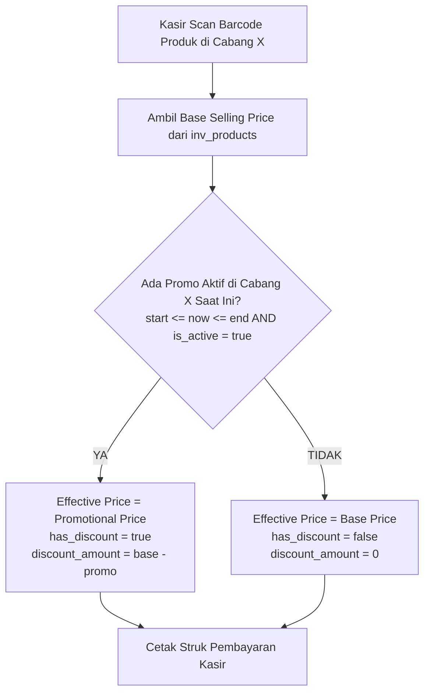
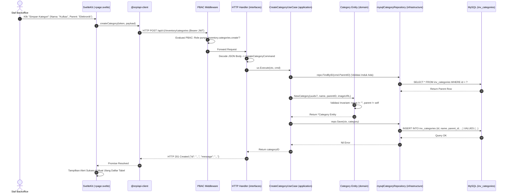
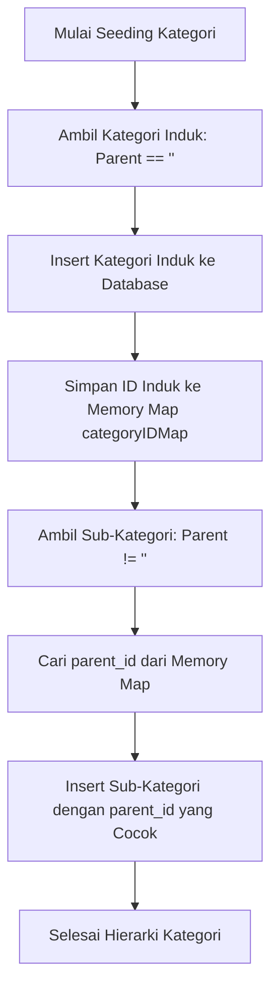
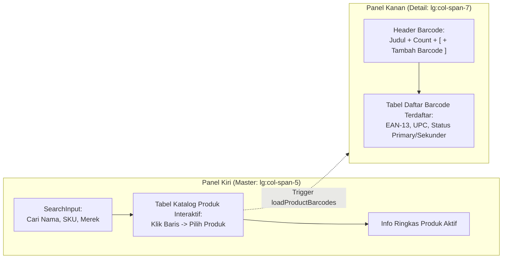

# Kamus & Jurnal Belajar Arsitektur ERP Retail Modular

Dokumen ini adalah buku catatan belajar (_learning companion_) yang merangkum konsep-konsep teknis, pola kode, dan arsitektur backend/frontend pada proyek ini menggunakan **analogi sederhana dunia nyata**.

---

## 🏬 1. Pondasi Arsitektur Makro

### 1.1 Modular Monolith

- **Konsep Teknis:** Satu repositori dan satu binary server yang sama, tetapi kode di dalamnya dipisah secara tegas menjadi modul-modul independen (`inventory`, `purchasing`, `sales`, `finance`).
- **Analogi Dunia Nyata:** **Sebuah Gedung Mall Besar dengan Toko-Toko Tersekat Tembok Rapi.**
  - _Bukan Monolith Spaghetti (Pasar Tradisional Kumuh):_ Di mana semua barang pedagang campur aduk tanpa batas.
  - _Bukan Microservices (Ruko Terpisah di Kota Berbeda):_ Yang butuh biaya sewa jalan tol, jaringan telepon rumit, dan rawan macet/gagal jaringan hanya untuk saling menyapa.
  - _Modular Monolith:_ Semua berada di bawah atap yang sama (efisien, cepat), namun setiap toko memiliki kunci pintu dan pembukuannya sendiri.

---

### 1.2 Bounded Context (Konteks Terisolasi)

- **Konsep Teknis:** Setiap modul memiliki model datanya sendiri dan tidak boleh menggunakan definisi milik modul lain secara serampangan.
- **Analogi Dunia Nyata:** **Beda Bahasa Antar Divisi Perusahaan.**
  - Bagi orang gudang (**Inventory**), kulkas adalah _"Stock Item"_ dengan ukuran dimensi dan nomor seri fisik.
  - Bagi orang kasir (**Sales**), kulkas adalah _"Item Menu"_ dengan harga diskon dan tombol klik.
  - Bagi orang akuntan (**Finance**), kulkas adalah _"Asset Persediaan"_ senilai nominal rupiah.
  - Mereka tidak perlu saling memaksakan definisi. Yang terpenting cukup bertukar nomor kode referensi saja (`product_id`).

---

### 1.3 Lisensi Berbasis Modul (_Feature Gating_)

- **Konsep Teknis:** Modul yang tidak dibeli oleh klien tidak boleh terpasang sama sekali di memori saat aplikasi dijalankan (`main.go`).
- **Analogi Dunia Nyata:** **Saklar Listrik Kamar Sewa.**
  - Jika penyewa gedung tidak menyewa lantai 2 (misal modul `purchasing`), maka saklar lantai 2 dimatikan dari panel utama (`main.go`).
  - Lampunya padam, lift tidak berhenti di lantai itu, dan tidak ada satpam yang berjaga. Sangat hemat energi dan tidak ada pengunjung yang bisa nyasar masuk.

---

## 🧱 2. Jeroan Modul: 4 Layer DDD (Domain-Driven Design)

Setiap modul di dalam `/internal/modules/` memiliki 4 lapisan dapur internal:

```text
[Interfaces]     -> Pelayan & Meja Kasir (Menerima Tamu)
     ↓
[Application]    -> Koki Eksekutor (Mengolah Pesanan)
     ↓
[Domain]         -> Buku Resep & Standar Rasa SOP (Aturan Murni)
     ↓
[Infrastructure] -> Gudang Lemari Es & Truk Suplai (Database & Jaringan)
```

| Layer                 | Fungsi Teknis                                                                                        | Analogi Dunia Nyata (Restoran)                                                                                                                                                           |
| :-------------------- | :--------------------------------------------------------------------------------------------------- | :--------------------------------------------------------------------------------------------------------------------------------------------------------------------------------------- |
| **`domain/`**         | Entity bisnis, aturan validasi, dan interface repository. Bebas dari database atau framework apapun. | **Buku Resep Rahasia & SOP Murni.** Menentukan bahwa _"Nasi goreng tidak boleh pakai gula pasir"_. Buku resep ini tidak peduli apakah koki memasak pakai kompor gas atau kompor listrik. |
| **`application/`**    | Use Case / Command Handler. Mengatur langkah kerja dan alur bisnis.                                  | **Koki yang Memasak.** Membaca buku resep (Domain), meminta bahan dari lemari es (Infrastructure), lalu menghasilkan masakan.                                                            |
| **`infrastructure/`** | Query SQL (PostgreSQL), koneksi database, integrasi pihak ketiga.                                    | **Gudang Bahan Mentah & Lemari Es.** Tempat fisik barang disimpan secara nyata di rak/lemari (Database).                                                                                 |
| **`interfaces/`**     | HTTP Handlers, URL Routes, JSON DTO (Data Transfer Object).                                          | **Pelayan Meja & Kasir Depan.** Menyapa tamu (request dari browser), mencatat pesanan tamu ke kertas nota (DTO), lalu mengantar nota ke koki.                                            |

---

## ⚙️ 3. Komponen & Pola Kunci di Backend Go

### 3.1 `module.go` (Facade & Composition Root)

- **Konsep Teknis:** File utama di akar modul yang merakit (_wiring_) seluruh layer via fungsi `New(...)` dan mengekspos fungsi `Register(...)` serta interface publik (`InventoryService`).
- **Analogi Dunia Nyata:** **Meja Front Desk / Resepsionis Khusus Divisi.**
  - Tamu dari divisi lain (modul lain) tidak boleh masuk ke dapur atau membuka lemari arsip sembarangan.
  - Mereka cukup datang ke Meja Front Desk (`module.go`) dan berbicara lewat formulir resmi (`InventoryService`).

---

### 3.2 `http.ServeMux` (Router Standar Go)

- **Konsep Teknis:** Multiplexer bawaan Go (package `net/http`) yang mencocokkan pola HTTP Method dan URL dengan fungsi handler yang sesuai.
- **Analogi Dunia Nyata:** **Polisi Pengarah Lalu Lintas di Perempatan.**
  - Mobil datang dengan plat `GET /api/v1/inventory/products`.
  - Polisi (`ServeMux`) meniup peluit dan mengarahkan mobil ke jalur kanan (fungsi `handler.List`).
  - Jika jalurnya belum pernah didaftarkan (misal lisensi modul mati), polisi langsung pasang plang penutup jalan: **404 Not Found**.

---

### 3.3 Dependency Injection (DI) Manual

- **Konsep Teknis:** Menyusun komponen dari bawah ke atas dengan mengoper objek dependensi melalui parameter konstruktor `New(...)` tanpa framework/library refleksi.
- **Analogi Dunia Nyata:** **Merakit Komputer PC dengan Kabel Bening.**
  - Anda memasang motherboard, lalu mencolokkan prosesor dan kabel power secara jelas satu per satu dengan tangan sendiri.
  - Anda tahu persis kabel mana tersambung ke komponen mana. Tidak ada "sihir gelap" (_magic container_), sehingga ketika ada masalah, sangat mudah dilacak!

---

### 3.4 In-Process Event Bus

- **Konsep Teknis:** Jalur komunikasi asinkron antar modul untuk efek samping yang _eventually-consistent_.
- **Analogi Dunia Nyata:** **Pengeras Suara (Paging System) di Mall.**
  - Kasir toko selesai memproses pembayaran, lalu mengumumkan di mikrofon: _"Perhatian, Transaksi #123 telah lunas!"_
  - Kasir **tidak perlu** berjalan kaki mendatangi divisi gudang dan divisi akuntansi satu per satu.
  - Bagian Gudang yang mendengar suara langsung menyiapkan barang; bagian Akuntansi yang mendengar langsung mencatat buku kas.

---

### 3.5 Tanpa Foreign Key Lintas Modul

- **Konsep Teknis:** Modul `sales` menyimpan `product_id`, tetapi tidak ada constraint `FOREIGN KEY` di level database ke tabel `inv_products`.
- **Analogi Dunia Nyata:** **Menyimpan Nomor Kontak Teman di Buku Telepon.**
  - Anda hanya mencatat nomor teleponnya. Buku telepon Anda tidak terikat secara gaib dengan fisik teman Anda.
  - Jika teman Anda pindah rumah atau ganti model pakaian, buku telepon Anda tetap aman dan tidak rusak.

---

### 3.6 Standar ID: UUIDv7

- **Konsep Teknis:** ID unik 128-bit yang menggabungkan stempel waktu milidetik (_unix timestamp_) di bagian depan dan keacakan (_entropy_) di bagian belakang.
- **Analogi Dunia Nyata:** **Nomor Resi Pengiriman Barang Berstempel Tanggal.**
  - _Kenapa bukan Auto-Increment (1, 2, 3...)?_ Supaya orang luar tidak bisa menebak: _"Oh, toko ini hari ini baru ada 3 pesanan!"_
  - _Kenapa bukan UUIDv4 biasa (acak total)?_ Karena jika acak total, arsip lemari database akan berantakan seperti menaruh berkas di laci sembarangan. UUIDv7 terurut rapi berdasarkan waktu pembuatan, sehingga pencarian di database tetap secepat kilat!

---

## 📌 Ringkasan Cepat: Cheat Sheet Analogi

| Istilah Teknis               | Analogi Sederhana Dunia Nyata                              |
| :--------------------------- | :--------------------------------------------------------- |
| **Modular Monolith**         | Gedung Mall dengan toko-toko tersekat dinding rapi         |
| **Bounded Context**          | Kamus bahasa dan sudut pandang khusus tiap divisi          |
| **Lisensi / Feature Gating** | Saklar listrik kamar yang dimatikan jika belum disewa      |
| **Domain Layer**             | Buku resep rahasia & standar SOP murni                     |
| **Application Layer**        | Koki yang memasak mengikuti resep                          |
| **Infrastructure Layer**     | Lemari es bahan mentah (Database) & kurir                  |
| **Interfaces Layer**         | Pelayan ramah penerima pesanan tamu                        |
| **`module.go`**              | Meja resepsionis/front-desk pintu masuk modul              |
| **`http.ServeMux`**          | Polisi pengarah lalu lintas jalur rute jalan               |
| **Dependency Injection**     | Merakit PC rakitan dengan susunan kabel transparan         |
| **Event Bus**                | Pengeras suara (paging system) di pusat mall               |
| **UUIDv7**                   | Nomor resi berstempel waktu yang aman dari intipan pesaing |

---

## 🚦 4. Anatomi HTTP Handler (`interfaces/product_handler.go`)

### 4.1 Pelayan Restoran (`ProductHandler.Create`)

- **Konsep Teknis:** Method HTTP handler bertugas sebagai _entry point_ request luar. Tugasnya murni **3M**: **M**enerima (decode JSON), **M**endelegasikan (ke use case/command), dan **M**embalas (encode JSON response).
- **Analogi Dunia Nyata:** **Pelayan Meja Tamu di Restoran.**
  - Tamu datang menyodorkan kertas pesanan.
  - Pelayan memeriksa apakah kertas bisa dibaca (`json.NewDecoder.Decode`). Jika sobek/rusak, pelayan bilang: _"Kertas pesanan rusak"_ (`400 Bad Request`).
  - Pelayan menyalin pesanan ke tiket dapur resmi (`DTO` → `Command`), lalu menyerahkan tiket ke Koki (`useCase.Execute`).
  - Saat masakan selesai, pelayan mengantar pesanan ke meja tamu dengan senyuman dan nomor bon terbit (`201 Created`).

### 4.2 Mengapa DTO dan Command Dipisah? (DTO vs Command)

- **Konsep Teknis:** `CreateProductRequest` (DTO di layer Interfaces) disalin manual ke `CreateProductCommand` (di layer Application).
- **Analogi Dunia Nyata:** **Saringan / Corong di Leher Botol.**
  - Bayangkan botol kaca bersih (Use Case). Cairan bisa dituangkan dari teko teh (HTTP JSON), ember air (File Excel Bulk Import), atau cangkir kecil (Terminal CLI).
  - Di leher botol dipasang saringan corong presisi (`DTO -> Command`).
  - Saringan ini menyaring kotoran teknis dan memastikan cairan yang masuk ke dalam botol selalu bersih, murni, dan sesuai ukuran leher botol, tidak peduli dari wadah mana cairan itu dituangkan.
  - Jika koki dapur langsung menenggak dari teko teh (langsung pakai DTO HTTP), dapur akan rusak saat pesanan datang dari ember (Excel) atau cangkir (CLI).

### 4.3 Mengambil Parameter URL di Go Modern (`r.PathValue` vs `r.URL.Query`)

- **`r.PathValue("id")` (Go 1.22+):** Digunakan untuk mengambil nilai dari path URL (misal: `/products/{id}`).
  - _Analogi:_ **Mencari nomor rumah.** Nomor rumah menempel langsung pada alamat fisik jalan.
- **`r.URL.Query()`:** Digunakan untuk mengambil query string di belakang tanda tanya (misal: `/products?search=tv&page=2`).
  - _Analogi:_ **Permintaan filter tambahan.** Tamu yang datang bertanya: _"Ada menu apa saja yang harganya di bawah 50 ribu?"_.

### 4.4 Komunikasi Antar Modul: Telepon Interkom vs Pengeras Suara Mall

Ada 2 jenis kebutuhan saat modul berbicara dengan modul lain:

| Kebutuhan Modul                                | Jalur Komunikasi        | File Kunci                       | Analogi Dunia Nyata                                                                                                                                                                                                                                                                                       |
| :--------------------------------------------- | :---------------------- | :------------------------------- | :-------------------------------------------------------------------------------------------------------------------------------------------------------------------------------------------------------------------------------------------------------------------------------------------------------- |
| **Butuh Jawaban Detik Itu Juga (Sinkron)**     | Facade Interface publik | `module.go` (`InventoryService`) | **Telepon Interkom.** Kasir menekan tombol interkom ke gudang: _"Halo, kulkas #123 masih ready dan berapa harganya?"_ Orang gudang langsung menjawab saat itu juga sebelum transaksi diketik.                                                                                                             |
| **Efek Samping / Kejadian Selesai (Asinkron)** | In-Process Event Bus    | `events.go` (`eventBus.Publish`) | **Pengeras Suara Mall.** Setelah pembeli bayar lunas, kasir teriak di mikrofon: _"Perhatian, Order #999 Lunas!"_ Kasir tidak menunggu gudang selesai angkat barang; kasir langsung tersenyum melayani antrean pembeli berikutnya. Gudang dan Finance mendengar pengumuman lalu bekerja di belakang layar. |

### 4.5 HTTP Method: PUT vs PATCH vs DELETE

- **`PUT` (Update Menyeluruh):** Mengganti informasi formulir secara utuh (misal mengedit nama, harga beli, harga jual, spesifikasi).
- **`PATCH` (Tambal Parsial):** Mengubah satu status khusus secara instan (misal sekadar mengubah status produk menjadi non-aktif / diarsipkan tanpa harus mengirim ulang seluruh spesifikasi produk).
- **`DELETE`:** Menghapus data kategori yang sudah tidak digunakan.

---

## 🌳 5. Struktur Pohon & Invariant Kategori (`Category`)

### 5.1 Pohon Kategori (Parent - Child)

- **Konsep Teknis:** Tabel `inv_categories` memiliki kolom `parent_id` yang mereferensikan `id` kategori lain untuk mendukung sub-kategori tak terbatas (misal: _Elektronik_ -> _Audio_ -> _Headphone_).
- **Analogi Dunia Nyata:** **Pohon Silsilah Keluarga.**
  - "Headphone" adalah anak dari "Audio", dan "Audio" adalah anak dari "Elektronik".
  - **Invariant Cegah "Kakek Menjadi Cucunya Sendiri" (Circular Reference):** Di method `SetParent`, domain menolak jika kategori A menunjuk dirinya sendiri sebagai induk. Seseorang tidak bisa menjadi ayah kandung bagi dirinya sendiri!

### 5.2 Menangani Data Kosong/NULL SQL di Go (`sql.NullString` vs `*string`)

- **Konsep Teknis:** Di database SQL, kolom seperti `parent_id` dan `image_url` bisa bernilai `NULL`. Di Go, `string` biasa tidak bisa bernilai `nil`.
- **Solusi Arsitektur:**
  - Di layer **Infrastructure (SQL)**: Kita gunakan `sql.NullString` untuk membaca data aman tanpa panik runtime.
  - Di layer **Domain / DTO**: Kita gunakan pointer `*string` (jika `nil` artinya kosong, jika ada alamat memori artinya bernilai string).
- **Analogi Dunia Nyata:** **Kotak Surat Kosong vs Surat Kosong.**
  - `""` (string kosong) adalah amplop yang isinya kertas putih polos tanpa tulisan.
  - `nil` (pointer kosong / NULL) adalah tidak ada amplop sama sekali di dalam kotak pos.

---

## 💎 6. Keputusan Desain Master Data (Best Practices & Gotchas)

### 6.1 Uang Wajib `int64`, Haram Pakai `float64`

- **Konsep Teknis:** Seluruh nilai mata uang (`PurchasePrice`, `SellingPrice`) disimpan sebagai integer 64-bit (`int64`) dalam satuan terkecil (Rupiah utuh atau Sen), bukan desimal `float64`.
- **Mengapa? (Perangkap Floating-Point):**
  - Di komputer, pecahan float biner tidak presisi: `0.1 + 0.2 = 0.30000000000000004`.
  - Dalam sistem retail & akuntansi, selisih 1 rupiah saja akan membuat laporan audit neraca keuangan ditolak dan bermasalah!
- **Analogi Dunia Nyata:** **Menghitung Koin Logam Fisik vs Menimbang Timbangan Dapur.**
  - Menghitung koin Rp100 satu per satu itu pasti (1 koin, 2 koin, 3 koin).
  - Menimbang uang dengan timbangan jarum dapur bisa goyang sekian miligram karena hembusan angin. Untuk urusan kasir dan pembukuan, kita wajib hitung koin pasti!

### 6.2 Validasi Domain vs Validasi Use Case

- **Validasi Domain (Aturan Logika Murni):**
  - Memastikan entitas selalu dalam keadaan valid secara internal tanpa butuh koneksi luar.
  - _Contoh:_ "Harga jual tidak boleh negatif", "Nama produk tidak boleh kosong", "Kategori tidak boleh menjadi parent untuk dirinya sendiri".
  - _Analogi:_ **Hukum Biologi Tubuh Manusia.** Jantung harus memompa darah. Ini aturan internal tubuh, tidak peduli orangnya ada di rumah atau di kantor.
- **Validasi Use Case (Orkestrasi Alur Kerja):**
  - Memastikan langkah-langkah kerja terpenuhi dengan berkoordinasi ke pihak luar (database/repository).
  - _Contoh:_ "Apakah SKU ini sudah pernah dipakai di database?", "Apakah Parent Category ID yang dikirim benar-benar ada di tabel kategori?".
  - _Analogi:_ **Pemeriksaan Dokumen di Pintu Imigrasi Bandara.** Petugas imigrasi membuka komputer pusat database untuk mencocokkan nomor paspor.

### 6.3 Atribut Varian Generic (`map[string]any` / JSON)

- **Konsep Teknis:** Spesifikasi barang (warna, ukuran, watt, kapasitas) disimpan di kolom JSON fleksibel `atribut_varian`, bukan membuat kolom tabel SQL spesifik.
- **Mengapa?** Modul Inventory dibuat generic untuk segala jenis retail. Toko elektronik butuh _watt_, toko baju butuh _ukuran baju (S/M/L)_, toko sembako butuh _berat beras_.
- **Analogi Dunia Nyata:** **Laci Sekat Fleksibel vs Cetakan Patung Semen.**
  - Jika membuat kolom tabel SQL khusus (`kapasitas_liter`), itu seperti mencetak lemari semen kaku yang cuma bisa diisi kulkas. Saat toko menjual baju, kolom itu jadi sia-sia dan mengotori database.
  - Kolom JSON adalah laci fleksibel bersekat yang bisa diatur isinya sesuai kebutuhan barang.

---

## 📜 7. Jembatan Backend ke Frontend: Standar Dokumentasi & Type Safety

### 7.1 Tiga Lapisan Dokumentasi Ideal untuk Frontend

1. **Lapisan Visual & Interaktif (OpenAPI Spec / Swagger UI / Scalar):**
   - FE developer bisa melihat daftar endpoint, parameter URL, bentuk JSON request/response, dan langsung mencoba klik _Execute_ di browser.
2. **Lapisan Kode & Type Safety (OpenAPI -> TypeScript Generator):**
   - Tipe data request dan response digenerate otomatis ke `/packages/types`.
   - FE developer **dilarang keras** menulis `interface` atau `type` manual ganda di frontend (aturan _Zero-Warning & Strict Type-Safety_).
3. **Lapisan Eksekusi Nyata (`requests.http` / Bruno / Postman):**
   - Kumpulan file skenario HTTP nyata yang siap dijalankan langsung di VS Code / IDE.

---

### 7.2 Analogi Dunia Nyata: "Buku Menu Restoran" vs "Nampan Bersekat Bento"

- **Dokumentasi Manual (Chat WA / Catatan Notion Lepas):**
  - _Analogi:_ Koki dapur menceritakan resep secara lisan lewat telepon ke pelayan. Sangat rawan salah dengar! Ketika koki mengganti garam dengan kecap, pelayan tidak tahu dan makanan salah saji ke tamu.
- **OpenAPI / Swagger UI:**
  - _Analogi:_ **Buku Menu Cetak Resmi Berwarna di Meja Restoran.** Lengkap dengan foto makanan, daftar alergen, harga, dan level kepedasan. Tamu dan pelayan membaca dari buku yang sama.
- **TypeScript Type Generator (`/packages/types`):**
  - _Analogi:_ **Nampan Bersekat Khusus Bento Box.**
  - Sekat nampan diukir presisi sesuai mangkuk sup, kotak nasi, dan lauk dari dapur.
  - Jika koki di dapur mengubah mangkuk sup bundar menjadi mangkuk kotak (BE mengubah tipe kolom dari string ke array), pelayan di depan langsung tahu seketika karena mangkuk tidak muat di nampan (**TypeScript Compile Error**). Error dicegah sebelum pesanan sempat disajikan ke pengunjung!

### 7.3 Format File `.http` (_Executable Living Documentation_)

- **Konsep Teknis:** File `.http` adalah dokumen teks standar yang bisa dibaca manusia sekaligus dieksekusi langsung oleh ekstensi IDE (seperti _REST Client_ di VS Code).
- **Fitur Kunci:**
  - **Variabel (`@baseUrl`, `@token`):** Memusatkan konfigurasi agar tidak perlu mengetik ulang token atau alamat server berkali-kali.
  - **Pemisah Request (`###`):** Tiga tanda pagar menandai batas antara satu aksi API dengan aksi lainnya.
  - **Living Document:** Menjadi dokumentasi yang tidak pernah usang karena tim developer bisa langsung memencet tombol _Send Request_ untuk memvalidasi apakah server masih merespon sesuai ekspektasi.
- **Analogi Dunia Nyata:** **Kupon Tiket Uji Coba Berstempel Otomatis.**
  - Bukan brosur kertas biasa yang cuma bisa dibaca.
  - Ini seperti tiket uji coba interaktif: saat Anda menekan tombol di tiket tersebut, mesin di depan Anda langsung menyala dan mengeluarkan struk respon secara otomatis!

### 7.4 Postman Collection (_Visual GUI Dashboard_)

- **Konsep Teknis:** File JSON standar (`*.postman_collection.json` v2.1) yang merangkum seluruh endpoint, folder, skenario request body, header auth, dan environment variables. Bisa di-import ke aplikasi Postman, Thunder Client, Bruno, atau Insomnia.
- **Mengapa Sangat Populer?**
  - Tampilan ramah pengguna (_user-friendly_): Memiliki panel folder di kiri, tab body/headers yang rapi, dan tombol **"SEND"** besar berwarna mencolok.
  - Menjadi bahasa kolaborasi standar antara backend engineer, frontend developer, dan QA tester di seluruh dunia.
- **Analogi Dunia Nyata:** **Dashboard Mobil dengan Layar Sentuh Besar (Touchscreen).**
  - Jika file `.http` adalah saklar manual di balik kap mesin, maka Postman Collection adalah dashboard kemudi dengan tombol-tombol berwarna terang.
  - Siapa pun (bahkan orang baru) yang duduk di kursi kemudi langsung tahu mana pedal gas dan bagaimana cara menyalakannya tanpa perlu membaca buku manual yang rumit.

### 7.5 Mengapa Postman Saja TIDAK CUKUP bagi Backend Engineer Profesional?

- **Fakta Industri:**
  - Postman sangat bagus sebagai **alat uji coba (Playground)** dan sarana demonstrasi cepat.
  - Namun di perusahaan teknologi modern / skala enterprise, **Postman saja dianggap belum cukup** karena memiliki beberapa kelemahan fatal:
    1. **Dokumentasi Basi (_Documentation Drift_):** File Postman adalah file manual. Ketika BE mengubah skema tabel atau validasi di Go, developer sering lupa memperbarui Postman. Akibatnya FE tertipu oleh contoh JSON lama.
    2. **Tidak Ada Type Safety Otomatis:** Developer FE harus mengetik ulang tipe data secara manual di TypeScript. Rawan salah ketik (_typo_ antara camelCase dan snake_case) yang berujung bug di produksi.
    3. **Tidak Menjelaskan Aturan Bisnis Ketat:** Postman hanya menampilkan satu contoh JSON, tanpa aturan eksplisit: field mana yang wajib, berapa batas karakter, atau apa saja nilai enum yang sah.
- **Standar Lengkap Dokumentasi BE Profesional:**
  1. **OpenAPI 3.0 / Swagger UI:** Kontrak resmi mesin (_Machine-Readable Contract_) yang bisa diakses di `/docs`.
  2. **TypeScript Type Generator:** Kontrak diekspor otomatis ke file `.d.ts` di frontend sehingga FE bebas dari mengetik manual.
  3. **Postman Collection / File `.http`:** Pelengkap untuk mencoba request secara visual.

---

## 📖 8. Implementasi Nyata: OpenAPI 3.0, Scalar, Swagger UI & `//go:embed`

### 8.1 Arsitektur Dokumentasi di Server Go Kita

- **File Kontrak (`docs/openapi.yaml`):** Menyimpan seluruh spesifikasi kontrak OpenAPI 3.0.3 untuk modul Inventory (kategori, produk, filter, pagination, status).
- **Paket Platform (`internal/platform/docs`):** Bertugas melayani dokumentasi tanpa mencampuri logika bisnis modul.
  - `GET /openapi.yaml` : File mentah YAML untuk dibaca mesin / generator TypeScript.
  - `GET /docs` : Dokumentasi interaktif modern menggunakan **Scalar** (mendukung _dark mode_, pencarian kilat, dan _code generator_ multi-bahasa).
  - `GET /swagger` : Dokumentasi klasik menggunakan **Swagger UI**.

### 8.2 Fitur Kunci Go: `//go:embed` (Menanam File Statis ke Binary)

- **Konsep Teknis:** Fitur bawaan Go (sejak Go 1.16) yang mengompilasi file eksternal (seperti `.yaml`, `.html`, `.sql`, atau gambar) langsung menjadi bagian dari binary executable (`.exe` di Windows atau binary ELF di Linux).
- **Mengapa Sangat Kuat?**
  - Binary Go menjadi **100% mandiri (Self-Contained Single Binary)**.
  - Saat aplikasi dideploy ke server VPS / Docker, kamu tidak perlu khawatir file `openapi.yaml` tertinggal atau salah path `FileNotFound`!
- **Analogi Dunia Nyata:** **Buku Manual yang Tercetak di Balik Pintu Lemari Es.**
  - Bukan lembaran kertas brosur lepas yang bisa hilang tertiup angin saat lemari es dipindahkan ke rumah baru.
  - Buku manualnya sudah dicetak timbul permanen langsung di dinding mesin lemari es itu sendiri!

### 8.3 Apakah `/docs` (Scalar) dan `/swagger` (Swagger UI) Fungsinya Sama?

- **Jawaban:** **Ya, 100% fungsinya sama persis!**
- Keduanya membaca sumber data yang sama, yaitu file kontrak `openapi.yaml`. Keduanya menampilkan daftar endpoint, method, parameter, dan tombol coba request yang sama.
- **Perbedaannya Hanya di "Generasi & Kenyamanan Tampilan":**
  - **Swagger UI (`/swagger`):** Pelopor legendaris (generasi 2011). Tampilan kotak-kotak accordion klasik (hijau GET, biru POST, oranye PUT). Sangat dikenal luas oleh developer senior, namun belum ada dark mode bawaan.
  - **Scalar (`/docs`):** Generasi modern (2023-2024). Desain minimalis elegan ala Stripe/Vercel, otomatis dark mode, pencarian kilat (Ctrl+K), dan otomatis membuat contoh kode (_Code Snippets_) siap pakai dalam JavaScript, Python, Go, cURL, PHP, dll.
- **Analogi Dunia Nyata:** **Windows Media Player Classic vs Netflix Web Player.**
  - File film videonya persis sama (`openapi.yaml`).
  - Yang satu memakai pemutar klasik tahun 2000-an (Swagger), yang satu memakai pemutar modern sinematik (Scalar). Fungsinya sama-sama untuk menonton film!

---

## 🏬 9. Master Lokasi & Pola Integritas Data Multi-Cabang

### 9.1 `ON DELETE RESTRICT` vs `ON DELETE CASCADE`

- **`ON DELETE RESTRICT` (Gembok Penahan):** Database menolak penghapusan baris data induk jika masih ada baris data anak yang merujuk kepadanya.
  - _Digunakan pada:_ Relasi `inv_stocks` -> `inv_locations`. Lokasi toko tidak boleh dihapus jika masih ada stok barang yang tercatat di sana.
  - _Analogi Dunia Nyata:_ **Tali Pengaman Anak di Mall.** Anak kecil memegang erat tangan orang tuanya. Saat ada orang asing yang mau menarik orang tua pergi, anak itu menahan kuat dan berteriak menolak: _"Jangan bawa orang tuaku! Aku masih di sini!"_.
- **`ON DELETE CASCADE` (Hancur Bersama):** Database otomatis menghapus semua baris data anak jika baris data induknya dihapus.
  - _Digunakan pada:_ Relasi `inv_barcodes` -> `inv_products`. Jika produk dihapus dari katalog, semua barcode pabrik milik produk tersebut ikut terhapus otomatis.
  - _Analogi Dunia Nyata:_ **Rantai Petasan / Kartu Domino.** Saat kartu pertama jatuh, seluruh kartu anak di belakangnya ikut tumbang serentak.

### 9.2 Mengapa `ON DELETE` Ditulis di Tabel Anak, Bukan Tabel Induk?

- **Konsep Teknis:** Dalam SQL relasional, aturan `FOREIGN KEY ... ON DELETE` selalu ditempelkan pada tabel anak (_Child_) yang membawa kolom referensi, bukan di tabel induk (_Parent_).
- **Analogi Dunia Nyata:** **Gantungan Kunci & Label Nama.**
  - Gedung Induk (`inv_locations`) tidak mencatat siapa saja penghuni di dalamnya.
  - Setiap barang/anak (`inv_stocks`) membawa kartu gantungan bertuliskan: _"Aku disimpan di Gedung Cabang #123"_.
  - Maka tali pengaman dipasang di gantungan kartu anak tersebut, bukan di tembok gedung!

### 9.3 Soft Delete (Deaktivasi) vs Hard Delete di Sistem ERP

- **Hard Delete (`DELETE FROM ...`):**
  - Menghapus baris fisik secara permanen dari piringan database.
  - _Kapan Boleh Dipakai?_ Hanya saat data baru dibuat dan **belum pernah memiliki relasi** (misal: admin baru salah ketik nama cabang 5 menit lalu, belum ada stok dan belum ada transaksi).
  - _Analogi:_ Membatalkan kertas formulir pendaftaran yang baru salah ditulis sebelum sempat disahkan.
- **Soft Delete / Deaktivasi (`is_active = false`):**
  - Menandai status bahwa entitas sudah tidak aktif lagi beroperasi, namun seluruh riwayatnya tetap utuh.
  - _Mengapa Wajib di ERP?_ Jika cabang yang sudah pernah bertransaksi di-hard delete, laporan keuangan masa lalu, nota belanja kasir, dan audit stok masa lalu akan rusak karena mengarah ke ID hantu yang sudah hilang!

### 9.4 Mengapa `fk_inv_stocks_product` Wajib `ON DELETE RESTRICT`?

- **Problem Awal (`CASCADE`):** Jika query `DELETE FROM inv_products` dieksekusi, MySQL secara diam-diam akan menghapus semua baris stok barang tersebut di seluruh cabang gudang. Barang fisik kulkas ada di gudang, tapi catatan sistem hilang total tanpa jejak!
- **Solusi Arsitektural (`RESTRICT`):** Mengunci relasi stok-ke-produk dengan gembok `RESTRICT`. Produk tidak akan pernah bisa dihapus selama masih ada baris stok di cabang manapun.
- **Perintah SQL untuk Update DB Lokal yang Sudah Terlanjur Dibuat:**
  ```sql
  ALTER TABLE inv_stocks DROP FOREIGN KEY fk_inv_stocks_product;
  ALTER TABLE inv_stocks ADD CONSTRAINT fk_inv_stocks_product FOREIGN KEY (product_id) REFERENCES inv_products(id) ON DELETE RESTRICT;
  ```

### 9.5 Alur Lengkap End-to-End Fitur Master Lokasi

Berikut adalah jejak langkah (_blueprint_) bagaimana sebuah fitur utuh dibangun di proyek ini:

```text
1. [Domain]         : location.go (Entity + Rules) + repository.go (Kontrak)
2. [Infrastructure] : location_repository.go (Query SQL MySQL)
3. [Application]    : location_usecases.go (Orkestrasi alur kerja, cek duplikat, UUIDv7)
4. [Interfaces]     : dto.go (Format JSON) + location_handler.go (HTTP ServeMux)
5. [Module Root]    : module.go (Wiring Dependency Injection & daftarkan rute)
6. [Dokumentasi]    : openapi.yaml (Scalar/Swagger) & api.http (Living test scenarios)
```

---

## 🔌 10. Dependency Injection, Konstruktor Go, dan Polimorfisme Interface

### 10.1 "Merekrut Koki" vs "Membuat Kue" (`NewUseCase` vs `NewEntity`)

- **`NewCreateLocationUseCase(...)` (Application):**
  - _Merekrut Koki Kerja._ Dijalankan **hanya 1 kali** saat aplikasi pertama kali menyala (`main.go` / `module.go`). Koki ini standby di memori server menunggu ada perintah kerja (`Execute`).
- **`NewLocation(...)` (Domain):**
  - _Mencetak Kue Fisik._ Dijalankan **berkali-kali** di dalam method `Execute` setiap kali admin mendaftarkan cabang baru. Hasilnya adalah data yang disimpan ke database.

### 10.2 Janji Tipe Data di Header (`*`) vs Penyerahan Benda Nyata di Return (`&`)

```go
func NewCreateLocationUseCase(repo domain.LocationRepository) *CreateLocationUseCase {
    return &CreateLocationUseCase{repo: repo}
}
```

- **`*CreateLocationUseCase` (di Header):** Adalah **Janji Kontrak Tipe**. Berjanji bahwa fungsi ini PASTI mengembalikan alamat memori (pointer `*`) dari struct tersebut.
- **`&CreateLocationUseCase{repo: repo}` (di Return):** Adalah **Benda Nyatanya**. Mencetak struct baru di memori, lalu simbol `&` mengambil alamat memorinya untuk melunasi janji di header. Jika lupa tanda `&`, compiler Go akan error karena ketidakcocokan antara benda biasa vs alamat pointer.

### 10.3 Stopkontak Dinding & Colokan Listrik (Dependency Inversion Principle)

- **Konsep Teknis:** Field `repo domain.LocationRepository` di dalam use case adalah sebuah **Interface**, bukan struct database fisik.
- **Analogi Dunia Nyata: Stopkontak Dinding Kamar.**
  - Stopkontak di dinding (field `repo`) tidak peduli apakah alat yang dicolokkan adalah Kipas Angin, Blender, atau Charger Laptop.
  - Yang penting colokannya punya 2 kaki standar (`Save`, `FindByID`, `FindByCode`, dll).
  - _Manfaat Nyata:_
    - Saat server jalan normal: dicolokkan ke **MySQL** (`mysqlLocationRepository`).
    - Saat unit testing: dicolokkan ke **Mock RAM** (`mockLocationRepository`).
    - Jika 3 tahun lagi migrasi ke **PostgreSQL**: kode use case **sama sekali tidak perlu diubah 1 baris pun**!

---

## 📦 11. Ruang Lingkup Package di Go & Error "Redeclared in this block"

### 11.1 Package Scope: Satu Folder = Satu Ruangan Besar Tanpa Sekat

- **Konsep Teknis:** Di bahasa Go, semua file `.go` yang berada di dalam folder yang sama dan memiliki baris pembuka yang sama (misal `package interfaces`) **melebur menjadi satu kesatuan ruang lingkup (_package-level scope_)**.
- **Analogi Dunia Nyata:** **Satu Ruangan Kantor Bersama Tanpa Sekat Dinding.**
  - File-file terpisah (`product_handler.go`, `location_handler.go`, `response.go`) hanyalah **meja-meja kerja berbeda di dalam satu ruangan yang sama**.
  - Siapapun yang duduk di ruangan itu bisa langsung meminjam stapler (`writeJSON`) yang ditaruh di meja tengah (`response.go`) tanpa perlu permisi lewat telepon luar (`import`).
  - **Aturan Mutlak:** Di ruangan itu tidak boleh ada 2 orang atau 2 benda dengan nama identik di level ruangan (_package scope_). Jika ada 2 fungsi bernama `func writeJSON(...)`, compiler Go akan bingung dan berteriak: _"redeclared in this block!"_ (nama ini sudah ada pemiliknya di ruangan ini!).

### 11.2 Mengapa Error Ini Bisa Muncul Saat Refactoring?

- Saat memindahkan fungsi `writeJSON` dari file lama (`handler.go`) ke file baru (`response.go`), kita menghapus `handler.go` dari harddisk.
- Namun, editor/IDE (seperti VS Code melalui `gopls` / Go Language Server) sering kali masih menyimpan tab file lama di memori (_in-memory editor buffer_).
- Akibatnya, `gopls` menganggap file lama dan file baru masih hidup berdampingan di dalam ruangan yang sama, sehingga memunculkan garis merah `writeJSON redeclared in this block`.
- **Solusi Nyata:**
  1. Tutup tab file lama di editor (jangan disimpan ulang).
  2. Reload window IDE atau restart Go Language Server (`Ctrl + Shift + P` -> `Go: Restart Language Server`).
  3. Jalankan `go build ./...` di terminal untuk memastikan harddisk sudah 100% bersih dan lulus kompilasi.

---

## 📦 12. Manajemen Stok Fisik, Reservasi, dan Pencegahan Race Condition (`StockItem`)

### 12.1 Anatomi Tiga Jenis Kuantitas Stok di Sistem ERP

Dalam sistem retail profesional, stok barang **tidak boleh** hanya dicatat sebagai satu angka kuantitas tunggal. Ada 3 kuantitas yang wajib dipisahkan:

1. **`Quantity` (Kuantitas Fisik):** Jumlah barang nyata yang ada di atas rak gudang atau etalase toko.
2. **`ReservedQuantity` (Kuantitas Reservasi / Booking):** Jumlah barang yang sudah di-booking oleh pelanggan (misal: order online menunggu pembayaran 15 menit atau pesanan kantor menunggu pelunasan DP). Barang fisiknya masih ada di toko, tetapi sudah tidak boleh dijual ke orang lain.
3. **`AvailableQuantity = Quantity - ReservedQuantity` (Stok Bebas):** Jumlah stok nyata yang siap dijual oleh kasir kepada pengunjung yang datang.

- **Analogi Dunia Nyata: Kursi Bioskop di Studio Film.**
  - _`Quantity` (50 kursi):_ Total seluruh kursi fisik empuk yang terpasang di dalam ruangan bioskop.
  - _`ReservedQuantity` (10 kursi):_ Ada 10 orang yang sedang memilih kursi di aplikasi Cinema XXI di ponsel mereka. Warnanya berubah jadi oranye (sedang di-booking selama 15 menit waktu pembayaran). Barangnya masih ada di dalam studio, tetapi tidak boleh diambil orang lain.
  - _`AvailableQuantity` (40 kursi):_ Pembeli yang antre langsung di depan loket kasir hanya boleh memilih dari 40 kursi hijau yang masih bebas!
  - _`DeductReserved`:_ Ketika pembayaran aplikasi lunas, penonton masuk bioskop. Kursi fisik dan status booking sama-sama ditutup.
  - _`ReleaseReservation`:_ Jika waktu 15 menit habis tanpa pembayaran, warna oranye hilang dan kursi otomatis kembali hijau siap dijual lagi.

---

### 12.2 Bahaya _Race Condition_ (Stok Minus / Overselling)

- **Masalah Nyata:** Bayangkan kulkas LG di cabang Bandung tersisa **1 unit**.
  - Kasir A di toko fisik melayani pembeli langsung dan menekan tombol _"Bayar"_.
  - Di detik dan milidetik yang sama, pembeli di web online menekan tombol _"Checkout"_.
  - Jika sistem tidak dilindungi, kedua proses membaca stok yang sama: `stok = 1`. Keduanya mengizinkan transaksi! Kulkas terjual 2 kali padahal barang cuma ada 1! Toko terancam komplain hukum karena tidak bisa mengirim barang.
- **Analogi Dunia Nyata: Dua Orang Menarik Uang Terakhir di 2 Mesin ATM Berbeda Secara Bersamaan.**
  - Saldo tabungan tinggal Rp100.000. Suami di ATM Jakarta dan Istri di ATM Surabaya memencet tarik tunai Rp100.000 di detik yang sama. Tanpa sistem penguncian brankas, bank akan rugi Rp100.000!

---

### 12.3 Solusi Arsitektural: `SELECT ... FOR UPDATE` (Row-Level Locking)

- **Konsep Teknis:** Saat proses mutasi stok dimulai, database MySQL diperintahkan untuk mengunci baris stok produk & cabang tersebut:
  ```sql
  SELECT id, quantity, reserved_quantity FROM inv_stocks
  WHERE product_id = ? AND location_id = ?
  FOR UPDATE;
  ```
- **Efek Penguncian:**
  - Transaksi pertama masuk dan mengunci baris data.
  - Transaksi kedua yang datang **otomatis dibuat mengantre (standby)** di tingkat database sampai transaksi pertama selesai melakukan `COMMIT` atau `ROLLBACK`.
  - Saat transaksi kedua akhirnya giliran masuk, ia melihat data stok terbaru yang sudah berkurang menjadi `0`, sehingga transaksi kedua ditolak secara tertib: _"Stok tidak mencukupi"_.
- **Analogi Dunia Nyata: Lampu Indikator Merah di Pintu Toilet Kereta Api.**
  - Saat orang pertama masuk ke toilet dan memutar kunci pintu, lampu di luar menyala merah (_Locked_).
  - Orang kedua yang ingin masuk harus berdiri tertib di lorong menunggu sampai orang pertama keluar dan membuka kunci pintu. Tidak ada orang yang saling tabrakan di dalam toilet!

---

### 12.4 Pola Arsitektur Bersih: `AtomicMutate` dengan Closure Callback di Go

- **Problem Desain:**
  - Di DDD Clean Architecture, Use Case dan Domain **dilarang keras** meng-import `database/sql` atau memegang objek `*sql.Tx`.
  - Lalu bagaimana caranya use case bisa mengendalikan transaksi database tanpa mengotori domain?
- **Solusi Go: Closure Callback Pattern (`AtomicMutate`):**
  ```go
  // Di layer Application (Use Case):
  item, err := uc.stockRepo.AtomicMutate(ctx, productID, locationID, func(item *domain.StockItem) error {
      // Aturan bisnis murni dijalankan di sini:
      return item.AdjustQuantity(cmd.NewQuantity)
  })
  ```
- **Bagaimana Cara Kerjanya di Dapur Infrastructure?**
  1. `AtomicMutate` membuka transaksi database (`tx.BeginTx`).
  2. Menjalankan `SELECT ... FOR UPDATE` untuk mengunci baris.
  3. Memanggil fungsi bisnis `mutateFn(item)` yang dikirim oleh Use Case.
  4. Jika aturan domain menolak (misal kuantitas minus), fungsi mengembalikan error dan Infrastructure otomatis membatalkan (_Rollback_) transaksi database!
  5. Jika aturan domain lolos, Infrastructure menyimpan data ke database dan melakukan _Commit_.
- **Analogi Dunia Nyata: Petugas Keamanan Brankas Bank Membukakan Pintu untuk Akuntan.**
  - **Petugas Keamanan (Infrastructure):** Memegang kunci gembok brankas baja dan memastikan tidak ada orang lain yang boleh masuk saat brankas terbuka.
  - **Akuntan (Domain):** Hanya membawa buku kalkulator dan pulpen. Akuntan tidak perlu tahu kode rahasia brankas; ia cukup menghitung uang yang ada di hadapannya.
  - Jika akuntan bilang: _"Ada selisih uang palsu!"_, petugas keamanan langsung menutup brankas dan membatalkan seluruh transaksi serah terima saat itu juga!

---

## 🏷️ 13. Multi-Barcode Pabrik, Aggregate Root vs Child Entity (`ProductBarcode`)

### 13.1 Mengapa Barcode Masuk ke Produk dan Bukan Jadi Domain Terpisah?

- **Konsep Teknis (DDD):**
  - **`Product` = Aggregate Root (Induk Utama):** Entitas mandiri yang menjadi pusat kendali bisnis.
  - **`ProductBarcode` = Child Entity (Entitas Anak):** Entitas yang tidak memiliki arti atau eksistensi independen tanpa induknya.
- **Analogi Dunia Nyata: Koper Baju dan Stiker Bagasi Bandara.**
  - _Koper Baju (Product):_ Adalah barang aslinya.
  - _Stiker Bagasi (Barcode):_ Menempel pada permukaan koper. Stiker ini tidak bisa bepergian naik pesawat sendirian tanpa koper.
  - Jika koper Anda hancur terbakar, otomatis stiker bagasi yang menempel ikut musnah (**`ON DELETE CASCADE`** di database).
  - Koper Anda bisa ditempeli 2 atau 3 stiker (misal stiker penerbangan lama dan stiker baru), tetapi kopernya tetap satu (**Relasi 1-to-Many / Multi-Barcode**).

---

### 13.2 Mengapa Satu Produk Butuh Banyak Barcode (_Multi-Barcode_)?

- **Problem di Retail:**
  - Satu model barang yang sama persis (misal _Smart TV LG 43 Inch_) bisa diproduksi di 2 pabrik berbeda (Pabrik Cikarang vs Pabrik Vietnam).
  - Masing-masing pabrik mencetak kode barcode EAN-13 yang berbeda di kardus.
  - Atau pabrik mengubah desain kardus kemasan tahun 2026 dan menerbitkan barcode baru.
- **Solusi Arsitektur:**
  - SKU Toko tetap satu: `TV-LG-43-UQ7500`.
  - Tabel `inv_barcodes` menampung seluruh variasi barcode pabrik tersebut:
    - `8806091234567` (Primary - Pabrik Utama)
    - `8806099999999` (Secondary - Pabrik Cadangan)
  - Apapun barcode yang ditembak laser oleh kasir, kasir langsung menemukan produk yang sama!

---

### 13.3 Fast Lookup Table & Index B-Tree untuk Scanner Kasir

- **Tuntutan Kasir:**
  - Antrean kasir di supermarket/toko elektronik menuntut respon sistem di bawah **1 milidetik** saat barcode ditembak pemindai.
  - Kasir tidak boleh menunggu loading berputar-putar.
- **Solusi Teknis:**
  1. Kolom `barcode` di tabel `inv_barcodes` diberi **INDEX B-Tree** dan **UNIQUE constraint**.
  2. Query menggunakan `JOIN` satu langkah:
     ```sql
     SELECT p.*, b.* FROM inv_barcodes b
     JOIN inv_products p ON b.product_id = p.id
     WHERE b.barcode = ?;
     ```
  3. Database MySQL langsung melompat ke daun index B-Tree $O(\log N)$ dan mengembalikan data produk seketika tanpa membaca seluruh isi tabel (_Full Table Scan_).

---

## 📱 14. Pelacakan Fisik Unit Spesifik, Serial Number / IMEI, dan State Machine (`SerialUnit`)

### 14.1 Mengapa Perlu Melacak Unit Spesifik (Bukan Cuma Angka Kuantitas)?

- **Barang Biasa (Kabel, Casing, Baut):**
  - Cukup dicatat sebagai angka: _"Ada 50 kabel di rak"_.
  - Ketika kasir menjual 1 kabel, sistem cukup mengurangi stok dari 50 menjadi 49. Toko tidak peduli kabel mana yang diserahkan ke pembeli.
- **Barang Bernilai Tinggi (Smartphone, Laptop, Smart TV, Kulkas):**
  - Membawa risiko finansial dan garansi yang tinggi.
  - Toko wajib tahu: _"Unit fisik nomor berapa yang diserahkan ke pembeli A pada nota #123?"_.

---

### 14.2 Perbedaan Kunci: Barcode Produk vs Serial Number / IMEI

| Aspek            | Barcode Produk (EAN-13 / UPC)                                    | Serial Number / IMEI (`SerialUnit`)                              |
| :--------------- | :--------------------------------------------------------------- | :--------------------------------------------------------------- |
| **Pertanyaan**   | _"Barang jenis/tipe apa ini?"_                                   | _"Benda fisik spesifik yang mana ini?"_                          |
| **Cakupan**      | Mewakili **seluruh model/tipe** yang sama.                       | Mewakili **1 buah benda fisik tunggal di dunia**.                |
| **Contoh Nilai** | `8806091234567` (Semua kardus kulkas LG tipe ini sama nomornya). | `SN-LG-2026-X001` (Hanya ada 1 kulkas dengan nomor ini).         |
| **Tabel DB**     | `inv_barcodes` (relasi ke `inv_products`).                       | `inv_serial_units` (relasi ke `inv_products` & `inv_locations`). |

- **Analogi Dunia Nyata: Jenis Mobil vs Nomor Rangka Mesin & BPKB.**
  - _Barcode Produk:_ "Honda Brio RS Merah". Semua 100 brosur mobil di dealer sama.
  - _Serial Unit:_ Nomor Rangka Mesin yang diketok di rangka baja. Polisi dan asuransi hanya mengenali mobil Anda lewat nomor rangka ini, bukan sekadar bertanya _"Apakah ini mobil Brio merah?"_.

---

### 14.3 State Machine Siklus Hidup Unit Fisik

Sebuah unit fisik memiliki siklus hidup (_State Machine_) yang dikawal ketat oleh Domain Invariant:

```text
[ Pabrik / Supplier ]
        │
        ▼
   ┌─────────┐
   │ TERSEDIA│  (Unit tiba di gudang/toko, siap dipajang atau dipindah cabang)
   └────┬────┘
        │
        │ Kasir memproses pembayaran (MarkAsSold)
        ▼
   ┌─────────┐
   │ TERJUAL │  (Unit dibawa pulang pelanggan, garansi toko mulai berjalan)
   └────┬────┘
        │
        │ Pelanggan komplain barang rusak / cacat pabrik (MarkAsReturned)
        ▼
   ┌─────────┐
   │  RETUR  │  (Unit ditarik kembali ke toko, siap diklaim garansi ke distributor)
   └─────────┘
```

#### Aturan Domain (_Invariants_):

1. **Unit belum terjual dilarang diretur:** Seseorang tidak bisa meretur unit yang statusnya masih `tersedia` di gudang toko.
2. **Unit yang sudah terjual dilarang dijual dua kali:** Mencegah penjualan ganda (_double-selling fraud_).
3. **Unit yang sudah terjual tidak bisa dipindah cabang:** Hanya unit `tersedia` yang boleh dimutasi antar gudang.

---

### 14.4 Perlindungan Toko dari Penipuan Garansi (_Warranty Fraud_)

- **Masalah Lapangan:** Pembeli membeli HP second rusak di pasar loak, lalu datang ke toko Anda menuntut ganti baru: _"HP ini baru saya beli di sini kemarin, layarnya mati!"_.
- **Solusi Sistem:** Petugas service center menembak laser ke IMEI HP tersebut lewat endpoint:
  ```http
  GET /api/v1/inventory/serials/lookup?sn=356891234567890
  ```

  - Jika IMEI tidak ada di database ➔ **Penipuan tertolak seketika!**
  - Jika IMEI ada ➔ Sistem langsung menampilkan tanggal pembelian, nama pembeli, dan status garansi purna jual.

---

### 14.5 Pola Batch Insert Transaksional di Go (`PrepareContext` & `ExecContext`)

Saat satu truk kontainer datang membawa 50 unit kulkas baru, admin toko menembak 50 barcode serial secara beruntun.

- Mengirimkan 50 query `INSERT` terpisah ke database adalah tindakan lambat dan boros koneksi (_N+1 problem_).
- **Solusi Infrastructure Go:** Menggunakan **Prepared Statement** di dalam satu transaksi database:

  ```go
  tx, err := r.db.BeginTx(ctx, nil)
  stmt, err := tx.PrepareContext(ctx, "INSERT INTO inv_serial_units (...) VALUES (...)")
  defer stmt.Close()

  for _, u := range units {
      _, err := stmt.ExecContext(ctx, u.ID, u.ProductID, ...)
  }
  return tx.Commit()
  ```

- **Manfaat:** Query hanya di-compile 1 kali oleh MySQL, lalu 50 data disuntikkan sekaligus dalam hitungan milidetik secara atomik. Jika ada 1 nomor seri yang duplikat, seluruh 50 data otomatis dibatalkan (_Rollback_) tanpa merusak integritas database.

---

## 🐘 15. Portabilitas Database: Mengapa Mengganti ENUM Database Menjadi `VARCHAR` + Validasi Domain (Go)?

### 15.1 Jebakan Sintaks ENUM di MySQL vs PostgreSQL

- **Di MySQL (Sifatnya _Inline_):**
  - Kolom bisa langsung ditulis: `status ENUM('active', 'inactive', 'discontinued')`.
- **Di PostgreSQL (Sifatnya _Custom Data Type_ Global):**
  - PostgreSQL **TIDAK BISA** menerima sintaks inline MySQL di atas. Menjalankan query tersebut di Postgres akan langsung melempar `Syntax Error`.
  - Postgres mewajibkan pembuatan tipe terpisah via `CREATE TYPE status_type AS ENUM (...)`, yang membuat script migrasi menjadi kaku dan sulit di-maintain.

---

### 15.2 Solusi Arsitektural: `VARCHAR(20)` + Domain Value Object (DDD)

Daripada mengunci skema database ke fitur spesifik MySQL yang merusak portabilitas, kita menerapkan standar industri:

1. **Di Database:** Kolom didefinisikan sebagai `VARCHAR(20) NOT NULL DEFAULT '...'`.
   - Skema ini **100% universal**: bisa dijalankan langsung di MySQL, PostgreSQL, SQLite, maupun SQL Server tanpa ubah 1 baris SQL pun!
2. **Di Domain Layer Go:** Validasi nilai enum dijaga ketat oleh tipe Go (_Type Safety_):
   ```go
   type ProductStatus string
   const (
       ProductStatusActive       ProductStatus = "active"
       ProductStatusInactive     ProductStatus = "inactive"
       ProductStatusDiscontinued ProductStatus = "discontinued"
   )
   ```
3. **Analogi Dunia Nyata: Satpam Kompleks vs Kotak Surat.**
   - **Database itu Kotak Surat:** Kotak surat tidak perlu memeriksa apakah amplop surat yang dimasukkan asli atau palsu; kotak surat hanya bertugas menyimpan kertas (`VARCHAR`).
   - **Domain Go itu Satpam Kompleks:** Satpam di gerbang depan yang memeriksa KTP tamu sebelum diizinkan masuk ke kotak surat. Tamu tanpa identitas valid (`active`, `inactive`) langsung diusir di gerbang!

---

## 🏷️ 16. Price Override: Manajemen Promo Khusus Cabang & Algoritma Harga Kasir POS (Effective Price)

### 16.1 Mengapa Toko Retail Membutuhkan Price Override?

Bayangkan sebuah jaringan toko retail elektronik memiliki 50 cabang di seluruh Indonesia:

- Di tabel produk (`inv_products`), harga TV 55 Inch tercatat **Rp 10.000.000** (Harga Acuan Nasional).
- Cabang Surabaya baru saja dibuka (_Grand Opening_) dan ingin memberikan diskon spesial menjadi **Rp 8.500.000** selama 7 hari.
- Cabang Medan sedang cuci gudang (_Clearance Sale_) unit display dengan harga **Rp 9.000.000**.
- **Masalah Besar Jika Mengubah `inv_products.selling_price`:**
  Jika admin mengubah harga langsung di master produk, maka 48 cabang lainnya di Jakarta, Bali, dan Makassar harganya ikut anjlok jadi Rp 8.500.000! Ini tentu merugikan perusahaan.
- **Solusi Domain-Driven Design (DDD):**
  Master produk dibiarkan suci dan utuh (`selling_price` tetap Rp 10.000.000). Harga khusus cabang disimpan di entitas terpisah: `inv_price_overrides`.

---

### 16.2 Invariant Bisnis: Pencegahan Promo Tumpang Tindih (_Anti-Overlap Formula_)

Sebuah produk pada satu cabang yang sama **TIDAK BOLEH** memiliki dua promo aktif yang saling bertabrakan dalam rentang tanggal yang sama. Jika dibiarkan bertabrakan, kasir POS akan bingung: _"Konsumen harus bayar pakai promo A atau promo B?"_.

#### Formula Matematika & SQL Overlap Rentang Tanggal:

Dua rentang waktu `[Start_A, End_A]` dan `[Start_B, End_B]` saling bertabrakan jika dan hanya jika:
$$\text{Start}_A < \text{End}_B \quad \text{DAN} \quad \text{End}_A > \text{Start}_B$$

Dalam implementasi repository Go / MySQL:

```sql
SELECT id FROM inv_price_overrides
WHERE product_id = ?
  AND location_id = ?
  AND is_active = TRUE
  AND start_date < ?
  AND end_date > ?
LIMIT 1;
```

Jika query ini mengembalikan baris data, domain layer langsung melempar error **`ErrOverlappingPromo` (HTTP 409 Conflict)**, mencegah input data salah sebelum masuk ke database.

---

### 16.3 Algoritma Kasir POS: Menghitung Harga Jual Riil (`GetEffectivePrice`)

Ketika kasir menembak scanner ke barcode produk, sistem POS membutuhkan harga riil yang harus ditagihkan ke pelanggan pada detik transaksi itu berlangsung.



#### Keunggulan Arsitektur Ini:

1. **Otomatis Tanpa Intervensi Manual:** Begitu jam 00:00 tengah malam tiba di hari terakhir promo, promo otomatis tidak berlaku lagi tanpa admin harus begadang klik tombol mati/nyala.
2. **Transparansi Struk:** Kasir langsung tahu berapa nilai potongan diskonnya (`discount_amount`), sehingga struk belanja bisa mencetak:
   ```text
   Samsung Galaxy S24       Rp 19.999.000
   Diskon Grand Opening     -Rp 1.500.000
   TOTAL                    Rp 18.499.000
   ```
3. **Public Facade Antar Modul:** Fungsi `GetEffectivePrice` diekspos melalui `module.go (InventoryService)`, sehingga modul **Sales/POS** dan modul **Ecommerce Storefront** kelak tinggal memanggil interface ini tanpa perlu tahu detail tabel internal inventory.

---

### 16.4 Analogi Dunia Nyata: Label Rak Supermarket vs Brosur Promo

- **Harga Master (`inv_products`):** Seperti **label barcode cetak permanen** di rak supermarket. Label ini tidak pernah diganti setiap hari karena mahal dan merepotkan staf toko.
- **Price Override (`inv_price_overrides`):** Seperti **brosur promo mingguan / spanduk promo cabang**. Komputer kasir yang canggih sudah diprogram: jika barang dari rak diskon dibawa ke meja kasir selama periode brosur masih berlaku, scanner kasir otomatis menerapkan harga miring brosur!

---

## ⚡ 17. Flash Sale & Promo Kuota Terbatas (`max_quantity` & `claimed_quantity`)

### 17.1 Kebutuhan Bisnis: Promo "Siapa Cepat Dia Dapat"

Dalam bisnis retail elektronik, toko sering mengadakan event spesial:

- _"Diskon Kulkas 2 Pintu Rp 1.500.000 hanya untuk 5 pembeli pertama!"_
- _"Flash Sale Smart TV 55 Inch hanya untuk 10 unit pertama!"_
- **Tujuan Toko:** Menarik massa pengunjung datang ke toko di awal pembukaan (_loss leader marketing_), tetapi sekaligus membatasi risiko kerugian agar barang murah tidak diborong oleh calo/tengkulak.
- **Solusi Desain Kolom:**
  - `max_quantity INT NULL`: Batas kuota unit (jika `NULL`, berarti promo _unlimited_ untuk seluruh stok).
  - `claimed_quantity INT NOT NULL DEFAULT 0`: Menghitung berapa unit yang sudah berhasil dibeli di kasir.

---

### 17.2 Siklus Hidup Kuota & Fallback Otomatis ke Harga Normal

Sistem yang cerdas tidak boleh merepotkan admin toko:

1. **Saat Kuota Masih Ada (`claimed < max`):**
   - Kasir men-scan produk ➔ `GetEffectivePrice` mengembalikan `effective_price` diskon.
   - Respon API menyertakan `remaining_quota` (misal: sisa 3 unit lagi).
2. **Saat Kasir Memproses Pembayaran:**
   - Modul Sales memanggil `POST /price-overrides/{id}/claim` (atau via facade `InventoryService.ClaimPromoQuota`).
   - `claimed_quantity` bertambah.
3. **Saat Kuota Habis (`claimed >= max`):**
   - Begitu unit ke-5 terjual, promo otomatis dianggap tidak berlaku lagi.
   - Ketika pembeli ke-6 datang membawa kulkas ke kasir, endpoint `GetEffectivePrice` otomatis mengembalikan **harga normal (`base_price`)**!
   - Admin toko tidak perlu begadang untuk mengklik tombol nonaktif manual.

---

### 17.3 Proteksi Konkurensi: Menghindari _Race Condition_ di Kasir

Bayangkan kuota diskon tersisa **1 unit terakhir**, dan di toko ada **2 kasir** yang menekan tombol _Selesaikan Transaksi_ pada detik dan milidetik yang sama.

#### ❌ Cara Salah yang Sering Dibuat Pemula (TOCTOU Bug):

```go
// 1. Ambil data
promo := repo.FindByID(id)
// 2. Cek di Go
if promo.ClaimedQuantity < promo.MaxQuantity {
    // 3. Update
    repo.Update(...) // BAHAYA: Kasir A dan Kasir B sama-sama lolos cek if!
}
```

Pola di atas menghasilkan kuota bocor menjadi 6 dari 5 (_overselling bug_).

#### ✅ Cara Benar: _Atomic Conditional Update_ di Level Database

Kita menyerahkan kontrol ke database engine (MySQL/Postgres) menggunakan satu instruksi SQL atomik:

```sql
UPDATE inv_price_overrides
SET claimed_quantity = claimed_quantity + ?, updated_at = NOW()
WHERE id = ? AND is_active = TRUE
  AND (max_quantity IS NULL OR claimed_quantity + ? <= max_quantity);
```

- MySQL otomatis mengunci baris data (_row-level lock_) selama eksekusi query tersebut.
- Kasir pertama yang query-nya tiba akan berhasil meng-update baris (`RowsAffected = 1`).
- Kasir kedua yang tiba sepersekian milidetik kemudian akan mendapati kondisi `claimed + delta <= max` tidak lagi terpenuhi, sehingga `RowsAffected = 0`.
- Sistem Go mendeteksi `RowsAffected == 0` dan langsung melempar error **`ErrPromoQuotaExhausted` (HTTP 409 Conflict)**, melindungi kuota toko dari kebocoran 100%!

---

### 17.4 Analogi Dunia Nyata: Kupon Fisik Bertempel Stempel

- Bayangkan manajer toko mencetak **5 lembar kupon kertas** bertuliskan diskon Rp 1.500.000 dan menaruhnya di meja kasir.
- Setiap kali ada pelanggan yang membeli kulkas promo, kasir mengambil 1 kupon dan menyobeknya ke tempat sampah (`claimed_quantity++`).
- Begitu kupon ke-5 disobek, wadah kupon kosong melompong.
- Pelanggan ke-6 yang datang tidak mendapatkan kupon, sehingga kasir dengan sopan langsung menagihkan harga normal di layar komputer.

---

## BAB 18: Mutasi Stok Antar Cabang (Stock Transfer), State Machine Surat Jalan & Pelacakan Fisik Barang

---

### 18.1 Kebutuhan Bisnis: Mengapa Mutasi Stok Butuh Dokumen Formal Multi-Item?

Dalam jaringan retail dengan banyak cabang (misal: Gudang Pusat Cikarang, Toko Surabaya, Toko Bandung):

- Toko Surabaya kehabisan stok Kulkas 2 Pintu, sementara Gudang Pusat memiliki kelebihan stok.
- Pengiriman barang antar cabang melibatkan transportasi darat (truk boks / ekspedisi) yang memakan waktu perjalanan berjam-jam hingga berhari-hari.
- **Risiko Fatal Jika Mutasi Dilakukan Secara Asal (Langsung Potong Tambah):**
  1. _Barang 'Gaib' di Tengah Jalan:_ Jika stok pusat dipotong dan stok Surabaya langsung ditambah saat truk baru keluar gerbang, kasir di Surabaya bisa langsung menjual barang tersebut padahal fisiknya masih berada di jalan tol!
  2. _Stok Terjual Ganda:_ Jika staf gudang sedang mengangkat 2 kulkas ke atas bak truk, tetapi di kasir toko asal ada pembeli yang membayar kulkas tersebut karena stok belum dibooking.
  3. _Barang Hilang Tanpa Penanggung Jawab:_ Jika 1 truk membawa berbagai item (kulkas, TV, blender), tanpa surat jalan resmi (_Surat Jalan / Transfer Document_), sopir truk atau admin gudang tidak bisa dimintai pertanggungjawaban jika ada barang yang hilang di perjalanan.
- **Solusi Arsitektur:** Dokumen agregat `StockTransfer` (Header + Line Items Multi-Barang) dengan pelacakan status bertahap (_State Machine_).

---

### 18.2 State Machine Siklus Mutasi Stok

```text
[ Admin Cabang Asal ]
        │ Membuat permohonan mutasi multi-item
        ▼
 ┌──────────────┐
 │PENDING_APPR  │  Stok cabang asal DIBOOKING (ReservedQuantity++)
 └──────┬───────┘  Kasir cabang asal tidak bisa menjual barang ini
        │
        ├─────────────────────────────┐
        │ Superadmin Menyetujui       │ Superadmin / Cabang Menolak
        ▼                             ▼
 ┌──────────────┐              ┌──────────────┐
 │   APPROVED   │              │   REJECTED   │ Reservasi stok cabang asal
 └──────┬───────┘              └──────────────┘ LANGSUNG DILEPAS!
        │
        │ Truk boks berangkat (Ship)
        ▼
 ┌──────────────┐
 │  IN_TRANSIT  │  Stok fisik asal DIPOTONG (DeductReserved).
 └──────┬───────┘  Stok tujuan BELUM bertambah (masih di jalan tol).
        │
        │ Admin gudang tujuan menghitung & menerima barang (Receive)
        ▼
 ┌──────────────┐
 │   RECEIVED   │  Stok cabang tujuan BERTAMBAH.
 └──────────────┘  Lokasi fisik nomor seri (S/N / IMEI) otomatis PINDAH CABANG!
```

---

### 18.3 Mengapa Menggunakan `AtomicMutate` (SELECT ... FOR UPDATE)?

Saat memproses mutasi stok:

- Banyak usecase yang bersinggungan: kasir sedang checkout POS, admin gudang sedang approve mutasi, admin lain sedang stock opname.
- Jika kita membaca stok, mengubah angka di memori Go, lalu menyimpan balik secara naif, akan terjadi **Lost Update Anomaly**.
- **Solusi DDD & Infrastructure:**
  Metode `AtomicMutate` membuka transaksi database, mengeksekusi `SELECT ... FOR UPDATE` untuk mengunci baris spesifik produk di cabang tersebut, mengeksekusi validasi domain (`Reserve`, `ReleaseReservation`, `DeductReserved`, atau `AdjustQuantity`), lalu menyimpan dan meng-commit transaksi.
- Seluruh operasi perpindahan stok dijamin 100% konsisten tanpa risiko angka stok negatif atau selisih kuantitas.

---

### 18.4 Otomatisasi Perpindahan Unit Fisik Berserial (Serial Number / IMEI)

- Barang elektronik mahal (seperti kulkas inverter atau smartphone) memiliki identitas fisik unik (`inv_serial_units`).
- Ketika membuat dokumen transfer, admin mencantumkan daftar `serial_unit_ids`.
- **Sistem memvalidasi ketat:**
  - Apakah unit fisik tersebut benar-benar berada di cabang asal?
  - Apakah unit fisik tersebut berstatus `available` (belum terjual dan tidak rusak)?
- **Saat barang tiba dan status menjadi `received`:**
  - Use case secara otomatis mengeksekusi `unit.TransferLocation(toLocationID)` untuk setiap unit yang ada di dalam surat jalan.
  - Ketika kasir di cabang tujuan menembak scanner barcode ke nomor seri tersebut, sistem langsung mengenalinya sebagai milik cabang tujuan!

---

### 18.5 Analogi Dunia Nyata: Sopir Truk Ekspedisi & Surat Jalan 3 Rangkap

- **1. Lembar Permohonan (Pending Approval):**
  Staf toko Surabaya menelepon Cikarang meminta 2 kulkas. Manajer Cikarang memberi label kertas _"JANGAN DIJUAL - PESANAN SURABAYA"_ pada 2 kardus kulkas di gudang (`ReservedQuantity`).
- **2. Surat Jalan Diteken (Approved):**
  Direktur operasional membubuhkan tanda tangan persetujuan pengiriman antar kota.
- **3. Truk Ekspedisi Berangkat (In Transit):**
  Kulkas dinaikkan ke bak truk. Kulkas resmi keluar dari gudang Cikarang (`DeductReserved`). Namun kulkas ini masih di atas aspal jalan tol Cipali—belum sampai di Surabaya, sehingga belum bisa dijual di etalase Surabaya.
- **4. Berita Acara Penerimaan (Received):**
  Truk tiba di Surabaya. Satpam dan kepala gudang Surabaya mencocokkan nomor seri di kardus dengan surat jalan. Setelah cocok, mereka meneken lembar serah terima, kulkas dipajang di toko Surabaya, dan siap dibeli oleh warga Surabaya!

### 18.6 Validasi Dual-Mode: Barang Serial vs Barang Non-Serial pada Surat Jalan

Sistem kasir dan inventaris modern wajib menerapkan perilaku yang berbeda tergantung atribut master produk (`flag_serial_tracking`):

1. **Barang Bernomor Seri (Smartphone, Laptop, Kulkas, TV):**
   - **Wajib Input Satu per Satu:** Setiap 1 unit fisik yang diangkut wajib discan barcode serialnya. Jika transfer 2 kulkas, wajib ada 2 nomor seri unik yang dilampirkan.
   - **Validasi Lokasi & Status:** Sistem memastikan unit fisik tersebut berstatus `available` dan benar-benar sedang berada di cabang pengirim (`LocationID == FromLocationID`).
   - **Cegah Scan Ganda:** Sistem menolak jika ada 1 nomor seri yang discan 2 kali dalam dokumen yang sama.
2. **Barang Non-Serial (Kabel HDMI, Baut, Dudukan TV, Aksesoris):**
   - **Cukup Isi Kuantitas:** Admin gudang tidak perlu (dan dilarang) menginput nomor seri, cukup masukkan kuantitas (misal: 50 pcs).
   - **Efisiensi:** Menghemat waktu staf gudang agar tidak perlu membuat barcode buatan untuk barang-barang kecil bernilai rendah.

---

## 19. Bab 19: Kebijakan Garansi Toko & Garansi Resmi Pabrik (Warranty Policies & Invariant Auto-Replace)

### 19.1 Latar Belakang Bisnis: Mengapa Retail Elektronik Butuh 2 Jenis Garansi?

Saat seorang pembeli membeli barang elektronik berharga tinggi (contoh: Smart TV atau Kulkas), pembeli biasanya mendapatkan **dua lapis perlindungan garansi**:

1. **Garansi Toko (Store Warranty):**
   - Dikeluarkan langsung oleh toko ritel kita sendiri.
   - Durasi cenderung pendek (misal: 7 hari atau 14 hari).
   - Bentuk klaim: **Ganti unit baru (1-to-1 replacement)** jika barang cacat pabrik saat unboxing.
   - Prosedur: Pembeli cukup datang membawa nota dan dus ke toko cabang terdekat kita.
2. **Garansi Pabrik / Distributor Resmi (Manufacturer Warranty):**
   - Dikeluarkan oleh prinsipal manufaktur (contoh: PT Samsung Electronics Indonesia, PT LG Electronics Indonesia).
   - Durasi lebih panjang (misal: 12 bulan, 24 bulan, bahkan 10 tahun untuk kompresor kulkas).
   - Bentuk klaim: **Perbaikan servis gratis & pergantian sparepart** di bengkel resmi (_Authorized Service Center_).
   - Prosedur: Pembeli membawa barang ke bengkel resmi Samsung/LG dengan kartu garansi dan bukti nota pembelian.

---

### 19.2 Invariant Kunci: Maksimal Satu Garansi Aktif per Tipe per Produk

Aturan bisnis inti (_Domain Invariant_) yang ditegakkan sistem adalah:

> **"Sebuah produk maksimal hanya boleh memiliki SATU garansi toko yang aktif, dan SATU garansi pabrik yang aktif."**

**Mengapa tidak boleh ada 2 garansi toko yang aktif bersamaan pada 1 produk?**
Jika produk TV dipasangi "Garansi Toko Tukar Baru 7 Hari" dan sekaligus "Garansi Toko Tukar Baru 14 Hari", kasir dan pembeli akan bingung mana aturan klaim yang berlaku.

**Solusi Arsitektural (Auto-Replace Atomik):**
Saat admin toko menetapkan kebijakan garansi baru (misal upgrade dari garansi reguler 7 hari menjadi promo "Garansi Toko Member VIP 14 Hari"), sistem tidak boleh menolak atau melempar error membingungkan.
Sebaliknya, sistem **secara atomik dan transaksional menonaktifkan garansi toko yang lama**, lalu mengaktifkan garansi toko yang baru:

```sql
-- Dijalankan dalam satu DB Transaction (ACID):
-- Langkah 1: Nonaktifkan garansi sebelumnya dengan tipe yang sama
UPDATE inv_product_warranties
SET is_active = FALSE, updated_at = NOW()
WHERE product_id = ? AND type = 'toko' AND is_active = TRUE;

-- Langkah 2: Daftarkan garansi baru yang aktif
INSERT INTO inv_product_warranties (id, product_id, warranty_policy_id, type, is_active, created_at, updated_at)
VALUES (?, ?, ?, 'toko', TRUE, NOW(), NOW());
```

Dengan mekanisme ini, integritas data selalu terjamin 100%, tanpa risiko _race condition_ atau data ganda!

---

### 19.3 Perhitungan Tanggal Kedaluwarsa Dinamis (`CalculateExpiryDate`)

Kartu garansi master tidak menyimpan tanggal mati (misal 31 Desember 2026), melainkan menyimpan durasi relatif:

- `DurationMonths` (durasi dalam bulan)
- `DurationDays` (durasi dalam hari)

Pada domain entity Go:

```go
func (p *WarrantyPolicy) CalculateExpiryDate(startDate time.Time) time.Time {
    return startDate.AddDate(0, p.DurationMonths, p.DurationDays)
}
```

Ketika pembeli melakukan transaksi di kasir pada tanggal **22 September 2026**:

- Untuk garansi toko 7 hari: tanggal kedaluwarsa jatuh pada **29 September 2026**.
- Untuk garansi pabrik 12 bulan: tanggal kedaluwarsa jatuh pada **22 September 2027**.
  Staf kasir POS bisa langsung mencetak tanggal-tanggal ini tepat di bawah struk belanja pelanggan!

---

### 19.4 Analogi Dunia Nyata: Stiker Distributor vs Kartu Garansi Toko

Bayangkan saat Anda membeli sebuah laptop di toko komputer:

1. **Stiker Hologram Distributor di Kotak Dus (`type: pabrik`):**
   Ini adalah stiker garansi resmi dari distributor resmi (misal Asus/Lenovo). Masa berlakunya 2 tahun. Jika laptop rusak di bulan ke-8, Anda membawanya ke service center resmi Asus.
2. **Kupon Nota Stempel Toko (`type: toko`):**
   Kasir membubuhkan stempel merah di lembar struk: _"Garansi Toko Tukar Baru 7 Hari Pertama"_. Jika laptop mati total besok pagi, Anda tidak perlu ke service center Asus—cukup balik ke meja kasir toko untuk langsung ditukar dengan unit laptop baru yang masih segel.
3. **Pemberian Kupon Baru Menggantikan Kupon Lama (Auto-Replace):**
   Jika toko memperbarui promosi garansi tokonya menjadi promo _Imlek 14 Hari Tukar Baru_, kasir mengambil kupon 7 hari yang lama dan menggantinya dengan kupon 14 hari yang baru. Anda tidak memegang dua kupon toko yang kontradiktif!

---

### 19.5 Database Seeder & Konsep Idempotensi Data Awal (Anti-Duplikasi)

Dalam pengembangan aplikasi enterprise ritel, menyuruh admin atau tester menginput puluhan template kartu garansi satu per satu lewat UI/API setiap kali database di-reset adalah hal yang sangat merepotkan.

Oleh karena itu, kita membuat alat **Seeder (`cmd/seed/main.go`)**:

- **Konsep Idempotensi:** Seeder yang baik **wajib idempoten**—artinya jika dijalankan 1 kali, 10 kali, atau 100 kali, hasilnya harus tetap sama tanpa menciptakan data ganda atau error duplikat.
- **Cara Kerja di Balik Layar:**
  ```go
  // Periksa dulu apakah template dengan nama ini sudah ada
  var existingID string
  err := db.QueryRowContext(ctx, "SELECT id FROM inv_warranty_policies WHERE name = ? LIMIT 1", item.Name).Scan(&existingID)
  if err == nil {
      continue // Sudah ada, jangan masukkan lagi! (Skip secara elegan)
  }
  ```
- **Cara Menjalankan Seeder:**
  ```bash
  cd backend
  go run cmd/seed/main.go
  ```
  Sistem akan langsung menyuntikkan template garansi standar siap pakai (Garansi Toko 7 Hari, VIP 14 Hari, Cuci Gudang 3 Hari, Garansi Resmi Samsung, LG, Apple TAM, Sony, Asus 2 Tahun, Xiaomi, hingga Kompresor 10 Tahun).

---

## 20. Fondasi Frontend: Design System, Tailwind CSS v4, dan Component-First Architecture

### 20.1 Mengapa Wajib "Component-First" Sebelum Membuat Halaman?

- **Konsep Teknis:** Semua elemen UI (tombol, input form, kartu kontainer, alert, modal) dibuat sebagai komponen mandiri yang dapat digunakan ulang (_reusable_) di dalam paket `@erp/ui`. File halaman (`+page.svelte`) hanya bertugas merakit komponen-komponen tersebut, bukan menulis elemen HTML mentah `<button>` atau `<input>` secara bebas.
- **Analogi Dunia Nyata: Pabrik Batu Bata Cetak vs Mengaduk Semen Manual di Setiap Tembok.**
  - _Tanpa Komponen (Mengaduk Semen Manual):_ Setiap kali tukang ingin membuat dinding kamar mandi, dapur, atau teras, ia mengaduk semen dengan perbandingan pasir yang berbeda-beda. Hasilnya: warna tembok belang-belang, ukuran dinding tidak rata, dan jika ada instruksi "perkuat semua semen bangunan", tukang harus membongkar seluruh tembok satu per satu!
  - _Component-First (Pabrik Cetakan Presisi):_ Semua batu bata dicetak dengan standar ukuran dan mutu yang sama di pabrik (`@erp/ui`). Di lapangan (halaman rute), tukang tinggal menyusun bata rapi. Jika suatu saat ukuran tombol atau warna hover ingin diubah, kita cukup mengubah satu cetakan di pabrik, dan seluruh gedung otomatis ikut terbarui seketika!

---

### 20.2 Tailwind CSS v4 `@theme` (CSS-First Token)

- **Konsep Teknis:** Pada Tailwind CSS v4, seluruh variabel desain (warna, font, border radius, bayangan) didefinisikan langsung di dalam file CSS (`theme.css`) menggunakan blok `@theme`, bukan lagi lewat file JavaScript konfigurasi (`tailwind.config.js`).
- **Mengapa Dilarang Hardcode Kode Hex di Komponen?**
  - Jika programmer menulis `class="bg-[#2563eb]"` di 50 halaman berbeda, ketika direksi memutuskan untuk mengganti warna biru brand ke biru navy yang lebih pekat, programmer harus melakukan _find-and-replace_ berisiko tinggi di 50 file.
  - Dengan token semantik `class="bg-primary-600"`, kita hanya perlu mengubah 1 baris hex di `theme.css`.
- **Analogi Dunia Nyata: Buku Kode Cat Resmi Pabrik Mobil.**
  - Pabrik mobil mencantumkan nama warna resmi di katalog: _"Royal Blue"_ (`primary-600`).
  - Seluruh robot di jalur perakitan hanya mengenali perintah: _"Semprot mobil ini dengan Royal Blue"_. Robot tidak perlu tahu kode kimia pigmen warna cat; bagian peracikan cat di laboratorium pusat yang mengatur formula warnanya.

---

### 20.3 Nol Emoticon, Nol Sparkle, dan Standar Tunggal Heroicons

- **Mengapa Dilarang Memakai Emoticon dan Icon Sparkle di Sistem ERP?**
  - Sistem ERP Retail adalah alat kerja operasional yang digunakan oleh staf kasir, kepala gudang, dan akuntan profesional untuk mengelola perputaran uang miliaran rupiah dan puluhan ribu inventaris fisik.
  - Tampilan yang berlebihan dengan emoji atau efek sparkle mengurangi tingkat keterbacaan (_scannability_), menimbulkan distraksi visual, dan merusak citra enterprise yang presisi dan stabil.
- **Mengapa Standar Tunggal Heroicons?**
  - Seluruh icon digambar di atas grid koordinat standar yang seragam (24x24 px dengan ketebalan garis 1.5 atau 2.0).
  - Menjaga keselarasan ritme visual sehingga mata pengguna tidak terganggu oleh ketebalan garis yang berbeda-beda antar menu.
- **Analogi Dunia Nyata: Rambu-Rambu Petunjuk di Bandara Internasional.**
  - Di bandara, seluruh papan petunjuk arah (Pintu Keberangkatan, Pengambilan Bagasi, Toilet) menggunakan simbol piktogram resmi dengan garis dan proporsi yang identik.
  - Bayangkan jika papan petunjuk toilet diganti stiker kartun lucu atau bintang berkilau; pengunjung akan bingung dan bandara kehilangan standar keselamatan serta keprofesionalannya.

---

## 21. Arsitektur Autentikasi (Login Flow) & Clean Layering SvelteKit + Go Backend

### 21.1 Alur Autentikasi End-to-End (Dari Form Kasir ke Token JWT)
Ketika staf kasir atau admin membuka sistem ERP dan login:
1. **User Input di Browser:**
   - Kasir mengetik username (`superadmin`) dan password (`superadmin123`) pada komponen `<Input>` di `src/routes/login/+page.svelte`.
   - State ditampung secara reaktif menggunakan Svelte 5 runes:
     ```typescript
     let username = $state('');
     let password = $state('');
     ```
2. **Form Submission Interception:**
   - Form dikirim lewat event `onsubmit={handleLogin}`.
   - Panggilan `e.preventDefault()` mencegah browser melakukan reload halaman penuh (khas aplikasi Single Page Application / SPA).
3. **Pendelegasian ke Auth Store (Application Layer):**
   - Halaman UI tidak memanggil `fetch()` secara langsung. UI memanggil fungsi use case: `login(username, password)` yang ada di `src/lib/stores/auth.svelte.ts`.
4. **Pengiriman Paket HTTP via API Client (Infrastructure Layer):**
   - `@erp/api-client` mengemas data ke dalam JSON sesuai kontrak `LoginRequest` dari `@erp/types`.
   - Mengirim request `POST /api/v1/auth/login` ke Go backend (port 8088).
5. **Verifikasi di Go Backend:**
   - Go backend mencocokkan password hash bcrypt dari tabel database `users`.
   - Jika cocok, Go menerbitkan JWT token yang berisi identitas user (`id`, `username`, `role`).
6. **Penyimpanan Sesi & Redirect:**
   - Token JWT dan data user disimpan di memory reaktif `$state` sekaligus di `localStorage` browser (`TOKEN_KEY = 'erp_auth_token'`).
   - SvelteKit mengeksekusi `goto('/dashboard')` untuk memindahkan kasir ke halaman dashboard utama tanpa reload browser!

---

### 21.2 Pemisahan 4 Layer pada Fitur Login

```text
┌──────────────────────────────────────────────────────────────┐
│  1. CONTRACT LAYER (@erp/types/src/auth.ts)                  │
│     LoginRequest, LoginResponse, UserResponse                │
│     (Single Source of Truth, sinkron 1:1 dengan Go DTO)      │
└──────────────────────────────┬───────────────────────────────┘
                               ▼
┌──────────────────────────────────────────────────────────────┐
│  2. INFRASTRUCTURE LAYER (@erp/api-client/src/auth.ts)       │
│     login(req: LoginRequest): Promise<LoginResponse>         │
│     (Menangani HTTP fetch, base URL, status code, JSON parse)│
└──────────────────────────────┬───────────────────────────────┘
                               ▼
┌──────────────────────────────────────────────────────────────┐
│  3. APPLICATION / STORE LAYER (src/lib/stores/auth.svelte.ts)│
│     $state token, $state user, initAuth(), login(), logout() │
│     (Mengatur siklus hidup sesi & localStorage)              │
└──────────────────────────────┬───────────────────────────────┘
                               ▼
┌──────────────────────────────────────────────────────────────┐
│  4. PRESENTATION LAYER (src/routes/login/+page.svelte)       │
│     Komponen @erp/ui: Card, Input, Button, Alert             │
│     (Hanya menangani tampilan visual & interaksi pengguna)   │
└──────────────────────────────────────────────────────────────┘
```

---

### 21.3 Mengapa Menggunakan `localStorage` + `initAuth()` pada SvelteKit SPA?
* **Sifat Memori JavaScript Browser:**
  Ketika kasir menekan tombol refresh (F5) pada browser, seluruh variabel di memori JavaScript akan terhapus menjadi kosong (`null`).
* **Peran `localStorage`:**
  Menyimpan token JWT string di media penyimpanan browser yang persisten.
* **Peran `initAuth()`:**
  Dijalankan di root layout (`src/routes/+layout.svelte`) saat aplikasi pertama kali dimuat.
  Fungsi ini membaca token dari `localStorage`, lalu memanggil `GET /api/v1/auth/me` ke backend Go untuk memastikan token belum kedaluwarsa. Jika masih valid, user tetap login tanpa perlu login ulang!

---

### 21.4 Analogi Dunia Nyata: Masuk ke Gedung Kantor Pusat
1. **Form Login (`+page.svelte`):** Meja resepsionis di lobi lantai 1.
2. **Username & Password:** KTP atau Surat Tugas yang disodorkan tamu kepada resepsionis.
3. **Backend Go (`:8088`):** Ruang HRD / Personalia yang mengecek arsip pegawai di komputer server apakah KTP tersebut terdaftar.
4. **Token JWT:** Kalung tali **Kartu Akses Magnetik (Access Card)** yang diberikan resepsionis jika data cocok. Tamu tidak perlu menunjukkan KTP lagi di setiap lift, cukup menempelkan kartu akses magnetik ini.
5. **`localStorage`:** Saku baju pegawai tempat menyimpan kartu akses magnetik tersebut agar tidak jatuh saat bekerja.

---

### 21.5 Ubiquitous Language DDD Ritel: Mengapa 'Customer' Lebih Pas Dibanding 'User'?
* **Konsep *Ubiquitous Language* (Bahasa Universal Domain):**
  Dalam Domain-Driven Design, penamaan entitas dan enum wajib mencerminkan bahasa dunia bisnis nyata yang digunakan oleh pemilik toko, kasir, dan pelanggan.
  - Kata `'user'` terlalu kabur (*generic technical term*): admin adalah user, kasir adalah user, database admin pun user.
  - Kata `'customer'` secara tegas dan presisi mendefinisikan **pembeli / pelanggan toko** yang berinteraksi lewat Storefront E-Commerce untuk belanja produk.
* **Hierarki Role Resmi di Sistem ERP Ritel Kita:**
  1. `owner`: Pemilik bisnis, pemegang otoritas absolut.
  2. `superadmin`: Administrator sistem teknis dan manajemen akun.
  3. `admin`: Staf operasional backoffice cabang.
  4. `cashier`: Operator kasir POS di meja transaksi fisik.
  5. `warehouse`: Petugas gudang penerimaan barang & surat jalan.
  6. `customer`: Pelanggan publik e-commerce (Storefront).
* **Penjagaan Keamanan Lintas Aplikasi (Route Guard):**
  Pada file [`(app)/+layout.ts`](file:///c:/PROJECT/WEBSITE/erp-retail-modular/frontend/apps/backoffice/src/routes/(app)/+layout.ts), kita memasang aturan:
  ```typescript
  const user = getUser();
  if (user?.role === 'customer') {
    // Akun pelanggan dilarang masuk ke Backoffice staf internal
    redirect(307, '/login?error=forbidden');
  }
  ```
  Ini menjamin pelanggan toko online tidak akan pernah bisa mengintip laporan keuangan atau stok rahasia gudang di Backoffice!

---

### 21.6 Desain UI Split-Screen Modern & Component-First Workflow

* **Pola Desain Split-Screen (Showcase + Auth Form):**
  - **Sisi Kiri (Desktop Showcase):**
    - Membangun *brand trust* dan kesan premium bagi staf maupun pemilik toko.
    - Menggunakan foto showroom retail elektronik modern (`electronics_store_bg.jpg`) dipadukan dengan *gradient overlay* gelap (`slate-950` & `blue-950`) dan kartu fitur *glassmorphism* (`backdrop-blur-md`).
    - Menampilkan ringkasan 6 modul utama: Penjualan, Persediaan, Pembelian, Keuangan, Pelanggan, dan Laporan.
  - **Sisi Kanan (Form Autentikasi):**
    - Bersih, fokus, berlatar putih dengan kontras tinggi untuk mempermudah kasir/staf mengetik kredensial secara cepat dan tanpa distraksi.
    - Mengakomodasi tombol alternatif (Login QR Code untuk mobile kasir) dan kartu info ritel elektronik.
  - **Responsivitas Layar (Mobile-First):**
    - Di layar smartphone atau tablet kasir kecil, sisi kiri otomatis disembunyikan (`hidden lg:flex`) agar form login tetap tampil penuh dan nyaman digunakan.

* **Alur Kerja *Component-First* (@erp/ui):**
  Sesuai aturan arsitektur sistem, pembuatan antarmuka TIDAK BOLEH menulis tag HTML mentah secara berantakan di halaman. Kita membangun bata penyusunnya terlebih dahulu:
  1. **`Input.svelte` (Extended):**
     - Mendukung `leadingIcon` menggunakan fitur **Svelte 5 Snippets** (`Snippet`).
     - Menyediakan toggle visibility password otomatis (mata terbuka / tertutup) dengan icon Heroicons outline.
     - Type-safe dengan `HTMLInputAttributes['autocomplete']`.
  2. **`Button.svelte` (Extended):**
     - Menambahkan variant `outline` untuk aksi sekunder (seperti Login QR Code) dengan border netral dan hover halus.
  3. **`Checkbox.svelte` (Komponen Baru):**
     - Input biner reusable dengan binding dua arah `$bindable(false)` untuk pilihan *"Ingat saya"*.
  4. **Pendaftaran di `COMPONENTS.md`:**
     - Menjadi dokumen katalog tunggal (*Single Source of Truth*) agar seluruh developer mengetahui props dan contoh penggunaan yang sah.

* **Svelte 5 Snippets vs Svelte 4 Slots:**
  - Di Svelte 4, kita menggunakan `<slot name="icon" />` yang perilakunya seperti lubang HTML pasif.
  - Di Svelte 5, kita menggunakan `{#snippet leadingIcon()}` dan `{@render leadingIcon?.()}`. Snippet adalah nilai kelas satu (*first-class value*) di TypeScript yang bisa di-passing layaknya fungsi, memiliki type-checking ketat, dan performa render yang jauh lebih cepat!

* **Gotcha Penting Monorepo: Mengapa Form Sempat "Kurus" & Solusi Direktif `@source` di Tailwind v4:**
  - **Penyebab:** Pada arsitektur monorepo, file komponen berada di luar folder aplikasi (`packages/ui/components/*.svelte`). Compiler Tailwind CSS v4 secara default *hanya memindai* file di dalam `apps/backoffice/src/`. Karena tidak membaca folder `packages/ui`, class seperti `h-12`, `pl-11`, `py-3`, dan `rounded-xl` tidak ikut dikompilasi ke file CSS! Akibatnya, input dan tombol jatuh kembali ke gaya bawaan browser yang kurus dan icon menabrak teks.
  - **Solusi:** Menambahkan direktif `@source "../components";` pada `theme.css` dan `@source "../../../../packages/ui/components";` pada `layout.css`. Ini memberitahu engine Tailwind untuk memindai seluruh komponen UI di package bersama.
  - **Standardisasi Dimensi:** Input form dan tombol aksi `lg` dikunci pada tinggi **`h-12` (48px)** dengan padding kiri `pl-11` (44px) yang memberikan ruang bernapas lega di samping icon.

* **Analogi Dunia Nyata:**
  - **Direktif `@source` Tailwind:** Seperti memasukkan daftar inventaris gudang sebelah ke dalam buku catatan kasir. Jika kasir tidak diberi daftar barang gudang sebelah, kasir mengira barang tersebut tidak ada sehingga tidak bisa dicetak di struk belanja.
  - **Split-Screen Showcase:** Seperti etalase kaca depan toko elektronik di mall. Bagian etalase kaca depan menampilkan deretan laptop dan smart TV canggih untuk memikat mata, sedangkan meja kasir di sebelahnya didesain rapi, bersih, dan ringkas agar proses pembayaran kartu atau barcode berlangsung secepat mungkin tanpa hambatan.
  - **Svelte 5 Snippet (`leadingIcon`):** Seperti slot dudukan aksesoris di kamera mirrorless (hot shoe). Kita bisa memasang flash, mic, atau lampu tambahan ke lubang tersebut kapan saja tanpa perlu membongkar bodi kamera utamanya.

---

### 21.7 Transformasi Tema Terpusat (Centralized Token Theming via `@theme`): Mengubah Primary Menjadi Obsidian / Black

* **Kekuatan Arsitektur CSS-First `@theme` di Tailwind CSS v4:**
  - Dalam aplikasi tradisional tanpa design system token, mengubah warna utama (misal dari biru ke hitam) menuntut developer mencari dan mengganti (*find-and-replace*) ratusan class seperti `bg-blue-600`, `text-blue-500`, `focus:ring-blue-500` di setiap komponen dan halaman. Cara ini rawan ketinggalan dan menghasilkan kode yang berantakan.
  - Di sistem ERP kita, seluruh komponen (`Button`, `Input`, `Checkbox`, `Alert`, `Badge`) hanya mereferensikan token semantik: `bg-primary-600`, `focus:ring-primary-500`, dsb.
  - Ketika kita mengubah definisi variabel di [`packages/ui/styles/theme.css`](file:///c:/PROJECT/WEBSITE/erp-retail-modular/frontend/packages/ui/styles/theme.css):
    ```css
    @theme {
      --color-primary-50:  #f4f4f5;
      --color-primary-100: #e4e4e7;
      --color-primary-500: #27272a; /* Hover Glow */
      --color-primary-600: #09090b; /* Onyx Black Utama */
      --color-primary-700: #000000;
    }
    ```
    **Seketika itu juga**, seluruh tombol utama di aplikasi berubah menjadi hitam monokrom mewah ala Apple / Linear / Vercel tanpa perlu menyentuh satu baris pun kode logika!

* **Skala Monokrom Obsidian (Zinc / Black Spectrum):**
  - **`primary-600` (`#09090b`):** Warna default tombol utama (CTA) — hitam tegas dan berwibawa.
  - **`primary-500` (`#27272a`):** State `hover` yang sedikit lebih terang (charcoal), memberikan umpan balik visual (*micro-interaction*) yang elegan saat kursor melintas.
  - **`primary-100` (`#e4e4e7`) & `primary-50` (`#f4f4f5`):** Digunakan untuk background badge atau container info ringan agar tidak silau namun tetap selaras dengan palet hitam.

* **Analogi Dunia Nyata: Master Switchboard Pencahayaan Hotel:**
  Mengubah token di `@theme` seperti menekan tombol pada **Master Switchboard** di ruang kendali hotel bintang lima. Alih-alih menyuruh petugas memanjat tangga mengganti satu per satu 500 bohlam lampu di seluruh lobi, resepsionis cukup menggeser tuas master dari *"Daylight Blue"* ke *"Executive Obsidian Noir"*, maka seluruh tata lampu di seantero gedung berganti tema serempak dalam satu detik!

---

### 21.8 Identitas Brand Resmi: GEN ENTERPRISE (Gen-E) & Ekstraksi Aset Visual Transparan

* **Identitas Brand Resmi Sistem ERP:**
  - **Nama Lengkap:** **GEN ENTERPRISE — MODULAR ERP SYSTEM**
  - **Singkatan Resmi:** **Gen-E**
  - **Simbol Mark:** Hexagon isometrik 3D berbentuk balok kubus yang memadukan huruf **"G"** di sisi kiri dan huruf **"E"** di sisi kanan/atas.

* **Teknik Ekstraksi Alpha Channel Presisi (Subpixel Anti-Aliased Matting):**
  - Foto kertas fisik diproses secara matematis untuk memisahkan foreground gelap dari tekstur kertas putih.
  - Alih-alih melakukan *color keying* kasar yang meninggalkan gerigi kasar (*halo effect*), nilai transparansi dihitung menggunakan kurva *smoothstep* subpixel:
    - Background kertas difilter menjadi **100% transparan** (`alpha = 0`).
    - Foreground dikunci menjadi solid hitam obsidian (`#09090b`) atau putih bersih (`#ffffff`).
    - Tepian kurva membentuk gradasi alpha halus sehingga logo terlihat tajam dan menyatu alami di atas latar belakang apapun (terang, gelap, maupun foto).

* **Katalog Aset Brand yang Tersedia (`/static/brand/`):**
  1. **`gene_mark_black.png` & `gene_mark_white.png` (512x512):** Icon kubus isometrik saja, sempurna untuk avatar, app icon, dan favicon.
  2. **`gene_logo_black.png` & `gene_logo_white.png`:** Logo vertikal lengkap (Mark + Teks GEN ENTERPRISE + MODULAR ERP SYSTEM).
  3. **`gene_horizontal_black.png` & `gene_horizontal_white.png`:** Layout horizontal ramping, ideal untuk header navbar, topbar kasir, serta kop surat/faktur thermal.
  4. **Paket Favicon Web (`/static/`):** `favicon.ico`, `favicon.png`, `apple-touch-icon.png`, `favicon-32x32.png`, `favicon-16x16.png`.

* **Analogi Dunia Nyata: Cap Stempel Emboss Foil Emas/Perak:**
  Logo transparan seperti lempengan cap stempel grafir (*emboss die*). Ketika dicapkan ke kertas putih, ia mengeluarkan tinta hitam pekat. Ketika dicapkan ke kemasan hitam mewah, ia mengeluarkan foil perak/putih berkilau. Logo yang sama fleksibel beradaptasi di atas permukaan apa saja tanpa meninggalkan noda latar belakang.

---

### 21.9 Reduksi Visual & Universal Auth (Single Sign-On / Google OAuth & Multi-Audience Login)

* **Prinsip *Visual Decluttering* pada Halaman Login Universal:**
  - **Masalah:** Menampilkan panel rincian modul internal (seperti *Persediaan Stok*, *Supplier PO*, dan *Laporan Keuangan*) di halaman login adalah *domain leak* (kebocoran konteks domain) jika aplikasi nantinya juga diakses oleh pembeli/pelanggan ritel (*customer*). Pelanggan tidak perlu melihat modul operasional internal toko.
  - **Solusi:** Panel "Modul Lengkap" di sisi kiri dihapus. Sisi kiri kini berfungsi sebagai *Hero Showcase* yang bersih, elegan, dan menyoroti visi: *"Solusi Retail Modern Lebih Mudah & Efisien"*.
  - **Penyederhanaan Sisi Kanan (Form):** Menghilangkan logo ganda di atas form login memberikan *white space* vertikal yang lapang. Pandangan mata pengguna langsung terarah ke tujuan utama: mengisi username dan password tanpa distraksi visual.

* **Transisi ke *Masuk dengan Google* (OAuth 2.0 / OpenID Connect):**
  - Menggantikan tombol QR Code dengan tombol **Masuk dengan Google**.
  - Menyediakan mekanisme login cepat satu klik (*frictionless login*) yang sangat krusial bagi pelanggan e-commerce yang ingin checkout belanja secara instan tanpa perlu registrasi form manual yang panjang.

* **Analogi Dunia Nyata: Lobi Utama Pusat Perbelanjaan:**
  Pintu masuk utama lobi mall didesain megah, bersih, dan terang. Manajemen mall tidak memajang diagram pipa saluran pembuangan atau bagan shift satpam di kaca pintu masuk mall. Pengunjung umum, kasir toko, hingga manajer mall masuk melalui pintu yang sama, dan sistem tiket/kartu akses yang mereka bawa yang akan menentukan ke lantai mana mereka boleh melangkah.

### 21.10 Dynamic Copyright Year vs Hardcoded Static Year di Web Application

* **Mengapa Muncul "2025" Sebelumnya?**
  - Teks `2025` sebelumnya terbawa secara statis (*hardcoded*) dari gambar referensi/mockup awal desain antarmuka.
* **Bahaya Hardcoded Tahun pada Aplikasi:**
  - Jika tahun ditulis manual secara statis (`2025`), aplikasi akan terasa usang (*outdated*) ketika pergantian tahun baru tiba jika pengembang lupa mengedit manual kodenya.
* **Solusi Dinamis Menggunakan Runtime Javascript:**
  - Di Svelte / SvelteKit, kita menggunakan ekspresi dinamis `{new Date().getFullYear()}`:
    ```svelte
    <footer class="mt-8 text-center text-xs text-neutral-400">
      v1.0.0 &bull; Gen-E &bull; GEN ENTERPRISE &copy; {new Date().getFullYear()}
    </footer>
    ```
  - Mesin browser secara otomatis mengambil tahun kalender aktif saat halaman dirender. Sistem akan selalu akurat setiap tahun tanpa perlu menyentuh atau mendeploy ulang kode sumber.
* **Analogi Dunia Nyata: Papan Kalender Digital vs Kalender Kertas Dinding:**
  Menulis tahun statis seperti menggantung kalender kertas dinding tahun lalu yang lupa diganti di ruang resepsionis toko sehingga membingungkan tamu. Menggunakan `{new Date().getFullYear()}` seperti memasang jam dinding digital pintar yang otomatis memperbarui angka tahunnya sendiri begitu jam berdentang di tengah malam tahun baru.

---

## 🔐 22. Arsitektur Autentikasi End-to-End: Go Backend (BCrypt + JWT + Middleware) & SvelteKit 5 (Runes + Guards + API Client)

### 22.1 Mengapa Autentikasi Diletakkan di `shared/auth` (Bukan di Modul Tertentu)?

* **Sifat *Cross-Cutting Concern*:**
  - Modul bisnis seperti **Inventory**, **Purchasing**, atau **Sales** berfokus pada logika domain masing-masing (stok barang, surat pesanan, nota kasir).
  - Siapa yang sedang login (*identitas pengguna*) dan peran apa yang dia miliki (*otorisasi*) dibutuhkan oleh **SEMUA** modul.
  - Meletakkan Auth di dalam modul Inventory akan melanggar aturan Bounded Context karena modul Sales terpaksa bergantung (*couple*) ke modul Inventory.
  - Oleh karena itu, Auth diletakkan di `internal/shared/auth` sebagai layanan bersama (*Shared Kernel / Cross-Cutting*).

---

### 22.2 Sisi Backend (Go): Keamanan Kata Sandi, JWT, dan Satpam Middleware

#### 1. Keamanan Kata Sandi dengan BCrypt (`golang.org/x/crypto/bcrypt`)
* **Dilarang Teks Polos (*Plaintext*):** Password tidak pernah disimpan dalam bentuk kata aslinya di database.
* **One-Way Hash + Salt:** BCrypt mengubah kata sandi menjadi deretan acak (hash). Kita tidak bisa membalikkan (*decrypt*) hash kembali ke password asli.
* **Verifikasi:** Saat login, Go menjalankan `bcrypt.CompareHashAndPassword(hashDariDB, passwordDariUser)`.
* **Analogi Dunia Nyata (Cetak Sidik Jari):**
  Bank tidak menyimpan salinan sidik jari asli Anda di brankas. Bank hanya menyimpan pola matematisnya. Ketika Anda menempelkan jempol ke scanner, sistem mencocokkan apakah lekukan jempol Anda cocok dengan pola matematis tersebut.

#### 2. Paspor Digital: JSON Web Token (JWT)
* Setelah password cocok, backend tidak menyimpan state sesi di server (*stateless*). Sebagai gantinya, backend mencetak tiket digital bernama **JWT**.
* **Payload / Claims yang Disematkan:**
  ```go
  type Claims struct {
      UserID   string `json:"user_id"`
      Role     string `json:"role"`     // "owner", "superadmin", "admin", "cashier", "warehouse", "customer"
      Location string `json:"location"` // location_id tempat staf bertugas
      jwt.RegisteredClaims              // exp (waktu kedaluwarsa 24 jam)
  }
  ```
* **Tanda Tangan Kriptografi (*Cryptographic Signature*):** Token ditandatangani menggunakan `jwtSecret`. Jika ada pihak yang mencoba memodifikasi `role: "cashier"` menjadi `role: "superadmin"`, tanda tangan akan rusak dan otomatis ditolak oleh backend.
* **Analogi Dunia Nyata (Gelang Tiket Konser VIP Berhologram):**
  Panitia konser tidak perlu mencatat setiap kali Anda keluar-masuk pintu arena. Cukup periksa gelang tangan Anda. Jika warna gelang VIP dan segel hologramnya utuh, Anda dipersilakan masuk.

#### 3. Satpam Middleware Decorator (`net/http`)
* Middleware di Go bertindak sebagai filter perantara sebelum request mencapai logika handler:
  ```go
  Request ──► [ Middleware Validasi Token ] ──(Jika Lolos)──► [ Handler Modul Bisnis ]
  ```
* **Pola Context Injection:** Token yang valid di-extract claims-nya, lalu disuntikkan ke dalam `r.Context()`. Dengan begitu, handler bisnis dapat mengetahui ID dan Role user yang sedang memanggil tanpa perlu membaca ulang token.

---

### 22.3 Sisi Frontend (SvelteKit 5): Reactive Runes, API Client, dan Route Guarding

#### 1. Kontrak Tipe Data Tunggal (`/packages/types`)
* Frontend tidak mereka-reka struktur data response API.
* Tipe `LoginRequest`, `LoginResponse`, dan `UserResponse` diekspor dari `/packages/types` sehingga jika backend mengubah skema, TypeScript akan langsung memberi tahu (*compile-time error*).

#### 2. Klien HTTP Modular (`/packages/api-client`)
* Fungsi `fetchApi<T>()` bertindak sebagai agen kurir tunggal:
  - Menyematkan base URL backend (`http://localhost:8088`).
  - Menyematkan header `Authorization: Bearer <token>` secara otomatis jika token ada.
  - Membaca status HTTP. Jika `401 Unauthorized` atau `400 Bad Request`, membungkusnya menjadi `ApiError` yang ramah di sisi UI.

#### 3. State Reaktif Svelte 5 Runes (`$state`) di `auth.svelte.ts`
* Menggunakan fitur Runes modern Svelte 5:
  ```ts
  let token = $state<string | null>(null);
  let user = $state<UserResponse | null>(null);
  ```
* **Persistensi Sesi:** Saat login berhasil, token disimpan ke `localStorage`. Saat halaman di-refresh (F5), fungsi `initAuth()` membaca kembali token dari `localStorage` dan memanggil `GET /api/v1/auth/me` untuk memulihkan sesi (*session rehydration*).

#### 4. Route Guarding di `(app)/+layout.ts`
* Folder `(app)` adalah folder pelindung untuk seluruh halaman staf internal.
* Fungsi `load()` berjalan sebelum halaman di-render:
  ```ts
  export function load() {
    if (!isAuthenticated()) {
      redirect(307, '/login');
    }
    const user = getUser();
    if (user?.role === 'customer') {
      redirect(307, '/login?error=forbidden');
    }
  }
  ```
* **Analogi Dunia Nyata (Pintu Akses Khusus Karyawan):**
  Pintu masuk ruang staf memiliki pemindai kartu. Siapa pun yang mencoba masuk tanpa kartu identitas (atau pengunjung mall bergelang biasa) langsung diarahkan kembali ke lobi depan.

---

### 22.4 Siklus Hidup Lengkap (Request-Response Lifecycle)

```text
[ Browser / User ]
       │
       ▼ 1. Ketik username & password di login form
[ +page.svelte ]
       │
       ▼ 2. Panggil handleLogin() ──► auth.svelte.ts (Runes)
[ Auth Store ]
       │
       ▼ 3. Panggil login() ──► @erp/api-client
[ API Client ]
       │
       ▼ 4. HTTP POST http://localhost:8088/api/v1/auth/login
[ Go net/http ServeMux ]
       │
       ▼ 5. auth.Handler.Login()
[ auth.Service ]
       │
       ▼ 6. Ambil user dari MySQL (users table) & Compare BCrypt
[ MySQL Database ]
       │
       ▲ 7. Password cocok! Service buat JWT Token & UserResponse
[ Go Backend Response ]
       │
       ▲ 8. Balas HTTP 200 OK { token: "...", user: { ... } }
[ Auth Store ]
       │
       ▼ 9. Simpan token ke localStorage & update $state(user)
[ +page.svelte ]
       │
       ▼ 10. goto('/dashboard')
[ (app)/+layout.ts ]
       │
       ▼ 11. Route Guard validasi isAuthenticated() == true & role != 'customer'
[ (app)/dashboard/+page.svelte ]
       │
       ▲ 12. Tampilkan Nama, Role, dan Selamat Datang!
```

---

### 22.5 Akun Bawaan (Default Seed Users) untuk Uji Coba

Sistem Go backend sudah dilengkapi data awal (*seeder*) yang siap digunakan untuk testing login langsung di browser:

| Username | Password | Role | Deskripsi Hak Akses |
| :--- | :--- | :--- | :--- |
| `owner` | `password123` | **owner** | Pemilik bisnis, akses tak terbatas |
| `superadmin` | `password123` | **superadmin** | Administrator teknis & konfigurasi |
| `admin_pusat`| `password123` | **admin** | Operasional cabang/toko |
| `kasir_01` | `password123` | **cashier** | Kasir penjualan & POS |
| `gudang_01` | `password123` | **warehouse** | Penerimaan barang & mutasi stok gudang |

---

## 🏗️ 23. Anatomi Struktur Frontend Monorepo: Packages vs Apps di SvelteKit 5

### 23.1 Mengapa Menggunakan Pola Monorepo?

Dalam sistem ERP ritel modern, antarmuka pengguna terbagi menjadi **dua dunia yang berbeda karakteristiknya**:
1. **Backoffice SPA (`apps/backoffice`):**
   - Diperuntukkan bagi staf internal (kasir, admin gudang, akuntan, owner).
   - Membutuhkan interaksi cepat, dinamis, tanpa kedipan reload halaman (*Single Page Application*).
   - Tidak butuh SEO karena halamannya tersembunyi di balik login.
2. **Storefront SSR (`apps/storefront` - rilis mendatang):**
   - Diperuntukkan bagi publik dan pelanggan e-commerce yang ingin berbelanja.
   - Wajib ramah mesin pencari (*Search Engine Optimization / SEO*) dan cepat dimuat di perangkat mobile.
   - Memerlukan *Server-Side Rendering (SSR)*.

**Masalah jika proyek dipisah menjadi dua repository berbeda:**
Kita akan terpaksa menyalin-tempel (*copy-paste*) tombol, input form, tema warna, tipe data TypeScript, dan fungsi pemanggil API backend. Jika backend Go mengubah satu field, kita harus mengubahnya di dua tempat terpisah.

**Solusi Arsitektural Monorepo:**
Membagi kode menjadi dua kelompok:
- **`packages/*`:** Kode bersama yang dapat dipakai ulang oleh aplikasi manapun.
- **`apps/*`:** Aplikasi akhir yang siap dijalankan dan dikunjungi oleh pengguna.

---

### 23.2 Tiga Pilar di Direktori `/packages`

```text
frontend/packages/
├── types/         # Single source of truth seluruh tipe data TypeScript & DTO
├── ui/            # Design system, komponen visual atomik, dan tema Tailwind v4
└── api-client/    # Wrapper HTTP Client terstandar untuk memanggil backend Go
```

#### 1. `@erp/types` (Kamus Kontrak Tunggal)
* Menyimpan definisi TypeScript murni tanpa dependensi framework (UI-agnostic):
  - `UserResponse`, `LoginRequest`, `ApiError`, `Product`, dsb.
* Menegakkan aturan **Zero Any Policy**: Seluruh payload dari backend memiliki tipe yang pasti.
* **Analogi Dunia Nyata (Buku Standar Operasional & Kamus Resmi):**
  Buku kamus resmi yang dipegang bersama oleh divisi gudang, divisi kasir, dan kurir pengiriman. Semua pihak menggunakan istilah yang seragam sehingga tidak ada kesalahpahaman data.

#### 2. `@erp/ui` (Design System & Komponen Atomic Reusable)
* Berisi komponen tampilan murni yang **tidak memiliki logika bisnis**:
  - `Button.svelte`, `Input.svelte`, `Checkbox.svelte`, `Card.svelte`, `Alert.svelte`.
* Mengatur tema sentral melalui Tailwind CSS v4 (`styles/theme.css` via `@theme`).
* Mengikuti prinsip **Component-First Workflow**: Setiap komponen baru wajib memiliki dokumentasi props di `COMPONENTS.md`. Halaman dilarang menulis tag `<button>` mentah atau warna hex sembarangan.
* **Analogi Dunia Nyata (Pabrik Cetakan Balok LEGO):**
  Pabrik yang memproduksi balok-balok bangunan standar (balok kotak, pintu, jendela). Bagian arsitek ruangan tinggal merakit balok-balok tersebut tanpa perlu membuat adonan semen atau mencetak plastik dari nol di setiap ruangan.

#### 3. `@erp/api-client` (Kurir Komunikasi HTTP)
* Mengemas fungsi `fetch()` bawaan browser ke dalam `fetchApi<T>()`.
* Menangani otomatis:
  - Base URL backend (`http://localhost:8088`).
  - Penyisipan header keamanan `Authorization: Bearer <token>`.
  - Pengecekan status error HTTP (mengubah response error backend menjadi objek `ApiError` yang ramah).
* **Analogi Dunia Nyata (Petugas Kantor Pos Khusus):**
  Staf kantor tidak perlu pergi sendiri ke bandara setiap kali ingin mengirim berkas ke kantor pusat. Cukup serahkan berkas ke petugas kantor pos di meja lobi; dialah yang menempelkan perangko resmi, membungkus paket, dan mengirimkannya ke alamat yang tepat.

---

### 23.3 Anatomi Direktori `/apps/backoffice` (SvelteKit SPA)

```text
apps/backoffice/
├── static/               # Aset statis murni (logo transparan, favicon, gambar)
└── src/
    ├── app.html          # HTML dasar (head, meta, link font)
    ├── lib/              # Logika & modul internal aplikasi
    │   └── stores/       # State management global (auth.svelte.ts dengan Runes)
    └── routes/           # Sistem Routing Berbasis File (File-based Routing)
        ├── +layout.ts    # Set export const ssr = false (Mode SPA penuh)
        ├── +layout.svelte# Layout terluar (inisialisasi auth & layar loading awal)
        ├── layout.css    # Impor tema CSS @theme dari @erp/ui
        ├── login/        # Rute publik http://localhost:5174/login
        │   └── +page.svelte
        └── (app)/        # Route Group terproteksi (Khusus Staf yang Sudah Login)
            ├── +layout.ts     # Route Guard (tendang jika belum login / bukan staf)
            ├── +layout.svelte # Layout internal (Sidebar & Topbar aplikasi)
            ├── dashboard/     # Halaman http://localhost:5174/dashboard
            └── inventory/     # Halaman http://localhost:5174/inventory
```

---

### 23.4 Tiga Konsep Kunci SvelteKit yang Digunakan di Proyek Ini

#### 1. Route Grouping dengan Tanda Kurung `(app)`
* Di SvelteKit, nama folder yang dibungkus tanda kurung `(app)` adalah **pengelompokan organisasional murni** dan **TIDAK mengubah path URL di browser**.
  - Folder `routes/(app)/dashboard/+page.svelte` diakses di browser melalui URL:
    `/dashboard` (bukan `/app/dashboard`).
* **Manfaat Arsitektural:** Kita bisa memasang `+layout.ts` khusus di dalam folder `(app)` untuk mengamankan seluruh rute staf internal sekaligus dengan satu penjaga pintu (*Route Guard*), tanpa memengaruhi rute publik seperti `/login`.

#### 2. Mode SPA Murni (`export const ssr = false`)
* Di [routes/+layout.ts](file:///c:/PROJECT/WEBSITE/erp-retail-modular/frontend/apps/backoffice/src/routes/+layout.ts), kita menuliskan:
  ```ts
  export const ssr = false;
  ```
* Ini memberitahu SvelteKit agar menonaktifkan rendering sisi server untuk backoffice. Seluruh navigasi antar menu berjalan di browser secara instan tanpa ada *full-page refresh*.

#### 3. State Management Modern Svelte 5 Runes (`$state`)
* Berbeda dari Svelte 4 yang memakai `writable()` / `readable()` yang kaku, Svelte 5 menggunakan konsep **Runes**:
  ```ts
  let token = $state<string | null>(null);
  let user = $state<UserResponse | null>(null);
  ```
* Variabel ini bersifat reaktif alami. Ketika `token` atau `user` terisi saat login, seluruh komponen yang menggunakan nilai tersebut langsung ter-update secara otomatis tanpa memerlukan *boilerplate subscription*.

---

### 23.5 Analogi Dunia Nyata: Kompleks Perkantoran Modern

| Komponen Struktur | Analogi Dunia Nyata | Fungsi Utama |
| :--- | :--- | :--- |
| **`/packages/types`** | **Kamus Istilah Resmi Perusahaan** | Memastikan semua orang memakai definisi dan format data yang persis sama. |
| **`/packages/ui`** | **Gudang Material & Furnitur Standar** | Menyediakan meja, kursi, dan pintu standar agar semua kantor terlihat elegan dan seragam. |
| **`/packages/api-client`**| **Jalur Kurir Khusus Perusahaan** | Jembatan pengantar dokumen bolak-balik antara lobi kantor dan server pusat. |
| **`/login`** | **Meja Resepsionis Lobi Gedung** | Pintu terbuka tempat pengunjung/staf melapor dan menukarkan identitas dengan kartu akses. |
| **`routes/(app)`** | **Pintu Lorong Khusus Karyawan** | Pintu berpemindai kartu akses; hanya mereka yang mengantongi kartu aktif yang boleh masuk ke ruang kerja. |

---

## 🔑 24. Mekanisme Khusus Login di Frontend: Siklus Hidup Token & Penyimpanan (LocalStorage vs Memory Runes)

### 24.1 Di Mana Token Disimpan di Frontend? (Strategi Dua Lapisan)

Di frontend Backoffice ERP, token JWT disimpan di **dua tempat sekaligus secara bersamaan**:

```text
┌─────────────────────────────────────────────────────────────┐
│                       BROWSER USER                          │
│                                                             │
│  [ LAPISAN 1: MEMORI RAM (Cepat & Reaktif) ]               │
│  let token = $state<string | null>(null);                   │
│  let user  = $state<UserResponse | null>(null);             │
│                                                             │
│  [ LAPISAN 2: MEDIA PENYIMPANAN BROWSER (Persisten) ]       │
│  localStorage.setItem('erp_auth_token', tokenJWT);          │
└─────────────────────────────────────────────────────────────┘
```

#### Mengapa Wajib di Dua Tempat Sekaligus?
1. **Jika HANYA disimpan di Memori RAM (`$state`):**
   - Kecepatan membaca data sangat cepat (hitungan nanodetik).
   - **Kelemahannya:** Begitu pengguna me-refresh halaman (tekan **F5**) atau membuka tab baru, seluruh memori RAM JavaScript browser akan terhapus (*wipe out*). Pengguna akan sangat jengkel karena dipaksa login ulang setiap kali berpindah halaman atau refresh!
2. **Jika HANYA disimpan di `localStorage`:**
   - Datanya aman tersimpan di piringan komputer pengguna dan tidak akan hilang meskipun browser ditutup.
   - **Kelemahannya:** `localStorage` bersifat statis (tidak reaktif). Jika komponen UI di sudut kanan atas ingin menampilkan nama kasir yang sedang login, komponen tidak akan tahu kapan token berubah kecuali kita menulis kode rumit untuk memantau storage.
3. **Solusi Sinergis (Dua Lapisan):**
   - **`localStorage`** bertindak sebagai **brankas cadangan** saat halaman dimuat ulang.
   - **Svelte 5 Runes (`$state`)** bertindak sebagai **akses cepat di meja kerja** yang membuat antarmuka langsung reaktif seketika.

* **Analogi Dunia Nyata: Dompet Saku Celana vs Laci Meja Kamar Tidur:**
  Kartu identitas Anda disimpan di laci meja kamar tidur saat malam hari (`localStorage`). Di pagi hari sebelum berangkat kerja, Anda mengambilnya dan menaruhnya di saku celana Anda (`memori RAM / $state`). Setiap kali Anda perlu menunjukkan kartu identitas di kantor, Anda cukup mengambilnya dari saku celana tanpa perlu pulang ke rumah.

---

### 24.2 Siklus Hidup (Lifecycle) Login: Dari Menekan Tombol Hingga Masuk Dashboard

Mari kita telusuri baris-demi-baris kode yang dieksekusi saat proses login terjadi:

#### Langkah 1: Input Form & Submit Event
* **File:** [frontend/apps/backoffice/src/routes/login/+page.svelte](file:///c:/PROJECT/WEBSITE/erp-retail-modular/frontend/apps/backoffice/src/routes/login/+page.svelte)
* Pengguna mengetik username dan password. Komponen `Input` mengikat nilai ke variabel:
  ```svelte
  let username = $state('');
  let password = $state('');
  ```
* Saat tombol **"Masuk ke Akun"** diklik, fungsi `handleLogin()` dipanggil:
  ```ts
  async function handleLogin(e: SubmitEvent) {
    e.preventDefault();
    clearError();
    const success = await login(username, password);
    if (success) {
      await goto('/dashboard');
    }
  }
  ```

#### Langkah 2: State Store Memanggil API Client
* **File:** [frontend/apps/backoffice/src/lib/stores/auth.svelte.ts](file:///c:/PROJECT/WEBSITE/erp-retail-modular/frontend/apps/backoffice/src/lib/stores/auth.svelte.ts)
* Fungsi `login()` mengubah state `loading = true` (sehingga tombol menampilkan spinner animasi) dan memanggil klien API:
  ```ts
  const response = await apiLogin({ username, password });
  ```

#### Langkah 3: Pengiriman Paket HTTP ke Go Backend
* **File:** [frontend/packages/api-client/src/client.ts](file:///c:/PROJECT/WEBSITE/erp-retail-modular/frontend/packages/api-client/src/client.ts)
* Fungsi `fetchApi()` mengirim request `POST` berformat JSON ke:
  `http://localhost:8088/api/v1/auth/login`

#### Langkah 4: Penerimaan Respon & Penyimpanan Ganda
* Backend Go mencocokkan password via BCrypt, membuat JWT, dan mengembalikan respon:
  ```json
  {
    "token": "eyJhbGciOiJIUzI1NiIsInR5cCI6IkpXVCJ9...",
    "user": {
      "id": "018f2d5a-...",
      "name": "Pemilik Bisnis (Owner)",
      "username": "owner",
      "role": "owner"
    }
  }
  ```
* Kembali di `auth.svelte.ts`, respon sukses langsung disimpan ke dua lapisan:
  ```ts
  // 1. Simpan ke Memori RAM Svelte 5 (UI otomatis reaktif)
  token = response.token;
  user = response.user;

  // 2. Simpan ke LocalStorage Browser (Persisten tahan refresh)
  localStorage.setItem('erp_auth_token', response.token);
  ```

#### Langkah 5: Pengalihan & Pemeriksaan Satpam Route Guard
* Fungsi `goto('/dashboard')` membawa pengguna masuk ke folder rute `routes/(app)`.
* File [routes/(app)/+layout.ts](file:///c:/PROJECT/WEBSITE/erp-retail-modular/frontend/apps/backoffice/src/routes/%28app%29/+layout.ts) menjalankan pemeriksaan guard:
  ```ts
  export function load() {
    if (!isAuthenticated()) {
      redirect(307, '/login');
    }
  }
  ```
* Karena fungsi `isAuthenticated()` memeriksa apakah `token !== null`, pemeriksaan lolos dan halaman Dashboard terbuka!

---

### 24.3 Apa yang Terjadi Saat Pengguna Menekan Refresh (F5)? (Session Rehydration)

Ini adalah konsep krusial di dunia Single Page Application (SPA) yang disebut **Session Rehydration** (Menghidupkan Kembali Sesi):

```text
Pengguna Tekan F5 (Browser Reload)
           │
           ▼
Memori RAM ($state) kosong kembali menjadi: token = null
           │
           ▼
[ +layout.svelte ] dijalankan pertama kali (onMount)
           │
           ▼
Memanggil initAuth() di auth.svelte.ts
           │
           ▼
Baca brankas: const savedToken = localStorage.getItem('erp_auth_token');
           │
     ┌─────┴────────────────────────┐
     ▼ Ada Token                    ▼ Tidak Ada Token
Panggil GET /api/v1/auth/me         Biarkan token = null
dengan header Bearer <savedToken>   (User tetap di /login)
     │
 ┌───┴────────────────────────┐
 ▼ Token Masih Valid (200 OK) ▼ Token Expired / Rusak (401)
Isi kembali RAM:             Bersihkan brankas:
token = savedToken;          localStorage.removeItem('erp_auth_token');
user = profileDariBackend;   token = null; user = null;
Sesi pulih instan!           User diarahkan ke /login
```

* **Manfaat Keamanan:** Sistem tidak hanya sekadar percaya pada data teks di browser. Sistem tetap bertanya ke backend Go (`GET /api/v1/auth/me`) untuk memastikan akun pengguna belum dinonaktifkan oleh admin.

---

### 24.4 Apa yang Terjadi Saat Pengguna Klik Tombol Keluar (Logout)?

Di halaman Dashboard, ketika pengguna menekan tombol **"Keluar (Logout)"**:
```ts
export function logout(): void {
  token = null;
  user = null;
  error = null;
  localStorage.removeItem('erp_auth_token');
}
```
1. Variabel RAM `$state` dikosongkan.
2. Token di `localStorage` dimusnahkan.
3. Pengguna dialihkan kembali ke `/login`. Jika pengguna mencoba menekan tombol "Back" di browser, Route Guard di `(app)/+layout.ts` akan langsung memblokir dan mengembalikannya ke halaman login.

---

## ⚙️ 25. Konfigurasi SvelteKit: `svelte.config.js` vs `vite.config.ts` & Path Resolution

### 25.1 Mengapa SvelteKit Membutuhkan Dua File Konfigurasi Berbeda?

Dalam aplikasi SvelteKit modern, ada dua file konfigurasi utama yang bekerja berdampingan:

1. **`svelte.config.js` (Buku Manual & Otak Kerangka Svelte):**
   - Mengatur adapter deployment (misal `@sveltejs/adapter-auto` atau node/static).
   - Mengatur compiler Svelte (mode runes Svelte 5, preprocessor CSS/TS).
   - Dibaca langsung oleh **Svelte Language Server (VS Code / Antigravity IDE)** dan CLI `svelte-check`.
2. **`vite.config.ts` (Mesin Turbo & Bundler Vite):**
   - Mengatur plugin build (Tailwind CSS v4 `@tailwindcss/vite`, SvelteKit plugin `@sveltejs/kit/vite`).
   - Mengatur dev-server, alias path, dan bundling aset.

- **Analogi Dunia Nyata: Buku Manual Kendaraan vs Mesin Mobil.**
  - **`svelte.config.js` adalah Buku Pedoman Pengoperasian Resmi Mobil di Laci Dashboard.** Buku ini menentukan siapa pengemudinya, mode kemudi apa yang aktif (runes), dan adaptasi jalan mana yang dilalui (adapter). Mekanik dan komputer servis (IDE Language Server) selalu mencari buku pedoman resmi ini di laci dashboard terlebih dahulu.
  - **`vite.config.ts` adalah Ruang Mesin & Rak Perkakas.** Tempat kita memasang turbo charger (Tailwind v4) dan menyambungkan kabel listrik ke kerangka utama (`sveltekit()`).
  - **Penyebab Error "No Svelte configuration found in vite config":**
    - Terjadi ketika file buku pedoman (`svelte.config.js`) hilang dari laci dashboard, sementara pengaturannya dipaksa dijejalkan ke dalam saklar kabel mesin `sveltekit({ adapter: ..., compilerOptions: ... })` di `vite.config.ts`.
    - Komputer diagnostik IDE / Svelte plugin kebingungan karena mencari buku manual resmi di tempat yang semestinya dan tidak menemukannya!

---

### 25.2 Navigasi Modern SvelteKit: Mengapa `goto(resolve('/dashboard'))`?

- **Konsep Teknis (`svelte/no-navigation-without-resolve`):**
  - Di SvelteKit 2.26+, pemanggilan navigasi terprogram seperti `goto('/dashboard')` diwajibkan menggunakan pembungkus `resolve('/dashboard')` dari `$app/paths`.
- **Mengapa Ini Sangat Penting?**
  - Aplikasi ERP enterprise sering kali di-deploy di sub-path organisasi (misal: `https://kantor.com/erp/backoffice/`).
  - Jika kita menulis string mentah `goto('/dashboard')`, browser akan melompat ke root domain `https://kantor.com/dashboard` (salah alamat / 404 Not Found!).
  - Fungsi `resolve(...)` secara cerdas membaca konfigurasi base path sistem dan mengubahnya menjadi `https://kantor.com/erp/backoffice/dashboard` secara otomatis dan type-safe.
- **Analogi Dunia Nyata: Menulis Alamat dengan Kode Pos Lengkap vs Sekadar Nama Gang.**
  - Menulis string mentah `goto('/dashboard')` seperti menulis surat hanya dengan tulisan: _"Kirim ke Gang Mawar No. 1"_. Jika surat dikirim ke kantor pos kota lain, tukang pos akan bingung mencari gang mawar yang mana.
  - Menulis `goto(resolve('/dashboard'))` seperti menulis alamat lengkap dengan Provinsi, Kota, dan Kode Pos resmi. Surat dijamin sampai ke tujuan yang tepat di cabang manapun sistem berada!

### 25.3 Mengapa Garis Merah Masih Muncul di Editor? (Language Server Cache vs Disk Reality)

- **Konsep Teknis:**
  - Ekstensi IDE (seperti _Svelte for VS Code_) menjalankan proses latar belakang bernama **Language Server** (`svelte-language-server`).
  - Ketika sebuah file dibuka pertama kali sebelum konfigurasi diperbaiki, Language Server menyimpan status diagnosa error di dalam memori RAM editor.
  - Saat file konfigurasi baru (`svelte.config.js`) dibuat atau diubah di harddisk, Language Server sering kali tidak otomatis mendeteksi perubahan konfigurasi arsitektur tersebut sampai prosesnya di-restart.
- **Solusi Cepat:**
  1. Buka Command Palette: **`Ctrl + Shift + P`**
  2. Ketik dan jalankan: **`Svelte: Restart Language Server`** (atau **`Developer: Reload Window`**).
- **Analogi Dunia Nyata: Layar Monitor Kasir yang Belum Ditekan Refresh (F5).**
  - Barang sudah selesai di-restock oleh orang gudang di database server (file di harddisk sudah 100% valid dan lulus uji).
  - Namun kasir di depan masih menatap layar monitor kasirnya yang belum di-refresh sejak 5 menit lalu. Begitu tombol Refresh (F5) ditekan, layar langsung bersih dan stok barang terupdate normal!

---

## 🎨 26. Svelte 5 Snippets (`{@render ...}`) & Monorepo Multi-Package Config: Mengapa Muncul "Unexpected character '@'"?

### 26.1 Evolusi Svelte 4 (`<slot />`) ke Svelte 5 (`{@render ...}`)

- **Konsep Teknis:**
  - Di Svelte 4, konten dinamis atau anak yang dioper ke dalam komponen menggunakan tag `<slot />` dan `<slot name="..." />`.
  - Di Svelte 5, sistem slot digantikan oleh fitur yang jauh lebih fleksibel, eksplisit, dan type-safe bernama **Snippets**:
    - Menerima props berupa `Snippet` dari package `svelte` (`leadingIcon?: Snippet`).
    - Menampilkan snippet tersebut di dalam template markup menggunakan tag:
      ```svelte
      {@render leadingIcon()}
      ```
    - Atau dengan optional chaining jika snippet bersifat opsional:
      ```svelte
      {@render leadingIcon?.()}
      ```

### 26.2 Mengapa Muncul Error: "Unexpected character '@'"?

- **Penyebab Utama (Svelte 4 Parser vs Svelte 5 Syntax):**
  - Di dalam kurung kurawal `{...}` template Svelte versi 3 dan 4, karakter `@` **hanya sah** diikuti oleh 3 kata kunci khusus:
    1. `{@html ...}` (render HTML mentah)
    2. `{@debug ...}` (breakpoint debugger)
    3. `{@const ...}` (variabel lokal template)
  - Di Svelte 4, kata kunci `@render` **belum pernah ada**.
  - Jika editor atau Svelte Language Server menjalankan parser dengan aturan Svelte 4, parser tersebut langsung kaget dan gagal memproses sintaks begitu membaca karakter `@` di baris `{@render ...}`, lalu mengeluarkan pesan:
    ```text
    Unexpected character '@' @[Input.svelte:L66]
    ```

### 26.3 Mengapa Error Ini Muncul Khusus di `packages/ui`?

- **Akar Masalah Monorepo:**
  - Di arsitektur monorepo kita, folder aplikasi terbagi menjadi `apps/` dan `packages/`.
  - Folder `apps/backoffice` sudah memiliki file konfigurasi lengkap (`svelte.config.js`, `tsconfig.json`, dan dependensi Svelte 5 di `package.json`).
  - Sebaliknya, folder `packages/ui` adalah paket pustaka komponen murni yang awalnya **belum memiliki `svelte.config.js` dan `tsconfig.json` sendiri**.
  - Ketika Anda membuka file `Input.svelte` di editor, **Svelte Language Server** mencari file konfigurasi terdekat ke atas:
    1. Mencari di `packages/ui/components/` (tidak ada).
    2. Mencari di `packages/ui/` (tidak ada).
    3. Mencari di `packages/` (tidak ada).
    4. Mencari di root proyek (tidak ada).
  - Karena tidak menemukan `svelte.config.js` di lingkup paket tersebut, Language Server mengalami _fallback_ ke parser standar bawaan yang masih mengasumsikan mode Svelte 4 lama!

### 26.4 Analogi Dunia Nyata: "Kamus Bahasa Gaul 2026 vs Mesin Penerjemah Jadul 2020"

- **`{@render leadingIcon()}` adalah Kosakata Resmi Baru Tahun 2026 (Svelte 5).**
- **Mesin Penerjemah di Pos Jaga Cabang (`packages/ui`):**
  - Pos jaga cabang ini belum dibekali buku pedoman resmi di mejanya (`svelte.config.js` hilang).
  - Akibatnya, petugas jaga di pos tersebut terpaksa membuka buku kamus kuno terbitan tahun 2020 (Svelte 4).
  - Begitu Anda mengucapkan kata baru berawalan `@render`, petugas jaga jadul itu bingung, menutup kupingnya, dan berteriak: _"Huruf '@' ini tidak ada di kamus saya! Dilarang lewat!"_ (**Unexpected character '@'**).
- **Solusinya:**
  - Kita taruh buku pedoman resmi Svelte 5 modern (`svelte.config.js` dan `tsconfig.json`) langsung di atas meja pos jaga `packages/ui`.
  - Sekarang, petugas jaga langsung mengenali bahwa tanda `{@render}` adalah sintaks resmi Svelte 5 yang sah dan aman!

### 26.5 Solusi Tuntas & Cara Mengatasi

1. **Membuat `frontend/packages/ui/svelte.config.js`:**
   Memberitahukan Svelte Language Server dan preprocessor bahwa paket UI ini menggunakan Vite preprocessor dan Svelte 5.
2. **Membuat `frontend/packages/ui/tsconfig.json`:**
   Meng-extend `tsconfig.base.json` agar dukungan TypeScript dan Svelte 5 runes (`$props`, `$state`, `$derived`, `$bindable`) aktif sempurna.
3. **Mendaftarkan `devDependencies` di `frontend/packages/ui/package.json`:**
   Memastikan dependensi `svelte` dan `@sveltejs/vite-plugin-svelte` terpasang secara eksplisit.
4. **Restart Language Server di Editor:**
   Jika garis merah masih tampak di editor karena memori cache lama:
   - Tekan **`Ctrl + Shift + P`** (atau `Cmd + Shift + P` di Mac).
   - Ketik: **`Svelte: Restart Language Server`** lalu tekan Enter.
   - Semua garis merah akan hilang seketika!

---

## 🗺️ 27. Peta Arsitektur SvelteKit: Menghubungkan Mental Model MVC / Repository ke Dunia SvelteKit

Jika Anda terbiasa dengan pola klasik backend seperti **MVC (Model-View-Controller)** atau **Repository Pattern**, berikut adalah panduan pemetaan tempat penyimpanan kode di dalam proyek SvelteKit modern kita:

### 27.1 Tabel Pemetaan Cepat: MVC / Repo vs SvelteKit

| Konsep Klasik | Peran / Tanggung Jawab | Di Mana Disimpan di Proyek Kita? | Contoh File Nyata |
| :--- | :--- | :--- | :--- |
| **View (Halaman)** | Tampilan visual utama, markup HTML, styling Tailwind, dan interaksi form | `apps/backoffice/src/routes/**/+page.svelte` | `routes/(app)/inventory/+page.svelte`<br>`routes/login/+page.svelte` |
| **View (Komponen Reusable)** | Tombol, input teks, kartu, modal, tabel yang dipakai berulang | `packages/ui/components/*.svelte` | `Button.svelte`<br>`Input.svelte`<br>`Card.svelte` |
| **Controller (Route Guard & Data Loader)** | Pengecekan izin login/role sebelum halaman dibuka, dan pemanggilan data awal | `apps/backoffice/src/routes/**/+page.ts`<br>`apps/backoffice/src/routes/**/+layout.ts` | `routes/(app)/+layout.ts` (Guard)<br>`routes/(app)/inventory/+page.ts` (Loader) |
| **Repository (Data Access Layer)** | Fungsi pemanggil HTTP REST API ke backend Go | `packages/api-client/src/*.ts` | `auth.ts`<br>`inventory.ts`<br>`client.ts` |
| **Model / DTO** | Definisi struktur tipe data entitas dan format payload request/response | `packages/types/src/*.ts` | `User`<br>`Product`<br>`StockTransfer`<br>`LoginRequest` |
| **ViewModel / State Client** | Penyimpan status reaktif di RAM browser (sesi login user, keranjang belanja) | `apps/backoffice/src/lib/stores/*.svelte.ts` | `auth.svelte.ts` |

---

### 27.2 Analogi Dunia Nyata: "Gedung Teater & Restoran Modern"

1. **View (`+page.svelte` & `packages/ui`) = Panggung Pertunjukan & Meja Makan.**
   - Tempat pengunjung duduk menikmati pemandangan panggung.
   - Di sini pengunjung melihat lampu sorot (CSS Tailwind), membaca buku menu, dan menekan tombol bel pelayan (`onclick`).
2. **Controller (`+layout.ts` & `+page.ts`) = Petugas Sekuriti / Bouncer di Pintu Masuk.**
   - Sebelum pengunjung diizinkan melangkah masuk ke ruangan teater `(app)`, petugas di pintu mengecek kartu identitas:
     ```ts
     if (!isAuthenticated()) redirect(307, '/login');
     ```
   - Jika tiket palsu atau pengguna adalah 'customer', pintu ditutup dan pengunjung digiring ke pintu keluar (`/login`).
   - Petugas ini juga bisa membawakan buku daftar acara panggung sebelum pintu dibuka (`load()`).
3. **Repository (`packages/api-client`) = Kurir Truk Pengantar Bahan ke Dapur Pusat.**
   - Frontend di browser tidak memiliki database SQL sendiri.
   - Saat membutuhkan data barang atau mau menyimpan transaksi, kurir (`api-client`) menaiki jalan tol (HTTP) menuju Dapur Backend Go (`localhost:8080/api/v1/...`) lalu pulang membawa boks data JSON.
4. **Model (`packages/types`) = Standar Ukuran Boks & Kontrak Pengiriman.**
   - Memastikan ukuran boks yang dibawa kurir pas dengan meja dapur penerima. Jika ada ketidakcocokan tipe data, TypeScript langsung menolak sebelum terjadi kesalahan di produksi.
5. **State / Store (`auth.svelte.ts`) = Dompet & Saku Pengunjung.**
   - Mengingat siapa saya yang sedang menonton teater dan berapa sisa uang saku saya tanpa harus bolak-balik bertanya ke petugas kasir setiap detik.

---

### 27.3 Konvensi File SvelteKit: Rahasia Tanda Plus (`+`)

SvelteKit menggunakan sistem **File-Based Routing** di mana folder melambangkan URL dan nama file diawali tanda `+`:

- **Folder Path:** Melambangkan URL browser.
  - `routes/login/` menjadi alamat URL `/login`.
  - `routes/(app)/inventory/` menjadi alamat URL `/inventory` (tanda kurung `(app)` adalah *route group* untuk pengelompokan logika bersama tanpa menambah nama di URL).
- **`+page.svelte` (View):** Desain visual halaman yang tampil saat URL tersebut diakses.
- **`+page.ts` (Controller Khusus Halaman):** Fungsi `load()` yang dieksekusi tepat sebelum `+page.svelte` dirender.
- **`+layout.svelte` (Layout Wrapper):** Bingkai bersama (seperti Sidebar navigasi dan Navbar atas) yang membungkus semua halaman anak di bawah foldernya.
- **`+layout.ts` (Controller Bersama / Guard Grup):** Fungsi `load()` yang menjaga seluruh halaman anak di bawah foldernya sekaligus (seperti route guard autentikasi).

### 27.4 Mengapa View Masuk ke Folder `routes/`? (Prinsip Colocation & Keistimewaan Tanda `+`)

- **Pertanyaan Intuitif:** *"Makanya View masuk di folder `routes/` karena sekalian jadi rute URL-nya ya jika ada tanda `+` di depannya?"*
- **Jawaban:** **Tepat sekali 100%!**

#### Perbandingan dengan Pola Framework Tradisional:
1. **Cara Tradisional (Laravel / Express / React Router Lama):**
   - Anda membuat file view di `resources/views/inventory/index.blade.php`.
   - Anda membuat controller di `app/Http/Controllers/InventoryController.php`.
   - Anda membuka file terpisah lagi di `routes/web.php` untuk mendaftarkan URL:
     ```php
     Route::get('/inventory', [InventoryController::class, 'index']);
     ```
   - Ketiga file tersebut terpisah di folder yang berjauhan. Jika Anda ingin mengganti nama halaman, Anda harus bolak-balik mengubah 3 file berbeda di 3 tempat terpisah!
2. **Cara Modern SvelteKit (Prinsip Colocation):**
   - SvelteKit menyatukan alamat URL, View, dan Controller di dalam **satu rumah yang sama** (`src/routes/(app)/inventory/`).
   - SvelteKit router secara otomatis membaca: *"Folder ini bernama `inventory`, dan di dalamnya ada file `+page.svelte`. Maka URL `/inventory` resmi aktif dengan tampilan file ini!"*.

#### Manfaat Terbesar Tanda `+`: Bebas Menyimpan File Bantuan (Colocation Safe)
Karena hanya file berawalan `+` yang dikenali sebagai rute resmi oleh SvelteKit:
- Anda bebas membuat file komponen pembantu di dalam folder yang sama tanpa takut menjadi URL publik yang tidak sengaja bocor:
  - `routes/(app)/inventory/+page.svelte` -> **Rute Resmi URL** `/inventory`
  - `routes/(app)/inventory/+page.ts` -> **Controller Resmi** URL `/inventory`
  - `routes/(app)/inventory/InventoryTable.svelte` -> **Bukan Rute URL** (hanya komponen bantuan lokal)
  - `routes/(app)/inventory/format-currency.ts` -> **Bukan Rute URL** (hanya fungsi bantuan lokal)

#### Analogi Dunia Nyata: "Kavling Perumahan & Pintu Utama Berbel"
- **Folder (`routes/inventory`)** = **Tanah Kavling di Jalan Inventory.**
- **File Berawalan `+` (`+page.svelte`)** = **Pintu Depan Rumah Resmi yang Dipasangi Bel & Nomor Rumah.**
  Siapapun pejalan kaki di internet yang mengetik URL bisa mengetuk pintu depan ini dan dipersilakan masuk melihat ruangan tamu.
- **File Tanpa Awalan `+` (`InventoryTable.svelte`, `helper.ts`)** = **Perabotan Lemari & Meja di Dalam Rumah.**
  Benda-benda ini tinggal di kavling yang sama untuk membantu fungsi rumah, tetapi orang luar tidak bisa langsung memanjat masuk ke lemari dari jalan raya!

### 27.5 Apakah File Bertanda `+` Selalu Berakhiran `page`? (Kamus Baku File `+` SvelteKit)

- **Jawaban Singkat:** **TIDAK selalu `page`**, TETAPI **TIDAK BISA sembarang nama juga**.
- SvelteKit secara sengaja memesan (*reserved keyword*) awalan tanda `+`. Anda **hanya boleh** menggunakan nama-nama baku yang sudah ditentukan oleh arsitektur SvelteKit.

#### Kamus Lengkap 8 Nama File Resmi Berawalan `+` di SvelteKit:

| Nama File Resmi | Tipe Peran | Kapan & Untuk Apa Digunakan? |
| :--- | :--- | :--- |
| **`+page.svelte`** | View | Tampilan visual antarmuka halaman utama yang tampil di layar browser. |
| **`+page.ts`** | Controller / Loader | Mengambil data awal di sisi klien/universal sebelum `+page.svelte` dirender. |
| **`+page.server.ts`** | Backend Controller | Mengambil data rahasia (akses database langsung) atau menangani Form Actions di server Node.js. |
| **`+layout.svelte`** | Layout View | Bingkai bersama (Sidebar navigasi, Navbar atas) yang membungkus semua halaman anak. |
| **`+layout.ts`** | Layout Controller | Menjalankan logika pengecekan bersama untuk satu grup rute (seperti Route Guard login pada file `(app)/+layout.ts`). |
| **`+layout.server.ts`**| Backend Layout | Menjalankan logika sesi server bersama untuk satu grup rute. |
| **`+error.svelte`** | Error Boundary View | Tampilan darurat ramah pengguna jika terjadi error atau halaman tidak ditemukan (404/500). |
| **`+server.ts`** | REST API Endpoint | Menghasilkan data mentah (JSON, file PDF, XML) tanpa tampilan HTML visual (meng-export fungsi `GET`, `POST`, `PUT`, `DELETE`). |

#### Apa yang Terjadi Jika Menamai File Sembarangan dengan Tanda `+`?
Jika Anda mencoba membuat file seperti:
- `+table.svelte`
- `+modal.svelte`
- `+detail.svelte`

Compiler SvelteKit akan **langsung menolak dan mengeluarkan error**:
```text
Files and directories starting with + are reserved for SvelteKit.
Unknown file: src/routes/.../+table.svelte
```

#### Aturan Praktis:
- Gunakan awalan `+` **hanya** untuk 8 nama resmi di atas.
- Untuk komponen tampilan atau fungsi bantuan lainnya, **jangan gunakan awalan `+`** (misal: `Table.svelte`, `ProductModal.svelte`, `utils.ts`).

### 27.6 Rute Tanpa Tampilan Visual (POST, DELETE, Webhook): Mengapa Menggunakan `+server.ts`?

- **Pertanyaan Intuitif:** *"Gimana dengan routes yang khusus untuk POST, DELETE atau yang tidak membutuhkan tampilan? Berarti pakainya `+page.ts` itu ya nanti? Tapi kan tetap beda?"*
- **Jawaban:** **Bukan `+page.ts`, melainkan `+server.ts`!**

#### 1. Perbedaan Mendasar: `+page.ts` vs `+server.ts`

- **`+page.ts` (Selalu Berpasangan dengan View `+page.svelte`):**
  - Hanya memiliki fungsi `load()`.
  - Tugasnya **hanya menyiapkan data awal** untuk tampilan halaman yang akan dilihat mata manusia di browser.
- **`+server.ts` (Rute API Murni / Tanpa Tampilan Sama Sekali):**
  - Tidak memiliki `+page.svelte`.
  - Berfungsi sebagai **API Controller / Endpoint HTTP murni**.
  - Meng-export nama-nama HTTP Method dalam huruf kapital:
    ```ts
    import { json } from '@sveltejs/kit';
    import type { RequestHandler } from './$types';

    // Dipanggil saat ada request HTTP POST:
    export const POST: RequestHandler = async ({ request }) => {
        const body = await request.json();
        // Proses simpan data...
        return json({ success: true, message: 'Data berhasil dibuat' }, { status: 201 });
    };

    // Dipanggil saat ada request HTTP DELETE:
    export const DELETE: RequestHandler = async ({ params }) => {
        // Proses hapus data...
        return new Response(null, { status: 204 });
    };
    ```

#### 2. Kapan `+server.ts` Digunakan?
- Membuat API endpoint REST mandiri (misal webhook dari Midtrans/Stripe).
- Endpoint untuk mendownload file biner (PDF invoice, export Excel/CSV, file zip).
- Proxy request rahasia (menyembunyikan API key pihak ketiga dari browser pengguna).

#### 3. Catatan Arsitektur Penting di Proyek ERP Retail Modular Kita:
- Di sistem kita, **Backend Utama adalah Go** (`backend/cmd/api/main.go` yang berjalan di port 8080).
- Seluruh endpoint bisnis operasional (`POST /api/v1/inventory/transfers`, `DELETE /api/v1/inventory/products/:id`) **dibuat di backend Go**, bukan di SvelteKit!
- Halaman SvelteKit kita (`apps/backoffice`) mengeksekusi POST/DELETE tersebut dengan cara memanggil fungsi di paket `/packages/api-client` langsung dari handler klik/submit di browser:
  ```ts
  // Contoh di tombol simpan halaman Svelte:
  async function handleDelete(id: string) {
      await inventoryApi.deleteProduct(id); // memanggil backend Go
  }
  ```

#### 4. Analogi Dunia Nyata: "Loket Depan Bioskop vs Pintu Bongkar Muat Barang"
- **`+page.svelte` & `+page.ts` = Loket Kaca Depan Bioskop.**
  Ada layar monitor, poster film warna-warni, lampu terang, dan senyuman kasir. Tempat manusia datang membeli tiket dan menonton pertunjukan.
- **`+server.ts` = Pintu Besi Bongkar Muat Barang di Lorong Belakang Bioskop.**
  Tidak ada karpet merah, tidak ada kursi penonton, tidak ada jendela kaca. Hanya pintu besi tempat truk logistik menurunkan dus makanan (POST) atau truk sampah mengangkut kardus bekas (DELETE). Yang lewat di sana murni barang dan kuitansi nota, tanpa dekorasi untuk mata manusia!

### 27.7 Apakah `+server.ts` Berisi Controller Sekaligus Repository?

- **Pertanyaan Intuitif:** *"Berarti `+server.ts` isinya Repo dan Controller jika diasumsikan?"*
- **Jawaban:** 
  - **Controller? YA, 100% Benar.** `+server.ts` adalah HTTP Controller murni.
  - **Repository? SECARA BEST PRACTICE: BUKAN (Harus Dipisah).**

#### 1. Peran `+server.ts` Sebagai Controller Murni (Bukan Repo)
Tugas sebuah Controller murni hanyalah **3M**:
1. **M**enerima request (mengurai JSON body, parameter URL, headers, dan cookies).
2. **M**endelegasikan ke Repository / Service (meminta data atau menyuruh simpan).
3. **M**embalas response (mengembalikan format JSON dengan HTTP status code 200, 201, 400, 500).

```text
HTTP Request ---> [+server.ts (Controller)] ---> [Repository / DB]
                         │                              │
HTTP Response <──────────┴────── kirim data balik ──────┘
```

#### 2. Bahaya Menaruh Query Database (Repo) Langsung di Dalam `+server.ts`
Pada kode pemula / *spaghetti code*, orang sering langsung menulis query SQL atau query ORM langsung di dalam `+server.ts`:
```ts
// JANGAN DILAKUKAN (Anti-pattern: Controller merangkap Repo):
export const GET: RequestHandler = async () => {
    const data = await db.query('SELECT * FROM products WHERE is_active = true'); // SQL langsung di controller!
    return json(data);
};
```
**Mengapa ini buruk?**
1. **Duplikasi Kode:** Jika rute lain (`+page.server.ts`) atau latar belakang cron job butuh data produk yang sama, Anda terpaksa *copy-paste* query SQL tersebut.
2. **Sulit Diuji (Untestable):** Anda tidak bisa mengetes Controller tanpa menyambung ke database sungguhan.
3. **Melanggar Single Responsibility:** Controller tercampur antara urusan internet/HTTP dan urusan bahasa query SQL.

#### 3. Pola yang Benar: Pisahkan Repository ke File Tersendiri
Di SvelteKit profesional, kode server diletakkan terpisah di folder `$lib/server/`:
- **Repository (`src/lib/server/repositories/product.repo.ts`):**
  ```ts
  export const productRepo = {
      async findAllActive() {
          return db.query('SELECT * FROM products WHERE is_active = true');
      }
  };
  ```
- **Controller (`src/routes/api/products/+server.ts`):**
  ```ts
  import { json } from '@sveltejs/kit';
  import { productRepo } from '$lib/server/repositories/product.repo';

  export const GET: RequestHandler = async () => {
      const products = await productRepo.findAllActive(); // Panggil Repo
      return json(products); // Controller hanya membalas HTTP JSON
  };
  ```

#### 4. Analogi Dunia Nyata: "Pelayan Dapur Belakang vs Petugas Lemari Pendingin"
- **`+server.ts` = Pelayan di Meja Dapur Belakang (Controller).**
  Tugasnya menyambut sopir truk logistik, memeriksa surat jalan, dan menyodorkan nota tanda terima.
- **`productRepo` = Petugas Gudang / Lemari Es (Repository).**
  Orang yang memegang kunci fisik lemari pendingin dan tahu persis di rak mana susu ditaruh.
- **Jika pelayan dapur merangkap jadi pengangkut lemari es (Controller campur Repo):**
  Pelayan akan kelelahan, kotor terkena oli, dan meja depan terbengkalai.
- **Cara kerja profesional:**
  Pelayan (`+server.ts`) cukup berteriak ke petugas lemari es (`productRepo`): *"Tolong siapkan 10 dus susu!"*. Petugas lemari es mengambilkan barangnya, menyerahkannya ke pelayan, dan pelayan menyerahkan barang tersebut ke sopir truk dengan rapi.

---

## 🏛️ 28. Penerapan DDD (Domain-Driven Design) di Frontend SvelteKit

Sering kali ada kesalahpahaman bahwa DDD hanya berlaku untuk backend database. Di proyek ERP Retail Modular kita, **DDD diterapkan secara penuh di Frontend SvelteKit** untuk mencegah kode antarmuka menjadi tumpukan logika kusut (*Spaghetti UI*).

### 28.1 Empat Lapisan DDD di Frontend SvelteKit

Sama persis seperti 4 layer di Backend Go kita, di Frontend SvelteKit kita membaginya menjadi 4 lapisan:

```text
[Presentation Layer]  -> routes/**/+page.svelte & packages/ui/ (Etalase Toko)
        │
[Application Layer]   -> load() di +page.ts & Runes state $lib/stores/ (SOP Kasir)
        │
[Domain Layer]        -> packages/types/ & Aturan Bisnis Murni (Buku Aturan Jual)
        │
[Infrastructure Layer]-> packages/api-client/ & localStorage (Truk Kurir ke Go)
```

| Layer DDD Frontend | Letak di Proyek Kita | Peran & Tanggung Jawab | Contoh Nyata |
| :--- | :--- | :--- | :--- |
| **1. Presentation** | `routes/**/+page.svelte`<br>`packages/ui/components/` | Menangkap interaksi klik/ketik pengguna dan menampilkan visual komponen. **Dilarang ada logika bisnis rumit di sini!** | Form input stok, tombol approve transfer, modal konfirmasi. |
| **2. Application** | `routes/**/+page.ts`<br>`$lib/stores/*.svelte.ts` | Mengorkestrasi alur kerja: *"Saat tombol diklik -> cek apakah butuh Step-up auth -> panggil API -> ubah state layar"*. | Route guard di `+layout.ts`, Svelte 5 Runes state `auth.svelte.ts`. |
| **3. Domain** | `/packages/types/`<br>`$lib/domain/*.ts` | Aturan bisnis murni tanpa tergantung framework: *"Apakah transfer berstatus 'draft' boleh diapprove?"*, formula hitung diskon & komisi, tipe entitas. | `canApproveTransfer(status)`, `Product`, `StockTransfer`. |
| **4. Infrastructure**| `/packages/api-client/`<br>`localStorage` / IndexedDB | Urusan teknis jaringan HTTP luar ke backend Go, pembacaan token di storage browser. | `inventoryApi.approveTransfer()`, wrapper `fetch()`. |

---

### 28.2 Dua Pilar Utama DDD yang Diadopsi di Frontend

#### 1. Bounded Context (Pemisahan Wilayah Modul Bisnis)
Di frontend, Bounded Context tercermin dari pemisahan tegas per modul:
- **Routing:** Rute terisolasi per modul bisnis:
  - `routes/(app)/inventory/...`
  - `routes/(app)/purchasing/...`
  - `routes/(app)/sales/...`
- **API Client:** Fungsi pemanggil backend terpisah per modul di `/packages/api-client`:
  - `inventory.ts`, `purchasing.ts`, `sales.ts`.
  - Halaman Inventory **tidak boleh** memanggil API Purchasing secara sembarangan.
- **Types:** Tipe data terpisah di `/packages/types`.

#### 2. Pemisahan Komponen: Generic UI vs Domain UI
- **Generic UI Components (`packages/ui`):**
  - Komponen murni bebas dari pengetahuan bisnis toko: `Button`, `Input`, `Card`, `Modal`, `Alert`, `Table`.
  - Komponen ini tidak tahu apa itu "Kulkas", "SKU", atau "Salesman". Mereka hanya tahu warna, ukuran, dan event klik.
- **Domain UI Components:**
  - Komponen yang membawa pengetahuan domain bisnis: `ProductCard`, `StockBadge`, `ReauthModal`.
  - Komponen domain ini dirakit di atas komponen generic UI.

---

### 28.3 Analogi Dunia Nyata: "Gerai Toko Mall (Frontend) vs Pabrik Pusat (Backend Go)"

- **Backend Go** adalah **Pabrik Pusat & Gudang Kontainer Induk** di luar kota (menyimpan database MySQL, brankas transaksi aman, UUIDv7).
- **Frontend SvelteKit** adalah **Gerai Toko Mall** tempat pengunjung dan kasir bertransaksi.
- Di dalam Gerai Toko Mall tersebut:
  1. **Presentation Layer = Etalase Kaca & Lampu Toko.**
     Rak display tempat baju atau kulkas dipajang dengan pencahayaan rapi (Tailwind CSS) agar pengunjung tertarik.
  2. **Application Layer = Standar Operasional Prosedur (SOP) Kasir.**
     Langkah kerja petugas kasir: *"Scan barcode barang -> minta nomor member pelanggan -> tanyakan kantong belanja -> proses pembayaran"*.
  3. **Domain Layer = Buku Aturan Penjualan Toko.**
     Hukum tertulis toko: *"Barang cuci gudang tidak boleh diretur"*, *"Voucher diskon tidak bisa digabung promo cash"*. Aturan ini berlaku murni, tidak peduli kasirnya memakai seragam warna apa.
  4. **Infrastructure Layer = Saluran Telepon & Kurir Logistik.**
     Saluran telepon dan mobil pickup yang menghubungkan gerai toko mall dengan Pabrik Pusat Go di luar kota (`api-client`).

---

## 🔐 29. Letak Auth & Login dalam Arsitektur DDD Frontend

- **Pertanyaan Kunci:** *"Apakah auth dan login harus dipindah tempatnya jika menerapkan DDD?"*
- **Jawaban:** **TIDAK PERLU DIPINDAH.** Tempatnya saat ini sudah **100% tepat dan ideal** sesuai prinsip DDD.

### 29.1 Mengapa Auth Bukan Modul Bisnis Biasa? (Generic Subdomain / Cross-Cutting)

Dalam teori DDD, tidak semua sistem adalah modul bisnis inti (*Core Domain*):
1. **Core Domain (Domain Bisnis Inti):** Fitur yang menghasilkan uang bagi toko: `inventory`, `sales`, `purchasing`, `finance`.
2. **Generic Subdomain / Cross-Cutting Concern:** Fitur pendukung keamanan dan infrastruktur yang melayani seluruh modul: **Autentikasi (Auth)** dan **Audit Log**.

Sama persis seperti di backend Go kita di mana auth ditaruh di `internal/shared/auth` (bukan di dalam `internal/modules/`), di frontend pun Auth adalah layanan bersama (*shared cross-cutting*).

### 29.2 Mengapa `routes/login` Berada di Luar `(app)`?

Perhatikan struktur rute SvelteKit kita:

```text
src/routes/
  ├── login/                   <-- Public Area (Lobi Publik Bebas Masuk)
  │    └── +page.svelte        (View Form Login)
  │
  └── (app)/                   <-- Protected Area (Area Kerja Karyawan Bersekat)
       ├── +layout.ts          (Satpam Gerbang: Cek Sesi Login & Role)
       ├── +layout.svelte      (Bingkai Bersama: Sidebar Navigasi & Navbar)
       ├── dashboard/
       ├── inventory/          (Bounded Context Inventory)
       ├── purchasing/         (Bounded Context Purchasing)
       └── sales/              (Bounded Context Sales)
```

- **Tanda Kurung `(app)` adalah Route Group:**
  Mengelompokkan seluruh modul bisnis internal ke dalam satu perlindungan bersama tanpa mengubah alamat URL.
- **`routes/login` Wajib di Luar `(app)`:**
  Karena siapa pun yang belum login harus bisa membuka halaman login tanpa dihadang oleh satpam `(app)/+layout.ts`. Jika halaman login ditaruh di dalam `(app)`, sistem akan mengalami lingkaran pengalihan tanpa akhir (*infinite redirect loop*).

### 29.3 Di Mana Seluruh Bagian Auth Disimpan Berdasarkan 4 Layer DDD?

1. **Domain Model (`packages/types/src/auth.ts`):**
   Mendefinisikan entitas `User`, enum `Role`, serta kontrak data `LoginRequest` dan `AuthResponse`.
2. **Infrastructure (`packages/api-client/src/auth.ts`):**
   Menangani koneksi jaringan HTTP ke endpoint backend Go `POST /api/v1/auth/login`.
3. **Application State (`src/lib/stores/auth.svelte.ts`):**
   Menyimpan token JWT di memori reaktif RAM browser dan sinkronisasi ke `localStorage`.
4. **Presentation View (`src/routes/login/+page.svelte`):**
   Antarmuka formulir email, password, dan tombol login.
5. **Security Gatekeeper (`src/routes/(app)/+layout.ts`):**
   Route Guard penjaga seluruh modul bisnis internal.

### 29.4 Analogi Dunia Nyata: "Pos Satpam Lobi Depan Gedung Perkantoran"

- Modul bisnis (`inventory`, `purchasing`, `sales`) adalah **ruangan-ruangan divisi kerja di lantai 2 ke atas gedung perkantoran**.
- Halaman `login` adalah **Pos Satpam & Pintu Putar di Lobi Utama Lantai 1**.
  - Satpam tidak ditaruh di dalam ruang akuntansi atau di pojok gudang barang. Satpam berdiri di pintu lobi terdepan untuk memeriksa kartu identitas semua orang sebelum mereka diizinkan naik lift ke divisi masing-masing.
  - Seseorang yang belum memiliki kartu akses (belum login) dipersilakan mengisi buku tamu di pos satpam lobi (`login/+page.svelte`). Begitu kartu akses diberikan (`token`), gerbang putar terbuka (`(app)/+layout.ts`), dan karyawan dipersilakan naik lift ke divisinya masing-masing.

### 29.5 Mengapa Dashboard Juga Tidak Perlu Dipindah? (Composite UI / Executive Hub)

- **Pertanyaan Kunci:** *"Berarti Dashboard juga tidak perlu dipindah?"*
- **Jawaban:** **Tepat sekali, TIDAK PERLU DIPINDAH!** Posisinya di `routes/(app)/dashboard/+page.svelte` sudah sangat ideal.

#### 1. Dashboard Bukan Milik Satu Bounded Context Spesifik
- Dashboard bukan milik `inventory` saja, bukan milik `sales` saja, dan bukan milik `finance` saja.
- Dalam arsitektur DDD, Dashboard dikategorikan sebagai **Composite UI (Tampilan Agregasi Antar-Modul)**:
  - Merangkum metrik ringkasan dari berbagai modul bisnis: kartu omzet hari ini (Sales), kartu peringatan stok menipis (Inventory), daftar PO butuh persetujuan (Purchasing), dan arus kas masuk (Finance).
  - Menjadi beranda pendaratan (*landing home*) utama bagi seluruh staf internal setelah berhasil login.

#### 2. Mengapa Tetap Wajib di Dalam `(app)`?
- Karena data ringkasan omzet, stok, dan sesi pengguna adalah informasi rahasia toko.
- Hanya pengguna yang sudah berhasil login dan lolos verifikasi satpam `(app)/+layout.ts` yang berhak melihat isi halaman ini.

#### 3. Analogi Dunia Nyata: "Lobi Ruang Kendali di Lantai 2"
- **Pintu Lobi Lantai 1 (`routes/login`)** = Pos Satpam tempat tamu memperlihatkan KTP dan mengambil kartu ID Card.
- **Lift & Pintu Otomatis (`routes/(app)/+layout.ts`)** = Satpam gerbang yang memastikan hanya orang ber-ID Card aktif yang boleh naik lift ke lantai 2.
- **Ruang Kendali Utama Lantai 2 (`routes/(app)/dashboard`)** = **Lobi Tengah Lantai 2.**
  - Begitu keluar dari pintu lift, ruangan pertama yang Anda temui sebelum berbelok ke ruangan divisi kerja adalah Lobi Tengah.
  - Di dinding lobi ini ada layar monitor besar (*Dashboard*) yang menampilkan ringkasan situasi seluruh gedung: grafik penjualan toko, jadwal kedatangan truk, dan status karyawan yang hadir hari ini.
  - Dari lobi tengah ini, barulah karyawan berbelok ke lorong divisi masing-masing: lorong Divisi Gudang (`inventory`), lorong Divisi Kasir (`sales`), atau lorong Divisi Akuntansi (`finance`).

### 29.6 Apakah Semua Modul DDD Nanti Masuk di Folder `(app)`?

- **Pertanyaan Kunci:** *"Berarti semua DDD nanti masuk di folder `(app)`?"*
- **Jawaban:** 
  - **Untuk Halaman Operasional Backoffice: YA, SEMUA MODUL MASUK DI `(app)`.**
  - **Namun Secara Makro Arsitektur: DDD Meliputi Seluruh Monorepo (Packages + Apps).**

#### 1. Mengapa Seluruh Halaman Modul Backoffice Masuk di Dalam `(app)`?
Di aplikasi Backoffice kita (`apps/backoffice/src/routes/(app)`):
- `(app)/inventory/...` (Modul Inventory)
- `(app)/purchasing/...` (Modul Purchasing)
- `(app)/sales/...` (Modul Sales / Kasir POS)
- `(app)/finance/...` (Modul Finance & Akuntansi)
- `(app)/commission/...` (Modul Komisi Salesman)

**Alasan Utama:**
Semua modul di atas adalah **wilayah operasional internal toko (Staff Only)** yang:
1. Wajib dilindungi oleh Route Guard login dan verifikasi role di `(app)/+layout.ts`.
2. Berbagi bingkai tampilan yang sama (`(app)/+layout.svelte`, seperti Sidebar navigasi dan Header atas).

#### 2. Bagian DDD yang Berada di Luar `(app)`
DDD bukan hanya tentang rute halaman (*Presentation*). Tiga lapisan DDD lainnya berada di folder `/packages/` agar bisa dipakai bersama (*reusable*):
- **Domain Models & Types (`/packages/types`):** Definisi entitas `Product`, `StockTransfer`, `User`.
- **Infrastructure Data Client (`/packages/api-client`):** Fungsi pemanggil HTTP ke backend Go.
- **Design System UI (`/packages/ui`):** Komponen tombol, kartu, input, tabel.

#### 3. Aplikasi Kedua Kita: `apps/storefront` (E-Commerce Publik)
Nantinya proyek kita juga memiliki aplikasi kedua di folder `apps/storefront` untuk pelanggan/customer umum membeli barang secara online.
- Storefront juga merupakan bagian dari DDD (domain E-commerce & Sales publik).
- Storefront **TIDAK berada di bawah `(app)`**, melainkan memiliki rute publik sendiri (`/products`, `/cart`, `/checkout`) yang bebas dibuka tanpa login staf.
- Namun Storefront tetap mengonsumsi tipe data dan komponen dari `/packages/types` dan `/packages/ui`.

#### 4. Analogi Dunia Nyata: "Mall Depan vs Pintu Khusus Karyawan"
- **`apps/storefront` = Lantai Toko Retail Publik di Mall.**
  Pintu kaca lebar di mana pelanggan umum (*Customer*) bebas masuk tanpa ID card untuk melihat etalase baju/kulkas dan berbelanja.
- **`apps/backoffice/src/routes/(app)` = Pintu Khusus Karyawan Menuju Kantor & Gudang Belakang (Staff Only).**
  Di pintunya terpasang pemindai sidik jari satpam (`(app)/+layout.ts`). Di balik pintu ini terdapat lorong-lorong divisi kerja: lorong Divisi Gudang (`inventory`), lorong Divisi Pembelian (`purchasing`), dan lorong Kasir (`sales`).
- **`/packages/` = Pabrik & Standar Pusat Perusahaan.**
  Menyediakan seragam standar (`ui`), buku panduan ukuran produk (`types`), dan armada truk pengiriman (`api-client`) yang melayani baik toko depan maupun kantor belakang.

---

## 📦 30. Keputusan Manajemen Git: Monorepo (FE + BE Satu Repositori) vs Polyrepo (Terpisah)

- **Pertanyaan Kunci:** *"Sekarang mau dimasukkan ke Git. Baiknya FE dan BE disatukan dalam 1 repositori atau dipisah menjadi 2 repositori terpisah?"*
- **Rekomendasi Utama:** **SANGAT DISARANKAN TETAP MENJADI 1 REPOSITORI (MONOREPO).**

### 30.1 Mengapa Monorepo Lebih Unggul untuk Proyek ERP Ini?

1. **Atomic Commits & Version Tagging (Satu Paket Rilis):**
   - Proyek ini adalah ERP Retail yang dijual per instalasi (*single-tenant* via Docker/installer).
   - Ketika ada rilis fitur baru (misal: *Fitur Transfer Stok Cabang*), fitur tersebut membutuhkan:
     - SQL Migration di `backend/migrations/`
     - Domain Logic & Handler di `backend/internal/modules/inventory/`
     - Tipe DTO di `frontend/packages/types/`
     - Halaman UI di `frontend/apps/backoffice/`
   - Dalam 1 repositori, seluruh perubahan tersebut bisa disimpan dalam **satu commit Git yang sama** (`git commit -m "feat(inventory): add stock transfer end-to-end"`). Riwayat git menjadi cerita yang utuh.
   - Saat rilis versi, Anda cukup membuat satu tag rilis: `git tag v1.0.0` yang menjamin FE dan BE kompatibel 100%.
2. **Mencegah Ketidaksinkronan Kontrak API (*Contract Drift*):**
   - Jika repo terpisah, setiap kali ada perubahan nama kolom di Go, Anda harus push di repo BE, lalu berpindah ke repo FE untuk menyesuaikan tipe TypeScript-nya.
   - Sering kali developer lupa mengupdate repo FE, sehingga aplikasi rusak saat dideploy karena versi BE dan FE tidak cocok (*mismatch*).
   - Di Monorepo, spec OpenAPI di backend dan tipe TypeScript di frontend selalu berjalan berdampingan.
3. **Efisiensi Kerja (Bebas Overhead Koordinasi):**
   - Anda tidak perlu membuka dua jendela terminal Git, dua remote URL GitHub, atau membuat Pull Request ganda untuk satu fitur yang sama.

### 30.2 Kapan Polyrepo (Repositori Terpisah) Sebaiknya Digunakan?
Pemisahan repositori biasanya hanya dibutuhkan jika:
1. Perusahaan skala besar memiliki **dua divisi tim raksasa yang terpisah** (misal 50 engineer BE dan 50 engineer FE) yang tidak ingin melihat kode satu sama lain.
2. Mempekerjakan vendor eksternal/freelancer yang **hanya diberi akses ke frontend** tanpa boleh melihat rahasia database backend.

Untuk proyek kita yang dibangun secara modular dan bertahap, memisahkan repositori hanya akan menambah kerumitan tanpa memberi manfaat nyata.

### 30.3 Analogi Dunia Nyata: "Buku Manual Satu Jilid vs Dua Buku di Kota Berbeda"
- **Monorepo (Satu Repositori):**
  Buku manual restoran lengkap dalam satu jilid rapi. Bab 1 berisi SOP Dapur Masak (Backend), Bab 2 berisi SOP Pelayan Menyajikan Makanan (Frontend). Ketika koki mengubah resep dari pedas menjadi manis, koki dan pelayan membaca buku dengan nomor cetakan yang sama (`v1.0.0`). Tidak ada makanan yang salah saji!
- **Polyrepo (Dua Repositori Terpisah):**
  Buku Dapur dicetak di Jakarta, Buku Pelayan dicetak di Surabaya. Saat ada revisi bumbu masakan, pelayan di Surabaya masih memegang buku cetakan lama dan menyajikan makanan yang salah ke pengunjung.

---

## 🛡️ 31. Otorisasi Fleksibel: Dari Static RBAC Menuju Dynamic Permissions (PBAC)

- **Pertanyaan Kunci:** *"Bagaimana caranya agar izin akses (boleh atau tidaknya) bisa fleksibel dan tidak kaku di-hardcode di kode?"*
- **Jawaban Arsitektur:** Beralih dari **Static RBAC (Role-Based)** menjadi **Dynamic PBAC (Permission-Based Access Control)** yang dikendalikan oleh database.

### 31.1 Perbedaan Mendasar: Static RBAC vs Dynamic Permissions (PBAC)

| Aspek | Static RBAC (Kaku di Kode) | Dynamic Permissions / PBAC (Fleksibel) |
| :--- | :--- | :--- |
| **Pertanyaan Pintu** | *"Apa nama jabatan/role Anda?"* (`is admin?`) | *"Apakah Anda memegang kunci izin ini?"* (`has permission 'inventory.products.create'?`) |
| **Pengecekan di Router** | `RequireRoles("owner", "admin")` | `RequirePermission("inventory.products.create")` |
| **Di Mana Aturan Disimpan?** | Tertulis mati di kode Go (`module.go`). | Disimpan di tabel database (`roles`, `permissions`, `role_permissions`). |
| **Jika Toko Mau Mengubah Izin?** | Programmer harus mengubah kode Go, compile ulang binary `.exe`, lalu restart server. | Owner/Superadmin cukup buka menu **"Pengaturan Hak Akses"** di Backoffice dan mencentang checkbox (berubah instan tanpa sentuh kode!). |

---

### 31.2 Tiga Komponen Arsitektur Otorisasi Fleksibel

#### 1. Format Penamaan Izin Standar (*Permission Strings*)
Izin dinamai dengan format hierarki: `<modul>.<sumber_daya>.<aksi>`
- `inventory.products.read` (Boleh melihat daftar produk)
- `inventory.products.create` (Boleh menambah produk baru)
- `inventory.products.delete` (Boleh menghapus produk)
- `inventory.stocks.adjust` (Boleh menyesuaikan stok fisik)
- `inventory.transfers.approve` (Boleh menyetujui mutasi cabang)

#### 2. Skema Database Otorisasi Dinamis (`shared_*`)
- **`shared_roles`**: Daftar nama peran (`owner`, `admin`, `cashier`, `warehouse`, atau peran baru seperti `supervisor_toko`).
- **`shared_permissions`**: Daftar seluruh kemampuan yang tersedia di sistem ERP.
- **`shared_role_permissions`**: Tabel persimpangan (*Many-to-Many*) yang memetakan role mana memegang izin apa.

#### 3. Middleware `RequirePermission` di Backend Go
Endpoint di router tidak lagi peduli apakah yang datang adalah Owner, Admin, atau Kasir. Endpoint hanya bertanya: *"Apakah akun ini membawa izin `inventory.transfers.approve`?"*
```go
mux.Handle("POST /api/v1/inventory/transfers/{id}/approve",
    authMiddleware(
        auth.RequirePermission("inventory.transfers.approve")(
            http.HandlerFunc(m.stockTransferHandler.Approve),
        ),
    ),
)
```

---

### 31.3 Analogi Dunia Nyata: "Plang Nama Jabatan Kaku vs Kartu Akses RFID Fleksibel"

- **Static RBAC (Plang Jabatan Kaku):**
  Pintu ruang brankas dipasangi plang besi las bertuliskan: *"Hanya Mayor yang Boleh Masuk"*. Jika suatu hari seorang Kapten ditunjuk resmi menggantikan tugas Mayor, pintu tetap menolak sampai tukang las datang membongkar plang pintu dan mengelas tulisan baru (programmer mengedit kode Go dan deploy ulang).
- **Dynamic PBAC (Kartu Akses RFID Fleksibel):**
  Pintu ruang brankas hanya dipasangi sensor pembaca kartu RFID bertuliskan: *"Hanya kartu dengan Izin Kunci-B yang bisa membuka"*.
  Pemilik toko (Owner) cukup duduk di depan komputer manajemen lobi, membuka akun Kapten, lalu mencentang kotak "Izin Kunci-B". Dalam 1 detik, kartu Kapten langsung bisa membuka pintu tanpa perlu merusak pintu gedung!

---

## ⚡ 32. Arsitektur Implementasi PBAC Berkinerja Tinggi: In-Memory Cache (RAM) & Sinkronisasi Seketika

### 32.1 Tantangan Performa: Mengapa Otorisasi Tidak Boleh Selalu Query SQL ke Database?

Bayangkan jika setiap kali ada pengguna yang membuka halaman, men-scan barcode kasir, atau melihat daftar stok, server Go harus mengeksekusi query SQL:
```sql
SELECT p.name FROM shared_permissions p
JOIN shared_role_permissions rp ON p.id = rp.permission_id
JOIN shared_roles r ON rp.role_id = r.id
WHERE r.name = ?;
```
- **Bahaya Skalabilitas:**
  - Jika kasir menembak 50 barcode per menit, atau ada 1.000 request bersamaan dari kasir-kasir cabang lain, database MySQL akan terbebani oleh ribuan query JOIN yang sama secara berulang-ulang (*Read Bottleneck*).
  - Ini akan membuat sistem kasir terasa lambat dan delay beberapa milidetik.
- **Solusi Arsitektur Go: In-Memory Cache O(1) dengan `sync.RWMutex`**
  - Data hak akses seluruh peran dibaca dari MySQL **hanya sekali saat server startup** (fase *warm-up*).
  - Hasilnya disimpan langsung di memori RAM server Go dalam struktur data peta bersarang (_nested hash map_):
    ```go
    type permissionServiceImpl struct {
        repo  PermissionRepository
        mu    sync.RWMutex
        cache map[string]map[string]bool // key: role_name, key: permission_name -> true
    }
    ```
  - Setiap request HTTP yang masuk dievaluasi dalam waktu **kurang dari 1 mikrodetik** ($O(1)$ RAM lookup) tanpa menyentuh disk database sama sekali!

---

### 32.2 Aturan Bypass Owner & Superadmin (*Immunity Rule*)

Di dalam `permission_service.go`, terdapat aturan sakral:
```go
func (s *permissionServiceImpl) HasPermission(role string, permission string) bool {
    if role == string(UserRoleOwner) || role == string(UserRoleSuperadmin) {
        return true
    }
    // ... lookup cache untuk peran lainnya
}
```
- **Alasan Bisnis:**
  - Mencegah malapetaka *accidental lockout*: Jika seorang admin secara tidak sengaja menghapus semua checkbox izin milik peran Owner di antarmuka Backoffice, pemilik aplikasi atau pemilik toko tidak akan pernah terkunci dari sistemnya sendiri.
  - Owner dan Superadmin selalu dijamin memiliki akses 100% mutlak ke seluruh fitur dan modul ERP.

---

### 32.3 Sinkronisasi Seketika Tanpa Restart Server (*Zero-Downtime Cache Invalidation*)

Ketika Owner atau Superadmin mengubah hak akses peran tertentu (misal: mencentang izin `inventory.products.create` untuk kasir) melalui endpoint:
```http
PUT /api/v1/roles/cashier/permissions
```

Alur yang terjadi di balik layar adalah:
1. **Transaksional Database (`BeginTx`):**
   MySQL menghapus relasi lama peran tersebut dan menyuntikkan relasi izin baru dalam satu transaksi atomik.
2. **Reload Cache Seketika (`ReloadCache`):**
   Segera setelah transaksi MySQL berhasil di-*commit*, service Go membaca ulang daftar perizinan dan memperbarui `cache` di RAM menggunakan `s.mu.Lock()`.
3. **Hasilnya:**
   Pada detik itu juga, kasir langsung bisa membuat produk tanpa admin harus merestart backend Go atau menunggu jadwal pembersihan cache (*Zero Latency Update*).

---

### 32.4 Analogi Dunia Nyata: "Satpam Mengantongi Buku Saku vs Bolak-Balik Menelepon Kantor Arsip Pusat"

- **Query Database Setiap Request:**
  Setiap kali ada tamu mengetuk pintu gerbang kantor, satpam berlari ke gedung kantor arsip pusat di lantai 5, membongkar lemari berkas tebal, mencari nama tamu, lalu kembali ke gerbang untuk membukakan pintu. Antrean tamu di gerbang menjadi sangat panjang dan macet!
- **In-Memory Cache (PBAC Go Kita):**
  Sebelum gerbang dibuka di pagi hari, satpam menyalin seluruh daftar tamu ke dalam **buku saku kecil** di kantong seragamnya (RAM).
  Setiap kali tamu datang, satpam cukup melirik buku sakunya dalam 0,1 detik dan langsung mempersilakan masuk. Jika ada penambahan tamu baru di siang hari, kantor pusat cukup mengirimkan memo revisi agar satpam memperbarui catatan di buku sakunya seketika.

---

## 🧭 33. Arsitektur Layout Bersarang SvelteKit: Root Layout vs Route Group Shell `(app)/+layout.svelte`

### 33.1 Hierarki Dua Lapis Layout di SvelteKit

Dalam membangun aplikasi Backoffice modern, antarmuka dibagi menjadi dua lapisan pembungkus (*Nested Layouts*):

```text
src/routes/
├── +layout.svelte          <-- Lapisan 1: Root Layout (Inisialisasi Tema & Auth)
├── layout.css
├── login/
│   └── +page.svelte        <-- Halaman Login (Bebas dari Sidebar)
└── (app)/
    ├── +layout.svelte      <-- Lapisan 2: Backoffice Shell (Sidebar + Topbar + Main Content)
    ├── +layout.ts          <-- Route Guard (Cek auth & role staf)
    ├── dashboard/
    └── inventory/
```

1. **Root Layout (`routes/+layout.svelte`):**
   - Mengimpor `@erp/ui/styles/theme.css` satu kali untuk seluruh aplikasi.
   - Menjalankan `initAuth()` saat browser pertama kali dibuka untuk memverifikasi token JWT dari `localStorage`.
   - Menampilkan *loading spinner* global jika sesi autentikasi sedang diperiksa.
2. **Route Group Layout (`routes/(app)/+layout.svelte`):**
   - Menjadi **kerangka operasional (Backoffice Shell)** bagi seluruh halaman internal staf.
   - Menyatukan komponen [Sidebar.svelte](file:///c:/PROJECT/WEBSITE/erp-retail-modular/frontend/apps/backoffice/src/lib/components/Sidebar.svelte) di sisi kiri, [Topbar.svelte](file:///c:/PROJECT/WEBSITE/erp-retail-modular/frontend/apps/backoffice/src/lib/components/Topbar.svelte) di sisi atas, dan area konten utama yang dapat di-*scroll* secara independen.

---

### 33.2 Mengapa Menggunakan Route Group `(app)`?

- **Pemisahan Tampilan Tanpa Merusak URL:**
  - Halaman login (`/login`) tidak boleh memiliki sidebar atau header navigasi.
  - Halaman operasional (`/dashboard`, `/inventory/products`) wajib memiliki sidebar dan header navigasi.
  - SvelteKit menyediakan fitur **Route Group** menggunakan tanda kurung: `(app)`.
  - Tanda kurung memberitahu SvelteKit: *"Gunakan layout shell ini untuk semua folder di dalamnya, tetapi **JANGAN** sertakan kata `(app)` di URL browser!"*.
  - Sehingga kasir tetap mengakses `http://localhost:5173/dashboard`, bukan `/app/dashboard`.

---

### 33.3 Svelte 5 Runes dalam Komponen Navigasi

Pada [Sidebar.svelte](file:///c:/PROJECT/WEBSITE/erp-retail-modular/frontend/apps/backoffice/src/lib/components/Sidebar.svelte) dan [Topbar.svelte](file:///c:/PROJECT/WEBSITE/erp-retail-modular/frontend/apps/backoffice/src/lib/components/Topbar.svelte), kita memanfaatkan fitur modern Svelte 5:
1. **`$props()`:**
   Mendeklarasikan properti komponen (`collapsed`, `mobileOpen`, `onToggleCollapse`, `onCloseMobile`) dengan dukungan type-safety TypeScript penuh tanpa `export let`.
2. **`$state()`:**
   Menyimpan status reaktif lokal apakah sidebar sedang diciutkan (*collapsed*) atau sedang dibuka di perangkat mobile.
3. **`$derived()`:**
   Menghitung secara otomatis nama modul dan judul halaman berdasarkan URL yang aktif saat ini (`page.url.pathname`). Begitu kasir berpindah halaman, teks breadcrumb di Topbar langsung berubah otomatis tanpa perlu menulis event listener manual!

---

### 33.4 Analogi Dunia Nyata: "Gerbang Kompleks vs Gedung Kantor Karyawan"

- **Root Layout (`+layout.svelte`):**
  Seperti **Pintu Gerbang Kompleks Perusahaan**. Siapapun yang datang (tamu biasa, kurir, atau karyawan) harus melewati gerbang ini dulu untuk dicek KTP-nya. Tamu diarahkan ke Gedung Lobi Umum (`/login`).
- **Route Group Layout `(app)`:**
  Seperti **Gedung Khusus Karyawan**. Begitu karyawan lolos dari gerbang depan dan masuk ke gedung ini, mereka langsung disambut oleh **Lorong Navigasi Bersekat (Sidebar)** dengan papan petunjuk ke Ruang Gudang, Ruang Kasir, dan Ruang Manajer, serta **Meja Informasi Resepsionis (Topbar)** di setiap lantai. Pengunjung dari luar tidak pernah melihat lorong kantor ini karena mereka hanya berada di Gedung Lobi Umum.
---

## 👤 34. Desain Interaktif Enterprise: Animasi Tooltip, Dropdown Profil & Modal Self-Service

### 34.1 Sidebar Menciut (*Collapsed*) & Animasi Tooltip Geser Kiri-ke-Kanan

- **Tantangan Ruang Kerja Kasir & Admin:**
  - Pada layar kasir (POS) atau monitor laptop dengan ruang terbatas, sidebar lebar (256px / `w-64`) dapat memakan ruang kerja yang berharga untuk tabel data inventaris.
  - Mode ciut (*collapsed* `w-18` / 72px) menyisakan ikon saja sehingga area kerja bertambah luas.
- **Tantangan UX saat Menciut:**
  - Pengguna mungkin lupa arti sebuah ikon jika tidak ada teksnya.
- **Solusi Animasi Tooltip CSS-First:**
  - Pada pembungkus menu, kita pasang class `group relative`.
  - Tooltip ditempatkan di posisi absolut di sebelah kanan ikon: `absolute left-full top-1/2 -translate-y-1/2`.
  - Keadaan diam: `opacity-0 -translate-x-2.5` (sembunyi dan sedikit bergeser ke kiri).
  - Keadaan saat kursor mendekat (*hover*): `group-hover:opacity-100 group-hover:translate-x-0 transition-all duration-200 ease-out`.
  - Hasilnya: Tooltip muncul secara halus meluncur dari kiri ke kanan memberikan sensasi visual yang mulus (*responsive & alive*) tanpa perlu JavaScript tambahan!

---

### 34.2 Dropdown Profil di Topbar & Pola *Click-Outside Backdrop*

- **Kebutuhan Akses Cepat:**
  - Staf yang sedang bertugas butuh akses instan untuk melihat detail identitas akun, mengganti kata sandi secara mandiri, dan mengakhiri sesi (*logout*).
- **Arsitektur Dropdown Popover:**
  - Diletakkan di pojok kanan atas Topbar, menampilkan inisial avatar pengguna, nama panggilan, dan peran (*role*).
  - Saat tombol diklik, state reaktif Svelte 5 `$state(false)` diubah menjadi `true`.
- **Pola Penutup Otomatis (*Click-Outside Backdrop*):**
  - Untuk menutup dropdown saat staf mengklik area lain di layar, kita merender elemen lapisan transparan berukuran layar penuh (*full-screen backdrop*):
    ```svelte
    {#if dropdownOpen}
      <div
        class="fixed inset-0 z-30"
        onclick={() => (dropdownOpen = false)}
        onkeydown={(e) => e.key === 'Escape' && (dropdownOpen = false)}
        role="button"
        tabindex="0"
        aria-label="Tutup menu profil"
      ></div>
    {/if}
    ```
  - Ini adalah pola yang sangat ringan, andal, dan ramah aksesibilitas (*keyboard escape supported*).

---

### 34.3 Dialog Modal Mandiri (*Self-Service Modals*)

Kita melengkapi Backoffice dengan dua modal dialog interaktif:

1. **Modal Lihat Akun:**
   - Menampilkan kartu identitas lengkap staf: Nama Lengkap, Username, Email, Peran (*Role Label*), Penempatan Lokasi Cabang, Status Keaktifan, serta ID Pengguna dalam format UUIDv7 berhuruf *monospace*.
2. **Modal Ganti Kata Sandi:**
   - Menyediakan form penggantian password dengan validasi langsung di browser (minimal 6 karakter dan pencocokan konfirmasi sandi baru).
   - Memanggil fungsi type-safe `changePassword` dari `@erp/api-client` yang terhubung langsung ke backend Go `POST /api/v1/auth/change-password`.
   - Menggunakan komponen form berstandar tinggi: `Input` dengan fitur *show/hide password toggle*, `Alert` untuk pesan umpan balik sukses/gagal, dan `Button` dengan *loading spinner* otomatis saat request sedang berlangsung.

---

### 34.4 Analogi Dunia Nyata: "Kartu Akses Kalung & Ruang Loker Pribadi"

- **Ikon Avatar di Pojok Kanan Atas:**
  Seperti **Kartu Pengenal Kalung (ID Card)** yang tergantung di leher staf. Siapapun yang melihat sekilas tahu nama dan jabatannya (*Kasir / Gudang / Super Admin*).
- **Dropdown Menu:**
  Seperti **Membuka Dompet Kartu Nama**. Dari situ staf bisa memilih mau memperlihatkan KTP aslinya (*Lihat Akun*), mengambil kunci gembok baru (*Ganti Password*), atau mengembalikan kartu tanda masuk ke pos satpam (*Keluar Sesi / Logout*).
- **Modal Dialog Popup:**
  Seperti **Bilik Loker Pribadi**. Ketika staf membuka lokernya untuk mengganti kunci gembok sandi rahasia, ruangan sekelilingnya sedikit diredupkan (*backdrop blur*), sehingga staf bisa berkonsentrasi penuh pada urusan keamanan pribadinya tanpa terdistraksi oleh kesibukan di lorong kantor.

---

### 34.5 Navigasi Accordion Collapsible per Kelompok Modul

- **Tantangan Skalabilitas Menu di ERP Enterprise:**
  - Seiring modul-modul bisnis di-unlock (Inventaris, Pembelian, Penjualan, Keuangan, Komisi, Ecommerce), jumlah tautan menu bisa mencapai 30–50 halaman.
  - Jika seluruh menu dibiarkan memanjang terbuka secara statis, staf harus sering melakukan *scroll* panjang ke bawah, yang menurunkan efisiensi kerja kasir dan admin (*UX fatigue*).
- **Solusi Accordion Collapsible Berbasis Svelte 5:**
  - Header setiap kelompok navigasi (`navGroups`) diubah menjadi tombol pemicu interaktif.
  - State pelipatan disimpan secara reaktif: `let collapsedGroups = $state<Record<string, boolean>>({});`.
  - Animasi pembukaan/penutupan menggunakan transisi mulus `transition:slide={{ duration: 150 }}` dari `svelte/transition`.
  - **Smart Context Awareness:** Jika sebuah kelompok menu ditutup oleh pengguna tetapi ada halaman aktif di dalamnya, judul kelompok otomatis menampilkan indikator titik biru kecil (`bg-primary-600`) sehingga staf tidak pernah kehilangan konteks halaman yang sedang dikerjakannya!
- **Analogi Dunia Nyata: "Buku Binder / Map Arsip Bersekat"**
  - Bayangkan meja kerja kasir yang memiliki **Buku Binder Tebal Bersekat**. Ada sekat bertuliskan *"Inventaris"*, *"Keuangan"*, dan *"Pengaturan"*.
  - Kasir cukup membuka sekat yang sedang diperlukan (misal: lembar *Katalog Produk* dan *Stok*). Sekat modul lain yang belum dipakai dibiarkan tertutup rapi agar meja kerja tidak berantakan tertutup kertas.

---

## 📦 35. Master Data Fondasi Inventaris: Kategori Hierarkis & Lokasi Multi-Cabang

### 35.1 Mengapa Kategori & Lokasi Harus Dibangun Paling Awal? (*Dependency Layering*)

- **Prinsip Ketergantungan Data (Dependency Graph):**
  - Anda tidak bisa membuat **Katalog Produk** tanpa memilih **Kategori**.
  - Anda tidak bisa mencatat **Stok Fisik** atau **Nomor Seri** tanpa mengetahui barang tersebut berada di **Lokasi / Cabang** mana.
  - Anda tidak bisa mengajukan **Mutasi Stok (*Stock Transfer*)** tanpa menentukan **Cabang Asal** dan **Cabang Tujuan**.
- Oleh karena itu, dalam arsitektur Domain-Driven Design (DDD), **Kategori** dan **Lokasi Cabang** adalah *Root Foundation Master Data* yang wajib tersedia terlebih dahulu sebelum produk, stok, maupun transaksi dapat berjalan.

---

### 35.2 *Component-First Architecture* di Frontend: Paket `@erp/ui`

Sesuai aturan arsitektur monorepo, kita tidak menulis tag HTML mentah berulang kali di halaman, melainkan membangun pustaka komponen reusable berstandar enterprise:
1. **`Table.svelte`:** Wrapper tabel responsif dengan scroll horizontal otomatis, *skeleton loading spinner*, dan *empty state* ramah pengguna ketika data kosong.
2. **`Select.svelte`:** Dropdown form serasi dengan `Input.svelte` (tinggi `h-12`, sudut `rounded-xl`, dan warna fokus `@theme`).
3. **`SearchInput.svelte`:** Input pencarian cepat dengan *debouncing* (jeda 200–300 milidetik) agar tidak membebani server backend di setiap ketikan huruf.
4. **`Pagination.svelte`:** Kontrol navigasi nomor halaman cerdas dengan elipsis (`...`) untuk volume data besar.
5. **`StepUpModal.svelte`:** Modal konfirmasi ulang kata sandi (*re-auth*) untuk aksi sensitif di backoffice.

---

### 35.3 Menghindari *Cyclic / Circular Parent* pada Kategori

- Saat membuat atau mengedit kategori, kategori turunan (*sub-kategori*) dapat memilih kategori induk (*parent_id*).
- **Aturan Logika UI Cerdas:**
  Saat pengguna mengedit kategori "Elektronik", opsi dropdown *Parent* secara otomatis memfilter dirinya sendiri agar tidak muncul.
  Kategori "Elektronik" tidak boleh memilih dirinya sendiri sebagai induknya (mencegah *infinite circular loop* $A \to A$ di database).

---

### 35.4 Lokasi Cabang: Toko Fisik vs Gudang Online Storefront

- Sistem ERP retail kita mendukung operasional *Omnichannel* (penjualan kasir offline di cabang fisik dan penjualan online di storefront e-commerce).
- Di tabel database `inv_locations`, keduanya disimpan sebagai entitas `Location` yang sama namun dibedakan oleh kolom `type`:
  - `physical`: Toko cabang fisik (memiliki mesin kasir POS, rak etalase, dan staf toko).
  - `online`: Gudang pengiriman e-commerce (fokus pada packing pesanan kurir).
- Staf kasir atau gudang dapat di-assign ke lokasi tertentu via `user.location_id` untuk isolasi operasional harian.

---

### 35.5 Analogi Dunia Nyata: "Rak Etalase Bertingkat & Denah Cabang Toko"

- **Kategori Produk:**
  Seperti **Papan Petunjuk Lorong Supermarket**. Di langit-langit toko tergantung plang besar: *"Elektronik"* (Kategori Utama). Di bawahnya terdapat lorong lebih spesifik: *"Televisi"*, *"Kulkas"*, dan *"Mesin Cuci"* (Sub-kategori). Pembeli dan kasir dapat menemukan barang dengan cepat tanpa tersesat.
- **Lokasi Cabang:**
  Seperti **Buku Alamat Cabang Perusahaan**. Toko Anda memiliki Cabang Jakarta Pusat, Cabang Bandung, dan satu Gudang Pusat Ekspedisi Online. Setiap kali barang masuk dari pabrik atau dipindahkan antar toko, kasir mencatat kode cabangnya agar bos tahu persis di brankas toko mana modal barangnya sedang disimpan.

---

## 🏛️ 36. Pemisahan Domain Acuan: Data Master vs Inventaris & Stok

### 36.1 Mengapa "Data Master" dan "Inventaris" Harus Dipisahkan?

Dalam sistem ERP kelas enterprise (seperti SAP, Odoo, Accurate, maupun Gen-E Retail), terdapat perbedaan mendasar antara **Data Master (Master Data)** dan **Data Transaksional/Operasional (Transactional / Inventory Movements)**:

| Aspek Pembeda | Data Master (`/master/...`) | Inventaris & Stok (`/inventory/...`) |
| :--- | :--- | :--- |
| **Sifat Data** | Acuan statis, berumur panjang, dan jarang berubah drastis (*Slow-changing dimension*). | Dinamis, bergerak sangat cepat, bertambah seiring transaksi setiap menit (*High-frequency transactions*). |
| **Contoh Entitas** | Katalog Produk, Kategori Produk, Cabang & Lokasi, Barcode, Kebijakan Garansi. | Jumlah Stok Fisik Cabang, Mutasi Antar Gudang (*Stock Transfer*), Pelacakan Unit Fisik Ber-IMEI, Diskon/Promo Cabang. |
| **Aktor Pengelola** | Manajer Produk, Purchasing Buyer, atau Owner/Direksi Toko. | Admin Gudang, Staf Kasir POS, dan Supervisor Toko Harian. |
| **Pertanyaan Kunci** | *"Barang apa yang toko kita jual dan bagaimana spesifikasinya?"* | *"Berapa banyak kotak barang yang ada di rak toko cabang X detik ini?"* |

Jika keduanya dicampur aduk dalam satu menu atau folder, antarmuka Backoffice menjadi semrawut. Kasir yang hanya ingin mengecek stok cabang akan bingung jika harus melewati form konfigurasi garansi pabrik atau master kategori.

---

### 36.2 Struktur Rute SvelteKit & Seamless Idempotent Redirection

Untuk menjaga arsitektur tetap bersih dan intuitif:
1. **Rute Data Master (`/master/...`):**
   - `/master/categories`: Pengelolaan taksonomi hierarki kategori.
   - `/master/products`: Katalog acuan barang (SKU, nama, merek, harga pokok HPP, harga jual, flag serial tracking).
   - `/master/locations`: Pengaturan identitas cabang fisik dan gudang online.
   - `/master/barcodes`: Manajemen nomor kode batang (EAN-13, Code-128) dan simulator laser scanner kasir.
   - `/master/warranties`: Master template garansi toko dan garansi resmi pabrik.
2. **Rute Inventaris & Stok (`/inventory/...`):**
   - `/inventory/stocks`: Matriks sisa kuantitas barang per gudang dan penyesuaian opname (*stock adjustment*).
   - `/inventory/transfers`: Mutasi stok antar cabang (*approval workflow*: Draft $\to$ In Transit $\to$ Received).
   - `/inventory/serials`: Pelacakan nomor seri / IMEI spesifik per unit fisik yang ada di toko.
   - `/inventory/price-overrides`: Promo dan diskon khusus cabang tertentu.
3. **Mekanisme Redirect Idempoten (SvelteKit 2):**
   Jika staf memiliki *bookmark* lama ke `/inventory/categories` atau `/inventory/locations`, file `+page.ts` secara otomatis melempar `redirect(308, '/master/categories')` sehingga URL langsung berpindah mulus tanpa memicu error 404.

---

### 36.3 Analogi Dunia Nyata: "Buku Katalog Perpustakaan vs Kartu Peminjaman Buku Fisik"

- **Data Master itu Seperti "Buku Induk Katalog Perpustakaan":**
  - Berisi daftar judul buku, nama pengarang, penerbit, nomor ISBN, dan sinopsis.
  - Buku induk ini memberitahu pengunjung: *"Perpustakaan ini menerbitkan atau memiliki koleksi buku novel Harry Potter jilid 1 dengan ISBN sekian"*. Data ini tidak berubah meskipun ada pengunjung yang meminjam buku.
- **Inventaris & Stok itu Seperti "Kartu Peminjaman & Rak Fisik":**
  - Berisi catatan fisik: *"Di Rak Nomor 3 Cabang Surabaya, saat ini ada 5 eksemplar fisik buku Harry Potter yang tersedia, 2 eksemplar sedang dipinjam siswa, dan 1 eksemplar rusak di sampulnya"*.
  - Ketika seorang siswa meminjam buku, angka di kartu fisik berkurang dari 5 menjadi 4. Namun, catatan di Buku Induk Katalog tidak pernah berubah!

---

## 🎓 37. Bedah Arsitektur End-to-End: Perjalanan Fitur CRUD Kategori Produk (Dari Database Hingga Svelte 5)

Fitur **Kategori Produk** adalah contoh paling ideal, murni, dan representatif untuk memahami bagaimana arsitektur **Domain-Driven Design (DDD) Modular Monolith** di backend Go dipadukan secara harmonis dengan **SvelteKit 5 Monorepo** di frontend.

Mari kita bedah lapis demi lapis (*layer by layer*), memahami **mengapa file diletakkan di sana** (*Why & Where*), dan bagaimana data mengalir dari klik tombol staf di browser hingga ke baris tabel basis data MySQL.

---

### 37.1 Peta Alur Perjalanan Data (*The End-to-End Data Journey*)



---

### 37.2 Bedah 8 Lapis Arsitektur (Why, Where & How)

#### Lapis 1: Skema Database (`migrations/inventory/001_create_inventory_tables.sql`)
- **Letak:** Folder migrasi khusus modul `inventory`.
- **Tabel:** `inv_categories` (selalu menggunakan prefix modul `inv_` untuk mencegah konflik nama tabel).
- **Karakteristik Kunci:**
  - `id VARCHAR(36) PRIMARY KEY`: Menggunakan **UUIDv7** (urut waktu alami, bukan auto-increment).
  - `parent_id VARCHAR(36) NULL`: Relasi hierarki pohon (*self-referencing*).
  - Tidak ada FK ke tabel modul lain (misal: modul sales atau finance).

#### Lapis 2: Domain Layer (`internal/modules/inventory/domain/category.go`)
- **Tanggung Jawab:** Menyimpan kebenaran murni bisnis (*pure business invariants*), bebas dari teknologi database/HTTP apapun.
- **Mengapa di `domain`?** Karena aturan bahwa *"nama kategori tidak boleh kosong"* dan *"kategori tidak boleh menjadi induk dari dirinya sendiri ($A \to A$)"* adalah hukum mutlak bisnis, bukan urusan SQL ataupun HTTP.
- **Pola Khas Go:**
  - **Constructor `NewCategory(...)`:** Menjamin entitas tidak pernah dibuat dalam keadaan cacat/invalid (*invalid state impossible*).
  - **Pointer Receiver `(c *Category)`:** Memodifikasi data struct secara in-place tanpa menduplikasi alokasi memori.
  - **Interface Kontrak `CategoryRepository`:** Didefinisikan di `domain/repository.go`! Bukan di `infrastructure`. Ini adalah prinsip **Dependency Inversion (DIP)**: layer bisnis yang mendikte apa yang dibutuhkannya, bukan layer database.

#### Lapis 3: Infrastructure Layer (`internal/modules/inventory/infrastructure/category_repository.go`)
- **Tanggung Jawab:** Kuli teknis database yang mengeksekusi query mentah SQL (`INSERT`, `SELECT`, `UPDATE`, `DELETE`).
- **Mengapa di `infrastructure`?** Jika besok database diganti dari MySQL ke PostgreSQL atau MongoDB, **hanya file ini yang diubah**. Domain dan Application tidak perlu disentuh sama sekali!
- **Pola Khas Go:**
  - **Implicit Interface (*Duck Typing*):** `type mysqlCategoryRepository struct { db *sql.DB }` otomatis dianggap sebagai `domain.CategoryRepository` oleh kompilator Go tanpa perlu menulis kata kunci `implements`.

#### Lapis 4: Application Layer (`internal/modules/inventory/application/category_usecases.go`)
- **Tanggung Jawab:** Pengatur orkestrasi alur kerja use case.
- **Alur Kerja `CreateCategoryUseCase.Execute`:**
  1. Menerima input dalam bentuk **`Command` DTO** (`CreateCategoryCommand`).
  2. Memeriksa keberadaan induk via `uc.repo.FindByID(cmd.ParentID)`.
  3. Menghasilkan ID time-ordered UUIDv7 via `uid.New()`.
  4. Memanggil domain constructor `domain.NewCategory(...)`.
  5. Memerintahkan repository menyimpan ke database `uc.repo.Save(ctx, category)`.
- **Mengapa di `application`?** Karena layer ini memegang skenario kerja (*workflow*), namun sama sekali tidak tahu apakah perintah datang dari HTTP REST, gRPC, terminal CLI, atau cron job. Dilarang keras mengimpor `net/http` di layer ini!

#### Lapis 5: Interfaces / HTTP Layer (`internal/modules/inventory/interfaces/category_handler.go`)
- **Tanggung Jawab:** Duta penerjemah protokol jaringan HTTP.
- **Tugas Utama:**
  1. Menerima request HTTP, membaca token autentikasi.
  2. Melakukan *decoding* JSON dari `r.Body` ke DTO struct `CreateCategoryRequest`.
  3. Memanggil use case `h.createCategory.Execute(ctx, cmd)`.
  4. Menulis balasan status HTTP (`201 Created`, `400 Bad Request`, `404 Not Found`) dalam format JSON.

#### Lapis 6: Modular Wiring & Lisensi (`internal/modules/inventory/module.go` & `main.go`)
- **Tanggung Jawab:** Perakitan dependensi (*Dependency Injection*) dan perlindungan hak lisensi modul.
- **Dependency Injection:**
  ```go
  // Dirakit dari bawah ke atas:
  categoryRepo := infrastructure.NewCategoryRepository(db)
  createCategoryUC := application.NewCreateCategoryUseCase(categoryRepo)
  categoryHandler := inventoryHTTP.NewCategoryHandler(createCategoryUC, ...)
  ```
- **Proteksi Lisensi & Otorisasi:**
  Di `module.Register()`, rute didaftarkan dengan middleware granular PBAC:
  `mux.Handle("POST /api/v1/inventory/categories", require("inventory.categories.create", m.categoryHandler.Create))`
  Jika lisensi toko untuk modul Inventory tidak aktif di `main.go`, fungsi `Register()` ini **tidak akan pernah dipanggil**. Modul benar-benar tidak ter-mount di RAM!

#### Lapis 7: Frontend Types & API Client (`packages/types` & `packages/api-client`)
- **Tanggung Jawab:** *Single Source of Truth* kontrak data antara backend dan frontend.
- **`@erp/types`:** Mendefinisikan interface TypeScript `CategoryResponse`, `CreateCategoryRequest`, `UpdateCategoryRequest` tanpa duplikasi tipe.
- **`@erp/api-client`:** Membungkus HTTP fetch menjadi fungsi async yang type-safe:
  `const data = await listCategories(token);`

#### Lapis 8: Antarmuka UI SvelteKit 5 (`routes/(app)/master/categories/+page.svelte`)
- **Tanggung Jawab:** Pengalaman pengguna interaktif (*reactive backoffice UI*).
- **Fitur Modern Svelte 5 Runes:**
  - `$state`: Menyimpan daftar kategori, status loading, dan nilai form modal secara reaktif.
  - `$derived`: Menghitung total kategori utama, sub-kategori, dan memetakan opsi dropdown secara otomatis tanpa perlu reactive statement `$:` gaya lama.
  - **Pencegahan Circular Loop di UI:** Saat tombol edit diklik, opsi pilihan Parent secara otomatis menyaring ID kategori yang sedang diedit agar kategori tidak bisa memilih dirinya sendiri sebagai induk.

---

### 37.3 Analogi Dunia Nyata: "Dapur Restoran Bintang Lima"

Untuk mengingat peran masing-masing layer dengan mudah, bayangkan alur **Dapur Restoran Bintang Lima**:

| Komponen Teknis | Analogi Restoran | Peran & Tugas di Restoran |
| :--- | :--- | :--- |
| **MySQL Database** | **Gudang Pendingin Bahan** | Tempat penyimpanan fisik bahan mentah makanan (daging, sayur, bumbu) di lemari rak. |
| **Infrastructure (Repository)** | **Staf Logistik Dapur** | Petugas khusus yang tahu persis di rak mana bahan disimpan, dan mengambilnya menggunakan alat fisik (SQL). |
| **Domain (Entity & Invariant)** | **Buku Resep & Standar Higienitas Chef** | Aturan baku masakan: *"Daging basi dilarang dimasak"*, *"Saus tiram tidak boleh dicampur es krim"*. Aturan ini berlaku mutlak di dapur manapun. |
| **Application (Use Case)** | **Koki Masak (*Cook*)** | Koki yang mengeksekusi langkah demi langkah: minta staf logistik ambil bahan $\to$ racik sesuai standar higienitas $\to$ tata di piring saji. |
| **Interfaces (HTTP Handler)** | **Pelayan (*Waiter*)** | Menerima pesanan dari tamu di meja, mencatat nota, membawanya ke dapur, lalu mengantarkan hidangan matang ke tamu. Pelayan tidak perlu tahu cara menyalakan kompor gas! |
| **module.go (Wiring)** | **Manajer Restoran Saat Briefing Pagi** | Membagikan tugas pagi: menunjuk pelayan A melayani meja 1, menghubungkan koki B dengan staf logistik C. |
| **Licensing (`main.go`)** | **Izin Buka Stan Makanan di Food Court** | Jika stan kuliner Jepang belum membayar sewa izin di mall, stan tersebut ditutup terpal rapat dan tidak melayani pesanan apapun. |
| **SvelteKit 5 UI** | **Meja Makan & Buku Menu Tamu** | Tampilan buku menu yang elegan, tempat pelanggan memilih makanan, melihat foto menu, dan menerima nota kasir. |

---

## 🌐 38. Arsitektur Monorepo Frontend: Mengapa `packages/api-client` Terpisah dari `apps/backoffice`?

### 38.1 Pertanyaan Arsitektur Kunci
> *"Mengapa `inventory.ts` diletakkan di `packages/api-client` dan bukan langsung di dalam `apps/backoffice/src/lib/api/inventory.ts`? Apakah ada rencana agar bisa dipakai oleh `apps/storefront`?"*

Jawabannya adalah: **YA, 100% TEPAT SEKALI!**

Keputusan ini adalah pilar fundamental dari arsitektur **Monorepo (Turborepo / npm workspaces)** yang memisahkan antara **Aplikasi (*Apps*)** dan **Pustaka Bersama (*Packages*)**.

---

### 38.2 Anatomi Monorepo: `apps/` vs `packages/`

Dalam proyek ERP Retail kita, struktur frontend dibagi menjadi dua kubu utama:

```
frontend/
├── apps/                        <- Aplikasi yang di-deploy dan dijalankan (Runnable Apps)
│   ├── backoffice/              <- Single Page Application (SPA) khusus internal kasir/admin
│   └── storefront/              <- Server-Side Rendering (SSR) khusus toko online e-commerce publik
│
└── packages/                    <- Pustaka internal yang dibagikan (Shared Internal Libraries)
    ├── types/                   <- Single Source of Truth tipe entitas dan DTO backend
    ├── ui/                      <- Design system, token CSS Tailwind v4, komponen reusable
    └── api-client/              <- SDK pemanggil REST API backend Go yang type-safe
```

---

### 38.3 Mengapa `storefront` Membutuhkan `api-client/src/inventory.ts`?

Toko online e-commerce publik (`apps/storefront`) **BUKAN** aplikasi yang berdiri sendiri dengan database berbeda. Storefront menjual **barang fisik yang sama** yang ada di gudang toko ritel!

Storefront membutuhkan fungsi-fungsi di `inventory.ts` untuk:
1. **Menampilkan Etalase Produk Publik:** Memanggil `listProducts()` dan `listCategories()` untuk katalog toko online dan menu navigasi kategori.
2. **Halaman Detail Produk (*Product Detail Page*):** Memanggil `getProduct(id)` untuk menampilkan deskripsi, merek, foto, dan varian barang.
3. **Cek Ketersediaan Stok Real-Time:** Memanggil `getStock(productId, locationId)` (khusus lokasi gudang online) agar pembeli tahu apakah barang masih tersedia sebelum menekan tombol *"Beli Sekarang"*.
4. **Harga Diskon & Flash Sale:** Memanggil `getEffectivePrice(productId, locationId)` agar pembeli melihat harga promo cabang online yang sedang aktif.
5. **Informasi Garansi Purna Jual:** Memanggil `getProductWarranties(productId)` untuk menampilkan badge *"Garansi Resmi TAM 1 Tahun"* di halaman produk e-commerce.

---

### 38.4 Bahaya Besar Jika Ditaruh di Dalam `apps/backoffice` (*The Silo Anti-Pattern*)

Jika fungsi pemanggil API ditaruh di dalam `apps/backoffice/src/lib/api/inventory.ts`, maka timbul 3 malapetaka arsitektur:

1. **Pelanggaran Batas Modul (*Boundary Violation*):**
   `apps/storefront` **TIDAK BISA** dan **DILARANG KERAS** mengimpor kode dari aplikasi tetangganya (`apps/backoffice`). Backoffice adalah aplikasi tertutup (SPA terlindungi login), sedangkan storefront adalah aplikasi publik (SSR SEO-friendly). Keduanya memiliki konfigurasi build, bundler, dan runtime yang berbeda.
2. **Jebakan *Copy-Paste* (*DRY Violation*):**
   Developer yang malas akan menyalin (*copy-paste*) kode fetch dari backoffice ke storefront. Akibatnya, ada 2 salinan kode yang melakukan hal yang sama persis.
3. **Risiko Ketidaksinkronan (*API Drift*):**
   Jika suatu hari backend Go mengubah URL dari `/api/v1/inventory/products` menjadi `/api/v1/inventory/v2/products` atau menambahkan query parameter baru, developer harus mengingat untuk mengubahnya di dua proyek berbeda. Jika lupa salah satu, storefront akan *crash* atau menampilkan data yang salah.

Dengan meletakkannya di `packages/api-client`:
- **Cukup ditulis SATU KALI**.
- Jika ada perubahan endpoint backend, cukup perbarui satu file di `packages/api-client/src/inventory.ts`.
- Baik `apps/backoffice` maupun `apps/storefront` langsung menikmati pembaruan tersebut secara otomatis dengan jaminan ketat *TypeScript compile-time safety*.

---

### 38.5 Analogi Dunia Nyata: "Instalasi Saluran Pipa Air Bersih PDAM"

Bayangkan sebuah gedung ruko toko retail yang terdiri dari dua ruangan:
1. **Dapur Karyawan / Ruang Kantor (Backoffice):** Hanya boleh dimasuki oleh kasir, staf gudang, dan bos.
2. **Area Etalase & Wastafel Depan (Storefront):** Area terbuka yang dikunjungi oleh pelanggan umum dari jalanan.

Pertanyaannya: **Di mana pipa saluran air bersih utama (PDAM) harus dipasang?**
- ❌ **Jika pipa air dipasang di dalam lemari brankas karyawan (Backoffice):**
  Maka setiap kali pengunjung umum di depan butuh air untuk cuci tangan, mereka tidak bisa mendapatkan air. Karyawan terpaksa menimba air pakai ember bolak-balik dari dapur ke depan (*copy-paste manual*). Jika keran dapur rusak, wastafel depan ikut kering.
- ✅ **Pipa air harus dipasang sebagai infrastruktur bersama di dinding gedung (`packages/api-client`):**
  Pipa air bersih mengalir di dinding tengah gedung.
  - Ruang kantor karyawan tinggal memasang **keran dapur** yang tersambung ke pipa utama.
  - Area depan etalase toko tinggal memasang **keran wastafel** yang tersambung ke pipa utama yang sama persis.

Keduanya mendapatkan air bersih dari sumber yang sama, tanpa saling mengganggu, dan tanpa perlu menarik dua saluran pipa ganda dari jalan raya!

---

## 🎭 39. Perbedaan Fundamental View & Controller: Backoffice vs Storefront

### 39.1 Apakah Hampir Seluruh Data Bisa Diakses Dua-duanya?
Jawabannya: **TIDAK SEMUANYA.** Walaupun entitas barang yang dijual sama persis, terdapat perbedaan batas keamanan (*security & authorization boundaries*) yang mutlak:

| Aspek Data & Kontrol | Backoffice (`apps/backoffice`) | Storefront (`apps/storefront`) |
| :--- | :--- | :--- |
| **Harga Pokok / HPP (`purchase_price`)** | ✅ **Boleh Diakses:** Owner/Admin wajib tahu HPP untuk menghitung laba kotor. | ❌ **HARAM Bocor ke Publik:** Pembeli umum tidak boleh tahu harga modal toko! |
| **Status Publikasi Produk** | ✅ **Semua Status:** Menampilkan `draft`, `active`, dan `archived`. | ❌ **Hanya `active`:** Produk dalam tahap perencanaan atau sudah tidak dijual disembunyikan. |
| **Isolasi Lokasi Stok** | ✅ **Semua Cabang:** Admin memantau stok fisik di seluruh toko dan gudang. | ❌ **Hanya Gudang Online:** Pembeli hanya melihat stok yang siap dikirim via kurir ekspedisi. |
| **Aksi Tulis (*Write Actions*)** | ✅ **Penuh (PBAC):** Create, Update, Delete produk, Opname, Mutasi Stok. | ❌ **Read-Only / Shopping:** Publik hanya bisa melihat barang dan membuat pesanan (*Checkout*). |
| **Pola Rendering (Controller)** | **Client-Side SPA:** Cepat di browser, interaktif, tidak butuh SEO (terlindung login). | **Server-Side Rendering (SSR):** Wajib SEO-friendly agar halaman terindeks sempurna oleh Googlebot & OpenGraph. |

---

## 🔐 40. Pola Route Grouping SvelteKit: Mengapa Ada Folder `(app)` dan `login`?

### 40.1 Mengapa Halaman Login Berada di Dalam `apps/backoffice`?
- **Pintu Masuk Otentikasi Staf:**
  Backoffice adalah aplikasi internal operasional toko. Kasir POS, Admin Gudang, Supervisor, dan Owner **wajib memiliki pintu masuk otentikasi** untuk memvalidasi kredensial (username/password) dan menerima token JWT yang berisi peran (*role*) dan hak akses (*permissions*).
- **Berbeda dari Akun Pelanggan Storefront:**
  Nanti di `apps/storefront`, akan ada alur login pelanggan e-commerce tersendiri (misal: OTP WhatsApp / Google OAuth) untuk menyimpan alamat pengiriman dan melihat status paket kurir. Akun pelanggan (*role = 'customer'*) **dilarang keras** masuk ke Backoffice!

---

### 40.2 Keajaiban Tanda Kurung SvelteKit: `(app)` vs `login`

Dalam SvelteKit, nama folder yang diapit tanda kurung seperti `(app)` disebut **Route Group (Layout Group)**:

```
src/routes/
├── +layout.svelte               <- Root Layout (Inisialisasi Auth Store di RAM)
│
├── login/                       <- Di LUAR (app)
│   └── +page.svelte             <- Tampil FULL-SCREEN (Tanpa Sidebar & Topbar)
│
└── (app)/                       <- ROUTE GROUP (Tanda kurung tidak muncul di URL!)
    ├── +layout.svelte           <- Shell Navigasi: Renders <Sidebar> + <Topbar>
    ├── +layout.ts               <- ROUTE GUARD: if (!auth) redirect(307, '/login')
    ├── dashboard/
    ├── master/
    └── inventory/
```

#### 2 Keuntungan Utama Pemisahan `(app)`:
1. **Layout Bersih Tanpa Polusi Sidebar:**
   - Folder `(app)` memiliki `(app)/+layout.svelte` yang memuat `<Sidebar>` dan `<Topbar>`. Seluruh halaman di dalamnya (`/dashboard`, `/master/products`, dll.) otomatis dibungkus menu navigasi.
   - Halaman `/login` berada di luar `(app)`. Hasilnya: halaman login tampil elegan secara **layar penuh (*full-screen split-screen*)** tanpa menu sidebar yang aneh/bocor di layar orang yang belum login!
2. **Pencegahan *Infinite Redirect Loop*:**
   - Di `(app)/+layout.ts`, terdapat penjaga pintu (*Route Guard*):
     ```typescript
     if (!isAuthenticated()) {
         redirect(307, '/login');
     }
     ```
   - Jika `/login` diletakkan di dalam `(app)`, maka saat pengguna belum login, sistem akan mengarahkannya ke `/login`, lalu `/login` mengecek lagi apakah sudah login, lalu redirect ke `/login` lagi tanpa henti (*infinite redirect loop* $\to$ browser crash).
   - Tanda kurung `(app)` tidak menambah prefix di URL browser, jadi URL tetap rapi: `/dashboard`, bukan `/(app)/dashboard`.

---

### 40.3 Analogi Dunia Nyata: "Pintu Mesin Absensi Fingerprint Khusus Karyawan"

- **Halaman `/login` Backoffice = Pintu Belakang Karyawan & Mesin Absensi:**
  Di belakang gedung toko retail, terdapat pintu khusus bertuliskan *"Staff Only"*. Di sebelahnya ada mesin absensi sidik jari (*Fingerprint / PIN Keypad*). Kasir atau admin gudang wajib menempelkan jari atau memasukkan PIN sebelum pintu terbuka.
- **Halaman `(app)` = Ruang Kerja Internal Toko:**
  Setelah sidik jari cocok (login sukses), staf melangkah masuk ke ruangan kerja yang lengkap dengan meja kerja, seragam, papan tugas, dan komputer kasir POS (*Sidebar & Topbar*).
- **Pengunjung Toko (Storefront):**
  Pelanggan umum yang datang dari pintu depan sama sekali tidak boleh masuk lewat pintu fingerprint karyawan ini. Jika ada orang luar yang nekat mencoba masuk, sistem penjaga pintu (`(app)/+layout.ts`) langsung mengusir mereka kembali ke luar (*Redirect*).

---

## 🚪 41. Mengapa Tampilan Login Backoffice & Storefront Tetap Harus Terpisah?

### 41.1 Dua Pengguna yang Berbeda 180 Derajat

Meskipun backend Go menggunakan tabel pengguna yang sama (`users`), **antarmuka login untuk Backoffice dan Storefront wajib dipisah secara visual dan alur pengguna (*User Journey*)**:

| Kriteria | Login Backoffice (`apps/backoffice/src/routes/login`) | Login Storefront (`apps/storefront`) |
| :--- | :--- | :--- |
| **Target Pengguna** | Karyawan Internal (Kasir, Admin Gudang, Superadmin, Owner). | Pembeli / Konsumen umum di internet. |
| **Metode Otentikasi** | **Kredensial Formal:** Username & Password kuat, atau PIN Kasir POS. | **Cepat & Tanpa Hambatan (*Frictionless*):** Nomor WhatsApp (OTP), Google OAuth, Apple ID, atau Email Link. |
| **Format Tampilan** | **Halaman Khusus Enterprise:** Layar penuh (*split-screen*) berlatar gelap, logo resmi Gen-E, informasi sistem internal toko. | **Modal Pop-Up Belanja:** Kotak dialog melayang di atas keranjang belanja (*Cart Modal*) atau halaman checkout yang ramah dan hangat. |
| **Alur Setelah Sukses** | Diarahkan ke **`/dashboard`** atau halaman kerja operasional toko. | Tetap berada di halaman keranjang belanja untuk menyelesaikan pembayaran (*Checkout*), atau riwayat pesanan (*My Orders*). |
| **Peran Pengguna (*Role*)** | `owner`, `superadmin`, `admin`, `cashier`, `warehouse`. | Wajib berstatus `customer`. |

---

### 41.2 Bagaimana Backend Go Membedakannya?

1. **Satu Basis Data, Berbeda Hak Akses:**
   - Keduanya sama-sama diverifikasi oleh package `shared/auth` di backend Go dan menghasilkan token JWT yang valid.
   - Namun, payload token JWT milik staf memuat hak akses modular:
     `{"sub": "...", "role": "cashier", "permissions": ["inventory.products.view", ...]}`
   - Sementara token JWT milik pembeli hanya memuat:
     `{"sub": "...", "role": "customer", "permissions": ["orders.create", "orders.view_own"]}`
2. **Pagar Pembatas (*Guard Barrier*):**
   - Jika seorang pelanggan online mencoba login di portal Backoffice, file `(app)/+layout.ts` memeriksa perannya:
     ```typescript
     if (user?.role === 'customer') {
         redirect(307, '/login?error=forbidden');
     }
     ```
     Sistem langsung menolak dan mengusir akun pembeli agar tidak bisa menyusup ke aplikasi kasir/admin.

---

### 41.3 Analogi Dunia Nyata: "Pintu Masuk Penonton Bioskop vs Pintu Khusus Ruang Proyektor"

Bayangkan sebuah bioskop modern di mall:
- **Pintu Masuk Penonton (Storefront Login):**
  Di lobi bioskop yang terang dan ramai, ada meja scan tiket QR barcode dari smartphone. Penonton cukup menempelkan layar HP selama 1 detik, pintu tali beludru dibuka oleh staf ramah, dan penonton langsung masuk ke kursi bioskop untuk menikmati film. Sangat cepat, santai, dan tanpa hambatan.
- **Pintu Ruang Proyektor & Brankas Tiket (Backoffice Login):**
  Di lorong belakang bioskop yang tersembunyi, ada pintu baja bertuliskan *"Staff Only"*. Di sebelahnya ada panel digital yang meminta kartu identitas magnetik karyawan dan PIN khusus. Petugas proyektor dan manajer bioskop wajib memasukkan kode rahasia sebelum pintu baja terbuka.

Penonton bioskop tidak mungkin disuruh antre di pintu baja lorong karyawan belakang. Begitu juga petugas teknisi proyektor tidak bisa mengendalikan film lewat meja scan tiket penonton!

---

## 🎨 42. Arsitektur Tema Design System: Mengapa Mengubah Token `@theme` Otomatis Mengubah Seluruh Tombol & Komponen Aplikasi?

### 42.1 Masalah "Hardcode Hex Code" vs Keanggunan Design Tokens

Bayangkan jika sebuah aplikasi ERP memiliki 100 tombol aksi di puluhan halaman, dan setiap tombol ditulis dengan kode hex langsung:
```svelte
<!-- ❌ ANTI-PATTERN: Hardcoded Hex Code di Komponen/Halaman -->
<button class="bg-[#2563eb] text-white hover:bg-[#1d4ed8]">
    + Tambah Kategori
</button>
```
Jika suatu hari pemilik bisnis memutuskan merombak identitas brand dari **Biru** ke **Monochrome Obsidian / Hitam Mewah (Gen-E Enterprise)**:
- Tim programmer harus mencari dan mengganti kode `#2563eb` di ratusan baris file satu demi satu.
- Rawan terlewat, menyebabkan warna tombol belang-belang di berbagai halaman.

### 42.2 Solusi Tailwind CSS v4 Engine-First (`@theme`)

Di dalam file `/packages/ui/styles/theme.css`, kita mendaftarkan token warna semantik brand sebagai **Single Source of Truth**:
```css
@theme {
  /* ── Primary (Gen-E Monochrome Obsidian / Black) ─────────────────── */
  --color-primary-50:  #f4f4f5;
  --color-primary-500: #27272a;
  --color-primary-600: #09090b; /* Aksen Utama Tombol CTA & Menu Aktif */
  --color-primary-700: #000000;
}
```

Dan seluruh komponen UI dasar (seperti `Button.svelte`, `Badge.svelte`, `Sidebar.svelte`) hanya merujuk ke token semantik ini:
```svelte
<!-- Button.svelte -->
const variantClasses = {
    primary: 'bg-primary-600 text-white hover:bg-primary-500 shadow-sm active:scale-[0.99]',
};
```

#### Efek Domino yang Sempurna:
Hanya dengan mengubah satu baris definisi `--color-primary-600` dari `#2563eb` (biru) menjadi `#09090b` (obsidian/hitam):
1. **Tombol CTA Utama (`+ Tambah Kategori`):** Otomatis berubah menjadi hitam pekat mewah dengan efek hover abu-abu arang modern (`#27272a`).
2. **Menu Sidebar Aktif (`Kategori Produk`):** Otomatis menjadi kapsul hitam pekat kontras tinggi dengan teks putih bersih, serasi dengan logo hitam Gen-E.
3. **Avatar Staf & Badge:** Otomatis menyesuaikan aksen monokromatis elegan tanpa kita perlu menyentuh kode file halaman `+page.svelte` sama sekali!

---

### 42.3 Analogi Dunia Nyata: "Panel Sakelar Utama Pengatur Lampu Induk Gedung Mall"

- **Pendekatan Hardcoded = Mengganti 1.000 Bohlam Lampu Satu per Satu:**
  Bayangkan pengelola gedung mall ingin mengganti nuansa pencahayaan mall dari lampu neon biru menjadi lampu hangat mewah (*warm amber / dark luxury*). Jika setiap lampu harus dipanjat dengan tangga dan diganti bohlamnya satu demi satu, biayanya mahal dan memakan waktu berminggu-minggu.
- **Pendekatan Design System Token (`theme.css`) = Panel Kontrol Sakelar Pintar Terpusat:**
  Gedung modern menggunakan lampu pintar digital (*Smart LED Lighting System*). Di ruang kontrol teknisi (*Chief Engineer Control Room*), cukup geser satu panel sakelar induk: **"Ubah Preset Gedung dari Mode Neon Biru ke Mode Obsidian Luxury"**.
  Dalam hitungan sepersekian detik, seluruh lampu di lobi utama, koridor kasir, papan petunjuk arah, dan kamar pas toko otomatis serentak berubah warna secara seragam, sempurna, dan tanpa ada satu sudut pun yang tertinggal!

---

## 🏷️ 43. Semantik Warna UI: Memisahkan Warna Brand Utama (Primary Obsidian) dan Status Informasi (Info Blue)

### 43.1 Mengapa Tombol Utama Harus "Primary" Namun Badge Hierarki Boleh "Info Blue"?

Dalam arsitektur *Design System* enterprise modern, warna dibagi menjadi dua kategori fungsional:
1. **Warna Identitas Brand (*Brand Identity Colors*):**
   - Menggunakan token `--color-primary-*` (di Gen-E: **Monochrome Obsidian / Hitam Mewah `#09090b`**).
   - Digunakan untuk elemen penentu aksi utama: **Tombol Tambah/Simpan (CTA)**, menu navigasi aktif, dan avatar identitas resmi. Tujuannya memberikan kesan berwibawa, solid, dan konsisten dengan logo brand.
2. **Warna Semantik Status (*Semantic Status Colors*):**
   - Menggunakan token terpisah: `--color-info-*` (Biru), `--color-success-*` (Hijau), `--color-warning-*` (Amber), `--color-danger-*` (Merah).
   - Digunakan untuk memberikan **petunjuk status instan** kepada mata kasir/admin saat memindai tabel data yang panjang:
     - **Biru (`info`):** Menandai **Kategori Utama (Induk)**, sehingga langsung kontras dan dapat dibedakan dari Sub-Kategori (abu-abu netral).
     - **Hijau (`success`):** Menandai stok aman, barang lunas, atau transfer yang telah diterima.
     - **Merah (`danger`):** Menandai stok habis atau transaksi batal.

### 43.2 Penerapan Kode Bersih (Clean Architecture) di Svelte 5

Dengan menambahkan token `--color-info-*` secara resmi di `theme.css`:
```svelte
<!-- Di kolom Tipe / Hierarki (categories/+page.svelte) -->
<td class="px-4 py-3">
    {#if category.parent_id}
        <Badge variant="default" size="sm">Sub-Kategori</Badge>
    {:else}
        <!-- Tetap Biru Lembut (bg-info-50 text-info-700 border-info-200) -->
        <Badge variant="info" size="sm">Kategori Utama</Badge>
    {/if}
</td>
```
Hasilnya:
- Tombol aksi `+ Tambah Kategori` tetap tampil hitam obsidian mewah (tidak lagi biru menyala yang bertabrakan dengan brand).
- Label badge `Kategori Utama` tetap memiliki aksen biru lembut yang segar, informatif, dan mudah dipindai di tabel.

---

### 43.3 Analogi Dunia Nyata: "Papan Petunjuk Bandara Internasional"

Bayangkan interior sebuah bandara internasional berbintang lima:
- **Logo Resmi & Meja Resepsionis Utama (Primary Brand = Hitam Obsidian):**
  Papan nama bandara dan meja counter lobi depan dirancang dengan marmer hitam obsidian beraksen emas/perak yang sangat berkelas dan elegan.
- **Rambu Petunjuk Arah Terminal (Semantic Info = Biru Informasi):**
  Meskipun logo bandara berwarna hitam mewah, papan petunjuk arah jalan ke *"Terminal Keberangkatan Internasional"* atau *"Informasi Penerbangan"* sengaja menggunakan lampu latar **biru lembut universal**.
  Tujuannya agar penumpang yang sedang terburu-buru bisa langsung menemukan informasi rute tanpa harus membaca tulisan satu per satu.
  
Jika seluruh rambu petunjuk jalan ikut dicat hitam polos seperti logo, mata pengunjung akan kelelahan membedakan mana nama toko dan mana petunjuk arah terminal!

---

## 📦 44. Arsitektur Database Seeder: Menjaga Idempotensi & Mengelola Relasi Hierarkis Antar Data

### 44.1 Mengapa Seeder Tidak Boleh Sekadar `INSERT INTO` Polos?

Seeder adalah program pembuat data awal (*initial dummy/master data*) untuk keperluan demo, pengujian otomatis, maupun instalasi awal toko klien.

Jika seeder ditulis dengan query `INSERT` biasa tanpa pengecekan:
```sql
-- ❌ RAWAN CRASH: Error saat dijalankan kedua kalinya
INSERT INTO inv_products (id, sku, name) VALUES ('...', 'SAM-S24U', 'Samsung S24');
```
Begitu seeder dijalankan untuk kedua kalinya saat redeploy atau restart server, database akan langsung melempar error:
`Error 1062: Duplicate entry 'SAM-S24U' for key 'inv_products.sku'` $\to$ aplikasi gagal deploy!

### 44.2 Prinsip Idempotensi & Pola "Two-Pass" pada Relasi Parent-Child

Dalam implementasi Go pada [seeder.go](file:///c:/PROJECT/WEBSITE/erp-retail-modular/backend/internal/modules/inventory/seeder.go), kita menerapkan dua pola penting:

#### 1. Idempotensi Berbasis Unique Key
Sebelum melakukan `INSERT`, sistem selalu mengecek apakah entitas dengan kunci bisnis unik tersebut sudah ada:
- Pada **Lokasi**: Dicek via `SELECT id FROM inv_locations WHERE code = ?`
- Pada **Produk**: Dicek via `SELECT id FROM inv_products WHERE sku = ?`
- Pada **Kategori**: Dicek via `SELECT id FROM inv_categories WHERE name = ?`
Jika data sudah ada di database, baris tersebut dilewati (*skip*). Jika belum, barulah di-*insert*. Dengan demikian seeder aman dieksekusi 100 kali berturut-turut tanpa memicu duplikasi atau error.

#### 2. Pola "Two-Pass" untuk Struktur Hierarkis Kategori
Sub-kategori membutuhkan `parent_id` yang valid dan menunjuk ke Kategori Induk:
1. **Pass 1 (Kategori Utama):** Kategori dengan `Parent == ""` di-*insert* terlebih dahulu menggunakan UUIDv7 baru. ID yang terbentuk disimpan ke dalam cache memori `categoryIDMap[name] = id`.
2. **Pass 2 (Sub-Kategori):** Sub-kategori dieksekusi setelahnya. Sistem mengambil `parentID` dari `categoryIDMap` dan memasukkannya ke kolom `parent_id`.



#### 3. Rantai Relasi Lengkap: Kategori $\to$ Produk $\to$ Barcode $\to$ Stok
Setelah kategori siap, seeder produk:
1. Membaca `category_id` yang sesuai dari memori.
2. Memasukkan data produk dengan `atribut_varian` (format JSON generik seperti warna, RAM, dan spesifikasi).
3. Sekaligus mendaftarkan **Primary Barcode** produk ke tabel `inv_barcodes`.
4. Mengalokasikan **Stok Awal** (`inv_stocks`) di Gudang Utama Jakarta.

---

### 44.3 Analogi Dunia Nyata: "Menata Rak Toko Buku Baru Sebelum Grand Opening"

Bayangkan seorang manajer toko buku yang sedang mempersiapkan pembukaan cabang baru:
- **Papan Plang Lorong (Kategori Induk):**
  Tukang kayu wajib memasang plang besar di langit-langit lorong terlebih dahulu: *"Fiksi & Sastra"*, *"Sains & Teknologi"*, *"Bisnis & Keuangan"*.
- **Label Rak Sub-Bagian (Sub-Kategori):**
  Setelah plang lorong terpasang, barulah staf toko menempelkan label kecil di ambalan rak: *"Novel Fantasi"* (di bawah Fiksi), atau *"Pemrograman Komputer"* (di bawah Sains). Tidak mungkin menempel label sub-rak sebelum rak induknya berdiri!
- **Menata Buku & Menempel Barcode (Produk & Barcode):**
  Setelah rak dan plang terpasang rapi, barulah karton berisi buku dibuka. Setiap buku diperiksa nomor ISBN barcode-nya, dimasukkan ke katalog komputer, dan diletakkan di rak yang tepat dengan jumlah stok awal yang tercatat di pembukuan gudang.

---

## 🎨 45. Palet Warna Soft & Token Desain UI pada Enterprise ERP

### 45.1 Mengapa Warna Soft (Pastel Tint) Lebih Nyaman di Mata Daripada Warna Neon / Pekat?

Aplikasi ERP Backoffice digunakan oleh staf kasir, admin gudang, dan manajer selama **8-10 jam kerja setiap hari**.
- **Warna Pekat / Neon (*High Saturation*):**
  Jika tabel dipenuhi badge merah terang (`#ff0000`), biru neon, atau hijau stabilo, mata operator akan cepat lelah (*visual fatigue*) dan informasi penting justru kehilangan fokus.
- **Warna Soft Berkarakter (*Tints & Low Saturation with Contrast*):**
  Menggunakan latar belakang lembut (`50` seperti `#eef2ff` atau `#faf5ff`) dipadu teks berwarna senada yang cukup gelap (`700` seperti `#4338ca` atau `#7e22ce`) serta garis batas tipis (`200`).
  Hasilnya:
  1. Data **sangat terbaca** (*high legibility*).
  2. Tabel terasa hidup dan tidak monoton/kering.
  3. Perbedaan entitas kunci langsung tertangkap mata dalam sepersekian detik:
     - **SKU (Kode Produk):** Soft Indigo (`Badge variant="indigo"`) — kesan presisi teknis & kode barang.
     - **Serial / IMEI (Lacak Unit):** Soft Purple (`Badge variant="purple"`) — identitas unit bernilai tinggi & bergaransi.
     - **PPN (Pajak):** Soft Cyan (`text-cyan-700 bg-cyan-50`) — pembeda perpajakan yang segar.
     - **Status Aktif:** Soft Emerald (`Badge variant="success"`) — sinyal aman/siap transaksi.
     - **Status Draft:** Soft Amber (`Badge variant="warning"`) — peringatan butuh tindakan lanjut.

---

### 45.2 Arsitektur Desain: Component-First & Token Governance

Sesuai aturan arsitektur ERP:
1. **Tidak Boleh Menulis Hex Sembarangan:**
   Warna didefinisikan satu kali di `/packages/ui/styles/theme.css` via `@theme` Tailwind CSS v4.
2. **Komponen Reusable Bertanggung Jawab Penuh:**
   Komponen `Badge.svelte` diekstensi dengan varian baru (`purple`, `indigo`, `cyan`), didokumentasikan di `COMPONENTS.md`, lalu dipakai di halaman manapun secara bersih:
   ```svelte
   <Badge variant="indigo">
     <span class="font-mono font-semibold">{prod.sku}</span>
   </Badge>
   <Badge variant="purple">Serial / IMEI</Badge>
   ```

---

### 45.3 Analogi Dunia Nyata: "Stiker Sticky Notes Pastel di Atas Map Dokumen Hitam"

Bayangkan seorang eksekutif yang bekerja dengan binder arsip kulit hitam mewah (**Obsidian Black Theme**):
- Jika semua kertas, dokumen, dan pembatas arsip warnanya hitam dan abu-abu kusam, manajer harus membaca teks kata-demi-kata hanya untuk menemukan nomor seri atau kode barang.
- Namun jika manajer menggunakan **stiker penanda warna lembut (*soft pastel sticky tags*)**:
  - Warna **Lavender/Ungu Soft** untuk dokumen nomor garansi berharga tinggi.
  - Warna **Biru Indigo Soft** untuk kode katalog gudang.
  - Warna **Hijau Daun Soft** untuk berkas yang sudah disetujui.
- Dokumen tetap terlihat sangat berkelas dan elegan di dalam map hitam, tetapi mata langsung dapat memilah dan mengelompokkan jenis dokumen dengan cepat tanpa pusing!

---

## 📐 46. Ergonomi Form Dialog Modal: Hukum Kedekatan (*Law of Proximity*) & Layout 2-Kolom

### 46.1 Mengapa Formulir Vertikal yang Terlalu Panjang Tidak Efisien?

Pada aplikasi operasional toko, operator memasukkan puluhan hingga ratusan produk baru ke sistem:
1. **Form 1-Kolom Panjang ke Bawah:**
   - Memaksa operator terus menggulir (*scrolling*) layar ke bawah.
   - Sering memicu *mental fatigue* karena pengguna tidak bisa melihat gambaran utuh data produk dalam satu pandangan (*one-glance visibility*).
2. **Form 2-Kolom Terstruktur (*Split Context*):**
   - **Kolom Kiri (Data Finansial & Inti):** SKU, nama, kategori, harga beli, harga jual, dan pajak.
   - **Kolom Kanan (Konfigurasi Fisik & Spesifikasi):** Penanda unit fisik ber-IMEI dan atribut varian (warna, RAM, dimensi).
   - Layout menjadi seimbang, tinggi modal berkurang drastis, dan seluruh field utama muat di layar desktop tanpa scroll berlebih.

---

### 46.2 Prinsip Kedekatan (*Gestalt Law of Proximity*): Harga dan PPN

- **Kesalahan Umum:**
  Menaruh input *Harga Jual* di atas, tetapi opsi *Sudah Termasuk PPN* ditaruh di dasar form bersama checkbox lain yang tidak ada hubungannya. Operator sering lupa mencentangnya karena lokasinya jauh dari nominal uang.
- **Solusi UX:**
  Menempatkan checkbox PPN bersatu di dalam satu kontainer dengan *Harga Pokok* dan *Harga Jual*. Mata pengguna langsung menghubungkan keterkaitan antara nominal harga yang diketik dengan status pajaknya secara alami.

---

### 46.3 Analogi Dunia Nyata: "Formulir Faktur Pembelian Kertas (Nota Dua Kolom)"

Bayangkan nota formulir penerimaan barang resmi di kantor distributor:
- Di sisi **kiri faktur**: Tertulis jelas harga per unit, kalkulasi PPN 11%, dan total nominal uang.
- Di sisi **kanan faktur**: Terdapat kolom stempel nomor kartu garansi / serial number pabrik serta lembar checklist spesifikasi barang.
- Pembukuan keuangan dan pengecekan fisik barang berdampingan rapi tanpa perlu membolak-balik halaman berkali-kali!

---

## 📝 47. Arsitektur Komponen WYSIWYG Editor: Jembatan Format Antara Backoffice & Storefront

### 47.1 Mengapa Kita Membangun Native WYSIWYG Editor (*Zero Dependency*)?

Banyak pengembang terburu-buru menginstal library pihak ketiga yang besar (seperti Quill atau TipTap dengan puluhan plugin). Namun dalam proyek monorepo modular berstandar enterprise:
1. **Masalah Pustaka Berat:**
   - Sering menimbulkan konflik *peer dependency*, bundle membengkak ratusan kilobyte, dan masalah reaktivitas pada rilis terbaru Svelte 5 runes.
2. **Kekuatan Native Selection & `contenteditable` API:**
   - Browser modern sudah memiliki mesin *rich text editing* bawaan yang sangat cepat, ringan, dan stabil.
   - Komponen [RichTextEditor.svelte](file:///c:/PROJECT/WEBSITE/erp-retail-modular/frontend/packages/ui/components/RichTextEditor.svelte) membungkus API native tersebut dengan antarmuka deklaratif Svelte 5 (`$bindable`), desain konsisten Tailwind CSS v4 `@theme`, dan ikon resmi Heroicons.

---

### 47.2 Perjalanan Data: Dari Backoffice Admin Menuju Storefront E-Commerce

```mermaid
flowchart LR
    A[Admin Backoffice:<br>RichTextEditor] -->|Simpan String HTML| B[(Database PostgreSQL:<br>inv_products.description)]
    B -->|API JSON Response| C[Storefront SSR:<br>SvelteKit Halaman Detail]
    C -->|Render {@html ...}| D[Tampilan Pengunjung E-Commerce:<br>Heading, Bold, Bullet List]
```

1. **Input di Backoffice:** Admin mengetik poin-poin spesifikasi, judul fitur, dan teks tebal melalui antarmuka visual WYSIWYG.
2. **Penyimpanan di Database:** Disimpan sebagai string HTML semantik standar (`<h2>`, `<p>`, `<ul>`, `<li>`, `<strong>`, `<a>`).
3. **Penyajian di Storefront:** Modul Storefront (SSR) dapat langsung merender tag HTML tersebut ke dalam kontainer `<article class="prose">` menggunakan sintaks Svelte `{@html product.description}`. Halaman publik langsung terlihat profesional dan ramah SEO!

---

### 47.3 Analogi Dunia Nyata: "Mesin Ketik Cetak Brosur di Kantor Percetakan"

Bayangkan bagian editorial di sebuah toko ritel besar:
- Jika staf hanya diberi kertas coretan pulpen biasa (**Textarea Polos**), staf tidak bisa menentukan ukuran judul, huruf tebal, atau daftar poin. Brosur etalase toko akan terlihat membosankan seperti tumpukan teks mentah.
- Namun jika staf disediakan **Meja Tata Letak Cetak Brosur (*WYSIWYG Editor*)**:
  - Tombol stempel judul besar (**H2**) untuk *"Fitur Unggulan"*.
  - Garis cetak tebal (**Bold**) untuk *"Garansi Resmi 2 Tahun"*.
  - Stempel poin bertingkat (**Bullet List**) untuk rincian *"Spesifikasi Teknis"*.
- Brosur yang selesai dicetak di meja redaksi (Backoffice) akan langsung siap dipajang di etalase kaca depan mall (**Storefront**) dengan tampilan yang memukau calon pembeli!

---

## 🔍 48. Komponen Select2 (Combobox Searchable): Mengatasi Keterbatasan Native HTML Select

### 48.1 Mengapa Elemen Native `<select>` Tidak Memadai untuk Skala Enterprise?

Tag bawaan browser `<select>` memiliki sejumlah kelemahan fatal pada sistem ERP:
1. **Tidak Ada Fitur Pencarian Cepat:**
   - Jika toko memiliki 200 kategori produk, pengguna harus menggulir (*scrolling*) panjang ke bawah dan mencari satu per satu dengan mata.
2. **Tampilan Kaku & Tidak Mendukung Informasi Kontekstual:**
   - Tag `<option>` di browser bawaan tidak bisa menampilkan subteks hierarki (misal: *"Apple iPhone (Induk: Smartphone)"*) dan tidak dapat disesuaikan styling warnanya.
3. **Solusi Select2 Buatan Sendiri (*Custom Combobox*):**
   - Komponen [Select2.svelte](file:///c:/PROJECT/WEBSITE/erp-retail-modular/frontend/packages/ui/components/Select2.svelte) menyediakan kotak input filter pencarian real-time di bagian atas menu dropdown.
   - Dilengkapi navigasi keyboard instan (`ArrowUp`, `ArrowDown`, `Enter`, `Escape`), tombol pembersih satu klik (*clearable*), dan deteksi klik luar (*click-outside*) yang intuitif.

---

### 48.2 Analogi Dunia Nyata: "Daftar Menu Kertas Tebal vs. Pramusaji Cerdas dengan Tablet"

Bayangkan seorang pelanggan yang ingin memesan makanan di restoran berkapasitas besar:
- **Native `<select>` (Buku Menu Tebal 50 Halaman):**
  Pelanggan harus membolak-balik halaman demi halaman untuk menemukan *"Kopi Susu Aren"*. Butuh waktu lama dan melelahkan.
- **`Select2` (Pramusaji Cerdas dengan Fitur Pencarian Cepat):**
  Pelanggan cukup menyebutkan *"Kopi"*, pramusaji langsung menyaring dan menunjukkan 3 pilihan kopi yang tersedia dalam sekejap mata. Pemesanan selesai dalam 2 detik!

---

## 🏷️ 49. Pola Master-Detail UX & Colocation Tombol Aksi: Redesain Halaman Barcode Produk

### 49.1 Problem: UX "Blind Selection" pada Dropdown Select Tunggal

Sebelumnya, halaman manajemen barcode menggunakan elemen dropdown `<Select>` tunggal di panel kiri. Pola ini memiliki kelemahan ergonomis (*UX friction*):
1. **Pengguna "Buta" Katalog:** Pengguna tidak dapat melihat sekilas produk apa saja yang ada di toko, berapa jumlahnya, atau atribut penting seperti SKU dan status nomor seri (IMEI).
2. **Disorientasi Aksi (*Action Disorientation*):** Tombol `+ Tambah Barcode` diletakkan di pojok kanan atas halaman (header global), padahal tombol tersebut hanya relevan dengan tabel daftar barcode di panel kanan. Pengguna bingung apakah tombol tersebut untuk menambah produk atau menambah barcode.

---

### 49.2 Solusi: Pola Master-Detail View (Katalog Terbuka & Detail Relasi)

Untuk menghadirkan pengalaman pengguna kelas enterprise yang mulus, diterapkan arsitektur antarmuka **Master-Detail**:



1. **Panel Kiri (Master View):**
   - Menghadirkan kotak pencarian instan ([SearchInput.svelte](file:///c:/PROJECT/WEBSITE/erp-retail-modular/frontend/packages/ui/components/SearchInput.svelte)) dengan debouncing.
   - Tabel katalog produk yang bisa diklik (*clickable rows*) dengan indikator visual aktif (`border-l-4 border-l-primary-600 bg-primary-50/80`).
   - Setiap baris langsung memperlihatkan nama produk, merek, badge SKU (Indigo soft), dan status Serial/IMEI (Purple soft).
   - Pengguna dapat menggulir katalog secara mandiri dengan area tabel *scrollable* ber-header *sticky*.

2. **Panel Kanan (Detail View & Colocation of Action Buttons):**
   - Tombol `+ Tambah Barcode` dipindahkan langsung ke dalam header panel *"Daftar Barcode Terdaftar"*.
   - Ini menerapkan prinsip UX **Action Colocation**: tombol aksi ditempatkan sedekat mungkin secara visual dengan tabel/data yang akan dimanipulasinya.
   - Tombol secara otomatis dinonaktifkan (`disabled={!selectedProductId}`) jika belum ada produk yang dipilih dari katalog sebelah kiri.

---

### 49.3 Analogi Dunia Nyata: "Buku Rak Arsip Gudang & Label Stempel Barcode"

Bayangkan seorang petugas gudang logistik:
- **Pola Lama (Mata Tertutup / Buta):** Petugas diminta mengambil satu map barang secara acak dari lubang sempit tanpa melihat daftar rak, lalu harus berjalan jauh ke meja depan kantor hanya untuk mengambil stempel barcode.
- **Pola Baru Master-Detail (Rak Etalase Transparan):**
  - Di sebelah kiri (**Master**), terdapat **Rak Etalase Kaca Terbuka** yang tersusun rapi dengan label nama, merek, dan nomor SKU yang jelas. Petugas cukup menunjuk barang yang diinginkan.
  - Tepat di sebelah kanan barang tersebut (**Detail**), tersedia wadah stempel barcode khusus untuk barang tersebut, lengkap dengan tombol stempel baru (**`+ Tambah Barcode`**) tepat di atas wadahnya. Petugas tidak perlu mondar-mandir dan alur kerja menjadi sangat cepat, jelas, dan akurat!

---

## 🛡️ 50. Konsistensi Pola Master-Detail: Penetapan Garansi Produk (Product Warranties)

### 50.1 Prinsip Konsistensi Pengalaman Pengguna (*Design Consistency Principle*)

Salah satu prinsip terpenting dalam pengembangan aplikasi kelas *enterprise* adalah **Konsistensi Desain**:
- Jika admin toko sudah terbiasa dengan alur pencarian katalog dan tabel relasi di halaman **Barcode Produk**, maka ketika mereka beralih ke halaman **Garansi Produk**, mereka tidak boleh dipaksa beradaptasi dengan mental model yang berbeda.
- Mempertahankan pola yang seragam (*Predictable UI*) menurunkan beban kognitif (*cognitive load*), mempercepat kecepatan kerja operator, dan meniadakan potensi salah input.

---

### 50.2 Penerapan pada Tab Penetapan Garansi Produk

Halaman [master/warranties/+page.svelte](file:///c:/PROJECT/WEBSITE/erp-retail-modular/frontend/apps/backoffice/src/routes/(app)/master/warranties/+page.svelte) memiliki dua tab:
1. **Tab 1: Template Kebijakan:**
   - Berisi tabel pustaka template garansi (Garansi Toko 7 Hari Tukar Baru, Garansi Resmi 1 Tahun, dsb.) dan tombol `+ Buat Template Garansi` di header atas.
2. **Tab 2: Penetapan ke Produk (Master-Detail):**
   - **Sisi Kiri (`lg:col-span-5`):** Kotak pencarian seketika `SearchInput` + tabel produk interaktif (*clickable rows*) berindikator aktif, dilengkapi kartu informasi produk terpilih dan pengingat aturan bisnis (*Business Invariant: maks 1 toko & 1 pabrik aktif per produk*).
   - **Sisi Kanan (`lg:col-span-7`):** Tabel daftar garansi aktif produk tersebut, dengan tombol aksi `+ Pasang Garansi ke Produk` dipindahkan langsung ke dalam header panel kanan (*colocated action button*).
   - Tombol global di header atas otomatis disembunyikan saat berada di Tab 2 agar fokus admin tetap terarah pada panel garansi yang sedang dikelola.

---

### 50.3 Analogi Dunia Nyata: "Kartu Garansi Toko Elektronik di Meja Kasir"

Bayangkan meja kasir toko komputer:
- Konsumen datang membawa laptop yang dibeli.
- Kasir tidak perlu membuka laci lemari rahasia untuk menebak laptop apa yang dimaksud (**Dropdown Buta**).
- Kasir membuka buku katalog laptop di sisi kiri meja (**Master Panel**), memilih model laptop yang sesuai dengan sekali tunjuk.
- Di sisi kanan meja (**Detail Panel**), kartu garansi toko dan garansi resmi pabrik langsung tertera di depan mata, lengkap dengan stempel `+ Pasang Garansi ke Produk` tepat di sebelah kartu tersebut. Proses klaim dan pencatatan garansi selesai dalam hitungan detik dengan akurasi 100%!


## 🔌 51. Keselarasan Kontrak API (*Contract Alignment*) & Prinsip Toleransi Parameter Query

### 51.1 Bahaya *Silent Parameter Mismatch* pada REST API

Pada kasus lookup barcode:
1. Frontend mengirim query parameter `?barcode=8806098765432`.
2. Backend Go membaca `r.URL.Query().Get("code")`.
3. Karena kunci yang dibaca berbeda (`code` vs `barcode`), backend mendapati nilai kosong lalu melempar respon `400 Bad Request`.
4. Di frontend, kode penangkap error langsung menganggap `ApiError` sebagai *"Barcode tidak terdaftar"* seolah-olah terjadi `404 Not Found`. Akibatnya, pengguna mengira data di database hilang atau scanner rusak!

---

### 51.2 Penerapan *Postel's Law* (Robustness Principle) di Backend & Client

Untuk mencegah friksi serupa di masa mendatang, diterapkan prinsip arsitektur perangkat lunak terkenal dari Jon Postel:
> *"Be conservative in what you send, be liberal in what you accept"*
> *(Kirim data sepresisi mungkin, namun terimalah input secara fleksibel dan toleran).*

1. **Backend yang Ramah (*Liberal in Acceptance*):**
   - Handler backend memeriksa parameter utama `code`. Jika tidak ditemukan, ia memeriksa alternatifnya `barcode`.
   - Hal serupa diterapkan pada serial unit lookup: memeriksa `sn`, lalu mencoba fallback ke `serial`.
2. **Client yang Menjamin Kompatibilitas (*Conservative in Sending*):**
   - API client frontend mengirim kedua parameter (`?code=...&barcode=...`) agar kompatibel baik dengan backend versi lama maupun versi baru.
3. **Penyempurnaan Error Status Discrimination:**
   - Frontend memeriksa status HTTP secara spesifik (`err.status === 404`). Jika statusnya adalah 400 atau 500, antarmuka akan menampilkan pesan kesalahan teknis yang sebenarnya, bukan pesan palsu "tidak terdaftar".

---

### 51.3 Analogi Dunia Nyata: "Loket Teller Bank dengan Kolom Nama KTP & Nama Panggilan"

Bayangkan seorang nasabah datang ke bank:
- Nasabah menulis nama di formulir dengan nama alias: *"Pak Budi"*.
- **Sistem Kaku Tanpa Toleransi:** Teller bank langsung menolak nasabah: *"Orang bernama Budi tidak ada di dunia ini!"* (padahal di buku tabungan tercatat *"Budiman Santoso"*). Nasabah bingung dan panik.
- **Sistem Cerdas (Postel's Law):** Teller membaca kolom: jika nama KTP tidak ada, teller mengecek kolom nama alias (*fallback*). Jika cocok dengan *"Budiman Santoso"*, transaksi langsung diproses dengan lancar tanpa ada penolakan yang membingungkan nasabah!

---

## 🖨️ 52. Arsitektur Cetak Label Barcode & Komponen SVG Code 128 Native

### 52.1 Standar Industri Code 128 (ISO/IEC 15417) pada Retail Modern
- **Mengapa Code 128?** Merupakan standar barcode linear (1D) paling luas dan serbaguna di dunia retail, logistik, dan pergudangan elektronik modern.
- **Kepadatan Tinggi (*High Density*):** Mampu mengkodekan karakter alfanumerik (huruf A-Z, angka 0-9, dan simbol khusus) dengan modul garis yang rapat dan ringkas. Hal ini sangat krusial agar stiker label berukuran mini (seperti ukuran 40x30 mm atau 50x30 mm) tetap dapat memuat kode panjang secara proporsional.
- **Integritas Data Matematis (Modulo-103 Check Digit):** Sebelum kode diterjemahkan menjadi pola garis hitam-putih, algoritma menghitung angka pemeriksa (*checksum*) berbasis pembagian sisa 103. Jika ada satu garis yang cacat atau buram saat discan oleh laser kasir, scanner langsung menolak data yang rusak alih-alih salah membaca angka.

---

### 52.2 Arsitektur *Zero-Dependency* SVG Barcode Generator
Alih-alih membebani proyek dengan library eksternal berukuran puluhan kilobyte (seperti `JsBarcode`), kita membangun generator resmi di `@erp/ui` (`Barcode.svelte`):
1. **Representasi Modul Garis & Spasi:**
   - Setiap karakter dalam tabel Code 128 diwakili oleh 6 segmen bergantian (3 garis hitam dan 3 spasi putih) dengan total lebar 11 modul satuan.
   - Karakter STOP diakhiri pola khusus selebar 13 modul.
2. **Kekuatan Vektor SVG vs Canvas/Bitmap:**
   - Garis-garis barcode digambar menggunakan elemen native `<rect>` SVG.
   - **Ketajaman 100% Vektor:** Bebas artefak dan tidak akan pernah buram atau pecah, baik saat dicetak pada printer thermal ekonomis 203 DPI, printer industri 300 DPI, maupun printer laser kantor ukuran A4.
   - **Ringan & Reaktif:** Terintegrasi langsung dengan ekosistem Svelte 5 Runes (`$derived`), langsung memperbarui gambar barcode seketika saat nilai teks kode berubah.

---

### 52.3 Mekanisme Pencetakan Label: Isolasi Window & CSS Paging
Mengapa kita tidak langsung memanggil `window.print()` pada halaman backoffice?
- Halaman Backoffice memiliki sidebar navigasi, header, padding, dan tema warna Obsidian yang dirancang untuk layar monitor, bukan untuk kertas stiker label.
- **Pola Jendela Cetak Terisolasi (*Isolated Print Window*):**
  1. Frontend membuat jendela virtual sementara via `window.open('', '_blank')`.
  2. Jendela ini diisi HTML murni tanpa CSS aplikasi umum, melainkan CSS cetak presisi:
     - **Mode Thermal Sticker:** `@page { size: 40mm 30mm; margin: 0; }` dengan `page-break-after: always` untuk setiap potongan label.
     - **Mode Lembar A4 (Grid Sheet):** `@page { size: A4; margin: 10mm; }` dengan grid multi-kolom yang rapi untuk kertas stiker lembaran (misal kertas Tom & Jerry).
  3. Menyalin SVG barcode vektor murni sebanyak jumlah rangkap yang diminta operator (`printCopies`).
  4. Memicu dialog cetak sistem browser (`window.print()`).
  5. Setelah operator selesai mencetak atau menutup dialog, jendela pembantu otomatis menutup diri via event listener `window.onafterprint = () => window.close()`.

---

### 52.4 Analogi Dunia Nyata: "Mesin Cap Stempel Baja Presisi vs Kertas Fotokopi Buram"

- **Mencetak barcode dengan gambar raster biasa (PNG/JPEG):**
  - Ibarat membuat stempel dari kertas fotokopi yang buram dan melebar tintanya saat ditekan ke stiker produk.
  - Sinar laser kasir akan kebingungan membedakan mana garis batas hitam dan spasi putih, sehingga kasir harus menembak scanner berulang-ulang hingga pembeli mengantre panjang.
- **Komponen Barcode SVG Code 128 Native:**
  - Ibarat **Mesin Cetak Cap Stempel Baja Presisi Milimeter**.
  - Setiap bilah logam diukur dengan perhitungan matematika mutlak. Ketika stiker ditempel di dus barang elektronik, pantulan sinar laser barcode scanner kasir langsung membaca data dengan sempurna dalam tempo sepersekian detik pada tembakan pertama!

---

## 🔄 53. Pola UX Master-Detail Dua Arah (*Bi-Directional State Synchronization*)

### 53.1 Menghubungkan Pemindaian Cepat dengan Ruang Kerja Operator
- **Masalah Antarmuka Terputus (*Disconnected State*):**
  - Pada antarmuka awal, simulator scan laser hanya menampilkan banner hijau verifikasi di bagian atas layar.
  - Namun ruang kerja operator di bawahnya (Katalog Produk di kiri dan Daftar Barcode di kanan) tetap tertinggal pada produk sebelumnya (misal MacBook Air). Operator terpaksa harus mencari ulang dan mengklik produk secara manual.
- **Solusi Arsitektur UX Reaktif (*Reactive Auto-Selection*):**
  1. **Sinkronisasi State Otomatis:** Saat respons `lookupBarcode` berhasil diterima, sistem seketika menetapkan `selectedProductId = res.product.id`.
  2. **Toleransi Filter Pencarian:** Jika operator sebelumnya sedang mengetik kata kunci pencarian yang tidak mencakup nama produk baru tersebut, sistem secara cerdas mereset filter agar produk dapat langsung terlihat di tabel katalog.
  3. **Auto-Scroll Elemen Aktif:** DOM baris produk yang baru dipilih digulirkan secara halus ke viewport (`scrollIntoView({ behavior: 'smooth', block: 'nearest' })`).
  4. **Pemuatan Barcode & Highlight Cocok:** Panel detail kanan langsung memuat daftar barcode produk tersebut, dan baris barcode yang identik dengan hasil tembakan scanner diberi penanda visual khusus berwarna hijau Emerald (*Cocok Scan*).

---

### 53.2 Analogi Dunia Nyata: "Pustakawan Cerdas yang Langsung Membukakan Halaman Buku"

- **Sistem Pasif / Terputus:**
  - Anda pergi ke komputer katalog perpustakaan dan mengetik nomor barcode buku `8806095312345`.
  - Komputer sekadar memunculkan tulisan di layar: *"Buku 'Samsung Galaxy S24 Manual' ditemukan"*.
  - Anda tetap harus berjalan menyusuri lorong rak yang luas, mencari manual di mana posisi buku itu berada, lalu membolak-balik halamannya satu per satu.
- **Sistem Reaktif Dua Arah (Bi-Directional Sync):**
  - Begitu Anda menembakkan scanner ke barcode buku di meja resepsionis, rak perpustakaan di samping Anda otomatis bergeser ke kategori yang tepat (**Master Auto-Select**), buku yang dicari langsung tersorot lampu (**Auto-Scroll**), dan lembar halaman bab spesifik langsung terbuka di depan mata Anda (**Detail Barcode Highlight**)!

---

## 🖼️ 54. Manajemen Media & Upload Berkas Produk pada ERP Modular

### 54.1 Desain Database: Relasi 1-to-N Produk dan Foto (`inv_product_images`)
- **Mengapa Tidak Menyimpan Gambar di Kolom Produk Langsung?**
  - Satu produk retail (misalnya smartphone atau laptop) hampir selalu membutuhkan lebih dari satu foto: tampak depan, tampak belakang, port samping, dan kelengkapan kotak.
  - Jika kita menyimpan URL gambar sebagai array atau kolom tunggal di tabel `inv_products`, kita akan kesulitan mengatur foto mana yang menjadi sampul utama (*primary image*), urutan tampilan (*sort order*), maupun metadata gambar di masa mendatang.
- **Skema Tabel `inv_product_images`:**
  - `id`: UUIDv7 time-ordered sebagai primary key unik.
  - `product_id`: UUID produk pemiliknya, dengan relasi `ON DELETE CASCADE` (jika produk dihapus, seluruh record fotonya ikut terhapus otomatis di database).
  - `url`: Path relatif URL gambar (misal `/uploads/products/01921a...jpg`).
  - `is_primary`: Boolean penanda foto sampul utama yang akan ditampilkan di tabel katalog dan kartu etalase.
  - `sort_order`: Angka urutan tampilan galeri.
- **Teknik Subquery Cepat untuk Thumbnail (`primary_image_url`):**
  - Alih-alih melakukan `JOIN` berat yang menduplikasi baris produk ketika satu produk memiliki banyak foto, repository Go mengambil foto utama secara presisi lewat correlated subquery:
    ```sql
    (SELECT url FROM inv_product_images WHERE product_id = p.id AND is_primary = true LIMIT 1) AS primary_image_url
    ```
  - Hasilnya sangat ringan dan instan, tetap menjaga waktu respons API dalam hitungan milidetik.

---

### 54.2 Penanganan Upload Berkas Multipart di Go Backend
- **Prinsip Keamanan Berkas Media:**
  1. **Batasan Ukuran Berkas (*Max Body Size*):** Membatasi request multipart maksimal 5 MB (`r.Body = http.MaxBytesReader(w, r.Body, 5<<20)`) untuk mencegah serangan *Denial of Service (DoS)* akibat berkas berukuran raksasa.
  2. **Validasi MIME Type Hakiki:** Mengekstrak header berkas dan memverifikasi MIME type (`image/jpeg`, `image/png`, `image/webp`). Berkas executable (`.exe`, `.sh`, `.php`) langsung ditolak dengan `400 Bad Request`.
  3. **Sanitasi Nama Berkas dengan UUIDv7:** Jangan pernah menggunakan nama asli berkas dari komputer klien (misal `../../etc/passwd` atau `foto produk.jpg`). Gunakan UUIDv7 baru sebagai nama berkas fisik di disk:
     ```go
     filename := fmt.Sprintf("%s%s", uid.NewUUIDv7().String(), ext)
     ```
  4. **Pembersihan Berkas Fisik (*Garbage Cleanup*):** Saat admin menghapus foto produk dari sistem, aplikasi tidak hanya menghapus baris di PostgreSQL, tetapi juga menghapus berkas fisiknya dari hard disk server via `os.Remove(filePath)`. Jika foto yang dihapus adalah foto utama, sistem secara otomatis mempromosikan foto tersisa berikutnya menjadi foto utama baru!

---

### 54.3 Pola Unggah Dua Alur di Frontend SvelteKit
- **Tantangan UX:**
  - Kasus A: Admin sedang **mengedit produk yang sudah ada** di database -> Foto bisa langsung diunggah (*live upload*) ke server seketika karena `product_id` sudah ada.
  - Kasus B: Admin sedang **membuat produk baru** yang belum disimpan -> `product_id` belum ada di database! Foto belum bisa dikirim ke endpoint `/api/v1/inventory/products/{id}/images`.
- **Solusi Arsitektur UI:**
  - **Pratinjau Instan di Browser:** Saat berkas dipilih via file dialog/drag-and-drop, frontend membuat URL pratinjau lokal menggunakan `URL.createObjectURL(file)` dan menyimpannya di antrean `pendingFiles`.
  - **Auto-Upload Pasca Pembuatan Produk:** Saat admin menekan tombol "Simpan Produk", frontend terlebih dahulu membuat produk di backend hingga menerima respons `createdProduct.id`, lalu seketika menjalankan perulangan `uploadProductImage(token, createdProduct.id, file)` untuk mengunggah seluruh berkas antrean secara berurutan di latar belakang.
  - **Pembersihan Memori:** Seluruh blob URL lokal dibersihkan via `URL.revokeObjectURL(url)` untuk mencegah kebocoran memori pada browser.

---

### 54.4 Static File Serving pada Arsitektur Single-Tenant Go
- **Konsep Teknis:**
  - Pada server Go monolithic, kita memanfaatkan router bawaan `net/http` untuk melayani folder `./uploads` sebagai berkas statis:
    ```go
    fileServer := http.FileServer(http.Dir("./uploads"))
    mux.Handle("GET /uploads/", http.StripPrefix("/uploads/", fileServer))
    ```
- **Keunggulan untuk Single-Tenant On-Premise:**
  - Sangat mandiri (*self-contained*), tidak membutuhkan layanan cloud object storage berbayar seperti AWS S3 atau Google Cloud Storage yang rumit dan membutuhkan koneksi internet konstan. Toko retail dapat berjalan offline atau dalam jaringan lokal (LAN) toko secara 100% mandiri!

---

### 54.5 Analogi Dunia Nyata: "Album Foto Etalase Toko dan Album Fisik di Lemari Arsip"

- **Database `inv_product_images` = Kartu Indeks Daftar Foto di Meja Resepsionis.**
  - Kartu indeks hanya mencatat: *"Foto #1: tampak depan (bintang emas/sampul utama), Foto #2: tampak samping"*.
  - Meja resepsionis tidak menimbun tumpukan kertas foto tebal di atas mejanya (database tidak menyimpan binary gambar raksasa), melainkan hanya nomor dan alamat simpannya.
- **Folder `./uploads/products/` = Lemari Arsip Khusus Cetak Foto.**
  - Foto fisik sebenarnya disimpan rapi di dalam laci khusus yang kering dan bernomor acak anti-tertukar (**UUIDv7**).
  - Ketika seorang pembeli bertanya di etalase, pelayan cukup melihat kartu indeks, lalu mengambil foto dari laci lemari arsip dengan cepat (**Static File Server**).
- **Tombol "Jadikan Utama" = Mengganti Foto yang Dipasang di Bingkai Etalase Kaca Depan Toko.**
  - Anda punya 5 foto kamera Sony. Dengan sekali geser, Anda memindahkan foto terbaik ke bingkai kaca depan toko (**`is_primary = true`**), sementara foto-foto lainnya tetap tersimpan rapi di dalam album di belakangnya!

---

## 🌳 55. Representasi Hierarki Pohon Data (Tree Structure) & Rekursi di Svelte 5

### 55.1 Pola Adjacency List: Menyimpan Pohon di Database Relasional
- **Masalah Struktur Bersarang (*Nested Object*):**
  - Database relasional (PostgreSQL) tidak menyimpan data dalam bentuk pohon bertingkat JSON mentah, melainkan sebagai baris-baris datar tabel biasa (`inv_categories`).
- **Pola Adjacency List (Daftar Ketetanggaan):**
  - Setiap baris cukup menyimpan satu kolom penunjuk sederhana: `parent_id` (berisi ID induknya, atau `NULL` jika merupakan kategori akar/utama).
  - Keunggulan: Sangat hemat kolom, indeks cepat, dan mudah memindahkan suatu cabang ke induk baru hanya dengan mengubah satu nilai `parent_id`.

---

### 55.2 Rekursi & Algoritma Transformasi di Frontend
- **Mengapa Dibangun di Sisi Klien (*Client-Side Tree Construction*)?**
  - Data kategori umumnya berukuran kecil (puluhan hingga ratusan baris). Mengirim flat array via API JSON jauh lebih efisien dalam bandwidth jaringan dibanding format pohon JSON yang membengkak.
- **Langkah Algoritma:**
  1. Buat pemetaan `parentMap` berstruktur `parent_id -> CategoryResponse[]`.
  2. Kumpulkan simpul akar (**Root Nodes**): Kategori yang `parent_id`-nya `null` atau kosong.
  3. Jalankan fungsi rekursif `buildNode(category, level, visited)`:
     - Cari semua kategori di `parentMap` yang memiliki `parent_id == category.id`.
     - Panggil kembali `buildNode` untuk setiap anak tersebut pada `level + 1`.
     - Gunakan `SvelteSet` untuk mencatat `visited` agar sistem kebal terhadap anomali data siklus (misal: A mengarah ke B, dan B mengarah ke A).
     - Hitung jumlah anak langsung (`children.length`) serta akumulasi seluruh turunan (*total descendants*).

---

### 55.3 Self-Referential Snippets pada Svelte 5 Runes
- **Fitur Baru Svelte 5:**
  - Pada Svelte versi terdahulu (Svelte 3/4), merender pohon rekursif memerlukan tag `<svelte:self>` atau membuat berkas komponen rekursif terpisah.
  - Di Svelte 5, kita dapat menggunakan **Self-Referential Snippets**:
    ```svelte
    {#snippet treeNode(node: CategoryTreeNode)}
      <div>
        <span>{node.category.name}</span>
        {#if node.children.length > 0 && isExpanded(node.category.id)}
          <div class="ml-6 border-l-2 pl-4">
            {#each node.children as child (child.category.id)}
              {@render treeNode(child)} <!-- Memanggil dirinya sendiri secara rekursif -->
            {/each}
          </div>
        {/if}
      </div>
    {/snippet}
    ```
  - Sangat ringkas, hemat memori, dan tetap memiliki type safety TypeScript 100%!

---

### 55.4 Reaktivitas Koleksi: `SvelteMap` & `SvelteSet` (`svelte/reactivity`)
- **Mengapa ESLint Menolak `new Map()` dan `new Set()` biasa?**
  - Di JavaScript murni, mutasi pada `Map` (`map.set(...)`) dan `Set` (`set.add(...)`) tidak memicu reaktivitas bawaan karena referensi objeknya tidak berubah.
  - Di Svelte 5, package `svelte/reactivity` menyediakan pembungkus reaktif resmi: `SvelteMap` dan `SvelteSet`.
  - Setiap penambahan, penghapusan, atau perubahan isi langsung dideteksi oleh sistem reaktivitas runes (`$derived` dan `$effect`) tanpa perlu menulis ulang referensi objek (`map = new Map(map)`).

---

### 55.5 Analogi Dunia Nyata: "Daftar Kartu Silsilah Keluarga vs Pohon Bagan Organisasi"

- **Tabel Database (Daftar Tabel) = Lembar KTP / Akta Kelahiran di Kantor Camat.**
  - Di lembar KTP Anda tertulis: *"Nama: Budi, Nama Ayah: Joko"*.
  - Di lembar KTP Joko tertulis: *"Nama: Joko, Nama Ayah: Slamet"*.
  - Data tersimpan rapi sebagai tumpukan kertas datar. Namun Anda harus membolak-balik berkas satu per satu untuk tahu siapa kakek buyut dan siapa saja cucunya.
- **Hierarki Tree View = Bagan Silsilah Pohon Keluarga di Dinding Ruang Tamu.**
  - Foto Eyang Slamet dipasang di paling atas dengan bingkai emas (**Kategori Utama / Akar**).
  - Dari Eyang Slamet, ditarik garis cabang ke bawah (**Elbow Branch Lines**) menuju anak-anaknya (**Level 2**), lalu bercabang lagi ke cucu-cucunya (**Level 3**).
  - Anda bisa melipat ranting keluarga om yang tidak ingin dilihat (**Collapse**), atau membuka seluruh cabang silsilah (**Expand All**) dalam sekejap mata!

---

## 🔍 56. Arsitektur Composite Detail View & Sub-Resource Showcase (Pola Master-Subresource pada Frontend DDD)

### 56.1 Pola Composite Aggregate Presentation: Mengapa Modal Luas, Bukan Halaman Baru?
- **Konteks Operasional Retail:**
  - Kasir dan staf gudang sering kali sedang menyaring puluhan produk (misal: mencari produk pada halaman ke-4 dengan filter kategori tertentu).
  - Jika detail produk dibuka melalui perpindahan rute URL penuh (`/master/products/[id]`), maka saat staf menekan tombol "Kembali", seluruh status tabel (posisi *scroll*, kata kunci pencarian, nomor halaman, dan filter aktif) rentan hilang (*state loss*).
- **Pendekatan Composite Modal (`size="4xl"` / Max Width):**
  - Modal luas mempertahankan konteks tabel di latar belakang (*background persistence*).
  - Membuka modal detail bersifat instan (*zero-route latency*) dengan tetap memberikan ruang visual yang lega untuk menampilkan data multi-dimensi secara terstruktur.

---

### 56.2 Paralelisasi Pengambilan Sub-Resource via `Promise.all`
- **Pemisahan Tanggung Jawab di Level API:**
  - Endpoint `GET /api/v1/inventory/products` hanya mengembalikan data agregat produk utama dan `primary_image_url` guna menghemat *payload bandwidth* daftar katalog.
  - Data sub-resource seperti seluruh galeri foto (`listProductImages`) dan seluruh kode barcode (`listBarcodes`) tidak di-embed sekaligus ke dalam baris tabel (menghindari masalah *N+1 serialization query* di backend).
- **Konsolidasi Asinkron di Frontend:**
  ```ts
  async function openDetailModal(prod: ProductResponse) {
    detailProduct = prod;
    showDetailModal = true;
    loadingDetail = true;

    try {
      const [barcodesRes, imagesRes] = await Promise.all([
        listBarcodes(authStore.token, prod.id),
        listProductImages(authStore.token, prod.id)
      ]);
      detailBarcodes = barcodesRes.data ?? [];
      detailImages = imagesRes.data ?? [];
    } catch {
      // Graceful fallback
    } finally {
      loadingDetail = false;
    }
  }
  ```
  - `Promise.all` mengeksekusi kedua permintaan HTTP secara simultan (*concurrently*), sehingga waktu tunggu pengguna sama dengan durasi permintaan terlambat (bukan total waktu akumulasi sekuensial).

---

### 56.3 Komponen Barcode Vektor SVG Asli (Client-Side Rendering)
- **Kelebihan Menggunakan SVG Vektor (`<Barcode>`):**
  - **Ketajaman Skala:** Format SVG tidak pecah atau buram pada layar resolusi tinggi (Retina/High-DPI) maupun saat dicetak di atas kertas label.
  - **Zero Server Overhead:** Server Go tidak perlu memproses rendering gambar bitmap (seperti PNG/JPEG) yang membebani CPU, karena garis-garis barcode dirender murni secara matematis oleh browser klien.
  - **Aksesibilitas & Utilitas:** Dilengkapi tombol salin satu-klik (*Copy to Clipboard*) dengan umpan balik visual (*Checkmark feedback*) selama 2 detik untuk kenyamanan operasional kasir saat input manual.

---

### 56.4 Analogi Dunia Nyata: "Etalase Toko vs Map Berkas Produk di Bawah Meja Kasir"

- **Tabel Katalog Produk = Rak Etalase Toko Kaca.**
  - Di rak kaca toko, pengunjung dan staf hanya melihat sekilas nama barang, foto kecil, SKU, dan harga banderol. Informasi ini dirancang ringkas agar pengunjung bisa melihat ratusan barang sekaligus tanpa pusing.
- **Modal Detail Produk Terpadu = Map Berkas Spesifikasi Lengkap dari Bawah Meja Kasir.**
  - Ketika calon pembeli bertanya: *"Mas, saya ingin tahu rincian berat barang ini, foto dari berbagai sudut, izin PPN-nya, dan stiker barcode apa saja yang terdaftar di sistem?"*, staf tidak perlu menyuruh pembeli pergi ke gudang arsip di lantai atas (**pindah halaman**).
  - Staf cukup menarik map berkas tebal dari laci kasir (**buka modal luas**):
    - Lembar kiri memuat foto resolusi tinggi, rincian margin laba, dimensi berat, serta dokumen spesifikasi teknis lengkap.
    - Lembar kanan memuat deretan stiker barcode resmi yang siap dipindai oleh alat scanner kasir.
  - Setelah selesai, map berkas ditutup (**tutup modal**), dan staf langsung kembali melanjutkan obrolan di rak etalase yang sama persis tanpa kehilangan jejak!

---

## 🎛️ 57. Desain Komponen UI Enterprise: Mengapa Searchable Combobox (Select2) Menggantikan Native `<select>` pada Toolbar Filter?

### 57.1 Kelemahan Mendasar Elemen Native HTML `<select>` pada Skala Retail
1. **Tidak Ada Pencarian Teks Terintegrasi:**
   - Dropdown bawaan HTML (`<select><option>...</option></select>`) tidak memiliki kotak pencarian di dalam popover.
   - Pada toko retail dengan 50 sub-kategori atau 30 cabang lokasi, pengguna terpaksa menggulir *scrollbar* ke bawah secara manual dan melelahkan (*poor cognitive ergonomics*).
2. **Inkonsistensi Visual Antar Sistem Operasi:**
   - Elemen `<select>` native dirender oleh kernel sistem operasi (tampilan di Windows berbeda dengan macOS, iOS, atau Ubuntu).
   - Akibatnya, palet warna dan radius tema modern Obsidian (`@theme`, `rounded-xl`, `border-neutral-300`) tidak bisa diterapkan secara presisi pada menu opsi yang muncul.

---

### 57.2 Keunggulan Komponen Custom Select2 (Gen-E Enterprise)
1. **Pencarian Real-Time Instan:**
   - Mengetik 2-3 huruf di kotak pencarian popover langsung menyaring daftar ratusan opsi secara instan ($O(N)$ filter memori lokal).
2. **Navigasi Keyboard Penuh (Keyboard-First Efficiency):**
   - Staf kasir atau gudang dapat menekan tombol `ArrowDown` / `ArrowUp` untuk memilih dan `Enter` untuk menetapkan pilihan tanpa perlu melepaskan tangan dari keyboard komputer.
3. **Subtext Kontekstual & Hierarki:**
   - Mendukung properti opsional `subtext` pada setiap opsi (contoh: menampilkan nama kategori induk *"Induk: Komputer"* atau deskripsi fungsional lokasi *"Operasional Kasir & POS Offline"*).
4. **Tombol Pembersih Seketika (*Clearable Button*):**
   - Begitu staf memilih filter tertentu, muncul tombol silang (*X*) di sisi kanan yang memungkinkan staf mengembalikan filter ke keadaan awal ("Semua...") dalam satu kali klik.

---

### 57.3 Harmonisasi Nilai Kosong (`value: ''`): Formulir Input vs Filter Toolbar
- **Dilema Arsitektur:**
  - Pada formulir input (misal: pendaftaran produk baru), `value: ''` diartikan sebagai *"Belum Memilih"* atau *"Wajib Dipilih"*.
  - Pada toolbar filter tabel, `value: ''` diartikan sebagai *"Tampilkan Semua Data"* (bukan eror, melainkan kondisi bebas filter).
- **Solusi Rekayasa di `Select2.svelte`:**
  - Opsi berlabel dummy dengan awalan `--` (seperti `-- Pilih Salah Satu --`) diabaikan dari daftar pencarian.
  - Namun opsi eksplisit seperti `{ value: '', label: 'Semua Kategori' }` atau `{ value: '', label: 'Semua Status' }` diperlakukan sebagai opsi valid yang dapat dipilih kembali oleh staf di dalam menu popover.

---

### 57.4 Analogi Dunia Nyata: "Buku Telefon Tebal Halaman Kuning vs Kolom Pencarian Kontak Pintar di Smartphone"

- **Native HTML `<select>` = Buku Telefon Tebal Halaman Kuning (*Yellow Pages*).**
  - Anda ingin mencari nomor tukang reparasi kulkas. Anda harus membalik lembar demi lembar buku tebal itu dari huruf A, B, C sampai K secara manual sambil menyipitkan mata mencari baris yang tepat.
- **Searchable Select2 = Kolom Pencarian Kontak Pintar di Layar Smartphone.**
  - Anda membuka aplikasi kontak, cukup mengetik *"kulk"*, dan layar langsung menyaring 5.000 kontak menjadi 2 nomor telepon yang relevan dalam hitungan sepersepuluh detik! Terdapat pula tombol silang (*X*) untuk menghapus kata kunci pencarian dalam sekali sentuh.

---

## 📐 58. Ergonomi CSS Flexbox pada Desain Toolbar Enterprise: Mengapa Filter Wajib 1 Baris Sejajar (*1-Row Flex*)?

### 58.1 Konservasi Ruang Vertikal (*Vertical Screen Real Estate*)
- **Karakteristik Layar Operasional Staf:**
  - Mayoritas monitor di meja kasir, gudang, maupun meja manajer toko menggunakan rasio layar lebar (*Widescreen 16:9*, resolusi 1080p).
  - Ruang horizontal (lebar) sangat melimpah, sedangkan ruang vertikal (tinggi) sangat berharga untuk menampilkan baris data tabel sebanyak mungkin tanpa harus banyak menggulir (*scrolling*).
- **Masalah Tumpukan Vertikal (*Vertical Stacking*):**
  - Jika input pencarian ditaruh di baris atas dan tombol/dropdown filter ditaruh di baris bawahnya, maka area filter memakan tinggi dua kali lipat (80–100px).
  - Akibatnya, baris tabel terdorong ke bawah (*push-down effect*), dan jumlah baris data yang terlihat di layar pertama (*above the fold*) berkurang drastis.

---

### 58.2 Pola Arsitektur 1-Row Flex: Gabungan Card Container & Fixed Sizing
Pada [master/locations/+page.svelte](file:///c:/PROJECT/WEBSITE/erp-retail-modular/frontend/apps/backoffice/src/routes/(app)/master/locations/+page.svelte):
```svelte
<div class="flex flex-col gap-3 rounded-xl border border-neutral-200/80 bg-white p-4 shadow-xs md:flex-row md:items-center md:justify-between">
    <!-- Kontrol Kiri: SearchInput + Select2 Tipe + Select2 Status -->
    <div class="flex flex-1 flex-wrap items-center gap-3">
        <div class="w-full sm:w-72">
            <SearchInput placeholder="Cari kode, nama, atau alamat..." class="w-full max-w-none" />
        </div>
        <div class="w-full sm:w-56">
            <Select2 options={locationTypeFilterOptions} placeholder="Semua Tipe Lokasi" />
        </div>
        <div class="w-full sm:w-48">
            <Select2 options={locationStatusFilterOptions} placeholder="Semua Status" />
        </div>
    </div>

    <!-- Informasi Metrik Kanan -->
    <p class="text-xs whitespace-nowrap text-neutral-500">Menampilkan X dari Y lokasi</p>
</div>
```
1. **`flex flex-wrap items-center gap-3`:**
   Membuat ketiga komponen kontrol (`SearchInput`, `Select2 Tipe`, `Select2 Status`) otomatis berjajar menyamping dalam satu baris lurus di layar desktop/tablet.
2. **Penentuan Lebar Terprediksi (`sm:w-72`, `sm:w-56`, `sm:w-48`):**
   Mencegah kontrol saling bertabrakan atau menciut berlebihan, serta memberikan kenyamanan visual yang simetris dan rapi.
3. **Kartu Kontras Bersih (`bg-white shadow-xs`):**
   Memisahkan area filter secara tegas dari 4 kartu ringkasan metrik di atasnya dan tabel data di bawahnya.

---

### 58.3 Analogi Dunia Nyata: "Meja Kasir Rapi 1 Baris Sejajar vs Meja Bertumpuk Kotak Bertingkat"

- **Toolbar Filter Bertumpuk Vertikal:**
  - Kasir meletakkan mesin pemindai barcode di atas meja, lalu di depannya ditaruh lagi kotak stempel dan kalkulator bertingkat-tingkat ke atas. Tumpukan ini menghalangi pandangan mata kasir ke keranjang belanjaan pelanggan di depannya!
- **Toolbar 1-Row Flex Sejajar:**
  - Kasir menata pemindai barcode, mesin kalkulator, dan terminal kartu debit **berjajar menyamping dalam satu garis horizontal rapi**.
  - Meja kasir terlihat sangat luas, bersih, dan pandangan mata kasir langsung tertuju lurus ke keranjang barang belanjaan pelanggan (**tabel data**) tanpa terhalang sedikit pun!

---

## 🌳 59. User Intent Defaulting & Penyelarasan Toolbar 1-Row Flex di Halaman Kategori

### 59.1 User Intent Defaulting (Mengutamakan View yang Paling Bernilai Tambah)

- **Konsep Teknis:** Menetapkan nilai awal state reaktif `let activeTab = $state<'table' | 'tree'>('tree');` alih-alih `'table'`.
- **Mengapa ini penting?**
  - Kategori produk retail bukanlah sekadar daftar teks acak; nilai bisnis terpentingnya terletak pada **relasi pohon hierarki** (apakah "Kabel Data" berada di bawah "Aksesoris", dsb).
  - Dengan mengarahkan default ke tampilan Tree, pengguna langsung mendapatkan *bird's-eye view* struktur toko begitu halaman dibuka, tanpa perlu klik ekstra.
- **Analogi Dunia Nyata:** **Bagan Silsilah Keluarga di Pintu Masuk Museum.**
  - Saat Anda masuk ke ruang pameran sejarah keluarga kerajaan, hal pertama yang dipasang di dinding utama adalah **bagan silsilah pohon keluarga raksasa**, bukan buku telepon daftar nama alfabetis.
  - Pengunjung langsung memahami siapa kakek, orang tua, dan anak-cucu hanya dalam 1 lirikan mata!

---

### 59.2 Konsistensi 1-Row Flex pada Tab Tabel Kategori

Pada [master/categories/+page.svelte](file:///c:/PROJECT/WEBSITE/erp-retail-modular/frontend/apps/backoffice/src/routes/(app)/master/categories/+page.svelte):
```svelte
<div class="flex flex-col gap-3 rounded-xl border border-neutral-200/80 bg-white p-4 shadow-xs md:flex-row md:items-center md:justify-between">
    <div class="flex flex-1 flex-wrap items-center gap-3">
        <!-- Input Pencarian (Lebar Responsif sm:w-72) -->
        <div class="w-full sm:w-72">
            <SearchInput bind:value={searchQuery} placeholder="Cari nama kategori..." class="w-full max-w-none" />
        </div>

        <!-- Filter Hierarki via Select2 (sm:w-64) -->
        <div class="w-full sm:w-64">
            <Select2 options={hierarchyFilterOptions} bind:value={selectedHierarchyFilter} placeholder="Semua Hierarki" clearable={false} />
        </div>
    </div>

    <!-- Ringkasan Hasil Pencarian di Sebelah Kanan -->
    {#if searchQuery || selectedHierarchyFilter !== 'all'}
        <p class="text-xs whitespace-nowrap text-neutral-500">
            Ditemukan <span class="font-semibold text-neutral-800">{filteredCategories.length}</span> dari {totalCategories} kategori
        </p>
    {/if}
</div>
```

- **Keunggulan Pola Desain:**
  1. **Visual Harmonious:** Menggunakan palet Obsidian monokrom (`border-neutral-200/80 bg-white shadow-xs`) yang identik dengan halaman Lokasi dan Katalog Produk.
  2. **1-Row Flex Sejajar:** Kotak input dan dropdown `Select2` berdampingan rapi secara horizontal pada layar desktop (`md:flex-row`), dan otomatis menurun rapi secara responsif pada layar ponsel (`flex-col`).
  3. **Zero Overflow:** Kelas `whitespace-nowrap` mencegah teks ringkasan patah baris canggung saat pengguna mengetik filter.

---

### 59.3 Analogi Dunia Nyata: "Dua Lensa Kacamata: Lensa Panorama (Tree) vs Lensa Buku Catatan (Tabel)"

- **Lensa Panorama (Default Tree):**
  - Seperti drone yang terbang di atas hutan dan melihat seluruh ranting dan cabang pohon secara utuh dari atas. Ini adalah perspektif terbaik untuk perencana dan manajer toko.
- **Lensa Buku Catatan (Tab Tabel):**
  - Seperti saat petugas memeriksa daftar inventaris baris demi baris dengan penggaris. Ketika dibuka, meja kerja pencariannya (**Toolbar 1-Row Flex**) sudah ditata rapi sejajar agar penggaris dan pulpen tidak saling senggol!

---

## 🚀 60. Menjalankan Aplikasi Fullstack: Dua Mesin (Go Backend & SvelteKit Frontend)

### 60.1 Anatomi Proyek: Dua Ekosistem Berbeda
Proyek ERP Retail Modular ini menggabungkan dua ekosistem teknologi yang sangat berbeda:
1. **Backend (Go):** Terletak di `/backend`, menggunakan `go run ./cmd/server/main.go`. Berjalan pada port `8088`.
2. **Frontend (Node.js & SvelteKit Monorepo):** Terletak di `/frontend`, menggunakan NPM Workspaces (`apps/*`, `packages/*`). Berjalan pada port `5173`.

### 60.2 Mengapa `npm run dev` di Root Awalnya Error?
Ketika perintah `npm run dev` dijalankan langsung di direktori root utama (`/erp-retail-modular`), NPM mengeluarkan galat `ENOENT: no such file or directory, open '.../package.json'`.
Hal ini terjadi karena secara default, NPM mencari file konfigurasi [package.json](file:///c:/PROJECT/WEBSITE/erp-retail-modular/package.json) tepat di direktori tempat perintah itu dipanggil. File konfigurasi frontend sebenarnya berada di dalam folder `/frontend/package.json`.

### 60.3 Solusi Arsitektural: Root `package.json` Orchestrator
Untuk mempermudah pengembang tanpa perlu selalu berpindah folder (`cd frontend`), kita menambahkan [package.json](file:///c:/PROJECT/WEBSITE/erp-retail-modular/package.json) di root level sebagai **Remote Control / Orkestrator Utama**:
```json
{
  "name": "erp-retail-modular",
  "private": true,
  "scripts": {
    "dev": "npm --prefix frontend run dev",
    "dev:frontend": "npm --prefix frontend run dev:backoffice",
    "dev:backend": "powershell -Command \"cd backend; go run ./cmd/server/main.go\"",
    "build": "npm --prefix frontend run build:backoffice",
    "lint": "npm --prefix frontend run lint",
    "check": "npm --prefix frontend run --workspace=apps/backoffice check"
  }
}
```

- **Perintah Eksekusi:**
  - `npm run dev` atau `npm run dev:frontend` -> Menjalankan Vite dev server untuk SvelteKit Backoffice (`http://localhost:5173`).
  - `npm run dev:backend` -> Menjalankan server Go (`http://localhost:8088`).

### 60.4 Analogi Dunia Nyata: "Dua Bangunan dalam Satu Kompleks (Pabrik Gudang vs Lobi Tamu)"
- **Backend Go (Pabrik Mesin Berat):**
  - Mesin diesel berkecepatan tinggi yang memproses jutaan instruksi per detik, menghitung stok, dan menjaga brankas database MySQL.
- **Frontend SvelteKit (Lobi Tamu & Etalase Kaca):**
  - Desain interior modern dengan palet monokrom Obsidian tempat resepsionis dan kasir berinteraksi dengan pengunjung toko.
- **Root `package.json` (Saklar Pintu Gerbang Utama):**
  - Seperti tombol saklar pusat di pos satpam depan gerbang kompleks. Satpam bisa langsung menekan tombol dari pos depan tanpa harus berjalan jauh masuk ke dalam lorong masing-masing gedung.

---

## 🌿 61. Anatomi Lengkap Frontend SvelteKit 5: Studi Kasus Master Kategori (Runes, Monorepo, & Component-First)

### 61.1 Mengapa Studi Kasus Kategori Sangat Ideal?
Kasus **Master Kategori** ([+page.svelte](file:///c:/PROJECT/WEBSITE/erp-retail-modular/frontend/apps/backoffice/src/routes/(app)/master/categories/+page.svelte)) adalah contoh terbaik untuk memahami seluruh spektrum frontend modern:
1. **Tidak Terlalu Rumit:** Tidak memiliki alur mutasi stok bertahap atau otorisasi multi-level yang membingungkan.
2. **Kaya Fitur Reaktif:** Memiliki pencarian instan (_instant search_), filter hierarki (induk vs sub-kategori), dua mode tampilan (Tabel & Pohon visual), formulir modal CRUD, dan dialog konfirmasi hapus yang aman.
3. **Mencerminkan Arsitektur Monorepo:** Memperlihatkan bagaimana kode mengalir secara disiplin melintasi 3 package internal (`@erp/types`, `@erp/api-client`, `@erp/ui`) sebelum dirakit di halaman SvelteKit.

---

### 61.2 "Jalur Tol 4 Langkah" Arsitektur Monorepo

Data kategori mengalir melewati 4 pos pemeriksaan terstruktur:

```text
[1. Backend Go REST API] 
       ↓  (Kirim JSON via HTTP: GET /api/v1/inventory/categories)
[2. @erp/types/inventory.ts]     -> "Kamus Bahasa Bersama" (Cetak Biru TypeScript)
       ↓  (Diimpor oleh API Client)
[3. @erp/api-client/inventory.ts] -> "Kurir Antar Paket" (Fungsi wrapper fetch)
       ↓  (Dipanggil saat onMount & Submit Form)
[4. master/categories/+page.svelte] -> "Meja Perakitan" (Menggabungkan Runes & Komponen @erp/ui)
```

1. **`@erp/types` ([inventory.ts](file:///c:/PROJECT/WEBSITE/erp-retail-modular/frontend/packages/types/src/inventory.ts)):**
   - Mendefinisikan tipe `CategoryResponse`, `CreateCategoryRequest`, dan `UpdateCategoryRequest`.
   - **Alasan Arsitektural:** Sumber kebenaran tunggal (*Single Source of Truth*). Jika ada perubahan kolom di backend, kita hanya perlu memperbarui satu file ini.
2. **`@erp/api-client` ([inventory.ts](file:///c:/PROJECT/WEBSITE/erp-retail-modular/frontend/packages/api-client/src/inventory.ts)):**
   - Berisi fungsi `listCategories(token)`, `createCategory(token, req)`, `updateCategory(token, id, req)`, dan `deleteCategory(token, id)`.
   - **Alasan Arsitektural:** Halaman UI tidak boleh menyentuh `fetch()` mentah, URL endpoint, atau manipulasi `Authorization: Bearer <token>` secara acak.
3. **`@erp/ui` ([COMPONENTS.md](file:///c:/PROJECT/WEBSITE/erp-retail-modular/frontend/packages/ui/COMPONENTS.md)):**
   - Menyediakan komponen atomik siap pakai: `<Table>`, `<Modal>`, `<Button>`, `<Input>`, `<Select2>`, `<Badge>`, `<SearchInput>`, `<Alert>`, dan `<toast>`.
   - **Alasan Arsitektural:** Konsistensi desain Obsidian Dark, kemudahan perawatan, dan mencegah duplikasi kode CSS.
4. **Halaman Page ([+page.svelte](file:///c:/PROJECT/WEBSITE/erp-retail-modular/frontend/apps/backoffice/src/routes/(app)/master/categories/+page.svelte)):**
   - Hanya bertugas mengelola **state reaktif** dan **tata letak**. Tidak menulis tag HTML mentah seperti `<button class="...">`.

---

### 61.3 Reaktivitas Modern: Svelte 5 Runes

Di Svelte 5, konsep reaktivitas disederhanakan dan diperkuat dengan **Runes** (simbol dengan awalan `$`):

#### 1. `$state` (Kotak Simpan Reaktif)
Variabel yang jika nilainya diubah, layar tampilan otomatis ter-render ulang seketika.
```typescript
let categories = $state<CategoryResponse[]>([]);
let loading = $state(true);
let searchQuery = $state('');
let activeTab = $state<'table' | 'tree'>('tree');
```

#### 2. `$derived` (Kalkulator Otomatis)
Menghitung nilai baru secara otomatis berdasarkan perubahan variabel `$state`. Tidak perlu memanggil fungsi kalkulasi manual!
```typescript
// Otomatis terfilter setiap kali pengguna mengetik di searchQuery atau mengganti filter hierarki
const filteredCategories = $derived(
    categories.filter((cat) => {
        const matchesSearch = cat.name.toLowerCase().includes(searchQuery.toLowerCase().trim());
        const matchesHierarchy =
            selectedHierarchyFilter === 'all' ||
            (selectedHierarchyFilter === 'root' && !cat.parent_id) ||
            (selectedHierarchyFilter === 'sub' && !!cat.parent_id);
        return matchesSearch && matchesHierarchy;
    })
);

// Statistik jumlah otomatis terbarui seketika
const totalCategories = $derived(categories.length);
const parentCategoriesCount = $derived(categories.filter((c) => !c.parent_id).length);
```

#### 3. `$derived.by` (Koki Peracik untuk Algoritma Kompleks)
Jika perhitungannya butuh logika percabangan, loop, atau rekursi multi-baris (misal mengubah data flat database menjadi struktur pohon hierarki anak-cucu):
```typescript
const categoryTree = $derived.by((): CategoryTreeNode[] => {
    // 1. Kelompokkan kategori berdasarkan parent_id
    // 2. Temukan semua kategori tingkat akar (roots)
    // 3. Bangun node anak secara rekursif (buildNode)
    return roots.map((r) => buildNode(r, 1, new SvelteSet()));
});
```

---

### 61.4 Siklus Formulir Interaktif: Two-Way Binding (`bind:value`) & Modal

Di React, membuat input form membutuhkan kode bertele-tele (`value={val} onChange={(e) => setVal(e.target.value)}`). Di Svelte, kita cukup menggunakan **Two-Way Binding**:

```svelte
<!-- Mengikat state formName secara bolak-balik dengan satu baris ringkas -->
<Input label="Nama Kategori" bind:value={formName} placeholder="Contoh: Smartphone" required />
```
- Saat pengguna mengetik di layar, variabel `formName` di JavaScript langsung berubah.
- Saat JavaScript mengubah `formName = ''` (reset form), teks di layar seketika terhapus!

Untuk membuka/menutup modal, polanya sama:
```svelte
<Modal bind:open={showFormModal} title={isEditing ? 'Ubah Kategori' : 'Tambah Kategori'}>
    <!-- Konten Form -->
</Modal>
```
Cukup ubah `showFormModal = true` untuk membuka, dan tombol silang bawaan modal otomatis mengubahnya menjadi `false` saat diklik!

---

### 61.5 Type Narrowing Ketat pada Error Handling (Zero-Warning)

Sesuai aturan arsitektur, `catch (err)` di TypeScript bertipe `unknown` (bukan `any`). Kita wajib melakukan penyempitan tipe (*Type Narrowing*):

```typescript
try {
    const data = await listCategories(token);
    categories = data;
} catch (err: unknown) {
    if (err instanceof ApiError) {
        // Tipe disempitkan menjadi ApiError: aman membaca err.message dari server Go
        error = err.message;
    } else if (err instanceof Error) {
        // Error bawaan JavaScript (misal: gagal koneksi jaringan)
        error = err.message;
    } else {
        error = 'Gagal memuat data kategori';
    }
}
```

---

### 61.6 Analogi Sederhana Dunia Nyata

| Konsep Teknis | Analogi Dunia Nyata | Penjelasan Intuitif |
| :--- | :--- | :--- |
| **`$state`** | **Bahan Mentah di Meja Barista** (Biji kopi, susu cair, sirup) | Variabel dasar yang kita punya. Kita bisa menuang atau menggantinya kapan saja. |
| **`$derived`** | **Secangkir Kopi Latte** | Begitu kamu mengganti susu sapi biasa dengan susu oat di meja (`$state`), rasa dan warna kopi di cangkir (`$derived`) langsung otomatis berubah tanpa kamu perlu menyeduh ulang dari nol! |
| **`$derived.by`** | **Koki Spesialis Kue Pengantin** | Membuat kue bertingkat butuh susunan fondasi, olesan krim, dan hiasan bertahap (seperti algoritma rekursif membuat pohon hierarki kategori). |
| **Two-Way Binding (`bind:value`)** | **Dua Cermin yang Berhadapan** | Gerakan apa pun yang kamu buat di depan cermin (UI) langsung memantul ke cermin di belakangnya (State JavaScript), dan sebaliknya. |
| **Component-First (`@erp/ui`)** | **Pabrik Balok LEGO Standar Internasional** | Daripada melelehkan plastik mentah setiap kali mau membuat rumah, kamu cukup mengambil balok LEGO `Button` dan `Modal` yang sudah lolos uji presisi pabrik. |
| **Pohon Kategori (Tree)** | **Bagan Silsilah Keluarga** | Dari daftar nama di kelurahan (flat list array), kita menyusun siapa kakek (Root), siapa ayah (Parent), dan siapa anak-cucu (Children). |

---

---

## 🗺️ 62. Integrasi Titik Koordinat GPS & Leaflet MapPicker pada Master Cabang / Lokasi

Membangun kapabilitas *Store Locator* untuk kebutuhan *Backoffice* kasir/admin dan *Storefront SSR* (ecommerce publik), sehingga pengunjung web di masa depan dapat melihat peta sebaran cabang fisik, memilih toko terdekat untuk pengambilan barang (*Click & Collect*), atau membuka rute navigasi.

---

### 62.1 Skema Database: Mengapa `DECIMAL(10,8)` & `DECIMAL(11,8)` Bukan `FLOAT`?

Dalam dunia Sistem Informasi Geografis (GIS), Latitude berkisar dari `-90.0` sampai `+90.0` (maksimal 2 digit sebelum koma), sedangkan Longitude berkisar dari `-180.0` sampai `+180.0` (maksimal 3 digit sebelum koma).

```sql
ALTER TABLE inv_locations
    ADD COLUMN latitude DECIMAL(10, 8) NULL DEFAULT NULL AFTER address,
    ADD COLUMN longitude DECIMAL(11, 8) NULL DEFAULT NULL AFTER latitude;
```

#### Mengapa tidak menggunakan tipe `FLOAT` atau `DOUBLE` biasa?
1. **Ketepatan Eksak vs Floating Point Drift:**
   Tipe data `FLOAT` berbasis biner IEEE 754 dan rentan mengalami pergeseran presisi tak kasat mata (contoh: angka `-6.17539200` bisa tersimpan sebagai `-6.175391999824`).
2. **Presisi 8 Desimal:**
   Pada ekuator bumi:
   - 4 angka desimal = akurasi ~11 meter (skala blok jalan).
   - 6 angka desimal = akurasi ~0.11 meter (skala pintu masuk toko).
   - 8 angka desimal = akurasi ~1.1 milimeter (skala posisi meja kasir toko secara absolut).
   Dengan `DECIMAL(10,8)` dan `DECIMAL(11,8)`, kita mendapatkan presisi tingkat milimeter tanpa ada pembulatan liar dari mesin biner.

---

### 62.2 Layer Domain DDD: Validasi Geodetik & Aturan "All-or-Nothing"

Di dalam `backend/internal/modules/inventory/domain/location.go`, koordinat disimpan sebagai pointer (`*float64`) agar dapat bernilai `nil` bagi gudang virtual atau toko online yang tidak memiliki koordinat fisik:

```go
func validateCoordinates(lat, lng *float64) error {
    // 1. Aturan All-or-Nothing: Keduanya harus ada, atau keduanya harus nil
    if (lat != nil && lng == nil) || (lat == nil && lng != nil) {
        return ErrInvalidCoordinates
    }
    if lat == nil || lng == nil {
        return nil
    }

    // 2. Batas Geodetik Latitude (-90 s/d +90)
    if *lat < -90.0 || *lat > 90.0 {
        return ErrInvalidLatitude
    }

    // 3. Batas Geodetik Longitude (-180 s/d +180)
    if *lng < -180.0 || *lng > 180.0 {
        return ErrInvalidLongitude
    }

    return nil
}
```

- **Invarian Bisnis:** Data koordinat tidak boleh pincang (misal hanya mengisi Latitude tanpa Longitude).
- **Nil Safety:** Penggunaan `sql.NullFloat64` di layer *Infrastructure* (`location_repository.go`) memastikan konversi yang aman antara SQL `NULL` dan Go pointer tanpa panic.

---

### 62.3 Pemetaan Web Bebas Biaya: Leaflet + OpenStreetMap + Nominatim

Banyak pengembang terjebak menggunakan Google Maps API yang mewajibkan pendaftaran kartu kredit, konfigurasi API Key kompleks, dan risiko tagihan tak terduga jika situs ramai pengunjung.

Pada proyek ini, kita menggunakan ekosistem **Open Source Modern**:
1. **Leaflet JS:** Pustaka visualisasi peta interaktif yang sangat ringan (<40 KB) dan cepat.
2. **OpenStreetMap Standard Tiles:** Tile peta dunia gratis dari komunitas global tanpa perlu registrasi API Key (`https://{s}.tile.openstreetmap.org/{z}/{x}/{y}.png`).
3. **Nominatim Search API:** Layanan geocoding gratis OpenStreetMap untuk mencari koordinat berdasarkan nama daerah/kota/jalan (`https://nominatim.openstreetmap.org/search?q=...&format=json`).

#### Trik Arsitektur: Menghindari Crash SvelteKit SSR
Pustaka peta seperti Leaflet mengandalkan objek browser global (`window` dan `document`). Jika di-`import` langsung di server Node.js pada saat SSR (*Server-Side Rendering*), aplikasi akan langsung *crash* dengan error `window is not defined`.

Solusi elegan pada `MapPicker.svelte`:
```typescript
onMount(() => {
    // Dipanggil hanya saat komponen terpasang di browser klien (Client-Side)
    loadLeaflet().then(() => {
        initMap();
    });
});
```
File script dan stylesheet CSS Leaflet diinjeksi secara dinamis ke tag `<head>` hanya ketika browser siap, menjamin 100% kompatibel baik di mode SSR maupun SPA.

---

### 62.4 Reusable Component Governance: `@erp/ui/MapPicker.svelte`

Sesuai prinsip **Component-First**, kita membangun satu komponen terpusat di `@erp/ui` yang memiliki fitur lengkap:
1. **Klik & Geser (*Draggable Pin*):** Menggeser penanda merah otomatis memperbarui angka Latitude & Longitude.
2. **Pencarian Alamat (*Geocoding Search*):** Pengguna cukup mengetik nama jalan/kota (misal: "Dago Bandung"), lalu memilih dari dropdown saran.
3. **Tombol "Lokasi Saya" (*HTML5 Geolocation*):** Memanfaatkan sensor GPS gawai pengguna untuk langsung mengarahkan pin ke lokasi saat ini.
4. **Input Manual Langsung:** Admin dapat langsung menempelkan (*paste*) angka koordinat dari Google Maps atau dokumen perizinan toko.
5. **Mode Pratinjau (*Readonly*):** Ketika dibuka di tabel master cabang, tombol pencarian dan penggeser pin dinonaktifkan sehingga hanya menampilkan lokasi toko beserta tombol jalan pintas ke Google Maps resmi.

---

### 62.5 Analogi Sederhana Dunia Nyata

| Konsep Teknis | Analogi Dunia Nyata | Penjelasan Intuitif |
| :--- | :--- | :--- |
| **`DECIMAL(10,8)` vs `FLOAT`** | **Patok Beton BPN vs Garis Kapur Tulis di Aspal** | Garis kapur (`FLOAT`) bisa luntur atau tergeser beberapa mili karena hembusan angin. Patok beton BPN (`DECIMAL`) ditancapkan ke tanah bumi secara permanen dan tidak akan pernah bergeser satu milimeter pun. |
| **Leaflet + OpenStreetMap** | **Atlas Peta Terbuka Perpustakaan Kota** | Buku peta umum yang bebas dibaca siapa saja tanpa biaya langganan, berbeda dengan layanan peta komersial yang setiap membuka halamannya harus menggesek kartu kredit. |
| **Geocoding Nominatim** | **Petugas Kantor Pos Senior** | Kamu menyebut nama tempat: *"Toko Dago, Bandung"*, lalu petugas pos langsung membuka buku induk kode pos dan menyebutkan koordinat lintang serta bujur gedung tersebut. |
| **`validateCoordinates` (All-or-Nothing)** | **Sepasang Sepatu Kiri dan Kanan** | Kamu tidak boleh keluar rumah hanya memakai sepatu kiri (Latitude) tanpa sepatu kanan (Longitude). Entah kamu memakai keduanya, atau bertelanjang kaki (nil). |
| **MapPicker Drag & Drop Pin** | **Menancapkan Bendera Merah di Meja Maket Arsitek** | Daripada pusing menebak koordinat di kertas, kamu cukup mengambil bendera kecil lalu menancapkannya tepat di atas atap ruko pada maket miniatur gedung. |
| **Dynamic Script Injection** | **Menyalakan Proyektor Bioskop Hanya Setelah Layar Diturunkan** | Menghindari error server: jangan putar film (Leaflet) jika bioskop masih dalam tahap konstruksi pondasi (SSR server), tunggu sampai ruangan siap dan penonton sudah duduk di kursi (Browser `onMount`). |

---

## 🏢 63. Arsitektur Tampilan Tabel Backoffice: Dari Root Layout Hingga Komponen Table Reusable

### 63.1 Struktur Bertingkat (_Russian Doll Layout_) di `apps/backoffice`
Sebelum sebuah tabel tampil di layar, SvelteKit merakit halaman melalui **3 lapis pembungkus bersarang**:

```text
1. Root Layout (src/routes/+layout.svelte)
   └── Cek Autentikasi Global, ToastContainer, Layar Loading Awal
       └── 2. App Shell Layout (src/routes/(app)/+layout.svelte)
           └── Sidebar Navigasi Vertikal + Topbar Header + Area Main Scrollable
               └── 3. Halaman Page (src/routes/(app)/master/categories/+page.svelte)
                   └── Toolbar (SearchInput + Select2) + <Table> Reusable
```

- **Level 1 — Root Layout (`+layout.svelte`):**
  - Berperan sebagai **Gerbang Masuk & Pos Satpam**.
  - Mengeksekusi `await initAuth()` saat aplikasi dimuat pertama kali. Jika sesi belum siap, menampilkan layar *"Memuat sistem..."*.
  - Menyediakan `<ToastContainer />` agar notifikasi melayang dapat dipanggil dari halaman mana pun.
- **Level 2 — App Shell Layout (`(app)/+layout.svelte`):**
  - Berperan sebagai **Denah Gedung Kantor**.
  - Mengelola `<Sidebar>` (bisa di-minimize/collapse atau dibuka via drawer di HP) dan `<Topbar>` (profil user, tombol logout).
  - Elemen `<main>` memiliki kelas Tailwind `flex-1 overflow-y-auto p-4 sm:p-6 lg:p-8`, memastikan area konten tabel bisa di-scroll secara independen tanpa membuat seluruh jendela browser bergoyang.
- **Level 3 — Page (`master/categories/+page.svelte`):**
  - Berperan sebagai **Ruang Kerja Meja Kategori**.
  - Di sinilah komponen data tabel diletakkan bersama filter dan tombol aksi.

---

### 63.2 Anatomi Komponen `<Table>` Reusable (`@erp/ui`)

Di `@erp/ui/components/Table.svelte`, tabel bukanlah sekadar tag `<table>` biasa. Komponen ini adalah wadah pintar yang menangani **3 kondisi visual utama**:

1. **State Loading (`loading = true`):**
   - Menampilkan animasi spinner SVG modern dan teks *"Memuat data..."*.
2. **State Kosong (`empty = true`):**
   - Menampilkan ikon Heroicons (dokumen kosong), judul bersahabat (`emptyTitle`), dan instruksi aksi bagi pengguna (`emptyMessage`).
3. **State Berisi Data:**
   - Membungkus tabel dengan `overflow-x-auto` (mencegah tabel pecah/rusak di layar sempit/HP).
   - Menggunakan fitur Svelte 5 **`{@render children()}`** untuk merender baris `<thead>` dan `<tbody>`.

```svelte
<!-- Penggunaan di master/categories/+page.svelte -->
<Table
    empty={!loading && filteredCategories.length === 0}
    emptyTitle="Belum Ada Kategori"
    emptyMessage={searchQuery
        ? 'Tidak ada kategori yang cocok dengan pencarian Anda.'
        : 'Silakan klik tombol Tambah Kategori untuk membuat kategori produk pertama.'}
    {loading}
>
    <thead>
        <tr class="border-b border-neutral-200 bg-neutral-50 text-[11px] font-bold tracking-wider text-neutral-500 uppercase">
            <th class="px-4 py-3">Nama Kategori</th>
            <th class="px-4 py-3">Tipe / Hierarki</th>
            <th class="px-4 py-3">Kategori Induk</th>
            <th class="hidden px-4 py-3 md:table-cell">ID Kategori</th>
            <th class="hidden px-4 py-3 sm:table-cell">Diperbarui</th>
            <th class="px-4 py-3 text-right">Aksi</th>
        </tr>
    </thead>
    <tbody class="divide-y divide-neutral-100">
        {#each filteredCategories as category (category.id)}
            <!-- Baris data -->
        {/each}
    </tbody>
</Table>
```

---

### 63.3 Konsep Kunci Svelte pada Baris Tabel: Keyed Loop `(category.id)`

Perhatikan sintaks perulangan data:
```svelte
{#each filteredCategories as category (category.id)}
```
Bagian `(category.id)` di dalam tanda kurung disebut **Keyed Each**.
- **Tanpa Key `(category.id)`:** Saat satu kategori dihapus dari tengah tabel, Svelte terpaksa merender ulang semua baris di bawahnya karena tidak tahu baris mana yang sebenarnya hilang.
- **Dengan Key `(category.id)`:** Svelte mengikat elemen DOM fisik secara 1:1 ke ID unik UUIDv7 kategori tersebut. Saat ada baris dihapus atau urutan diubah, Svelte hanya memindahkan/menghapus node DOM yang bersangkutan secara instan. Ini memberikan performa render maksimal!

---

### 63.4 Kolom Responsif Cerdas dengan Tailwind CSS

Tabel di backoffice sering kali memiliki banyak kolom (Nama, Tipe, Induk, ID, Tanggal, Aksi). Agar tidak berantakan di layar ponsel:
- **`hidden md:table-cell`:** Kolom "ID Kategori" disembunyikan di layar HP dan tablet kecil, baru dimunculkan di layar komputer (lebar $\ge 768\text{px}$).
- **`hidden sm:table-cell`:** Kolom "Diperbarui" baru dimunculkan pada lebar $\ge 640\text{px}$.
- Kolom penting seperti **Nama Kategori**, **Tipe**, dan **Tombol Aksi** tetap selalu tampil di semua ukuran layar!

---

### 63.5 Analogi Sederhana Dunia Nyata

| Komponen Arsitektur | Analogi Dunia Nyata | Penjelasan Intuitif |
| :--- | :--- | :--- |
| **Root Layout (`+layout.svelte`)** | **Pintu Gerbang & Pos Satpam Gedung** | Satpam memeriksa tanda pengenal (Auth) tamu sebelum diizinkan masuk ke dalam lift gedung kantor. |
| **App Layout (`(app)/+layout.svelte`)** | **Denah Lantai Kantor (Koridor & Meja Informasi)** | Menyediakan lorong jalan (Sidebar) dan papan informasi (Topbar) agar staf bisa menuju ke ruangan masing-masing. |
| **Halaman Page (`+page.svelte`)** | **Ruang Kerja Spesifik (Departemen Kategori)** | Ruangan kerja tempat staf membuka berkas lemari arsip kategori. |
| **Komponen `<Table>` Reusable** | **Etalase Kaca Toko yang Fleksibel** | Jika barang masih dibongkar: pasang tanda *"Sedang Menata Barang"* (Loading). Jika kosong: pasang papan *"Stok Kosong"* (Empty State). Jika ada: tata rapi di rak kaca. |
| **Keyed Each `(category.id)`** | **Nomor Tag Koper di Bagasi Bandara** | Memastikan petugas bagasi langsung mengambil koper yang tepat tanpa harus memeriksa dan membongkar ulang seluruh tumpukan koper lainnya. |

---

---

## 📦 64. Manajemen Persediaan Stok Cabang, Stock Opname, dan Invariant Row-Level Locking (`SELECT ... FOR UPDATE`)

Dalam operasional bisnis retail modern, salah satu masalah paling fatal adalah **ketidaksesuaian persediaan**: sistem kasir mencatat ada 10 unit barang, namun saat dicari di rak gudang fisiknya sudah kosong atau hilang (selisih stok).

Modul Inventaris menangani hal ini melalui arsitektur persediaan terisolasi per cabang (`inv_stocks`), fitur **Stock Opname**, dan penguncian transaksi atomik (*Pessimistic Locking*).

---

### 64.1 Anatomi Persediaan: Tiga Dimensi Kuantitas Barang

Di dalam database dan entity domain `backend/internal/modules/inventory/domain/stock.go`, stok tidak hanya dicatat sebagai satu angka "stok", melainkan dipisah menjadi **3 dimensi kuantitas**:

```text
┌────────────────────────────────────────────────────────┐
│             Stok Fisik Nyata (Quantity)                │  <- Seluruh dus barang di rak gudang
├────────────────────────────┬───────────────────────────┤
│ Stok Siap Jual (Available) │ Stok Dipesan (Reserved)   │
│ (Bebas ditransaksikan)     │ (Terkunci untuk mutasi/PO)│
└────────────────────────────┴───────────────────────────┘
```

1. **`Quantity` (Stok Fisik):**
   Jumlah total barang nyata yang ada di atas rak dan lantai gudang cabang.
2. **`ReservedQuantity` (Stok Dipesan / Dibooking):**
   Jumlah barang yang secara fisik masih ada di rak toko, tetapi **sudah dialokasikan** untuk pesanan pelanggan yang belum diambil atau mutasi antar-cabang yang sedang disetujui.
3. **`AvailableQuantity` (Stok Bebas / Siap Jual):**
   ```go
   AvailableQuantity = Quantity - ReservedQuantity
   ```
   Hanya angka inilah yang boleh ditampilkan di kasir POS toko atau storefront ecommerce. Kasir dilarang keras menjual barang yang sedang direservasi!

---

### 64.2 Invarian Bisnis Domain: Mencegah Pelanggaran Saldo

Domain DDD menjamin aturan integritas bisnis berikut:

```go
func (s *StockItem) AdjustQuantity(newQty int) error {
    if newQty < 0 {
        return ErrNegativeQuantity
    }
    // Invarian Kunci: Kuantitas fisik baru tidak boleh lebih kecil dari reservasi aktif!
    if newQty < s.ReservedQuantity {
        return fmt.Errorf("%w: kuantitas baru (%d) lebih kecil dari reservasi aktif (%d)",
            ErrReservedExceedsStock, newQty, s.ReservedQuantity)
    }

    s.Quantity = newQty
    s.UpdatedAt = time.Now().UTC()
    return nil
}
```

- **Pencegahan Overselling:** Petugas tidak diizinkan mengubah stok menjadi 1 unit jika ada 2 unit barang yang sudah di-booking oleh permohonan transfer stok atau order aktif.

---

### 64.3 Mengapa Menggunakan `SELECT ... FOR UPDATE` (Pessimistic Locking)?

Di toko retail yang ramai, bayangkan situasi berikut:
- **09:00:00:** Kasir A menjual produk terakhir (Stok = 1).
- **09:00:00:** Kasir B di meja sebelah juga menekan tombol bayar untuk produk yang sama.
- Tanpa penguncian database (*Race Condition*), kedua kasir membaca `Stok = 1`, keduanya memotong stok menjadi 0, dan toko mengalami kondisi **stok minus (-1)** atau barang tidak ada saat diserahkan ke pembeli.

#### Solusi Arsitektur: `AtomicMutate` di `stock_repository.go`
```sql
SELECT id, product_id, location_id, quantity, reserved_quantity, min_stock, updated_at
FROM inv_stocks
WHERE product_id = ? AND location_id = ?
FOR UPDATE
```

- Klausa **`FOR UPDATE`** memerintahkan MySQL untuk **mengunci baris data produk di cabang tersebut**.
- Transaksi kedua akan antre secara sopan di belakang transaksi pertama sampai transaksi pertama di-*commit*.
- Pola *Closure Callback* di Go memastikan koneksi transaksi dan rollback ditangani secara otomatis di layer *Infrastructure*, sementara aturan bisnis murni tetap tinggal di *Domain*.

---

### 64.4 SvelteKit 5 Runes: `$derived.by` untuk Enriched Stocks & Live Diff

Di halaman `frontend/apps/backoffice/src/routes/(app)/inventory/stocks/+page.svelte`, data katalog master produk digabungkan dengan saldo stok cabang menggunakan Svelte 5 **`$derived.by`**:

```typescript
const enrichedStocks = $derived.by<EnrichedStock[]>(() => {
    const stockMap = new Map<string, StockResponse>();
    for (const s of stocks) {
        stockMap.set(s.product_id, s);
    }

    return products.map((prod) => {
        const st = stockMap.get(prod.id);
        const qty = st ? st.quantity : 0;
        const rsv = st ? st.reserved_quantity : 0;
        return {
            productId: prod.id,
            productName: prod.name,
            productSku: prod.sku,
            quantity: qty,
            reservedQuantity: rsv,
            availableQuantity: Math.max(0, qty - rsv),
            ...
        };
    });
});
```

#### Kalkulasi Selisih Stok Seketika (*Live Dynamic Diff*):
Pada modal Stock Opname, ketika admin mengetik angka fisik baru:
- Jika kuantitas naik (misal dari 27 ke 30): Tampil badge hijau `+3 unit (Bertambah)`.
- Jika kuantitas turun (misal dari 27 ke 20): Tampil badge merah `-7 unit (Berkurang)`.
Perhitungan ini berjalan di memori browser secara reaktif dalam waktu kurang dari 1 milidetik!

---

### 64.5 Analogi Sederhana Dunia Nyata

| Konsep Teknis | Analogi Dunia Nyata | Penjelasan Intuitif |
| :--- | :--- | :--- |
| **`Quantity` (Stok Fisik)** | **Seluruh Dus HP di Lemari Kaca Toko** | Total semua dus HP yang tampak nyata oleh mata kita di dalam lemari etalase. |
| **`ReservedQuantity`** | **Dus HP yang Diberi Stiker "Milik Pelanggan A (Sudah Dibayar)"** | Dus barang masih diletakkan di lemari, tapi sudah ada yang punya. Siapa pun tidak boleh mengambilnya. |
| **`AvailableQuantity`** | **Dus HP yang Bebas Dijual ke Pembeli Baru** | Sisa dus yang belum ditempeli stiker pesanan siapapun. |
| **`SELECT ... FOR UPDATE`** | **Gembok Lemari Etalase Saat Kasir Mengambil Barang** | Kasir A memegang kunci gembok lemari. Kasir B harus menunggu kasir A selesai mengambil barang dan mengunci lemari kembali, mencegah rebutan barang yang sama. |
| **Stock Opname** | **Sensus Penduduk Barang Mingguan** | Petugas menghitung satu per satu barang nyata dengan mencocokkan buku catatan gudang untuk mendeteksi barang rusak, pecah, atau hilang. |
| **`min_stock`** | **Lampu Kuning Indikator Bensin di Dashboard Mobil** | Bensin mobil belum habis total, tetapi indikator berkedip mengingatkan supir untuk segera mampir ke SPBU (reorder barang ke supplier). |

---

---

## 🚚 65. Mutasi Stok Antar Cabang: Siklus State Machine & Invarian Alokasi Saldo

Ketika sebuah jaringan retail memiliki banyak cabang fisik (misal: Toko Jakarta, Toko Surabaya, Toko Bandung), barang dagangan sering kali harus dipindahkan dari gudang pusat ke cabang atau antar toko untuk memenuhi permintaan pasar lokal (*Inter-Branch Stock Transfer*).

Jika mutasi stok hanya dicatat sebagai teks biasa atau sekadar update instan angka database, bisnis akan menghadapi bahaya **selisih barang hilang di jalan (*in-transit shrinkage*)** dan penjualan ganda sebelum barang sempat dikirim.

---

### 65.1 State Machine Alur Mutasi (4-Step Status Lifecycle)

Modul Inventaris menerapkan mesin status (*State Machine*) yang ketat pada entity `StockTransfer`:

```text
 ┌──────────────────────┐
 │   pending_approval   │  -> Permohonan dibuat oleh staf cabang.
 └──────────┬───────────┘     Stok cabang asal langsung DIBOOKING (ReservedQuantity++).
            │
      ┌─────┴────────────────┐
      ▼                      ▼
┌───────────┐          ┌───────────┐
│ approved  │          │ rejected  │ -> Ditolak oleh Owner/Superadmin.
└─────┬─────┘          └───────────┘    Cadangan dilepaskan (ReservedQuantity--).
      │                                 Stok asal kembali siap dijual.
      ▼
┌───────────┐
│in_transit │ -> Armada ekspedisi berangkat (Ship).
└─────┬─────┘    Stok fisik cabang asal RESMI DIPOTONG (Quantity--, ReservedQuantity--).
      │          Barang berpindah ke tanggung jawab kurir pengiriman.
      ▼
┌───────────┐
│ received  │ -> Barang tiba di cabang tujuan & diperiksa (Receive).
└───────────┘    Stok fisik cabang tujuan RESMI BERTAMBAH (Quantity++).
```

#### Aturan Transisi Status yang Tidak Boleh Dilanggar:
- Tidak boleh langsung `received` tanpa melalui `in_transit` (barang tidak bisa teleportasi).
- Tidak boleh `ship` tanpa persetujuan `approved` dari pimpinan/owner.
- Jika ditolak (`rejected`), pemohon wajib menyertakan alasan penolakan (`rejection_reason`) untuk akuntabilitas.

---

### 65.2 Dampak Transaksi Terhadap Saldo Stok per Langkah

| Tahap Lifecycle | Dampak di Cabang Asal | Dampak di Cabang Tujuan | Penjelasan Bisnis |
| :--- | :--- | :--- | :--- |
| **1. `pending_approval`** | `ReservedQuantity += Qty`<br>`Available -= Qty` | *(Tidak ada perubahan)* | Barang fisik masih ada di rak asal, tetapi sudah terkunci dan kasir asal tidak bisa menjualnya. |
| **2. `approved`** | *(Tetap dicadangkan)* | *(Tidak ada perubahan)* | Disetujui pimpinan, staf gudang mulai mempacking dus barang ke palet. |
| **3. `rejected`** | `ReservedQuantity -= Qty`<br>`Available += Qty` | *(Tidak ada perubahan)* | Permohonan dibatalkan, kunci booking dilepas, kasir asal boleh menjualnya lagi. |
| **4. `in_transit`** | `Quantity -= Qty`<br>`ReservedQuantity -= Qty` | *(Tidak ada perubahan)* | Truk berangkat. Barang resmi keluar dari neraca fisik gudang asal. |
| **5. `received`** | *(Sudah dipotong)* | `Quantity += Qty`<br>`Available += Qty` | Truk dibongkar, barang dihitung, saldo fisik cabang tujuan bertambah. |

---

### 65.3 Integrasi Nomor Seri (Serial / IMEI Tracking)

Untuk produk elektronik bernomor seri (misal: iPhone, Laptop):
- Pada saat permohonan mutasi, admin memilih unit serial spesifik.
- Status unit serial berubah menjadi `reserved` di cabang asal.
- Saat status mencapai `received` di cabang tujuan, lokasi unit serial (`location_id` pada tabel `inv_serial_units`) secara otomatis dialihkan ke cabang tujuan, menjamin garansi dan riwayat unit tetap akurat.

---

### 65.4 Implementasi Frontend di Backoffice (`/inventory/transfers`)

1. **Multi-Item Transfer Builder:**
   - Dropdown cerdas `Select2` yang secara real-time menampilkan sisa stok siap jual di cabang asal untuk produk yang dipilih.
   - Validasi ketat di browser mencegah admin memasukkan kuantitas transfer melebihi stok yang tersedia di cabang asal.
2. **Kartu Statistik KPI:**
   - Memberikan visibilitas langsung terhadap berapa banyak permohonan yang antre persetujuan, barang yang sedang ada di jalan, dan total barang yang telah sampai.
3. **Surat Jalan Digital (Detail Modal):**
   - Menampilkan **4-Step Status Timeline Stepper** (*1. Diajukan* ➔ *2. Disetujui* ➔ *3. Dalam Ekspedisi* ➔ *4. Diterima Lengkap*).
   - Menampilkan jejak audit lengkap (*Audit Trail*): siapa staf yang mengajukan (`requested_by`), pimpinan yang menyetujui (`approved_by`), dan petugas gudang penerima (`received_by`).

---

### 65.5 Analogi Sederhana Dunia Nyata

| Konsep Teknis | Analogi Dunia Nyata | Penjelasan Intuitif |
| :--- | :--- | :--- |
| **`pending_approval`** | **Pita Kuning Pembatas di Dus Barang Gudang** | Staf menempelkan pita kuning bertuliskan *"Barang ini akan dikirim ke Cabang Surabaya, jangan dijual!"*. Dus barang belum pergi, tetapi sudah dikarantina. |
| **`approved`** | **Tanda Tangan Surat Perintah Jalan oleh Kepala Gudang** | Pimpinan memeriksa apakah cabang asal memang punya surplus stok dan cabang tujuan memang kekurangan barang. |
| **`rejected`** | **Gunting Pita Kuning & Kembalikan ke Rak Penjualan** | Jika transfer dibatalkan, staf melepas pita kuning dan barang kembali ditaruh di rak pajangan kasir. |
| **`in_transit`** | **Pintu Belakang Truk Boks Dikunci Gembok & Berangkat** | Dus barang sudah diangkat ke dalam truk. Barang resmi keluar dari toko asal dan menjadi tanggung jawab sopir armada. |
| **`received`** | **Tanda Tangan Berita Acara Serah Terima di Toko Tujuan** | Petugas toko penerima membuka pintu truk, menghitung jumlah dus, dan menata barang ke rak toko mereka. |

---

## 📱 66. Pelacakan Serial Number & IMEI Unit Fisik: Bounded Context, Fast Barcode Scanner, dan Siklus Hidup Terproteksi

Dalam industri ritel elektronik dan gadget bernilai tinggi (seperti *iPhone, smartphone Android, laptop gaming, kulkas, smart TV*), mencatat kuantitas stok agregat saja (misal: "tersedia 10 unit") tidaklah cukup. Toko ritel wajib mampu membedakan unit fisik yang satu dari unit fisik yang lain secara presisi. Modul **Serial Number & IMEI Tracking** (`inv_serial_units`) hadir untuk menjawab kebutuhan ini.

---

### 66.1 Stok Agregat (`inv_stocks`) vs Unit Fisik Individu (`inv_serial_units`)

| Aspek Pembeda | Stok Agregat (`inv_stocks`) | Unit Fisik Berserial (`inv_serial_units`) |
| :--- | :--- | :--- |
| **Konsep Utama** | *Counter* kuantitas saldo barang di cabang tertentu (misal: 25 unit). | Entitas fisik spesifik beridentitas unik global (1 unit = 1 baris). |
| **Identitas Utama** | Pasangan `(product_id, location_id)`. | **UUIDv7** & **Nomor Seri / IMEI Unik Pabrik** (`serial_number`). |
| **Target Barang** | Barang generik/komoditas (kabel data, baterai, pelindung layar, flashdisk). | Barang bernilai tinggi / bergaransi resmi pabrik (HP, laptop, TV, kulkas). |
| **Operasional Kasir** | Scan barcode produk biasa $\rightarrow$ kurangi kuantitas stok $-1$. | Scan barcode SKU produk $\rightarrow$ **wajib scan barcode nomor seri/IMEI fisik** pada dus barang. |
| **Klaim Garansi & Retur**| Sulit memvalidasi apakah barang dibeli di toko kita atau toko lain. | Sangat presisi: sistem mencatat riwayat kapan unit terjual, di cabang mana, dan batas garansi resminya. |

---

### 66.2 Domain Invariants Kunci Serial Unit

Di layer domain Go (`internal/modules/inventory/domain/serial_unit.go`), aturan bisnis diproteksi dengan ketat (*Domain Invariants*):

1. **Flag Serial Tracking Wajib Aktif:**
   Unit serial **hanya dapat didaftarkan** jika produk induknya memiliki `flag_serial_tracking = TRUE`. Barang generik seperti kabel atau baut akan ditolak jika dicoba didaftarkan nomor serinya (`ErrProductNotTrackedBySerial`).
2. **Keunikan Global Nomor Seri:**
   Tidak boleh ada dua unit fisik di seluruh sistem (bahkan di cabang berbeda) yang memiliki `serial_number` yang sama (`ErrDuplicateSerialNumber`).
3. **Siklus Hidup Terproteksi (State Machine):**
   - **`tersedia` (Available):** Unit berada di rak toko atau gudang cabang, siap dijual atau dimutasi.
   - **`terjual` (Sold):** Unit telah diserahkan ke pelanggan melalui transaksi POS. Unit yang berstatus terjual tidak boleh dijual kembali ganda.
   - **`retur` (Returned):** Unit dikembalikan oleh konsumen karena cacat pabrik atau klaim garansi. Hanya unit berstatus `terjual` yang boleh diretur (`ErrSerialNotSold`).
   - **Restock / Servis Selesai:** Unit retur yang telah diperbaiki atau disetujui untuk dijual kembali dapat dikembalikan statusnya menjadi `tersedia` (`MarkAsAvailable()`).
4. **Mutasi Antar Cabang Berbasis Serial:**
   Hanya unit yang berstatus `tersedia` di cabang asal yang boleh dipindahkan ke cabang lain (`TransferLocation()`).

---

### 66.3 Arsitektur Fast Barcode Scanner & Instant Lookup

Kasir POS dan petugas layanan pelanggan (*customer service*) membutuhkan verifikasi nomor seri dalam hitungan milidetik saat melayani antrean:

1. **Fast Lookup via Single Query:**
   Endpoint `GET /api/v1/inventory/serials/lookup?sn=...` memanfaatkan index unik database (`idx_inv_serial_units_sn`) sehingga pencarian nomor seri berlangsung instan (< 5 ms).
2. **Metadata Enrichment Tanpa N+1 Query:**
   Application use case `LookupSerialNumberUseCase` secara otomatis melengkapi data nomor seri dengan nama produk, SKU, brand, nama cabang, dan kode lokasi sehingga kasir langsung melihat informasi lengkap di layar monitor.
3. **Batch Scanner Registration:**
   Saat barang datang dari pabrik (1 palet berisi 50 unit), petugas gudang menggunakan scanner laser barcode. Input textarea di Backoffice secara otomatis mendeteksi baris baru (*multi-line input*), menghitung total unit valid secara real-time, dan memperingatkan jika ada nomor seri yang ter-scan ganda (*duplicate detection*).

---

### 66.4 Implementasi Frontend Modern di Backoffice (`/inventory/serials`)

1. **Obsidian Laser Scanner Card:**
   - Desain kontras tinggi bernuansa Obsidian gelap dengan form input yang siap menerima ketikan scanner barcode berkecepatan tinggi.
   - Dilengkapi tombol *clear* dan kartu hasil pindaian dinamis (*Hasil Pindai Fisik*).
2. **Sinkronisasi Reaktif Tanpa Reload Halaman (Svelte 5 Runes):**
   - Saat status serial diubah dari `Tersedia` menjadi `Terjual` via modal, state lokal reaktif langsung mengkalkulasi ulang (*derived computation*) seluruh kartu KPI (`kpiMetrics`) dan tombol filter status tanpa perlu melakukan *refresh* halaman.
3. **Batch Modal dengan Live Counter:**
   - Textarea cerdas yang mem-parsing input scanner secara dinamis dan mengubah label tombol simpan (*"Daftarkan 3 Unit"*).

---

### 66.5 Analogi Sederhana Dunia Nyata

| Konsep Teknis | Analogi Dunia Nyata | Penjelasan Intuitif |
| :--- | :--- | :--- |
| **`inv_stocks` (Stok Kuantitas)** | **Manifes Tiket Pesawat Rombongan** | Catatan maskapai bahwa ada *"150 kursi terisi di penerbangan Jakarta-Surabaya"*. Mengetahui jumlah total, tetapi tidak tahu nama spesifik setiap orang. |
| **`inv_serial_units` (Serial Unit)** | **Buku Paspor Imigrasi Individu** | Dokumen beridentitas resmi milik satu orang spesifik. Memiliki nomor paspor unik, nama pemilik, riwayat stempel bandara yang pernah disinggahi, dan masa berlaku visa aktif. |
| **Fast Barcode Scanner** | **Gerbang Autogate Imigrasi Bandara** | Penumpang menempelkan paspor ke mesin pemindai; dalam 1 detik layar langsung menampilkan foto, nama lengkap, dan status izin perjalanan penumpang. |
| **Batch Registration (Textarea)** | **Daftar Manifest Turis dari Agen Wisata** | Pemandu menyerahkan daftar nomor paspor rombongan turis sekaligus; petugas memasukkan semuanya dalam satu berkas pendaftaran kolektif. |
| **Status `tersedia` $\rightarrow$ `terjual` $\rightarrow$ `retur`** | **Siklus Hidup Tiket Konser Musik** | Tiket baru di loket (*Tersedia*) $\rightarrow$ Tiket dibeli penonton (*Terjual*) $\rightarrow$ Penonton menukar tiket karena ada gangguan teknis (*Retur*). Tiket yang belum dibeli tidak bisa tiba-tiba diretur! |

---

## 🏷️ 67. Promo Cabang & Engine Price Override: Menghitung Harga Efektif Kasir (POS)

### 67.1 Perbedaan Harga Dasar Produk vs Kebijakan Override Cabang (`inv_price_overrides`)

| Aspek | Harga Dasar Katalog (`inv_products.base_price`) | Promo Cabang (`inv_price_overrides`) |
| :--- | :--- | :--- |
| **Cakupan** | Global untuk seluruh sistem toko (Nasional). | Berlaku spesifik di satu cabang/lokasi tertentu (`location_id`). |
| **Sifat Waktu** | Permanen hingga diubah oleh manajemen. | Dinamis & berbatas waktu (`start_date` sampai `end_date`). |
| **Model Diskon** | Nilai nominal dasar. | Nominal potongan (`fixed_discount`), Persentase (`percentage`), atau Harga Jadi Langsung (`fixed_price`). |
| **Pembatasan Volume**| Tidak ada batasan kuota. | Mendukung kuota flash sale (`max_quantity` & `claimed_quantity`). |

---

### 67.2 Domain Invariants Kunci Price Override

1. **Anti-Overlap Invariant (Satu Promo Aktif per Rentang Waktu):**
   - Sebuah produk di cabang tertentu **dilarang keras** memiliki lebih dari satu promo aktif yang bersinggungan tanggalnya (`startA < endB && endA > startB`).
   - Mencegah kebingungan kasir dan sistem POS saat menghitung harga barang. Melanggar aturan ini mengembalikan error domain `ErrOverlappingPromo` (HTTP 409 Conflict).
2. **Flash Sale Quota Depletion (Habis Kuota Kembali ke Harga Normal):**
   - Jika kuota promo diatur (misal: 10 unit), setiap penjualan di kasir akan menaikkan `claimed_quantity`.
   - Begitu `claimed_quantity >= max_quantity`, metode domain `IsActiveAt(now)` otomatis mengevaluasi `false`, dan kalkulator kasir langsung mengembalikan harga normal.
3. **Pemberhentian Manual Kapan Saja (`Deactivate`):**
   - Manajemen dapat menonaktifkan promo yang sedang berjalan sewaktu-waktu tanpa menghapus rekam jejak historis promo tersebut.

---

### 67.3 Arsitektur Simulator POS Real-Time di Backoffice

Halaman Backoffice `/inventory/price-overrides` dilengkapi dengan **Simulator Hitung Harga Kasir (Real-Time)**:
1. **Live Computation:** Memanggil use case `GetEffectivePriceUseCase` yang mengevaluasi:
   - Apakah ada override aktif saat ini untuk cabang dan produk tersebut?
   - Jika ada, hitung diskon sesuai modelnya (misal: persentase 15% dari Rp 20.999.000 menjadi Rp 17.849.150).
   - Tampilkan badge hemat biaya dan sisa kuota flash sale secara interaktif.
2. **Metadata Enrichment:** Data promo diperkaya dengan nama cabang, kode lokasi, nama produk, SKU, dan harga normal dasar katalog secara in-memory untuk efisiensi tinggi.

---

### 67.4 Analogi Sederhana Dunia Nyata

| Konsep Teknis | Analogi Dunia Nyata | Penjelasan Intuitif |
| :--- | :--- | :--- |
| **Harga Dasar Katalog (`base_price`)** | **Buku Menu Restoran Pusat** | Daftar harga resmi yang tercetak di buku menu cetak seluruh Indonesia. |
| **Promo Cabang (`price_override`)** | **Label Kuning Promo Gondola Cabang Surabaya** | Stiker diskon khusus yang ditempel petugas toko di rak cabang Surabaya untuk cuci gudang akhir pekan. |
| **Anti-Overlap Rule** | **Satu Stiker Diskon per Barang** | Petugas toko dilarang menempelkan dua stiker promo sekaligus di satu barang karena kasir akan bingung stiker mana yang dipakai. |
| **Quota Depletion (`max_quantity`)** | **Kupon Diskon Terbatas 50 Pendaftar Pertama** | Begitu orang ke-51 datang, kupon dinyatakan habis dan harga kembali normal. |

---

## 🎨 68. Arsitektur UI Dropdown Modern: Mengatasi Sindrom Nested Scrollbar & Clipping pada Dialog Modal

### 68.1 Akar Masalah UX: *Double Scrollbar* & Dropdown Terpotong

Ketika komponen formulir diletakkan di dalam jendela pop-up dialog ([Modal.svelte](file:///c:/PROJECT/WEBSITE/erp-retail-modular/frontend/packages/ui/components/Modal.svelte)), sering kali muncul kendala UX:
- Komponen dropdown/combobox ([Select2.svelte](file:///c:/PROJECT/WEBSITE/erp-retail-modular/frontend/packages/ui/components/Select2.svelte)) yang berposisi `absolute` tertahan di dalam batas kontainer modal yang memiliki aturan CSS `overflow-y: auto` dan `overflow: hidden`.
- Saat dropdown dibuka ke bawah, menu bertambah panjang sehingga modal menganggap kontennya melebihi tinggi layar.
- **Akibatnya:** Modal memunculkan scrollbar vertikal di sebelah kanan, dan menu dropdown terpotong sehingga pengguna hanya melihat 1 baris opsi saja dan harus menggulir (*scroll*) di dalam modal untuk melihat opsi lainnya.

---

### 68.2 Solusi Arsitektur: *Smart Floating Placement & Viewport Coordinates*

Untuk memberikan pengalaman pengguna sekelas aplikasi kelas dunia (Linear, Stripe, Shopify), kita meningkatkan komponen `Select2`:

1. **Fixed Coordinate Decoupling (`position: fixed`):**
   - Menu dropdown tidak lagi terkurung di dalam hierarki DOM modal, melainkan memanfaatkan koordinat viewport absolut (`getBoundingClientRect()`).
   - Hal ini membuat menu dropdown **melayang bebas (*float*)** menembus batas modal tanpa memicu scrollbar pada badan modal.
2. **Smart Auto-Dropup (Deteksi Ketersediaan Ruang Layar):**
   - Komponen menghitung sisa ruang vertikal di bawah (`spaceBelow`) dan di atas (`spaceAbove`).
   - Jika ruang di bawah sempit (< 180px) atau mendekati batas bawah layar, dropdown secara otomatis **membuka ke atas (*Dropup*)** secara mulus.
3. **Scroll & Resize Tracking:**
   - Memanfaatkan Svelte 5 `$effect` dengan *capture event listener* pada `window.scroll` dan `window.resize`. Posisi dropdown terus terkunci rapi di bawah (atau di atas) input pemicu meskipun halaman digeser.

---

### 68.3 Analogi Sederhana Dunia Nyata

- **Dropdown Tradisional (`position: absolute` di dalam modal):**
  Seperti **mencoba membuka payung di dalam mobil kecil**. Payungnya ingin mekar, tetapi atap dan pintu mobil menahannya sehingga payung terjepit dan terpotong.
- **Smart Floating Dropdown (`position: fixed` + Auto-Placement):**
  Seperti **lampu proyektor hologram yang dipancarkan ke udara bebas**. Hologram melayang bebas di depan mobil tanpa terhambat oleh kaca atau pintu, dan sensor cerdasnya otomatis mengarahkan sorotan ke atas atau ke bawah tergantung di mana ruang paling lapang tersedia.

---

## 📸 69. Manajemen Media Kategori: Unggah Berkas Gambar Langsung & Kartu Pratinjau Interaktif

### 69.1 Masalah Input URL Manual vs Keunggulan Berkas Unggahan

Sebelumnya, gambar kategori hanya berupa input teks URL (`https://...`):
- **Kelemahan Input Teks URL:**
  1. Staf toko harus mencari hosting gambar di luar atau meng-upload foto ke tempat lain terlebih dahulu lalu menyalin link-nya (alurnya berbelit-belit).
  2. Gambar dari server eksternal rawan *broken link* / 404 jika server pemilik gambar menghapusnya atau memblokir *hotlinking*.
- **Keunggulan Unggah Langsung (*Direct File Upload*):**
  1. Staf cukup memilih file JPG/PNG/WebP langsung dari komputernya.
  2. Gambar disimpan mandiri di folder server lokal (`./uploads/categories/`) dengan penamaan **UUIDv7**, terisolasi, aman, dan berkecepatan load tinggi.

---

### 69.2 Arsitektur Alur Upload Gambar Kategori (Go + SvelteKit)

```text
[ Browser / Backoffice ]                             [ Backend Go ]
       │                                                   │
  (Pilih File)                                             │
       │                                                   │
       ├─── POST /api/v1/inventory/categories/upload-image ─┤ (Multipart 5MB)
       │    (Header: Authorization Bearer)                 │
       │                                                   ├─ Validasi format (JPG/PNG/WebP)
       │                                                   ├─ Generate UUIDv7 filename
       │                                                   ├─ Simpan ke ./uploads/categories/
       │◄── JSON { "url": "/uploads/categories/...webp" } ──┤
       │                                                   │
  (Tampilkan Kartu Preview)                                │
  (Isi formImageUrl otomatis)                              │
       │                                                   │
  (Klik "Buat Kategori")                                   │
       ├─── POST /api/v1/inventory/categories ─────────────┤ (Payload JSON)
       │    { name, parent_id, image_url }                 │
       │◄── 201 Created ───────────────────────────────────┤
```

1. **Endpoint `POST /api/v1/inventory/categories/upload-image`:**
   - Dikelola oleh `CategoryHandler.UploadImage` dengan proteksi izin PBAC `inventory.categories.create`.
   - Menggunakan `r.ParseMultipartForm(10 << 20)` dan validasi batas berkas 5 MB.
   - File fisik disimpan di `./uploads/categories/<UUIDv7>.<ext>`.
2. **Komponen Dropzone & Kartu Pratinjau di Backoffice:**
   - Menyediakan area dropzone interaktif dengan ikon foto dan status loading saat mengunggah.
   - Setelah berkas terunggah, antarmuka otomatis menampilkan **Kartu Pratinjau** lengkap dengan foto thumbnail, nama berkas, tombol "Ganti Gambar", dan tombol "Hapus".
   - Tetap menyediakan toggle *"Atau gunakan tautan URL eksternal"* sebagai opsi alternatif yang fleksibel.
3. **Penyajian di Pohon & Tabel Kategori:**
   - Setiap kategori yang memiliki `image_url` kini menampilkan foto thumbnail asli di sebelah nama kategori, baik pada tampilan tabel tabular maupun pohon hierarki interaktif (*Tree View*).

---

### 69.3 Analogi Sederhana Dunia Nyata

- **Input Teks URL Eksternal:**
  Seperti menuliskan catatan di buku menu: *"Untuk melihat gambar rak ini, silakan datang ke toko foto di seberang jalan"*. Jika toko foto tersebut tutup, pelanggan tidak bisa melihat apa-apa.
- **Unggah Berkas Langsung (Direct Upload):**
  Seperti **mencetak langsung foto polaroid rak tersebut dan merekatkannya di halaman buku katalog toko**. Fotonya awet, menjadi aset milik sendiri, dan langsung terlihat jelas oleh siapa pun yang membuka buku.

---

## 🎯 70. Standarisasi Menu Aksi Baris Titik Tiga (`ActionMenu`) & Redesain Hirarki Kartu KPI 2-Zona

### 70.1 Masalah Tombol Aksi Berjejer vs Standarisasi Menu Titik Tiga

Pada tabel data transaksi dan data master yang padat (seperti Produk, Kategori, Cabang, Garansi, Barcode, Stok, Mutasi, Serial, dan Promo), deretan tombol ikon horizontal yang banyak memiliki beberapa kelemahan:
1. **Memakan Lebar Kolom yang Terlalu Luas:**
   Setiap baris yang memiliki 3–4 tombol (Detail, Cetak, Ubah Status, Edit, Hapus) membuat kolom "Aksi" melebar hingga 180–220px, mengorbankan ruang kolom data utama seperti Nama Produk atau Lokasi.
2. **Kelelahan Visual (*Visual Noise*):**
   Mata kasir atau staf gudang terdistraksi oleh puluhan ikon kecil berwarna-warni yang berjejer di setiap baris tabel.
3. **Solusi: Komponen Reusable `ActionMenu`:**
   - Disediakan satu tombol trigger titik tiga vertikal (*EllipsisVertical* `...`) yang bersih dan seragam di semua tabel.
   - Saat diklik, menu melayang (*floating popover*) menampilkan opsi aksi lengkap dengan ikon, label jelas, varian warna (default, primary, danger), pemisah (*divider*), dan penanganan klik di luar menu (*click-outside*).
   - **Tantangan CSS & Solusi Arsitektural:** Tabel HTML modern selalu dibungkus `overflow-x: auto` agar responsif. Jika menu dropdown menggunakan `position: absolute`, menu akan terpotong oleh batas sel atau batas tabel. `ActionMenu` mengatasi ini dengan **`position: fixed`** berbasis koordinat *viewport* (`getBoundingClientRect`), sehingga menu dapat melayang bebas di atas tabel tanpa terpotong!

---

### 70.2 Mengapa Kartu KPI Butuh Hirarki Visual (Redesain 2-Zona)?

Ketika kartu ringkasan (*KPI stat cards*) ditampilkan sebagai 6 kotak identik berjejer rata dengan warna pastel yang mirip, timbul masalah **ketiadaan hirarki informasi**:
- Pengguna tidak tahu mana angka yang harus dilihat pertama kali: Apakah Total SKU sama pentingnya dengan Stok Fisik?
- Angka yang terlalu tebal (*font-black*) justru membuat antarmuka terasa kaku dan berat di mata, apalagi jika teks judul dan keterangannya bersaing tajam.

#### Arsitektur Desain Kartu KPI Bersih & Proporsional:
1. **Penyajian Langsung Tanpa Panel Pembungkus Berlebih:**
   - 6 kartu disajikan langsung secara berdampingan dalam grid 6 kolom responsif (`grid grid-cols-2 sm:grid-cols-3 lg:grid-cols-6`) tanpa kotak pembungkus sekunder yang memakan ruang vertikal.
2. **Penyelarasan Tipografi yang Elegan:**
   - **Angka Metrik:** Dibuat berukuran pas dengan bobot proporsional **`font-normal` (tidak bold)** (`text-2xl font-normal sm:text-3xl`) sehingga bersih dan tidak terasa berat di mata.
   - **Judul Label Atas:** Diperkecil menjadi **`text-[9.5px]`** dengan huruf kapital dan warna netral lembut `text-neutral-400`.
   - **Keterangan Bawah:** Diperkecil menjadi **`text-[10px]`** dengan warna memudar (*faded*) `text-neutral-400/80` (dan aksen lembut pada kartu alert) sebagai pelengkap konteks data.
3. **Kartu Peringatan Interaktif:**
   - Kartu *Menipis* dan *Habis* tetap dapat diklik secara langsung untuk mengaktifkan filter tabel secara instan.

---

### 70.4 Desain Quick Filter Tab Pills (Outline Abu-Abu Tipis pada State Inaktif)

Ketika tombol filter cepat berjejer dalam antarmuka:
1. **Masalah Tanpa Outline (Naked Text):**
   - Jika tombol yang aktif berbentuk *pill* penuh (berwarna gelap dengan sudut melengkung sempurna `rounded-full`), sedangkan tombol inaktif hanya teks melayang tanpa bingkai, antarmuka tampak timpang (*unbalanced*). Tombol inaktif tidak terasa seperti elemen yang bisa diklik (*clickable affordance* berkurang).
2. **Solusi Desain (Outline Abu-abu Tipis):**
   - Tombol inaktif diberi garis batas tipis 1px abu-abu netral (`border border-neutral-200 bg-white`) dengan bentuk kapsul `rounded-full`.
   - Warna teks tetap mempertahankan kode semantik (kuning/amber untuk Menipis, merah untuk Habis, hijau untuk Stok Aman), namun kini memiliki wadah yang rapi dan seragam.
   - Saat disentuh mouse (*hover*), garis batas sedikit menggelap (`hover:border-neutral-300`) dan latar belakang berubah lembut (`hover:bg-neutral-50`), memberikan umpan balik mikro yang jelas.

---

### 70.5 Analogi Sederhana Dunia Nyata

- **Menu Titik Tiga (`ActionMenu`):**
  Seperti **Buku Menu Lipat di Meja Restoran**. Alih-alih meletakkan 10 piring, sendok, garpu, pisau, tusuk gigi, dan garam sekaligus menumpuk di depan pelanggan saat baru duduk, pelayan hanya meletakkan satu buku menu ringkas. Saat pelanggan membuka menu tersebut, barulah seluruh pilihan makanan dan minuman terlihat rapi dan teratur.
- **Tipografi Kartu KPI Bersih & Halus:**
  Seperti **Papan Speedometer Digital Minimalis**. Angka kecepatan ditampilkan jelas tanpa ketebalan berlebihan (*clean regular weight*), dan satuan `km/jam` serta indikator trip dibuat kecil dan redup agar pengemudi fokus membaca informasi tanpa kelelahan mata.
- **Pills Filter dengan Outline Tipis:**
  Seperti **Lencana / Pin Name Tag Panitia**. Ketika seseorang menjadi ketua pelaksana, lencananya berwarna hitam pekat terisi penuh. Sementara anggota lainnya tetap memakai lencana dengan bingkai perak tipis dan teks elegan—semua tetap terlihat sebagai bagian dari tim yang teratur dan seragam, bukan sekadar tempelan kertas biasa.

---

## 71. Dual-Layer Audit Trail di ERP Retail Modular: Ledger Opname (inv_stock_adjustments) vs Log Audit Sistem Terpusat (shared_audit_logs)

### 71.1 Mengapa Penyesuaian Stok (Stock Opname) Wajib Memiliki Riwayat & Catatan?

Dalam operasional toko ritel, jumlah fisik barang di rak pajangan atau gudang sering kali berbeda dengan data di komputer (*stock discrepancy*). Perbedaan ini bisa disebabkan oleh:
1. Barang rusak atau pecah saat pemajangan (*shrinkage/damaged*).
2. Kesalahan hitung saat penerimaan barang dari supplier.
3. Barang hilang atau pencurian.
4. Bonus atau sampel promosi dari distributor yang belum tercatat.

**Bahaya Besar Jika Sistem Hanya Menimpa (Overwrite) Kolom Quantity:**
Jika sistem kasir/inventory hanya mengeksekusi `UPDATE inv_stocks SET quantity = 15 WHERE product_id = ...`, maka:
- Tidak ada yang tahu berapa jumlah stok sebelum diubah.
- Tidak ada bukti apakah stok bertambah (+3) atau berkurang (-5).
- Tidak ada catatan alasan mengapa stok diubah.
- Tidak ada jejak siapa staf/admin yang bertanggung jawab melakukan perubahan tersebut.

Situasi tanpa jejak (*audit trail*) ini sangat rentan dimanfaatkan untuk manipulasi stok atau penggelapan barang oleh oknum karyawan.

---

### 71.2 Arsitektur Dual-Layer Audit Trail: Domain Ledger vs Cross-Cutting Blackbox

Untuk menyelesaikan masalah akuntabilitas tanpa melanggar prinsip kebersihan kode dan Bounded Context, ERP Retail Modular menerapkan strategi **Audit Trail Dua Lapis (Dual-Layer)**:

```text
               [ Aksi Penyesuaian Stok oleh Admin ]
                                │
                                ▼
        [ inventory.AdjustStockUseCase (Application Layer) ]
                                │
        ┌───────────────────────┴───────────────────────┐
        ▼ (Transaksi Database Sinkron)                  ▼ (Asinkron via In-Process Event Bus)
  [ LAPISAN 1: DOMAIN LEDGER ]                   [ LAPISAN 2: SYSTEM AUDIT LOG ]
  Tabel: inv_stock_adjustments                    Tabel: audit_logs
  - product_id & location_id                      - user_id, user_name, user_role
  - previous_qty & adjusted_qty                   - action: "STOCK_ADJUSTED"
  - difference (+/-)                              - entity_type: "inventory_stock"
  - reason & notes (catatan staf)                 - details (JSON snapshot lengkap)
  - adjusted_by (UUID staf)                       - ip_address & user_agent
                                                        ▲
                                                        │
                                            [ shared/audit Service ]
                                            (Berlangganan EventStockAdjusted)
```

#### Lapisan 1: Domain-Specific Ledger (`inv_stock_adjustments`)
- **Letak:** Di dalam Modul Inventory (`internal/modules/inventory`).
- **Sifat:** Terikat erat dengan logika bisnis stok (*tightly coupled to domain*).
- **Tujuan:** Menyimpan riwayat perubahan fisik stok agar staf gudang dan kepala toko dapat melihat kartu mutasi stok secara instan per barang atau per cabang.
- **Tampilan UI:** 
  - Tombol **"Riwayat Opname"** di toolbar atas halaman stok untuk melihat seluruh riwayat cabang.
  - Opsi **"Riwayat Opname Barang"** pada menu aksi baris (*ActionMenu*) untuk melihat audit trail khusus untuk SKU produk tertentu.

#### Lapisan 2: Cross-Cutting System Audit Log (`shared_audit_logs`)
- **Letak:** Di dalam Shared Context (`internal/shared/audit`).
- **Sifat:** Independen dari logika modul bisnis apapun (*domain-agnostic*).
- **Tujuan:** Bertindak sebagai rekaman forensik terpusat (*blackbox* sistem) yang mencatat seluruh aksi penting di aplikasi (penyesuaian stok, penerimaan barang pembelian, pembayaran pesanan penjualan, penghapusan data master).
- **Mekanisme Decoupling:** Modul Inventory sama sekali tidak mengenal tabel `audit_logs`. Modul Inventory hanya menerbitkan event `EventStockAdjusted` ke Event Bus. Service `shared/audit` yang menangkap event tersebut dan menulis log secara otomatis.
- **Tampilan UI:** Menu khusus **"Log Audit Sistem"** (`/audit-logs`) pada sidebar grup "Sistem & Otorisasi" yang dilengkapi filter modul, rentang tanggal, pagination, dan penampil detail snapshot JSON.

---

### 71.3 Struktur Data Database: Skema Tabel dan Foreign Key Isolation

Sesuai aturan arsitektur ERP Modular, tidak boleh ada Foreign Key antar modul atau antar shared context di level skema SQL.

#### 1. Skema Tabel `inv_stock_adjustments` (Migration 009)
```sql
CREATE TABLE IF NOT EXISTS inv_stock_adjustments (
    id VARCHAR(36) NOT NULL PRIMARY KEY,
    product_id VARCHAR(36) NOT NULL,
    location_id VARCHAR(36) NOT NULL,
    previous_qty INT NOT NULL,
    adjusted_qty INT NOT NULL,
    difference INT NOT NULL,
    reason VARCHAR(50) NOT NULL,
    notes TEXT NULL,
    adjusted_by VARCHAR(36) NOT NULL,
    created_at TIMESTAMP NOT NULL DEFAULT CURRENT_TIMESTAMP,
    INDEX idx_inv_adj_product (product_id),
    INDEX idx_inv_adj_location (location_id),
    INDEX idx_inv_adj_created (created_at)
) ENGINE=InnoDB DEFAULT CHARSET=utf8mb4 COLLATE=utf8mb4_unicode_ci;
```

#### 2. Skema Tabel `audit_logs` (Shared Migration 003)
```sql
CREATE TABLE IF NOT EXISTS audit_logs (
    id VARCHAR(36) NOT NULL PRIMARY KEY,
    user_id VARCHAR(36) NOT NULL,
    user_name VARCHAR(100) NOT NULL,
    user_role VARCHAR(50) NOT NULL,
    action VARCHAR(100) NOT NULL,
    entity_type VARCHAR(100) NOT NULL,
    entity_id VARCHAR(36) NOT NULL,
    details JSON NULL,
    ip_address VARCHAR(45) NULL,
    user_agent VARCHAR(255) NULL,
    created_at TIMESTAMP NOT NULL DEFAULT CURRENT_TIMESTAMP,
    INDEX idx_audit_user (user_id),
    INDEX idx_audit_action (action),
    INDEX idx_audit_entity (entity_type, entity_id),
    INDEX idx_audit_created (created_at)
) ENGINE=InnoDB DEFAULT CHARSET=utf8mb4 COLLATE=utf8mb4_unicode_ci;
```

---

### 71.4 Penerapan di Backend Go: Use Case & Event Bus Publishing

Pada [stock_usecases.go](file:///c:/PROJECT/WEBSITE/erp-retail-modular/backend/internal/modules/inventory/application/stock_usecases.go), saat use case `AdjustStockUseCase.Execute` dipanggil:

1. Sistem mengambil stok saat ini (`previous_qty`).
2. Menghitung selisih matematis: `diff := adjustedQty - prevQty`.
3. Memperbarui stok di database melalui `stockRepo.Save`.
4. Membuat dan menyimpan entitas `StockAdjustment`:
   ```go
   adj := &domain.StockAdjustment{
       ID:          id,
       ProductID:   productID,
       LocationID:  locationID,
       PreviousQty: prevQty,
       AdjustedQty: adjustedQty,
       Difference:  diff,
       Reason:      reason,
       Notes:       notes,
       AdjustedBy:  adjustedBy,
       CreatedAt:   time.Now(),
   }
   _ = uc.adjustmentRepo.Save(ctx, adj)
   ```
5. Menerbitkan event asinkron ke Event Bus:
   ```go
   if uc.eventBus != nil {
       payload := event.StockAdjustedPayload{
           ProductID:   productID,
           LocationID:  locationID,
           PreviousQty: prevQty,
           AdjustedQty: adjustedQty,
           Difference:  diff,
           Reason:      reason,
           Notes:       notes,
           AdjustedBy:  adjustedBy,
           AdjustedAt:  adj.CreatedAt,
       }
       _ = uc.eventBus.Publish(ctx, event.EventStockAdjusted, payload)
   }
   ```
6. Paket `shared/audit` yang telah mendaftar via `SubscribeEventBus` secara otomatis menangkap payload tersebut dan menyimpannya ke `audit_logs` tanpa campur tangan modul Inventory.

---

### 71.5 Analogi Sederhana Dunia Nyata

- **Buku Catatan Opname (`inv_stock_adjustments`):**
  Seperti **Buku Berita Acara Hitung Fisik di Meja Supervisor Gudang**. Setiap kali supervisor menghitung jumlah barang di rak, ia mencatat di buku khusus: *"Rak A: Kulkas 2 Pintu, stok lama 5, stok fisik 4, selisih -1, alasan: 1 unit cacat bodi dikembalikan ke pabrik, ditandatangani oleh Andi"*. Staf gudang lain yang ingin tahu mengapa jumlah kulkas berkurang cukup membuka buku di meja supervisor tersebut.
- **Log Audit Sistem (`shared_audit_logs`):**
  Seperti **Kamera CCTV Otomatis dan Buku Tamu Satpam di Pos Keamanan Gerbang Toko**. Pos satpam tidak peduli detail teknis apakah kulkas itu model 2 pintu atau 1 pintu. Satpam hanya merekam secara objektif dari sudut pandang keamanan gedung: *"Pukul 14.30, Staf ID #042 (Andi, Admin Gudang) membuka pintu lemari penyimpanan, mengubah status unit, dari komputer meja 3"*. Rekaman ini disimpan di brankas pos satpam dan siap dijadikan bukti forensik jika owner atau auditor eksternal melakukan pemeriksaan menyeluruh.

---

## 72. Manajemen Staf Pengguna & PBAC (Permission-Based Access Control) Terpusat: Dari Kontrak Otorisasi ke Matriks Granular Backoffice

### 72.1 Mengapa ERP Membutuhkan PBAC Bukan Sekadar Hardcoded Role?

Pada aplikasi skala kecil, pengembang sering kali menuliskan pengecekan hak akses secara kaku (*hardcoded RBAC*):
```go
if user.Role == "admin" || user.Role == "warehouse" {
    // Boleh ubah stok
}
```

**Masalah Besar dalam Praktik Operasional Ritel:**
1. **Kekakuan Bisnis (*Business Rigidity*):**
   Toko ritel A memiliki 30 staf dan ingin agar staf gudang **sama sekali tidak boleh** mengubah angka stok (opname hanya boleh dilakukan oleh supervisor/pimpinan). Sebaliknya, toko ritel B adalah ruko kecil dengan 3 staf di mana staf gudang merangkap sebagai admin yang wajib bisa opname harian.
   Jika kode ditulis hardcoded, sistem tidak bisa dijual ke toko A dan toko B tanpa mengubah kode program (*recompile & redeploy*).
2. **Prinsip Hak Akses Terkecil (*Principle of Least Privilege*):**
   Kasir seharusnya hanya bisa membuat penjualan dan melihat stok ketersediaan, tanpa izin mengubah harga promo atau menghapus kategori barang.
3. **Solusi: PBAC (Permission-Based Access Control):**
   Aksi dipecah menjadi izin kapabilitas granular dengan format konvensi:
   `modul.sumberdaya.aksi` (contoh: `inventory.stocks.adjust`, `inventory.products.create`, `inventory.transfers.approve`).
   Peran (*Role*) hanyalah wadah kelompok izin yang dapat dicentang atau dicabut secara dinamis oleh Pemilik Bisnis melalui antarmuka Backoffice.

---

### 72.2 Arsitektur Backend Go: In-Memory Cached O(1) Permission Evaluation

Jika setiap request HTTP yang masuk ke backend harus melakukan query SQL JOIN ke tabel `shared_roles`, `shared_permissions`, dan `shared_role_permissions`, database akan terbebani oleh ribuan query periksa izin yang berulang.

Untuk mencapai performa maksimal tanpa mengorbankan keamanan, sistem menggunakan arsitektur **In-Memory Thread-Safe Cached Service**:

```text
HTTP Request Masuk ──► auth.Middleware (Ekstrak JWT Claims: role)
                             │
                             ▼
                    auth.RequirePermission("inventory.stocks.adjust")
                             │
                             ▼
                  permService.HasPermission(role, "inventory.stocks.adjust")
                             │
            ┌────────────────┴────────────────┐
            ▼ (O(1) Baca RAM via RLock)        ▼ (Bypass Langsung)
      Cek Map di Memory RAM              Role == "owner" / "superadmin"
      cache[role][permission]            return true (Akses Terbuka)
            │
      ┌─────┴──────────────┐
      ▼ Ada                ▼ Tidak Ada
  return true          return false (Balas HTTP 403 Forbidden)
```

#### Komponen Kunci di Backend:
1. **`shared_permissions`:** Menyimpan daftar 37 kapabilitas izin standar lintas modul.
2. **`shared_roles`:** Menyimpan metadata peran sistem (`owner`, `superadmin`, `admin`, `warehouse`, `cashier`, `customer`).
3. **`shared_role_permissions`:** Tabel penghubung relasi banyak-ke-banyak (*many-to-many*) antara peran dan izin.
4. **`PermissionService` ([permission_service.go](file:///c:/PROJECT/WEBSITE/erp-retail-modular/backend/internal/shared/auth/permission_service.go)):**
   - Saat backend menyala (*startup*), seluruh relasi peran-izin dimuat ke dalam memori RAM: `map[string]map[string]bool`.
   - Menggunakan `sync.RWMutex` untuk menjamin keamanan konkurensi antar *goroutine*.
   - Saat Owner mengubah centang izin via Backoffice (`PUT /api/v1/roles/:role/permissions`), database diperbarui dan cache RAM langsung disinkronkan seketika via `permService.UpdateRolePermissions`.

---

### 72.3 Penerapan Nyata: Mengunci Otorisasi Stock Opname untuk Pimpinan

Sebagai tindak lanjut dari audit kepatuhan internal:
1. **Pencabutan Hak Akses Gudang:**
   Izin `inventory.stocks.adjust` dicabut dari konfigurasi default peran `warehouse`.
2. **Pengecekan Berlapis:**
   - **Layer Backend:** Route `POST /api/v1/inventory/stocks/adjust` dijaga oleh middleware `require("inventory.stocks.adjust", m.stockHandler.Adjust)`. Jika akun gudang mencoba mengirim request manipulasi API secara langsung, server langsung membalas `403 Forbidden`.
   - **Layer Frontend:** Pada halaman [stocks/+page.svelte](file:///c:/PROJECT/WEBSITE/erp-retail-modular/frontend/apps/backoffice/src/routes/%28app%29/inventory/stocks/+page.svelte), opsi menu *Stock Opname (Penyesuaian)* di [ActionMenu](file:///c:/PROJECT/WEBSITE/erp-retail-modular/frontend/packages/ui/components/ActionMenu.svelte) hanya dirender jika peran pengguna adalah pimpinan (`owner`, `superadmin`, `admin`). Staf gudang dan kasir hanya dapat melihat stok dan riwayat kartu mutasi tanpa tombol eksekusi opname.

---

### 72.4 Dua Halaman Backoffice Baru di Menu "Sistem & Otorisasi"

#### 1. Halaman Manajemen Staf & Pengguna ([/users](file:///c:/PROJECT/WEBSITE/erp-retail-modular/frontend/apps/backoffice/src/routes/%28app%29/users/+page.svelte))
- **Metrik KPI:** Menampilkan total staf, staf aktif, dan distribusi peran (Pimpinan, Gudang, Kasir).
- **Filter Toolbar:** Pencarian cepat (nama, username, email), filter peran, dan filter lokasi penugasan cabang.
- **Tabel Staf:** Avatar inisial, alamat email, badge peran semantik, nama cabang kerja, status akun, dan tanggal terdaftar.
- **Modal Registrasi Staf Baru:** Form pembuatan akun staf lengkap dengan pemilihan cabang penugasan via [Select2](file:///c:/PROJECT/WEBSITE/erp-retail-modular/frontend/packages/ui/components/Select2.svelte).
- **Modal Detail & Konfirmasi Nonaktifkan Akun:** Memastikan proses pembekuan akun staf dilakukan dengan aman dan tercatat.

#### 2. Halaman Matriks Hak Akses Peran ([/roles](file:///c:/PROJECT/WEBSITE/erp-retail-modular/frontend/apps/backoffice/src/routes/%28app%29/roles/+page.svelte))
- **Pengelompokan Modul:** Menyajikan seluruh izin kapabilitas granular yang dikelompokkan rapi per Bounded Context (`inventory`, `shared`).
- **Checkbox Matriks Interaktif:** Admin/Owner dapat mencentang atau mencabut izin secara granular untuk setiap peran (`admin`, `warehouse`, `cashier`).
- **Proteksi Akun Owner & Superadmin:** Ditandai dengan badge khusus *Bypass Sistem Penuh* yang terkunci permanen demi stabilitas instalasi.
- **Pelacakan Perubahan (*Dirty State*):** Menampilkan tombol simpan khusus pada peran yang mengalami perubahan centang, serta tombol "Simpan Semua Perubahan" di header halaman.

---

### 72.5 Analogi Sederhana Dunia Nyata

- **Role vs PBAC: Seragam Kerja vs Kartu Kunci Magnetik (RFID):**
  - **Role (Peran):** Seperti **warna seragam kerja** karyawan. Kasir memakai rompi hijau, staf gudang memakai kaos kuning, dan manajer memakai kemeja rapi. Siapapun yang melihat dari jauh tahu apa profesi mereka.
  - **PBAC (Permission-Based Access Control):** Seperti **kartu chip magnetik (RFID)** di saku karyawan. Pintu brankas toko tidak peduli apa warna kaos yang Anda kenakan; pintu brankas hanya membaca data chip RFID yang Anda tempelkan ke pemindai.
  - Jika pemilik toko memutuskan bahwa staf gudang tidak boleh membuka brankas stok tanpa kehadiran manajer, pemilik toko tidak perlu memecat atau mengganti baju karyawan tersebut. Pemilik toko cukup duduk di depan komputer sekuriti ([/roles](file:///c:/PROJECT/WEBSITE/erp-retail-modular/frontend/apps/backoffice/src/routes/%28app%29/roles/+page.svelte)), menghapus izin akses brankas dari kartu chip gudang, dan seketika itu juga pintu brankas terkunci rapat untuk staf gudang!

---

## 73. Field-Level Security & Data Masking untuk HPP (Harga Pokok Penjualan) via PBAC: Melindungi Rahasia Dapur Finansial Ritel

### 73.1 Mengapa HPP (Harga Modal) Adalah Rahasia Tertinggi Toko Ritel?

Dalam industri ritel, harga pokok pembelian (HPP / *purchase price*) dan marjin keuntungan kotor adalah informasi bisnis yang sangat rahasia (*trade secret*).

**Mengapa HPP Wajib Dilindungi?**
1. **Pemisahan Tugas (*Separation of Concerns*):**
   Staf kasir bertugas melayani transaksi pelanggan di meja depan, sedangkan staf gudang bertugas membongkar muatan, memverifikasi kuantitas fisik, dan menata barang di rak. Tidak ada satupun proses kerja kasir atau staf gudang yang memerlukan informasi mengenai harga beli barang ke distributor pabrik.
2. **Mitigasi Risiko Kebocoran & Negosiasi:**
   Jika kasir mengetahui bahwa sebuah ponsel yang dijual seharga Rp 22.000.000 dibeli dengan modal Rp 18.500.000, ada risiko psikologis di mana staf memberi tahu pelanggan/kerabat untuk meminta diskon berlebihan, atau membocorkan struktur harga kulakan ke toko kompetitor.
3. **Solusi Melalui PBAC:**
   Akses melihat HPP tidak lagi dikaitkan secara kaku ke nama jabatan, melainkan diikat ke satu izin kapabilitas atomik: `inventory.products.view_cost`.

---

### 73.2 Bahaya Keamanan Ilusi: Frontend Hiding vs Backend Data Masking

Banyak pengembang pemula melakukan kesalahan fatal dalam menyembunyikan data sensitif di aplikasi web:

```text
KESALAHAN UMUM (Frontend CSS Hiding / Security Through Obscurity):
Backend mengirimkan: {"name": "Kulkas", "purchase_price": 4500000}
Frontend SvelteKit : {#if user.role === 'admin'} Rp 4.500.000 {:else} •••••••• {/if}
HASIL              : Kasir cukup tekan F12 -> Network Tab -> Baca JSON asli! (BOCOR)
```

```text
PENDEKATAN AMAN KELAS ENTERPRISE (Backend Data Masking):
Backend Evaluasi   : canViewCost := permService.HasPermission(role, "inventory.products.view_cost")
Jika False         : ProductResponse.PurchasePrice = nil
Backend mengirimkan: {"name": "Kulkas", "purchase_price": null}
HASIL              : Sekalipun kasir memeriksa F12, nilai modal asli TIDAK PERNAH dikirim ke browser! (100% AMAN)
```

#### Implementasi Pointer Nullable di Go:
Di [interfaces/dto.go](file:///c:/PROJECT/WEBSITE/erp-retail-modular/backend/internal/modules/inventory/interfaces/dto.go):
```go
type ProductResponse struct {
    ID            string  `json:"id"`
    Name          string  `json:"name"`
    PurchasePrice *int64  `json:"purchase_price"` // Gunakan pointer agar bisa bernilai nil (null di JSON)
    SellingPrice  int64   `json:"selling_price"`
    ...
}
```
Ketika `canViewCost == false`, Go mengatur field ini menjadi `nil`. Ketika di-encode menjadi JSON oleh `json.Marshal`, nilai tersebut berubah menjadi `null` secara bersih.

---

### 73.3 Analisis Efisiensi: Apakah Penarikan Data Menjadi Lebih Lambat?

Jawabannya: **Sama sekali tidak lebih lambat (0% overhead komputasi database).**

1. **Satu Query Database Tunggal:**
   Backend tetap menjalankan query SQL `SELECT ... FROM inv_products` yang sama persis. Database PostgreSQL tidak dibebani query tambahan maupun `JOIN` tabel izin yang lambat.
2. **Pengecekan Izin O(1) di Memory:**
   Fungsi `permService.HasPermission(role, "inventory.products.view_cost")` mengevaluasi cache di memori RAM server dalam hitungan mikrodetik (O(1) look-up map).
3. **Penyaringan Sekali Jalan (Single Pass):**
   Pemeriksaan `canViewCost` dilakukan satu kali di awal fungsi handler sebelum melakukan iterasi pemetaan response JSON.

---

### 73.4 Penyelarasan Frontend: Single Source of Truth & Zero Warnings

1. **Kontrak Tipe TypeScript (@erp/types):**
   Di [packages/types/src/inventory.ts](file:///c:/PROJECT/WEBSITE/erp-retail-modular/frontend/packages/types/src/inventory.ts):
   ```ts
   export interface ProductResponse {
       id: string;
       purchase_price?: number | null | undefined;
       selling_price: number;
       ...
   }
   ```
2. **Proteksi Tampilan Antarmuka Backoffice:**
   - **Tabel Produk ([master/products/+page.svelte](file:///c:/PROJECT/WEBSITE/erp-retail-modular/frontend/apps/backoffice/src/routes/%28app%29/master/products/+page.svelte)):**
     Kolom "Harga Pokok" menampilkan nominal format rupiah jika `item.purchase_price !== null`. Jika `null`, sistem merender teks terenkripsi `••••••••` dengan ikon gembok kecil.
   - **Modal Detail Stok ([inventory/stocks/+page.svelte](file:///c:/PROJECT/WEBSITE/erp-retail-modular/frontend/apps/backoffice/src/routes/%28app%29/inventory/stocks/+page.svelte)):**
     Baris rincian "Harga Pokok (HPP / Modal)" dan "Valuasi Aset Total (Stok Fisik x HPP)" otomatis memproteksi angka jika pengguna berstatus staf operasional lapangan tanpa izin finansial.

---

### 73.5 Analogi Sederhana Dunia Nyata: Salinan Surat Jalan Berstempel Hitam

- **Faktur Asli Distributor vs Salinan Surat Jalan Gudang:**
  Bayangkan truk distributor datang membawa 50 unit TV tabung.
  Distributor membawa dua rangkap dokumen:
  1. **Faktur Penjualan Asli (Diserahkan ke Meja Pimpinan):**
     Mencantumkan harga beli grosir Rp 1.500.000 per unit, total tagihan Rp 75.000.000, serta nomor rekening bank distributor.
  2. **Surat Jalan Bongkar Muat (Diserahkan ke Staf Gudang):**
     Petugas keuangan pimpinan mengambil spidol hitam tebal (*blackout marker*) dan mencoret hitam seluruh kolom harga uang sebelum menyerahkan kertas tersebut ke staf bongkar muat (*Backend Data Masking*).
  Staf gudang tetap dapat membaca nama TV, tipe varian, dan menghitung kecocokan 50 unit barang secara akurat, tetapi mereka tidak bisa melihat nominal harga beli sekalipun menerawang kertas surat jalan tersebut di bawah sinar matahari!

---

## 74. Resolusi Identitas Aktor Lintas Bounded Context: Transformasi UUID Menjadi Nama Lengkap Staf yang Human-Readable

### 74.1 Masalah Tampilan UUID Mentah Pada Dokumen Transaksi

Ketika seorang pimpinan menyetujui mutasi stok (Stock Transfer) antar cabang, sistem menyimpan identitas unik aktor (UUIDv7) di kolom `approved_by` (misal: `01a0ca15-36d9-75f5-bf00-ebf63de85bca`).

**Masalah Pada Tampilan Antarmuka:**
Bagi mesin, UUID adalah format terbaik karena unik secara global dan terurut secara kronologis. Namun bagi pengguna manusia di toko ritel, membaca teks *"Disetujui oleh 01a0ca15-36d9-75f5-bf00-ebf63de85bca"* sangat tidak ramah, sulit dibaca, dan merusak standar kejelasan dokumen surat jalan resmi. Pengguna mengharapkan informasi yang jelas: *"Disetujui oleh Administrator Sistem Utama"*.

---

### 74.2 Mengapa Dilarang Melakukan SQL JOIN Lintas Modul? (Prinsip DDD)

Mengapa kita tidak langsung menulis query SQL seperti ini?
```sql
-- DILARANG KERAS (Anti-Pattern Modular Monolith):
SELECT t.*, u.name as approver_name 
FROM inv_stock_transfers t
JOIN users u ON u.id = t.approved_by;
```

**Alasan Arsitektural:**
1. **Isolasi Bounded Context:** Tabel `inv_stock_transfers` adalah domain privat milik modul **Inventory**, sedangkan tabel `users` adalah domain privat milik **Shared Auth**.
2. **Kopling Database (*Tight Coupling*):** Jika kita membuat foreign key atau query JOIN SQL lintas tabel antar modul yang berbeda, maka batasan modul menjadi kabur (*leaky abstraction*). Jika di kemudian hari modul Auth dipisah menjadi layanan autentikasi terpusat (SSO / microservice terpisah), modul Inventory akan langsung rusak total.
3. **Aturan Komunikasi:** Komunikasi antar Bounded Context hanya boleh dilakukan melalui antarmuka publik Go (*facade/service*) atau Event Bus.

---

### 74.3 Solusi Bersih: Pola UserResolver & In-Memory Thread-Safe Caching

Untuk menjembatani kebutuhan data nama staf tanpa merusak isolasi modul, kita menggunakan pola **UserResolver**:

```text
HTTP GET /api/v1/inventory/transfers/{id}
                    │
                    ▼
          StockTransferHandler
                    │
        [ Ambil Data Transfer ] -> ApprovedBy = "01a0ca15-..."
                    │
                    ▼
          UserResolver.ResolveUserName(ctx, "01a0ca15-...")
                    │
           ┌────────┴────────┐
           ▼ (Cache Hit)     ▼ (Cache Miss - O(1) Memory / DB Look-up)
      Baca sync.Map       Query users by ID/Username -> Simpan ke sync.Map
           │                 │
           └────────┬────────┘
                    ▼
        ApprovedByName = "Administrator Sistem Utama"
                    │
                    ▼
JSON Response:
{
  "transfer_number": "TRF-202609-0003",
  "approved_by": "01a0ca15-36d9-75f5-bf00-ebf63de85bca",
  "approved_by_name": "Administrator Sistem Utama"
}
```

#### Komponen Kunci di Go:
1. **Interface Publik `auth.UserResolver` ([service.go](file:///c:/PROJECT/WEBSITE/erp-retail-modular/backend/internal/shared/auth/service.go)):**
   Menyediakan kontrak `ResolveUserName` (tunggal) dan `ResolveUserNames` (kolektif/batch) yang dapat dikonsumsi oleh modul manapun.
2. **In-Memory Cache `sync.Map`:**
   Memastikan pencarian nama pengguna tidak membebani database berulang kali untuk staf yang sama.
3. **Penyuntikan Dependency di `main.go` ([main.go](file:///c:/PROJECT/WEBSITE/erp-retail-modular/backend/cmd/server/main.go)):**
   `inventoryMod.Register(mux, authMiddleware, permService, authService)`. Modul Inventory menerima kontrak `UserResolver` tanpa perlu mengimpor repository internal milik Auth.

---

### 74.4 Penyesuaian Antarmuka SvelteKit Backoffice

Pada [transfers/+page.svelte](file:///c:/PROJECT/WEBSITE/erp-retail-modular/frontend/apps/backoffice/src/routes/%28app%29/inventory/transfers/+page.svelte):
1. **Tabel Mutasi Stok:** Kolom Pemohon menampilkan `{trf.requested_by_name || trf.requested_by}`.
2. **Header Modal Surat Jalan:** Menampilkan `Diajukan oleh: {selectedTransfer.requested_by_name || selectedTransfer.requested_by}`.
3. **Timeline Alur Logistik:**
   - Step 2 (Disetujui): Menampilkan `oleh {selectedTransfer.approved_by_name || selectedTransfer.approved_by}`.
   - Step 4 (Diterima Lengkap): Menampilkan `oleh {selectedTransfer.received_by_name || selectedTransfer.received_by}`.

---

### 74.5 Analogi Sederhana Dunia Nyata: Nomor Induk Kependudukan (NIK) vs Papan Nama Dada

- **UUID = Nomor Induk Kependudukan (NIK / NIP):**
  Di kantor dinas kependudukan pusat atau sistem arsip personalia, setiap orang memiliki nomor identitas unik berupa deretan angka panjang untuk memastikan tidak ada kekeliruan data dengan orang lain yang bernama sama.
- **Display Name = Papan Nama Dada (Nametag):**
  Ketika pimpinan menandatangani surat jalan muatan truk di lobi toko, pimpinan mengenakan papan nama dada yang terbaca jelas: *"Administrator Sistem Utama"*.
  Supir truk dan staf gudang tidak perlu menghafal deretan angka NIK pimpinan; mereka cukup melihat nametag tersebut untuk memastikan bahwa dokumen surat jalan telah ditandatangani oleh pejabat toko yang berwenang.

---

## ⚖️ 75. Standar Satuan Basis Database vs Kenyamanan Input Pengguna (Unit of Measure UX Decoupling)

### 75.1 Mengapa Basis Database Menggunakan Gram, Tetapi Form Input Menggunakan Kilogram (Kg)?

Dalam perancangan sistem ERP retail:
1. **Integritas Database (Integer Precision):**
   - Database MySQL menyimpan bobot barang dalam kolom `weight_gram INT NOT NULL DEFAULT 0`.
   - Mengapa integer gram? Karena bilangan bulat (`int`) **kebal dari _floating-point precision error_** (contoh: di JavaScript atau database float, `0.1 + 0.2 = 0.30000000000000004`).
   - Gram adalah satuan dasar terkecil yang presisi untuk kebutuhan logistik ekspedisi (JNE, SiCepat, kargo) dan perhitungan ongkos kirim.
2. **Kenyamanan Input Operasional Toko (Human Ergonomics):**
   - Karyawan toko retail elektronik lebih terbiasa membaca dan memasukkan bobot barang dalam satuan **Kilogram (Kg)**, misalnya kulkas `50` Kg atau laptop `1.8` Kg, daripada harus mengetik angka puluhan ribu seperti `50000` gram.
   - Angka yang terlalu panjang rawan salah ketik (*human error*, misalnya kelebihan atau kekurangan angka nol).

---

### 75.2 Pola Arsitektur: Transformasi Nilai Dua Arah di SvelteKit (+page.svelte)

Agar backend tetap mempertahankan kontrak database yang bersih tanpa perlu migrasi kolom, seluruh transformasi dilakukan secara elegan pada lapisan frontend SvelteKit:

```text
       [ Tampilan Form UI ]
                 │
      Pengguna mengetik: "50" (Kg)
                 │
                 ▼
      [ Svelte Form State: formWeightKg ]
                 │
                 ▼
      Saat Tombol Simpan Diklik (handleSubmitForm):
      const numWeight = parseFloat(formWeightKg);
      weight_gram = Math.round(numWeight * 1000);  // 50 * 1000 = 50.000 gram
                 │
                 ▼
      [ HTTP POST /api/v1/inventory/products ] -> JSON: { "weight_gram": 50000 }
                 │
                 ▼
      [ Backend Go & Database MySQL ] -> inv_products.weight_gram = 50000

================================================================================

      Saat Membuka Modal Edit (openEditModal):
      formWeightKg = prod.weight_gram ? (prod.weight_gram / 1000) : ''; // 50000 / 1000 = 50 Kg
```

#### Komponen Penunjang:
1. **Komponen `Input.svelte` ([Input.svelte](file:///c:/PROJECT/WEBSITE/erp-retail-modular/frontend/packages/ui/components/Input.svelte)):**
   Ditambahkan prop `step="any"` dan `min="0"` sehingga pengguna dapat memasukkan bobot pecahan desimal (misal: `0.5` kg untuk barang 500 gram) tanpa memicu error validasi form bawaan HTML5.
2. **Katalog & Detail Produk:**
   Tabel utama dan modal detail mengonversi nilai gram ke format Kg yang mudah dibaca dengan pemisah ribuan standar Indonesia: `(prod.weight_gram / 1000).toLocaleString('id-ID') + ' kg'`.

---

### 75.3 Analogi Sederhana Dunia Nyata: Timbangan Truk Ekspedisi vs Pembukuan Nota Kantor

- **Database (Gram) = Pembukuan Akuntansi / Resi Ekspedisi:**
  Pihak ekspedisi kargo menghitung tarif per gram terkecil untuk menentukan batas toleransi tarif timbangan. Di sistem komputer mereka, semuanya dihitung dalam satuan terkecil agar tidak ada selisih satu sen pun akibat pembulatan.
- **Form Input (Kg) = Spidol pada Kardus Barang:**
  Pabrik kulkas menuliskan tulisan besar di kardus: *"Netto: 50 Kg"*.
  Staf toko yang menerima barang cukup membaca angka 50 tersebut dan mengetikkan `50` pada komputer kasir.
  Komputer secara otomatis mencatatnya sebagai `50.000 gram` di database pusat tanpa merepotkan staf untuk menghitung nol secara manual.

---

## 📥 76. Mekanisme Drag & Drop File Upload pada Antarmuka Web Modern (HTML5 Drag & Drop API & Svelte 5)

### 76.1 Mengapa Drag & Drop Berkas Tidak Otomatis Berfungsi pada Elemen HTML Biasa?

Secara *default* bawaan browser web:
1. Ketika sebuah berkas (gambar, PDF, dokumen) diseret (*drag*) dari File Explorer / Finder komputer ke dalam jendela browser, perilaku standar browser adalah **mencoba membuka berkas tersebut secara langsung** (misal mengarahkan tab browser ke file gambar tersebut atau memunculkan tanda lingkaran silang/larangan).
2. Browser **TIDAK AKAN** memicu aksi *drop* pada elemen web kecuali kita secara eksplisit **mencegat dan membatalkan perilaku bawaan tersebut** (*prevent default*) pada event `dragover` dan `dragenter`.

---

### 76.2 Anatomi 4 Event Kunci Drag & Drop di Svelte 5

Untuk membuat kotak *dropzone* foto yang responsif, stabil, dan bebas *glitch* (kedip-kedip saat kursor melintas di atas teks atau ikon), diterapkan teknik berikut:

```text
Pengguna Menyeret File ke Dropzone
               │
               ▼
[ ondragenter & ondragover ] ──► e.preventDefault() & e.stopPropagation()
               │                 isDragging = true (Kotak menyala biru/primary)
               ▼
   Kursor Keluar dari Kotak
               │
               ▼
        [ ondragleave ] ────────► isDragging = false (Kembali ke abu-abu normal)
               │
               ▼
   Pengguna Melepas File (Drop)
               │
               ▼
          [ ondrop ] ──────────► e.preventDefault() & isDragging = false
                                 Ambil berkas: e.dataTransfer.files
                                 Validasi Format (JPG/PNG/WebP) & Ukuran (≤ 5MB)
                                 Unggah / Tampilkan Pratinjau Gambar
```

#### Trik Kunci: Mengapa Wajib `pointer-events-none` pada Elemen Anak?
Di dalam kotak `<label>` atau `<div>` dropzone terdapat elemen anak seperti ikon `<svg>` dan teks `<span>`.
Jika elemen anak tidak diberi class `pointer-events-none`:
- Saat kursor mouse melintas dari area kosong kotak ke atas teks/ikon, browser akan menganggap kursor telah *meninggalkan* area dropzone utama dan memicu event `dragleave`, sehingga kotak dropzone berkedip-kedip (*flicker*).
- Dengan `pointer-events-none` pada pembungkus isi anak, seluruh area kotak dihitung sebagai satu kesatuan utuh yang solid dan mulus.

---

### 76.3 Analogi Sederhana Dunia Nyata: Kotak Surat Pos Fisik vs Jendela Kaca Kantor

- **Perilaku Bawaan Browser = Melempar Surat ke Kaca Jendela Tertutup:**
  Jika Anda membawa surat dari luar dan melemparnya ke kaca jendela kantor, surat akan terpental jatuh ke tanah (atau memecahkan kaca). Jendela kantor secara default tidak didesain untuk menerima barang lemparan.
- **`ondragover` + `preventDefault()` = Petugas Pos yang Membuka Corong Kotak Surat:**
  Ketika Anda mendekatkan surat ke lubang kotak pos, ada tuas corong yang membuka penutupnya (`preventDefault()`) dan menyalakan lampu indikator hijau (`isDragging = true`).
- **`ondrop` = Surat Masuk ke Keranjang Pos:**
  Surat meluncur mulus ke dalam keranjang sortir, diperiksa beratnya dengan timbangan (validasi ukuran ≤ 5MB), dan langsung disiapkan untuk diantarkan (proses upload/preview).

---

## 🗂️ 77. Pola Kartu Sortable Tanpa Library Eksternal (Drag-to-Reorder Card List)

### 77.1 Konsep Teknis: Mengatur Urutan Elemen Array dengan HTML5 Drag Events di Svelte 5

Alih-alih menginstal library pihak ketiga yang besar (seperti SortableJS atau dnd-kit), kita memanfaatkan kemampuan murni HTML5 Drag & Drop dengan state Svelte 5:

```text
Pengguna Menyeret Kartu Foto B (index 1) ke Posisi A (index 0):
1. ondragstart (B):
   draggedPhotoIndex = 1
   e.dataTransfer.setData('text/plain', '1')

2. ondragover / ondragenter (A):
   dragOverPhotoIndex = 0 (Kartu A membesar halus scale-103 dengan ring biru)

3. ondrop (A):
   sourceIndex = 1, targetIndex = 0
   const [moved] = array.splice(1, 1);
   array.splice(0, 0, moved); // Susunan baru: [B, A, C]

4. Reaktivitas Svelte 5:
   Karena array diberi key unik (item.previewUrl atau img.id),
   Svelte 5 otomatis menggeser node DOM tanpa perlu render ulang dari nol.
```

---

### 77.2 Invariant Bisnis: Elemen Index 0 (Paling Kiri) = Foto Utama (*Single Source of Truth*)

Aturan UX yang ditetapkan: **Foto di posisi paling kiri (index 0) adalah Foto Utama**.

1. **Mode Tambah Produk Baru (`!isEditing`):**
   - Kartu index 0 otomatis memiliki badge `Utama` berwarna indigo dan border highlight.
   - Saat formulir dikirim (`handleSubmitForm`), pengunggahan file diproses sesuai urutan array:
     `uploadProductImage(token, id, item.file, i === 0)`
     Sehingga foto yang digeser ke index 0 otomatis tersimpan dengan `is_primary = true` di backend database.
2. **Mode Edit Produk (`isEditing`):**
   - Saat sebuah foto digeser ke index 0 (`targetIndex === 0`), sistem langsung memanggil fungsi `handleSetPrimaryImage(movedItem.id)`.
   - Backend memperbarui `is_primary = TRUE` pada database MySQL secara transaksional (`tx.ExecContext`), dan tabel katalog langsung memperbarui thumbnail produk.

---

### 77.3 Analogi Sederhana Dunia Nyata: Menggeser Foto di Etalase Kaca Toko

- **Kartu Tambahan = Foto Produk di Rak Belakang:**
  Toko memiliki beberapa foto kulkas: tampak depan, tampak dalam lemari, dan tampak belakang mesin.
- **Kartu Paling Kiri (Index 0) = Poster Terdepan di Etalase Depan Toko:**
  Pemilik toko mengambil foto tampak dalam lemari dari rak belakang, lalu menggesernya ke posisi paling depan di etalase toko.
  Otomatis, siapapun pengunjung mall yang lewat di depan toko akan melihat foto tampak dalam lemari tersebut sebagai gambar sampul produk.

---

## 💰 78. Pola Masking Input Finansial: Titik Pemisah Ribuan Otomatis (Thousand Separator UX)

### 78.1 Mengapa `<input type="number">` Kurang Bersahabat untuk Angka Finansial Rupiah?

Dalam transaksi ritel di Indonesia, nominal mata uang Rupiah kerap melibatkan digit angka nol yang panjang (misalnya Rp 1.500.000 atau Rp 25.000.000).
1. **Masalah Elemen Bawaan Browser (`type="number"`):**
   - Menolak tanda titik (`.`) sebagai pemisah ribuan karena dalam standar HTML5 internasional titik dianggap sebagai tanda desimal pecahan (*decimal point*).
   - Memunculkan tombol penggeser panah (*number spinner*) yang tidak relevan untuk nominal uang jutaan rupiah.
   - Tanpa pemisah ribuan, mata manusia sangat mudah terkecoh (*cognitive load* tinggi) saat membedakan antara `150000` (150 ribu), `1500000` (1,5 juta), atau `15000000` (15 juta).
2. **Solusi Elegan di Input.svelte:**
   - Menggunakan mode teks dengan atribut `inputmode="numeric"`.
   - Mengonversi digit masukan secara *real-time* ke format standar Indonesia menggunakan `toLocaleString('id-ID')` sehingga otomatis muncul pemisah titik: `1.500.000`.
   - Tetap mengikat (*two-way binding*) nilai numerik murni bertipe `number` (contoh: `1500000`) ke state parent, sehingga lapisan bisnis dan backend Go tetap menerima angka integer yang murni tanpa perlu parsing string manual.

---

### 78.2 Algoritma Preservasi Posisi Kursor (*Cursor Position Retention*)

Tantangan utama saat memformat teks input secara langsung adalah kecenderungan kursor melompat ke akhir kalimat setelah tanda titik disisipkan.
Untuk mengatasinya, diterapkan algoritma pelacak digit:

```text
Pengguna mengetik atau mengedit di tengah angka "150.000":
1. Hitung jumlah digit murni sebelum posisi kursor saat ini:
   digitsBeforeCursor = rawVal.slice(0, cursorPos).replace(/\D/g, '').length

2. Format ulang seluruh digit:
   formatted = num.toLocaleString('id-ID')

3. Telusuri string yang baru diformat hingga menemukan digit ke-N yang sama:
   for (char of formatted) {
     if (isDigit(char)) count++;
     if (count === digitsBeforeCursor) { newPos = index + 1; break; }
   }

4. Setel ulang kursor ke posisi baru:
   input.setSelectionRange(newPos, newPos);
```

Dengan algoritma ini, pengguna dapat mengedit angka di posisi manapun (depan, tengah, belakang) secara alami tanpa kursor melompat sembarangan.

---

### 78.3 Analogi Sederhana Dunia Nyata: Papan Hitung Abakus vs Struk Mesin Kasir

- **Input Tanpa Titik = Deretan Manik-Manik Abakus Tanpa Sekat:**
  Jika Anda melihat 7 manik-manik berjejer rapat `OOOOOOO`, Anda harus menghitung satu per satu dengan jari untuk memastikan apakah jumlahnya 6 atau 7.
- **Input Bertitik = Mesin Kasir Elektronik dengan Titik Pembatas:**
  Di layar mesin kasir toko, nominal langsung dikelompokkan per tiga digit: `1.500.000`. Cukup satu kali lirikan mata, kasir langsung tahu itu nominal satu setengah juta rupiah. Peluang salah input nol berkurang drastis menjadi nol.

---

## ⌨️ 79. Ergonomi Form Enterprise: Intersepsi Tombol Enter Varian & Sticky Modal Action Bar

### 79.1 Anatomi Form Submission HTML5 vs Alur Kerja Entri Cepat Operator

1. **Perilaku Standar Form HTML5:**
   - Dalam peramban (*web browser*), setiap kali pengguna menekan tombol `Enter` di dalam elemen `<input>` teks manapun di dalam sebuah `<form>`, browser secara otomatis memicu event `submit` (*implicit submission*).
   - Akibatnya, jika pengguna sedang mengetik atribut varian dinamis (misalnya nama spesifikasi atau nilai varian) dan menekan tombol `Enter`, form langsung mencoba menyimpan seluruh produk padahal data belum selesai diinput. Hal ini memicu validasi error prematur dan mengganggu ritme pengetikan operator.

2. **Solusi Intersepsi Keydown (`handleVariantKeyDown`):**
   - Kita menambahkan prop `onkeydown` pada komponen reusable `Input.svelte`.
   - Pada input atribut varian generik, kita menyadap event `keydown`:
     ```typescript
     function handleVariantKeyDown(e: KeyboardEvent, index: number, field: 'key' | 'value') {
       if (e.key === 'Enter') {
         e.preventDefault(); // Mencegah form tersimpan secara prematur
         e.stopPropagation();

         if (field === 'key' && formVariants[index]?.key.trim() && !formVariants[index]?.value) {
           // Jika nama atribut sudah diketik, pindahkan kursor langsung ke nilai atribut di baris yang sama
           focusVariantInput(index, 'value');
         } else {
           // Jika nilai atribut selesai diketik, otomatis tambahkan baris varian baru dan fokuskan ke baris baru
           addVariantField();
         }
       }
     }
     ```
   - **Hasil UX:** Operator dapat menginput puluhan spesifikasi varian hanya dengan keyboard secara berurutan:
     Ketik Nama $\to$ `Enter` $\to$ Ketik Nilai $\to$ `Enter` $\to$ Baris baru muncul dan kursor otomatis siap di baris baru! Tanpa perlu menyentuh mouse sama sekali.

---

### 79.2 Pemisahan Area Gulir: Scrollable Body vs Sticky Action Bar di Modal

1. **Permasalahan Tombol Ikut Ter-scroll (*Drifting Action Bar*):**
   - Form produk memiliki banyak field (SKU, nama, kategori, harga, pajak, nomor seri, varian, galeri foto, hingga editor deskripsi WYSIWYG).
   - Jika tombol aksi ("Batal" dan "Simpan Produk") diletakkan di bagian paling bawah konten form yang panjang, operator harus melakukan *scrolling* panjang ke bawah hanya untuk menemukan tombol Simpan. Jika operator sedang berada di bagian tengah, tombol simpan tidak terlihat di layar.

2. **Arsitektur Pemisahan Slot di `Modal.svelte`:**
   - Komponen `Modal.svelte` memiliki slot `children` untuk konten tubuh formulir dan slot khusus `footer` untuk bilah tindakan (*action bar*).
   - Tubuh modal dibatasi dengan tinggi maksimal responsif: `max-h-[calc(100vh-10rem)] overflow-y-auto`.
   - Bilah tindakan diletakkan di luar kontainer scroll (`{#if footer}`), sehingga selalu menempel (*sticky/fixed*) di bagian bawah jendela modal dengan latar `bg-neutral-50` dan pemisah `border-t border-neutral-200`.
   - Tombol submit tetap dapat men-submit form utama meskipun berada di luar tag `<form>` dengan memanfaatkan atribut standar HTML5:
     `<Button type="submit" form="product-form">Simpan Perubahan</Button>`

---

### 79.3 Analogi Sederhana Dunia Nyata: "Papan Alas Berpenjepit (Clipboard) & Tuas Pemutar Kertas Mesin Tik"

- **Intersepsi Tombol Enter = Tuas Penggeser Baris Mesin Tik Klasik:**
  Pada mesin tik manual, saat juru ketik menekan tuas *Carriage Return*, mesin tik tidak langsung mengirim surat ke kantor pos, melainkan hanya memutar rol kertas untuk berpindah ke baris baru berikutnya. Surat baru dikirim ke kantor pos ketika operator memasukkannya ke dalam amplop segel di akhir kerja.
- **Sticky Footer Action Bar = Papan Penjepit (Clipboard) Berpenjepit Permanen:**
  Bayangkan Anda memeriksa daftar inventaris gudang menggunakan papan jalan (*clipboard*). Kertas daftar barang bisa berlembar-lembar panjangnya dan bisa Anda buka-tutup (scroll), namun penjepit besi di bagian atas dan pengait pulpen di bagian bawah papan tetap menempel kokoh di tempatnya, siap digunakan kapanpun Anda butuhkan.

---

_Catatan: Dokumen ini akan terus diperbarui seiring kita mempelajari modul dan konsep-konsep baru!_


