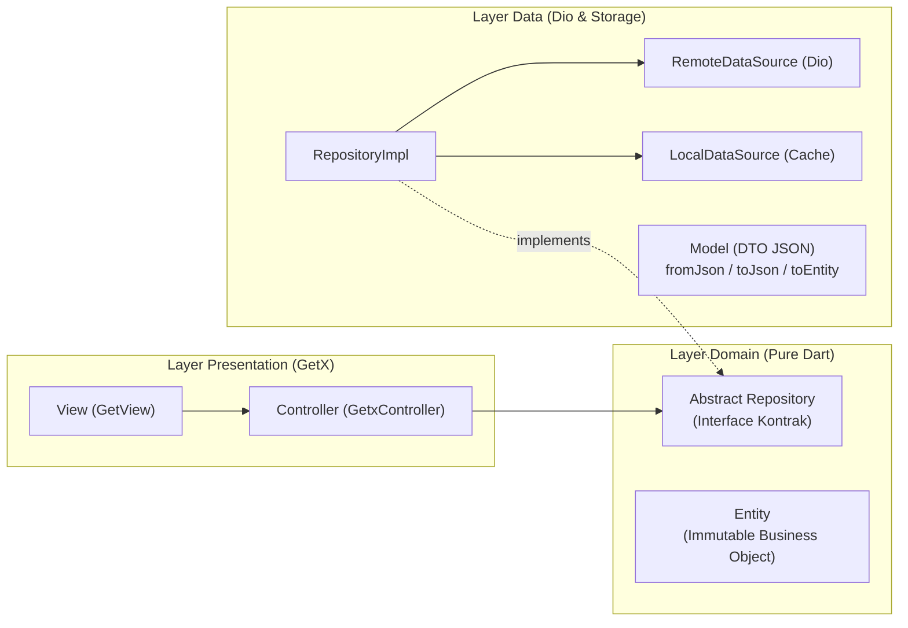
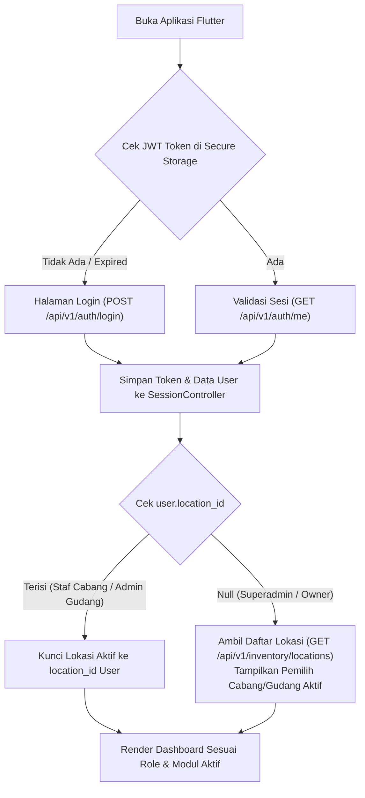
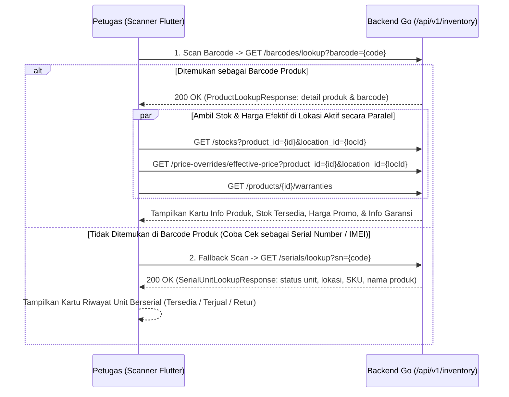
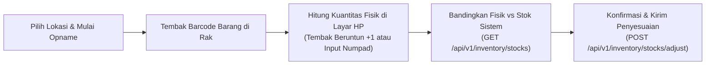

# Arsitektur & Aturan Utama Aplikasi Mobile Flutter (ERP Retail Modular)

Dokumen ini adalah **sumber kebenaran utama (Rules)** yang WAJIB dibaca dan dipatuhi oleh AI Agent maupun developer dalam setiap perencanaan, pembuatan, dan modifikasi kode pada aplikasi Android **ERP Retail Mobile (`mobile/`)**.

Aplikasi ini merupakan bagian integral dari ekosistem **ERP Retail Modular (Backend Go + Web SvelteKit + Mobile Flutter)** yang berfokus pada kecepatan eksekusi operasional lapangan melalui pemindaian barcode dan nomor seri (*Mobile WMS & Scanner App*).

---

## 1. Identitas Aplikasi & Tech Stack Utama

- **Target Platform:** Android (Smartphone Staf Toko & Perangkat Handheld PDA Scanner Gudang seperti Sunmi, Zebra, Honeywell, Urovo).
- **Framework & Bahasa:** Flutter (Dart dengan konfigurasi *Strict Type-Safety*).
- **Core Tech Stack Wajib:**
  1. **GetX (`get`):** Digunakan secara terstruktur untuk tiga pilar:
     - *State Management* reaktif (`GetxController`, `Rx<T>`, `Obx`).
     - *Dependency Injection* per modul/fitur (`Bindings`, `Get.lazyPut`, `Get.find`).
     - *Route Management & Guard* (`GetMaterialApp`, `GetPage`, `GetMiddleware`).
  2. **Dio (`dio`):** HTTP Client tunggal untuk berkomunikasi dengan REST API Backend Go (`/api/v1/...`), dilengkapi *Auth Interceptor* (injeksi otomatis JWT Bearer Token) dan *Error Interceptor* terpusat.
  3. **Mobile Scanner (`mobile_scanner`):** Engine kamera pemindai Barcode 1D (EAN-13, Code-128, UPC) dan 2D (QR Code, DataMatrix) berbasis Google ML Kit Android Native, dikombinasikan dengan *Hardware Keyboard Listener* untuk perangkat laser scanner fisik.
  4. **Penyimpanan Lokal Aman:** `flutter_secure_storage` untuk menyimpan JWT Token di dalam Android Keystore, dan penyimpanan lokal ringan untuk preferensi lokasi cabang aktif.

---

## 2. Prinsip Inti Arsitektur (Dilarang Keras Dilanggar)

1. **Satu Modul = Satu Bounded Context dengan Clean Architecture (3 Layer):**
   - Struktur folder di dalam `lib/modules/` wajib mencerminkan Bounded Context Backend Go (`inventory`, `purchasing`, `sales`, `owner_dashboard`).
   - Setiap modul **WAJIB** dibagi menjadi 3 layer **Clean Architecture**:
     - `domain/` : Berisi `entities/` (objek bisnis murni) dan `repositories/` (**abstract class / interface kontrak repository**). Layer ini murni Dart dan dilarang mengimpor `dio` atau widget Flutter.
     - `data/` : Berisi `models/` (DTO JSON `fromJson`/`toJson` yang mengonversi ke `Entity`), `datasources/` (`RemoteDataSource` menggunakan `Dio` dan `LocalDataSource` untuk penyimpanan lokal), serta `repositories/` (`RepositoryImpl` yang mengimplementasikan kontrak dari `domain/repositories/`).
     - `presentation/` : Berisi `bindings/`, `controllers/` (`GetxController`), `views/` (`GetView`), dan `widgets/` lokal modul.
   - Satu modul **DILARANG KERAS** mengimpor layer `data` atau `presentation` internal milik modul lain secara langsung.
2. **Aturan Ketergantungan Layer (Dependency Rule & Repository Pattern):**
   - Alur ketergantungan wajib satu arah: **`View -> Controller -> Domain Repository (Interface) <- Data RepositoryImpl -> RemoteDataSource -> ApiClient (Dio)`**.
   - `Controller` **DILARANG KERAS** memanggil `Dio` atau `RemoteDataSource` secara langsung. `Controller` hanya boleh memanggil kontrak `abstract class ...Repository` dari layer `domain/`.
3. **Standar Clean Code (SOLID & Keterbacaan Kode):**
   - **Single Responsibility Principle (SRP):** Satu class dan satu fungsi hanya melakukan satu tugas spesifik. Jika sebuah `View` melebihi `250 baris`, pecah sub-komponennya ke dalam folder `presentation/widgets/`. Jika sebuah method melebihi `35 baris`, ekstrak sub-logikanya menjadi helper method privat yang deskriptif.
   - **Guard Clauses (Early Return):** Hindari percabangan `if-else` bersarang dalam (*nested arrow anti-pattern*). Validasi kondisi gagal di awal fungsi dan langsung `return`.
   - **Intention-Revealing Names:** Gunakan nama variabel, fungsi, dan class yang menjelaskan niat bisnis (contoh: `scannedSerialNumbers`, `verifyTransferItems()`, `isBlindCountEnabled`), dilarang memakai singkatan ambigu (`temp`, `data1`, `val`, `arr`).
4. **Multi-Role & Lisensi Modul Dinamis (Fokus Bertahap):**
   - Aplikasi ini dirancang sebagai **Satu Aplikasi untuk Berbagai Peran** (*Gudang/Inventory, Purchasing, Sales/Kasir, hingga Owner/Superadmin*). Menu dan fitur yang tampil di layar menyesuaikan secara dinamis berdasarkan:
     - **Lisensi Modul Server:** Modul yang tidak aktif di server tidak boleh ditampilkan menunya dan rutenya wajib diblokir oleh `LicenseMiddleware`.
     - **Hak Akses (PBAC Permission) & Role User:** Staf hanya melihat menu yang diizinkan oleh permission akunnya (contoh: `inventory.stocks.adjust`, `inventory.transfers.ship`).
     - **Penugasan Cabang (`location_id`):** Staf cabang/gudang otomatis terkunci pada `location_id` tempat ia ditugaskan, sedangkan `superadmin` / `owner` (yang memiliki `location_id == null`) memiliki pemilih cabang (*Location Switcher*) di bagian atas layar.
   - **Fokus Fase Saat Ini (Fase 1):** Pembangunan saat ini **difokuskan penuh pada Modul Inventory (Gudang & Operasional Stok)** yang seluruh endpoint Backend Go-nya telah siap. Modul `purchasing`, `sales`, dan laporan `owner` disiapkan kerangka rutenya (*placeholder/slot*) untuk fase berikutnya.
5. **Zero-Dynamic & Strict Dart Type Safety:**
   - **Dilarang keras memakai tipe `dynamic`** secara eksplisit maupun implisit kecuali pada boundary dekode JSON mentah (`Map<String, dynamic>` di dalam factory `fromJson` pada layer `data/models/`).
   - Seluruh `Entity` dan `Model` wajib bersifat *immutable* (`final` fields dengan `const` constructor).
6. **Governance Komponen UI (`WIDGETS.md` - Component-First Workflow):**
   - Sebelum membuat halaman baru, **WAJIB memeriksa `mobile/WIDGETS.md`**.
   - Dilarang menulis ulang komponen dasar (`ElevatedButton`, `TextField`, `Container` card mentah, dialog konfirmasi) secara acak di halaman. Buat komponen reusable di `lib/shared/widgets/` terlebih dahulu, baru susun menjadi halaman.
7. **Larangan Emoticon & Icon Sparkle:**
   - **Dilarang keras memakai emoticon atau emoji** di dalam antarmuka aplikasi, pesan *snackbar/alert*, maupun komentar dokumentasi kode.
   - **Dilarang keras memakai icon sparkle** dalam bentuk apa pun.
   - Seluruh ikon wajib menggunakan gaya **Heroicons** (melalui package `heroicons` atau aset SVG Heroicons outline/solid 24x24).

---

## 3. Struktur Direktori Proyek (`mobile/` — Clean Architecture + GetX)

```text
mobile/
├── AGENTS.md                         # Dokumen aturan utama aplikasi Flutter ini
├── API_CONTRACT.md                   # Spesifikasi lengkap JSON Request/Response REST API Backend Go
├── ROADMAP.md                        # Tahapan pengerjaan (Fase 0 - Fase 9) dari Login s/d Inventory selesai
├── WIDGETS.md                        # Katalog & dokumentasi komponen UI reusable
├── pubspec.yaml                      # Daftar dependensi (get, dio, mobile_scanner, dll)
├── analysis_options.yaml             # Konfigurasi strict linter Dart (no implicit dynamic)
└── lib/
    ├── main.dart                     # Entry point, inisialisasi Core Services & GetMaterialApp
    ├── core/
    │   ├── config/
    │   │   └── env_config.dart       # Konfigurasi Base URL API & timeout
    │   ├── errors/
    │   │   ├── exceptions.dart       # ApiException, CacheException (dilempar oleh DataSource)
    │   │   └── failures.dart         # Failure object bersih yang dikonsumsi oleh Controller
    │   ├── network/
    │   │   ├── api_client.dart       # Instance tunggal Dio + Konfigurasi BaseOptions
    │   │   └── auth_interceptor.dart # Injeksi Bearer Token & penanganan HTTP 401/403
    │   ├── scanner/
    │   │   ├── scanner_controller.dart # Abstraksi mobile_scanner + Hardware Laser HID Listener
    │   │   └── scan_feedback.dart    # Efek suara Beep/Buzz & HapticFeedback getar
    │   ├── storage/
    │   │   └── token_storage.dart    # Wrapper flutter_secure_storage untuk JWT & Sesi
    │   └── theme/
    │       ├── app_colors.dart       # Token warna resmi Monochrome Obsidian (Gen-E)
    │       ├── app_typography.dart   # Konfigurasi font Inter & ukuran teks
    │       └── app_theme.dart        # ThemeData Flutter terpusat
    ├── routes/
    │   ├── app_routes.dart           # Konstanta nama route (contoh: Routes.inventoryStockIn)
    │   ├── app_pages.dart            # Daftar GetPage beserta Binding dan Middleware
    │   └── middlewares/
    │       ├── auth_middleware.dart  # Proteksi sesi login JWT
    │       └── role_middleware.dart  # Proteksi izin PBAC & lisensi modul
    ├── shared/
    │   ├── controllers/
    │   │   └── session_controller.dart # Global state: User aktif, Permission, & Lokasi Cabang Aktif
    │   ├── domain/
    │   │   └── entities/
    │   │       └── user_entity.dart  # Entity bisnis pengguna aktif
    │   └── widgets/                  # Komponen UI dasar yang terdaftar di WIDGETS.md
    │       ├── app_button.dart       # Tombol standar (Primary, Secondary, Danger, Outline, Ghost)
    │       ├── app_input.dart        # Input teks, angka ribuan, password toggle, & tombol scan
    │       ├── app_card.dart         # Wrapper kartu dengan border neutral-200 & shadow halus
    │       ├── app_badge.dart        # Badge status (Default, Primary, Success, Warning, Danger, Purple, Indigo)
    │       ├── scanner_viewport.dart # Widget kamera split-screen reusable + garis bidik
    │       └── reauth_modal.dart     # Modal Step-up Authentication (konfirmasi ulang password)
    └── modules/
        ├── auth/                     # Konteks Autentikasi & Pengaturan Akun
        │   ├── domain/
        │   │   └── repositories/
        │   │       └── auth_repository.dart          # Interface kontrak AuthRepository
        │   ├── data/
        │   │   ├── datasources/
        │   │   │   └── auth_remote_datasource.dart   # Pemanggil Dio /api/v1/auth/...
        │   │   ├── models/
        │   │   │   └── user_model.dart               # DTO JSON LoginResponse & UserResponse
        │   │   └── repositories/
        │   │       └── auth_repository_impl.dart     # Implementasi AuthRepository
        │   └── presentation/
        │       ├── bindings/
        │       ├── controllers/
        │       └── views/
        ├── home/                     # Dashboard Adaptif Berdasarkan Role & Lokasi
        │   └── presentation/
        │       ├── bindings/
        │       ├── controllers/
        │       └── views/
        ├── inventory/                # FOKUS FASE 1: Modul Gudang & Operasional Scanner
        │   ├── domain/               # LAYER 1: Inti Bisnis & Kontrak Abstrak (Murni Dart)
        │   │   ├── entities/         # ProductEntity, StockEntity, StockMovementEntity, StockTransferEntity, dll
        │   │   └── repositories/     # Kontrak Interface Repository:
        │   │       ├── inventory_lookup_repository.dart
        │   │       ├── stock_movement_repository.dart
        │   │       ├── stock_opname_repository.dart
        │   │       └── stock_transfer_repository.dart
        │   ├── data/                 # LAYER 2: Implementasi Data, DTO JSON, & Dio DataSource
        │   │   ├── datasources/
        │   │   │   ├── inventory_remote_datasource.dart # Pemanggil endpoint /api/v1/inventory/... via Dio
        │   │   │   └── inventory_local_datasource.dart  # Cache kamus lokasi/barcode lokal
        │   │   ├── models/           # DTO JSON (fromJson/toJson + toEntity()) sesuai API_CONTRACT.md
        │   │   └── repositories/     # Implementasi konkret Repository:
        │   │       ├── inventory_lookup_repository_impl.dart
        │   │       ├── stock_movement_repository_impl.dart
        │   │       ├── stock_opname_repository_impl.dart
        │   │       └── stock_transfer_repository_impl.dart
        │   └── presentation/         # LAYER 3: UI, State Reaktif GetX, & Dependency Injection
        │       ├── bindings/         # Menyuntikkan DataSource -> RepositoryImpl -> Controller
        │       ├── controllers/
        │       │   ├── quick_lookup_controller.dart   # Scan Cek Harga, Stok, Barcode, & Garansi SN
        │       │   ├── stock_in_controller.dart       # Barang Masuk via Scanner
        │       │   ├── stock_out_controller.dart      # Barang Keluar via Scanner
        │       │   ├── stock_opname_controller.dart   # Penyesuaian Stok / Opname via Scanner
        │       │   ├── stock_transfer_controller.dart # Mutasi Stok (Create, Approve, Ship, Receive)
        │       │   └── serial_scan_controller.dart    # Registrasi Serial Number / IMEI Beruntun
        │       ├── views/            # Halaman utama (GetView<TController>)
        │       └── widgets/          # Sub-widget modular khusus halaman Inventory
        ├── purchasing/               # (Slot Fase Berikutnya: PO Approval & Scan Goods Receipt)
        └── sales/                    # (Slot Fase Berikutnya: Mobile POS & Cek Komisi)
```

---

## 4. Desain Visual & Sistem Tema (Monochrome Obsidian)

Aplikasi Flutter **WAJIB** memiliki bahasa visual yang 100% selaras dengan Web Backoffice (`frontend/packages/ui/styles/theme.css`). Dilarang keras menuliskan kode warna `Color(0xFF...)` secara langsung di dalam file `views/`—seluruh warna wajib dipanggil dari `AppColors`.

### 4.1 Token Warna Resmi (`lib/core/theme/app_colors.dart`)

| Kategori Token | Nama Konstanta di `AppColors` | Kode Hex | Penggunaan Utama di UI Mobile |
| :--- | :--- | :--- | :--- |
| **Primary (Obsidian / Black)** | `primary50` .. `primary900` | `#F4F4F5` .. `#000000` (`primary600`: `#09090B`, `primary500`: `#27272A`) | Warna utama AppBar gelap, tombol aksi primer (`primary600`), indikator tab aktif, dan fokus input. |
| **Neutral (Slate Grey)** | `neutral50` .. `neutral950` | `#F8FAFC` .. `#020617` | Background halaman (`neutral50`), permukaan Card (`#FFFFFF`), garis batas/border (`neutral200`: `#E2E8F0`), teks utama (`neutral900`: `#0F172A`), teks sekunder (`neutral500`: `#64748B`). |
| **Success (Emerald)** | `success50`, `success500`, `success600`, `success700` | `#F0FDF4`, `#22C55E`, `#16A34A`, `#15803D` | Indikator scan berhasil, status stok aman, badge selesai (`received` / `approved`), notifikasi sukses. |
| **Danger (Red)** | `danger50`, `danger500`, `danger600`, `danger700` | `#FEF2F2`, `#EF4444`, `#DC2626`, `#B91C1C` | Peringatan barcode tidak ditemukan, stok kritis/habis, tombol hapus item scan, penolakan mutasi (`rejected`). |
| **Warning (Amber)** | `warning50`, `warning500`, `warning600`, `warning700` | `#FFFBEB`, `#F59E0B`, `#D97706`, `#B45309` | Status menunggu persetujuan (`pending_approval`), dalam pengiriman (`in_transit`), selisih opname belum lengkap. |
| **Info (Blue)** | `info50`, `info500`, `info600`, `info700` | `#EFF6FF`, `#3B82F6`, `#2563EB`, `#1D4ED8` | Informasi petunjuk pemindaian, status pengiriman mutasi. |
| **Purple (Serial / IMEI)** | `purple50`, `purple600`, `purple700` | `#FAF5FF`, `#9333EA`, `#7E22CE` | Badge penanda produk wajib *Serial Number / IMEI* (`flag_serial_tracking == true`) dan chip daftar SN yang di-scan. |
| **Indigo (Kode SKU)** | `indigo50`, `indigo600`, `indigo700` | `#EEF2FF`, `#4F46E5`, `#4338CA` | Badge kode SKU produk (`font-mono`). |
| **Cyan (Pajak / PPN)** | `cyan50`, `cyan600`, `cyan700` | `#ECFEFF`, `#0891B2`, `#0E7490` | Badge penanda produk kena PPN (`is_ppn == true`). |

### 4.2 Ergonomi & Prinsip Antarmuka Lapangan (Warehouse UX)
- **Tipografi:** Menggunakan font `Inter` untuk seluruh teks UI, dan `JetBrains Mono` (atau font *monospace*) untuk menampilkan Kode SKU, Nomor Barcode, Nomor Dokumen (`MOV-...`, `TRF-...`), serta Nomor Seri/IMEI agar angka `0` dan huruf `O` mudah dibedakan oleh mata petugas.
- **Ukuran Sentuh Ramah Satu Tangan (*Thumb-Friendly*):** Petugas gudang sering memegang barang di tangan kiri dan memegang HP/Scanner di tangan kanan. Tombol utama dan tombol pengubah kuantitas (`-` / `+`) wajib memiliki tinggi minimal `48dp`.
- **Border & Sudut:** Card menggunakan latar putih (`#FFFFFF`), border `1px` warna `AppColors.neutral200` (`#E2E8F0`), dan radius sudut moderat (`8dp` untuk input/tombol, `12dp` untuk card, `16dp` untuk bottom sheet/modal).

---

## 5. Standar Clean Architecture, Repository Pattern, GetX, Dio, dan Scanner

### 5.1 Arsitektur 3 Layer & Repository Pattern (Wajib di Setiap Modul)



1. **Layer `domain/` (Bebas Framework UI & Bebas HTTP):**
   - **`Entity` (`domain/entities/`):** Objek bisnis murni dengan properti `final` dan fungsi logika domain ringan (contoh: `bool get canBeShipped => status == 'approved';`).
   - **`Abstract Repository` (`domain/repositories/`):** Kontrak interface yang mendefinisikan operasi bisnis menggunakan `Entity` (bukan JSON mentah).
     ```dart
     abstract class StockMovementRepository {
       Future<StockMovementEntity> createStockIn(CreateStockMovementParams params);
       Future<List<StockMovementEntity>> listMovements({required String type, required String locationId});
     }
     ```
2. **Layer `data/` (Adaptasi JSON, Jaringan Dio, & Penyimpanan Lokal):**
   - **`Model / DTO` (`data/models/`):** Bertugas melakukan parsing `fromJson(Map<String, dynamic> json)`, `toJson()`, dan memiliki method `toEntity()` untuk mengubah DTO menjadi `Entity` domain.
   - **`RemoteDataSource` (`data/datasources/`):** Satu-satunya tempat yang boleh memanggil `ApiClient` (`Dio`). Menangkap `DioException` dan melempar `ApiException` yang bersih.
   - **`RepositoryImpl` (`data/repositories/`):** Mengimplementasikan `abstract class` dari `domain/repositories/`. Mengoordinasikan panggilan ke `RemoteDataSource` (serta `LocalDataSource` jika ada cache), memetakan `Model` ke `Entity`, dan membungkus error menjadi `Failure` yang ramah dibaca `Controller`.
3. **Layer `presentation/` (GetX Binding, Controller, & View):**
   - **`Binding` (`presentation/bindings/`):** Merakit *Dependency Injection* secara berurutan dari layer terdalam ke terluar menggunakan `Get.lazyPut`:
     ```dart
     class StockInBinding extends Bindings {
       @override
       void dependencies() {
         Get.lazyPut<InventoryRemoteDataSource>(
           () => InventoryRemoteDataSourceImpl(apiClient: Get.find<ApiClient>()),
         );
         Get.lazyPut<StockMovementRepository>(
           () => StockMovementRepositoryImpl(remoteDataSource: Get.find<InventoryRemoteDataSource>()),
         );
         Get.lazyPut<StockInController>(
           () => StockInController(repository: Get.find<StockMovementRepository>()),
         );
       }
     }
     ```
   - **`Controller` (`presentation/controllers/`):** Hanya menerima kontrak `Repository` melalui constructor (`final StockMovementRepository repository;`). Mengelola state reaktif (`.obs`) dan siklus hidup halaman.
   - **`View` (`presentation/views/`):** Hanya merender UI menggunakan komponen dari `lib/shared/widgets/` dan menggunakan `Obx` secara spesifik pada bagian widget yang berubah saja (dilarang membungkus seluruh `Scaffold` dengan satu `Obx`).

### 5.2 Aturan Pola Dio (`ApiClient` & Error Handling)
- **Single Dio Instance:** Hanya ada satu konfigurasi dasar `ApiClient` di `lib/core/network/api_client.dart` yang didaftarkan secara permanen saat startup (`Get.put(ApiClient(), permanent: true)`).
- **Standar Format Error Backend Go:** Semua error dari Backend Go dikembalikan dalam format JSON `{"error": "pesan kesalahan"}` (sesuai struct `ErrorResponse` di Go).
- `ApiException` di Dio Interceptor wajib mengekstrak field `error` tersebut dan mengubahnya menjadi pesan yang jelas bagi pengguna.
- Jika server mengembalikan `HTTP 401 Unauthorized`, interceptor otomatis menghapus token dari `token_storage` dan mengarahkan pengguna kembali ke `Routes.login`.

### 5.3 Arsitektur Dual-Mode Scanner (`mobile_scanner` + Laser PDA)
Aplikasi ini wajib mendukung **dua cara pemindaian sekaligus** pada setiap layar operasional melalui `ScannerController`:
1. **Mode Kamera (`mobile_scanner`):**
   - Ditampilkan dalam bentuk **Split-Screen Viewport** di bagian atas layar (tinggi sekitar `220dp` - `260dp`, dapat di-*minimize* atau di-*pause* dengan 1 ketukan untuk menghemat baterai).
   - Dilengkapi tombol **Flash/Torch** (senter) untuk area gudang yang gelap.
   - Wajib memiliki **Debounce / Anti-Duplicate Cooldown (1.200 ms)** untuk kode barcode yang sama persis agar 1 kardus yang terarah ke kamera tidak tercatat 5 kali dalam sedetik.
2. **Mode Hardware Laser Scanner (PDA Android / Bluetooth Scanner):**
   - Perangkat PDA gudang menembakkan hasil bacaan laser sebagai emulasi ketikan keyboard super cepat yang diakhiri karakter `Enter` (`LogicalKeyboardKey.enter`).
   - Halaman operasional wajib membungkus layar dengan listener keyboard global yang mengumpulkan karakter cepat dan langsung memicu fungsi `onBarcodeDetected(String code)` **tanpa** mengharuskan petugas mengetuk kolom input teks terlebih dahulu.
3. **Umpan Balik Sensorik Wajib (*Audio & Haptic*):**
   - **Scan Berhasil / Produk Dikenali:** Bunyi *Beep* pendek bernada tinggi + `HapticFeedback.mediumImpact()`.
   - **Scan Gagal / Barcode Tidak Terdaftar / Stok Tidak Cukup:** Bunyi *Buzz* ganda bernada rendah + `HapticFeedback.heavyImpact()` + pesan peringatan visual berwarna `AppColors.danger500`.

---

## 6. Penjelasan Lengkap Seluruh Alur Aplikasi (End-to-End Workflows)

Bagian ini menjelaskan secara rinci bagaimana setiap alur bisnis berjalan di aplikasi Flutter dan bagaimana ia berinteraksi dengan endpoint Backend Go yang sudah ada.

---

### Alur 1: Login, Resolusi Hak Akses, & Konteks Lokasi Cabang/Gudang



1. **Proses Login:**
   - Pengguna memasukkan `username` dan `password` -> memanggil `POST /api/v1/auth/login`.
   - Backend mengembalikan `token` dan objek `user` (`id`, `name`, `username`, `role`, `location_id`, `is_active`).
2. **Penentuan Lokasi Kerja Aktif (`activeLocationId`):**
   - Seluruh transaksi gudang di Backend Go mewajibkan `location_id`.
   - Jika pengguna yang login adalah **Admin Gudang / Staf Cabang** (`user.location_id != null`), maka aplikasi otomatis mengunci lokasi kerja pada cabang tersebut.
   - Jika pengguna yang login adalah **Owner / Superadmin** (`user.location_id == null`), aplikasi memanggil `GET /api/v1/inventory/locations` dan menyediakan *Dropdown Selector Lokasi* di AppBar atas agar Owner bisa memilih sedang menginspeksi atau melakukan opname di gudang yang mana.
3. **Visibilitas Menu Multi-Role:**
   - Saat ini menu utama menampilkan **Modul Inventory**.
   - Di masa depan, saat modul `Purchasing` dan `Sales` diaktifkan di backend, `SessionController` akan menampilkan grup menu sesuai peran login (Staf Gudang fokus ke Inbound/Outbound/Opname; Purchasing fokus ke PO/Goods Receipt; Sales fokus ke Kasir/Cek Harga; Owner melihat ringkasan valuasi & persetujuan dokumen).

---

### Alur 2: Scan Cek Cepat Barang, Harga Promo Cabang, & Lacak Serial/IMEI (Quick Lookup)

Fitur ini digunakan oleh staf gudang maupun pramuniaga toko untuk memeriksa informasi barang secara instan hanya dengan menembak barcode di kardus atau unit fisik.



- **Keunggulan Alur Cerdas (*Smart Dual-Lookup*):**
  Petugas tidak perlu bingung memilih menu "Cek Barcode Pabrik" atau "Cek IMEI/Serial Number". Cukup tembak kode apa saja:
  1. Aplikasi mengecek ke `GET /api/v1/inventory/barcodes/lookup?barcode={code}` terlebih dahulu.
  2. Jika dikembalikan `404 Not Found`, aplikasi otomatis memeriksa ke `GET /api/v1/inventory/serials/lookup?sn={code}`.
  3. Jika barcode belum terdaftar sama sekali tetapi petugas memiliki izin `inventory.barcodes.manage`, aplikasi menawarkan tombol cepat **"Daftarkan Barcode Ini ke Produk"** (`POST /api/v1/inventory/products/{id}/barcodes`).

---

### Alur 3: Transaksi Barang Masuk (`Stock In`) via Scanner

Digunakan ketika barang tiba di gudang untuk dicatat masuk ke sistem (`POST /api/v1/inventory/movements/in`).

1. **Inisialisasi Dokumen:**
   - Lokasi gudang otomatis terisi sesuai `activeLocationId`.
   - Petugas memilih **Alasan Barang Masuk (`category_reason`)** (contoh: *Penerimaan Barang Baru*, *Retur Pelanggan*, *Pengembalian Pinjaman*) serta mengisi Nomor Referensi/Surat Jalan (`reference_number`) dan Catatan (`notes`) jika ada.
2. **Pemindaian Barang Masuk ke Keranjang Scan:**
   - Kamera `mobile_scanner` menyala di bagian atas layar (atau petugas menembak dengan laser PDA).
   - Setiap kali barcode ditembak:
     - Aplikasi mencari produk via `GET /api/v1/inventory/barcodes/lookup?barcode={code}`.
     - **Jika Produk Biasa (`flag_serial_tracking == false`):**
       - Jika produk belum ada di daftar scan halaman ini, tambahkan baris baru dengan `quantity = 1`.
       - Jika produk sudah ada di daftar scan, otomatis tambahkan `quantity + 1` (disertai bunyi *Beep* dan efek highlight pada baris tersebut). Petugas juga bisa mengetuk angka kuantitas untuk mengetik jumlah besar (misal langsung ketik `50`).
     - **Jika Produk Wajib Serial / IMEI (`flag_serial_tracking == true`):**
       - Aplikasi menampilkan badge ungu `Serial / IMEI` dan otomatis mengaktifkan mode **"Tembak Nomor Seri Unit"**.
       - Petugas menembak stiker Serial Number/IMEI pada setiap kardus unit satu per satu. Setiap SN yang di-scan masuk ke dalam array `serial_numbers` item tersebut, dan `quantity` otomatis mengikuti jumlah SN unik yang telah di-scan!
3. **Penyimpanan Transaksi:**
   - Petugas menekan tombol **Simpan Barang Masuk**.
   - Aplikasi mengirim payload `CreateStockMovementRequest` ke `POST /api/v1/inventory/movements/in`:
     ```json
     {
       "location_id": "019...",
       "category_reason": "penerimaan_barang",
       "reference_number": "SJ-2026-099",
       "notes": "Input via Mobile Scanner",
       "items": [
         {
           "product_id": "019...",
           "quantity": 2,
           "serial_numbers": ["SN-001", "SN-002"]
         }
       ]
     }
     ```
   - Setelah sukses (`201 Created`), aplikasi menampilkan ringkasan nomor dokumen (`MOV-IN-...`).

---

### Alur 4: Transaksi Barang Keluar (`Stock Out`) via Scanner

Digunakan untuk mengeluarkan barang dari gudang (`POST /api/v1/inventory/movements/out`).

1. **Pemilihan Alasan & Validasi Stok Real-Time:**
   - Petugas memilih **Alasan Barang Keluar (`category_reason`)** (contoh: * Pemakaian Internal*, *Barang Rusak/Expired*, *Pengeluaran Gudang*).
   - Saat petugas menembak barcode produk:
     - Aplikasi mengambil data produk sekaligus mengecek sisa stok tersedia di cabang tersebut melalui `GET /api/v1/inventory/stocks?product_id={id}&location_id={locId}`.
     - **Proteksi Over-Quantity:** Jika `available_quantity` adalah `0`, atau jumlah yang di-scan melebihi `available_quantity`, aplikasi langsung membunyikan nada peringatan (*Error Buzz*) dan menolak penambahan kuantitas.
2. **Validasi Nomor Seri untuk Barang Berserial:**
   - Jika produk memiliki `flag_serial_tracking == true`, petugas wajib men-scan nomor seri unit yang akan dikeluarkan.
   - Aplikasi memverifikasi melalui `GET /api/v1/inventory/serials/lookup?sn={sn}` bahwa unit tersebut benar-benar berstatus `tersedia` di lokasi gudang aktif sebelum mengizinkannya masuk ke daftar pengeluaran.
3. **Eksekusi Pengeluaran:**
   - Mengirimkan request ke `POST /api/v1/inventory/movements/out`.

---

### Alur 5: Stock Opname (Hitung Fisik & Penyesuaian Stok) via Scanner

Digunakan saat kegiatan audit/hitung fisik barang di rak gudang (`POST /api/v1/inventory/stocks/adjust`).



1. **Mode Hitung Fisik Cepat (*Continuous Counting*):**
   - Petugas berdiri di depan rak barang dan mulai menembak barcode produk.
   - Tersedia toggle **Mode Akumulasi (+1 per Scan)** atau **Mode Input Kuantitas (Scan -> Muncul Numpad)**.
   - Aplikasi juga menyediakan opsi toggle **"Blind Count (Sembunyikan Stok Sistem Saat Menghitung)"** agar petugas fokus menghitung fisik barang yang nyata di rak tanpa terpengaruh angka sistem.
2. **Tinjauan Selisih (*Variance Preview*):**
   - Sebelum disimpan, petugas (atau kepala gudang) dapat melihat perbandingan per item:
     - `Stok Sistem Saat Ini` (`previous_quantity` dari `GET /api/v1/inventory/stocks`)
     - `Hasil Hitung Fisik` (`new_quantity`)
     - `Selisih` (`difference = new_quantity - previous_quantity`, diberi badge hijau jika `+`, merah jika `-`, dan abu-abu jika `0` / cocok).
3. **Simpan Penyesuaian Stok:**
   - Untuk item yang memiliki selisih (atau perlu dicatat opname-nya), aplikasi mengirimkan request ke `POST /api/v1/inventory/stocks/adjust` dengan menyertakan `product_id`, `location_id`, `new_quantity`, dan `reason` (contoh: `"Stock Opname via Mobile Scanner"`).

---

### Alur 6: Mutasi Stok Antar Cabang (`Stock Transfer`: Request, Approve, Ship, & Receive)

Mendukung siklus hidup penuh `StockTransfer` sesuai aturan domain (`pending_approval -> approved -> in_transit -> received`):

1. **Pengajuan Mutasi via Scan (`POST /api/v1/inventory/transfers`):**
   - Petugas memilih lokasi asal (`from_location_id`) dan lokasi tujuan (`to_location_id`), lalu men-scan barang-barang yang ingin dimutasi.
2. **Persetujuan Mutasi oleh Owner/Superadmin (`POST /api/v1/inventory/transfers/{id}/approve`):**
   - Hanya muncul bagi pengguna dengan permission `inventory.transfers.approve`.
   - **Wajib Step-up Authentication:** Saat tombol **Approve** ditekan, aplikasi menampilkan `ReauthModal` (meminta input ulang password) yang memverifikasi ke `POST /api/v1/auth/verify-password` sebelum mengeksekusi approval.
3. **Verifikasi Scan Pengiriman oleh Gudang Asal (`POST /api/v1/inventory/transfers/{id}/ship`):**
   - Petugas gudang pengirim membuka dokumen transfer yang berstatus `approved`.
   - Untuk mencegah salah ambil barang di rak, petugas menembak barcode barang fisik yang dimasukkan ke kardus pengiriman hingga angka verifikasi di layar mencapai target (`X / X Terverifikasi`), lalu menekan tombol **Kirim Barang (Ship)**. Status berubah menjadi `in_transit`.
4. **Verifikasi Scan Penerimaan oleh Gudang Tujuan (`POST /api/v1/inventory/transfers/{id}/receive`):**
   - Ketika barang tiba di cabang tujuan, Admin Gudang tujuan membuka dokumen transfer yang berstatus `in_transit`.
   - Petugas menembak barcode barang yang turun dari kendaraan untuk memastikan 100% barang sesuai surat jalan, lalu menekan **Konfirmasi Terima Barang (Receive)** (dilindungi `ReauthModal` jika kebijakan step-up aktif).

---

## 7. Referensi Kontrak Endpoint Backend Go & Tahapan Pengerjaan

- **Kontrak JSON Lengkap:** Sebelum membuat class `Model` (DTO), `Entity`, `RemoteDataSource`, atau `Repository`, **WAJIB** membaca spesifikasi payload JSON di [API_CONTRACT.md](file:///c:/PROJECT/WEBSITE/erp-retail-modular/mobile/API_CONTRACT.md).
- **Urutan Fase Pengerjaan:** Eksekusi pembangunan wajib mengikuti tahapan berurutan (Fase 0 s/d Fase 9) di [ROADMAP.md](file:///c:/PROJECT/WEBSITE/erp-retail-modular/mobile/ROADMAP.md).

Seluruh `RemoteDataSource` Dio di Flutter wajib mengacu pada ringkasan endpoint resmi yang sudah terdaftar di Backend Go berikut ini:

### 7.1 Shared Context: Auth & Profil
| Method & Path | Permission | Kegunaan di Aplikasi Flutter |
| :--- | :--- | :--- |
| `POST /api/v1/auth/login` | Publik | Login dengan `username` & `password`, menerima JWT `token` & `user`. |
| `GET /api/v1/auth/me` | Token Valid | Memuat ulang profil user saat aplikasi dibuka kembali. |
| `POST /api/v1/auth/verify-password` | Token Valid | **Step-up Authentication** sebelum mengeksekusi aksi kritikal. |
| `POST /api/v1/auth/change-password` | Token Valid | Mengganti kata sandi akun staf dari menu profil. |

### 7.2 Modul Inventory: Operasional Gudang & Scanner
| Method & Path | Permission PBAC | Kegunaan di Aplikasi Flutter |
| :--- | :--- | :--- |
| `GET /api/v1/inventory/barcodes/lookup?barcode={code}` | `inventory.barcodes.view` | **Inti Scanner:** Mencari produk berdasarkan hasil scan barcode pabrik. |
| `GET /api/v1/inventory/serials/lookup?sn={code}` | `inventory.serials.view` | **Inti Scanner:** Melacak unit fisik berdasarkan scan Serial Number / IMEI. |
| `POST /api/v1/inventory/products/{id}/barcodes` | `inventory.barcodes.manage` | Mendaftarkan barcode baru langsung dari HP saat men-scan produk baru. |
| `POST /api/v1/inventory/products/{id}/serials` | `inventory.serials.register` | Registrasi banyak Serial Number / IMEI beruntun via kamera scanner. |
| `GET /api/v1/inventory/locations` | `inventory.locations.view` | Mengambil daftar cabang/gudang untuk penentuan lokasi aktif. |
| `GET /api/v1/inventory/products` | `inventory.products.view` | Pencarian manual produk (jika stiker barcode pada kardus rusak/sobek). |
| `GET /api/v1/inventory/stocks` | `inventory.stocks.view` | Mengecek stok produk di cabang tertentu (`?product_id=...&location_id=...`). |
| `GET /api/v1/inventory/stocks/alerts` | `inventory.stocks.view` | Menampilkan daftar barang yang stoknya menipis (*Low Stock Alert*). |
| `POST /api/v1/inventory/stocks/adjust` | `inventory.stocks.adjust` | Mengeksekusi penyesuaian jumlah stok fisik (**Stock Opname**). |
| `GET /api/v1/inventory/stocks/adjustments` | `inventory.stocks.view` | Melihat riwayat hasil Stock Opname di cabang. |
| `POST /api/v1/inventory/movements/in` | `inventory.stocks.adjust` | Menyimpan transaksi **Barang Masuk (Inbound)** hasil scan. |
| `POST /api/v1/inventory/movements/out` | `inventory.stocks.adjust` | Menyimpan transaksi **Barang Keluar (Outbound)** hasil scan. |
| `GET /api/v1/inventory/movements` | `inventory.stocks.view` | Melihat daftar riwayat dokumen Barang Masuk & Barang Keluar. |
| `GET /api/v1/inventory/movements/{id}` | `inventory.stocks.view` | Melihat rincian item & nomor seri pada dokumen pergerakan stok. |
| `GET /api/v1/inventory/transfers` | `inventory.transfers.view` | Melihat daftar dokumen Mutasi Stok antar cabang. |
| `GET /api/v1/inventory/transfers/{id}` | `inventory.transfers.view` | Melihat detail item pada dokumen Mutasi Stok. |
| `POST /api/v1/inventory/transfers` | `inventory.transfers.create` | Membuat pengajuan mutasi stok baru via scanner. |
| `POST /api/v1/inventory/transfers/{id}/approve` | `inventory.transfers.approve` | Menyetujui mutasi stok (khusus Owner/Superadmin). |
| `POST /api/v1/inventory/transfers/{id}/reject` | `inventory.transfers.approve` | Menolak mutasi stok disertai alasan. |
| `POST /api/v1/inventory/transfers/{id}/ship` | `inventory.transfers.ship` | Mengonfirmasi pengiriman barang mutasi dari gudang asal. |
| `POST /api/v1/inventory/transfers/{id}/receive` | `inventory.transfers.receive` | Mengonfirmasi penerimaan 100% barang mutasi di gudang tujuan. |
| `GET /api/v1/inventory/price-overrides/effective-price` | `inventory.prices.view` | Mengecek harga jual efektif & diskon aktif cabang saat scan barang. |

---

## 8. Anti-Pattern yang Wajib Ditolak di Flutter

- Memanggil `Dio` atau `RemoteDataSource` secara langsung dari dalam `View` atau `Controller` (wajib melalui abstraksi `Repository` di layer `domain/repositories/`).
- Mengimpor `dio` atau `models/` (DTO JSON) ke dalam layer `domain/` (layer `domain/` wajib murni Dart dan hanya mengenal `Entity`).
- Menumpuk seluruh kode tampilan dalam satu file `View` raksasa (>250 baris) tanpa memecahnya ke sub-widget di `presentation/widgets/`.
- Menggunakan tipe `dynamic` pada parameter fungsi, state `Rx`, atau properti `Entity` / `Model`.
- Menulis kode warna hex `Color(0xFF...)` secara langsung di file View tanpa memanggil `AppColors`.
- Membuat `ElevatedButton`, `TextField`, atau `Dialog` mentah di halaman tanpa menggunakan komponen standar di `lib/shared/widgets/` yang terdaftar di `WIDGETS.md`.
- Membiarkan kamera `mobile_scanner` terus aktif di latar belakang ketika halaman berpindah atau ketika modal terbuka (wajib memanggil `scannerController.stop()` / `pause()` saat `onClose` atau saat modal tampil agar tidak menguras baterai dan tidak memicu *ghost scan*).
- Tidak memberi *cooldown/debounce* pada pembacaan kamera sehingga satu barcode yang tertahan di depan kamera terinput berkali-kali dalam satu detik.
- Menggunakan emoticon/emoji atau icon sparkle di bagian mana pun dari kode dan UI.

---

## 9. Pendekatan Edukasi & Penjelasan Kode (Learning-First Mentality)

Sama seperti prinsip utama proyek ERP Retail Modular ini, setiap pembuatan atau perubahan kode di aplikasi Flutter wajib disertai penjelasan edukatif:
1. **Penjelasan Terstruktur (*Why & Where*):** Jelaskan mengapa sebuah kode diletakkan di `Entity`, `Model`, `RemoteDataSource`, `Repository`, `Controller`, `Binding`, atau `View`.
2. **Soroti Konsep Kunci Flutter, Clean Architecture, & GetX:** Berikan catatan singkat mengenai konsep yang dipakai (contoh: *Dependency Inversion* pada `Repository`, siklus hidup `GetxController` `onInit`/`onClose`, cara kerja *Reactive State* `.obs`, manajemen memori `Get.lazyPut`, atau cara kerja *Interceptor* di `Dio`).
3. **Analogi Dunia Nyata:** Gunakan analogi sederhana dunia nyata untuk setiap konsep teknis baru dan catat rangkumannya ke dalam jurnal belajar [belajar.md](file:///c:/PROJECT/WEBSITE/erp-retail-modular/belajar.md).

