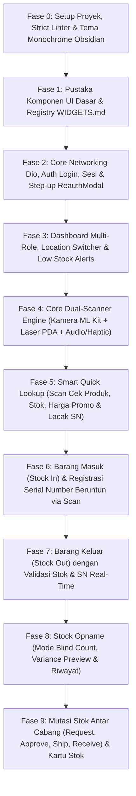

# Roadmap & Tahapan Pengerjaan Aplikasi Mobile Flutter (`mobile/ROADMAP.md`)

Dokumen ini adalah panduan tahapan eksekusi (*Implementation Phases*) untuk membangun aplikasi Android **ERP Retail Mobile (GetX + Dio + `mobile_scanner`)** dari titik nol (inisialisasi & login) hingga seluruh fitur **Modul Inventory** tuntas 100%.

Pembangunan wajib dieksekusi secara berurutan per fase agar setiap fondasi (Tema, Komponen UI `WIDGETS.md`, Networking `Dio`, dan Engine Scanner) teruji kokoh sebelum dipakai oleh halaman bisnis.

---

## Ringkasan Peta Fase (Phase Overview)

---

## Fase 0: Inisialisasi Proyek, Strict Linter, & Fondasi Tema Visual
**Tujuan:** Menyiapkan struktur folder modular di dalam `mobile/`, menginstal dependensi utama, mengaktifkan aturan *Zero-Dynamic Dart*, dan membangun sistem tema **Monochrome Obsidian**.

### Pekerjaan & File yang Dibuat:
1. **Setup `pubspec.yaml`:**
   - Dependensi utama: `get`, `dio`, `mobile_scanner`, `flutter_secure_storage`, `audioplayers`, `intl`, `heroicons` (atau `flutter_svg`).
2. **Setup `analysis_options.yaml`:**
   - Mengaktifkan `strict-casts: true`, `strict-inference: true`, `strict-raw-types: true` untuk mencegah penggunaan `dynamic`.
3. **Fondasi Tema (`lib/core/theme/`):**
   - `app_colors.dart`: Definisi lengkap palet warna *Monochrome Obsidian* (`primary`, `neutral`, `danger`, `success`, `warning`, `info`, `purple`, `indigo`, `cyan`) yang identik dengan `frontend/packages/ui/styles/theme.css`.
   - `app_typography.dart`: Konfigurasi teks standar (`Inter`) dan teks kode/angka (`JetBrains Mono` / monospace) untuk SKU, Barcode, dan Serial Number.
   - `app_theme.dart`: Konfigurasi `ThemeData` Flutter terpusat.
4. **Konfigurasi Lingkungan (`lib/core/config/env_config.dart`):**
   - Pengaturan `baseUrl` API yang mudah diganti antara Emulator (`10.0.2.2:8080`) dan IP Server LAN Gudang, termasuk fitur ubah IP Server di halaman Login untuk memudahkan instalasi *single-tenant* per toko.

### Kriteria Selesai (Definition of Done):
- Perintah `flutter analyze` menghasilkan `No issues found!`.
- Aplikasi dapat dijalankan menampilkan layar placeholder dengan tema warna Monochrome Obsidian.

---

## Fase 1: Pustaka Komponen UI Dasar & Governance (`WIDGETS.md`)
**Tujuan:** Menerapkan prinsip *Component-First Workflow* dengan membangun seluruh komponen atomik terlebih dahulu sebelum membuat halaman apa pun.

### Pekerjaan & File yang Dibuat:
1. **Dokumentasi Katalog (`mobile/WIDGETS.md`):**
   - Mencatat spesifikasi props, varian, dan contoh penggunaan setiap widget standar.
2. **Komponen Reusable (`lib/shared/widgets/`):**
   - `app_button.dart`: Mendukung varian `primary` (Obsidian `#09090B`), `secondary`, `danger`, `outline`, `ghost`, ukuran `sm | md | lg`, state `isLoading`, dan tinggi ramah satu tangan (`>= 48dp`).
   - `app_input.dart`: Mendukung label, validasi error, toggle visibilitas password, pemisah ribuan Rupiah, serta tombol ikon pemindai (*scan action suffix*).
   - `app_card.dart`: Kontainer putih dengan border `1px` `AppColors.neutral200`, radius `12dp`, dan opsi aksi ketuk (`onTap`).
   - `app_badge.dart`: Mendukung varian `default`, `primary`, `success`, `warning`, `danger`, `info`, `purple` (khusus Serial/IMEI), `indigo` (khusus SKU), dan `cyan` (khusus PPN).
   - `app_alert.dart` & `app_snackbar.dart`: Helper notifikasi standar untuk menampilkan pesan sukses maupun error dari API tanpa menggunakan emoticon.
   - `app_empty_state.dart`: Tampilan standar ketika daftar data atau keranjang scan masih kosong.

### Kriteria Selesai (Definition of Done):
- Seluruh widget terdaftar di `mobile/WIDGETS.md` dengan tipe parameter eksplisit.

---

## Fase 2: Core Networking (`Dio`), Autentikasi Login, Sesi, & `ReauthModal`
**Tujuan:** Menghubungkan aplikasi Flutter ke Backend Go untuk alur autentikasi JWT, penyimpanan sesi aman, dan modal konfirmasi ulang kata sandi (*Step-up Authentication*).

### Endpoint yang Diintegrasikan:
- `POST /api/v1/auth/login`
- `GET /api/v1/auth/me`
- `POST /api/v1/auth/verify-password`
- `POST /api/v1/auth/change-password`

### Pekerjaan & File yang Dibuat:
1. **Layer Jaringan, Error, & Storage (`lib/core/network/`, `lib/core/errors/`, & `lib/core/storage/`):**
   - `exceptions.dart` & `failures.dart`: Definisi `ApiException` (Data layer) dan `Failure` (Domain/Presentation layer).
   - `token_storage.dart`: Simpan/baca/hapus JWT token & URL server lokal.
   - `api_client.dart`: Konfigurasi `Dio` tunggal dengan `AuthInterceptor` (otomatis menyisipkan header `Authorization: Bearer <token>` dan menangani redirect saat `401 Unauthorized`).
2. **Global Session (`lib/shared/controllers/session_controller.dart` & `lib/shared/domain/entities/user_entity.dart`):**
   - Menyimpan `UserEntity` yang sedang login, role (`superadmin`, `owner`, `admin`, `staff`), serta status sesi.
3. **Modul Auth (`lib/modules/auth/` — Clean Architecture):**
   - `domain/repositories/auth_repository.dart`: Kontrak interface `AuthRepository`.
   - `data/models/user_model.dart`: DTO JSON `LoginResponse` & `UserResponse` beserta konversi `.toEntity()`.
   - `data/datasources/auth_remote_datasource.dart`: Pemanggil Dio `/api/v1/auth/...`.
   - `data/repositories/auth_repository_impl.dart`: Implementasi konkret `AuthRepository`.
   - `presentation/`: `auth_binding.dart`, `auth_controller.dart`, `login_view.dart`, `profile_view.dart`.
4. **Komponen Keamanan (`lib/shared/widgets/reauth_modal.dart`):**
   - Modal reusable `ReauthModal.show()` yang meminta input password pengguna dan memverifikasinya melalui `AuthRepository.verifyPassword()` sebelum mengizinkan fungsi callback aksi kritikal dijalankan.

### Kriteria Selesai (Definition of Done):
- Pengguna dapat login menggunakan akun backend, token tersimpan aman saat aplikasi ditutup dan dibuka kembali, serta `ReauthModal` berhasil memvalidasi password ke server.

---

## Fase 3: Dashboard Multi-Role, Resolusi Lokasi Cabang (`Location Switcher`), & Peringatan Stok
**Tujuan:** Membangun halaman beranda adaptif yang mengunci atau memilih lokasi gudang aktif (`activeLocationId`) serta menampilkan ringkasan operasional gudang.

### Endpoint yang Diintegrasikan:
- `GET /api/v1/inventory/locations`
- `GET /api/v1/inventory/stocks/alerts?location_id={lid}`

### Pekerjaan & File yang Dibuat:
1. **Manajemen Lokasi Aktif di `SessionController`:**
   - Jika `user.locationId != null` (Staf/Admin Cabang): Otomatis memuat detail lokasi tersebut dan menguncinya sebagai lokasi kerja.
   - Jika `user.locationId == null` (Owner/Superadmin): Memuat daftar lokasi aktif dari `GET /api/v1/inventory/locations` dan menampilkan *BottomSheet / Dropdown Location Switcher* di bagian atas layar.
2. **Halaman Dashboard (`lib/modules/home/presentation/`):**
   - Header informasi pengguna, role badge, dan indikator Lokasi Cabang/Gudang Aktif.
   - **Grid Menu Operasional Utama (Fokus Fase 1 - Inventory):**
     1. *Scan Cek Barang & SN (Quick Lookup)*
     2. *Barang Masuk (Inbound Scan)*
     3. *Barang Keluar (Outbound Scan)*
     4. *Stock Opname (Hitung Fisik)*
     5. *Mutasi Antar Cabang (Transfer)*
     6. *Registrasi Serial / IMEI & Kartu Stok*
   - **Section Peringatan Stok Menipis (*Low Stock Alerts*):** Menampilkan daftar ringkas barang di cabang aktif yang kuantitasnya berada di bawah batas minimum (`is_low_stock == true`).
   - **Slot Navigasi Masa Depan:** Menyiapkan arsitektur tab/menu yang otomatis menampilkan modul *Purchasing*, *Sales*, atau *Owner Summary* ketika modul tersebut diaktifkan pada fase mendatang.

### Kriteria Selesai (Definition of Done):
- Staf cabang otomatis masuk ke lokasi cabangnya, sedangkan Superadmin dapat berganti-ganti lokasi cabang di Dashboard dan daftar *Low Stock Alert* langsung berubah mengikuti cabang yang dipilih.

---

## Fase 4: Core Dual-Scanner Engine (`mobile_scanner` + Laser PDA + Audio/Haptic)
**Tujuan:** Membangun mesin pemindai barcode terpusat yang mendukung kamera HP sekaligus tembakan laser alat PDA gudang dengan umpan balik suara dan getaran.

### Pekerjaan & File yang Dibuat:
1. **Audio & Haptic Feedback (`lib/core/scanner/scan_feedback.dart`):**
   - Fungsi `ScanFeedback.success()`: Bunyi *Beep* pendek + `HapticFeedback.mediumImpact()`.
   - Fungsi `ScanFeedback.error()`: Bunyi *Buzz* peringatan + `HapticFeedback.heavyImpact()`.
2. **Dual-Scanner Controller (`lib/core/scanner/scanner_controller.dart`):**
   - Mengelola siklus hidup `MobileScannerController` (otomatis `stop()` saat halaman ditutup atau saat modal terbuka).
   - Mekanisme **Anti-Duplicate Cooldown (1.200 ms)**: Mencegah barcode yang sama terbaca berulang kali dalam jeda kurang dari 1,2 detik.
   - **Global Hardware Laser Listener:** Menangkap rentetan input karakter cepat dari laser scanner fisik (HID Keyboard Emulation) yang diakhiri tombol `Enter` tanpa memerlukan fokus pada `TextField`.
3. **Komponen Kamera Reusable (`lib/shared/widgets/scanner_viewport.dart`):**
   - Widget kamera **Split-Screen** yang dapat ditempatkan di bagian atas halaman operasional, dilengkapi kotak bidik tengah (*scan window*), tombol senter (*Flash/Torch*), tombol sembunyikan/tampilkan kamera (*Collapse/Expand* untuk mode PDA laser), dan tombol input manual kode jika stiker barcode sobek.

### Kriteria Selesai (Definition of Done):
- Kamera dapat membaca Barcode 1D dan QR Code dengan cepat, tidak terjadi pembacaan ganda beruntun dalam 1 detik, dan senter/pause kamera berfungsi mulus.

---

## Fase 5: Fitur "Smart Quick Lookup" (Scan Cek Produk, Stok, Harga Promo, Garansi, & SN)
**Tujuan:** Memungkinkan petugas gudang atau pramuniaga menembak barcode apa pun (baik Barcode Pabrik maupun Serial Number/IMEI) untuk melihat seluruh informasi produk secara instan.

### Endpoint yang Diintegrasikan:
- `GET /api/v1/inventory/barcodes/lookup?code={code}`
- `GET /api/v1/inventory/serials/lookup?sn={code}`
- `GET /api/v1/inventory/stocks?product_id={pid}&location_id={lid}`
- `GET /api/v1/inventory/price-overrides/effective-price?product_id={pid}&location_id={lid}`
- `GET /api/v1/inventory/products/{id}/warranties`
- `POST /api/v1/inventory/products/{id}/barcodes` (Pasang barcode baru ke produk)
- `GET /api/v1/inventory/products?search={q}` (Pencarian manual produk)

### Pekerjaan & File yang Dibuat:
1. **Layer Domain (`lib/modules/inventory/domain/`):**
   - `entities/`: `product_entity.dart`, `barcode_entity.dart`, `serial_unit_entity.dart`, `stock_entity.dart`, `effective_price_entity.dart`, `warranty_entity.dart`.
   - `repositories/inventory_lookup_repository.dart`: Kontrak interface pencarian barcode, serial, stok, harga efektif, dan garansi.
2. **Layer Data (`lib/modules/inventory/data/`):**
   - `models/`: DTO JSON `product_model.dart`, `barcode_model.dart`, `serial_unit_model.dart`, `stock_model.dart`, `effective_price_model.dart`, `warranty_model.dart` (beserta mapper `.toEntity()`).
   - `datasources/inventory_remote_datasource.dart` & `repositories/inventory_lookup_repository_impl.dart`.
3. **Layer Presentation (`lib/modules/inventory/presentation/`):**
   - `quick_lookup_binding.dart`, `quick_lookup_controller.dart`, `quick_lookup_view.dart`, dan sub-widget kartu detail produk/serial di `presentation/widgets/`.
   - Alur **Smart Dual-Lookup**: Saat barcode ditembak, panggil `repository.lookupBarcode(code)`. Jika tidak ditemukan, otomatis fallback panggil `repository.lookupSerial(code)`.
   - Jika kode barcode belum terdaftar di sistem, sediakan fitur **"Tautkan Barcode Ini ke Produk"**.

### Kriteria Selesai (Definition of Done):
- Menembak barcode produk langsung memunculkan stok, harga efektif promo, dan garansi cabang aktif; menembak barcode IMEI/Serial langsung memunculkan status unit (`tersedia` / `terjual` / `retur`).

---

## Fase 6: Fitur Barang Masuk (`Stock In`) & Registrasi Serial Number Beruntun via Scanner
**Tujuan:** Memungkinkan petugas gudang mencatat barang masuk dan mendaftarkan puluhan nomor seri unit elektronik secara cepat hanya dengan menembak barcode.

### Endpoint yang Diintegrasikan:
- `POST /api/v1/inventory/movements/in`
- `GET /api/v1/inventory/movements?type=IN`
- `GET /api/v1/inventory/movements/{id}`
- `POST /api/v1/inventory/products/{id}/serials`

### Pekerjaan & File yang Dibuat:
1. **Layer Domain & Data (`stock_movement_entity.dart`, `stock_movement_repository.dart`, `stock_movement_model.dart`, `stock_movement_repository_impl.dart`):**
   - Kontrak abstrak & implementasi untuk `createStockIn`, `listMovements`, `getMovementDetail`, dan `registerSerialUnits`.
2. **Layer Presentation Barang Masuk (`stock_in_binding.dart`, `stock_in_controller.dart`, `stock_in_view.dart`):**
   - Pemilihan alasan barang masuk (`category_reason`), input nomor referensi surat jalan (`reference_number`), dan catatan.
   - **Keranjang Scan Interaktif:**
     - Scan barcode produk reguler -> tambah baris baru atau tambah `quantity + 1` otomatis.
     - Ketuk angka kuantitas untuk membuka *Numpad Dialog* jika ingin memasukkan jumlah kardus besar sekaligus.
     - **Sub-Alur Produk Berserial (`flag_serial_tracking == true`):** Membuka sheet/mode *Rapid Serial Capture* di mana petugas menembak barcode Serial Number/IMEI pada setiap unit secara beruntun. Mencegah duplikasi SN di dalam keranjang dan menyamakan `quantity` dengan jumlah SN yang ter-scan.
   - Halaman daftar riwayat & detail dokumen Barang Masuk.
3. **Halaman Khusus Registrasi Serial Mandiri (`serial_scan_controller.dart`, `serial_scan_view.dart`):**
   - Untuk mendaftarkan nomor seri baru ke produk yang sudah ada di gudang (`POST /api/v1/inventory/products/{id}/serials`) dan melihat daftar nomor seri per produk.

### Kriteria Selesai (Definition of Done):
- Petugas berhasil melakukan scan beberapa produk (baik produk biasa maupun produk wajib Serial Number) dan menyimpannya menjadi dokumen `MOV-IN-...` yang sah di Backend Go.

---

## Fase 7: Fitur Barang Keluar (`Stock Out`) dengan Validasi Stok & SN Real-Time
**Tujuan:** Memungkinkan pengeluaran barang dari gudang melalui pemindaian barcode dengan pencegahan stok minus dan validasi ketersediaan nomor seri.

### Endpoint yang Diintegrasikan:
- `POST /api/v1/inventory/movements/out`
- `GET /api/v1/inventory/movements?type=OUT`
- `GET /api/v1/inventory/stocks?product_id={pid}&location_id={lid}`
- `GET /api/v1/inventory/serials/lookup?sn={sn}`

### Pekerjaan & File yang Dibuat:
1. **Layer Presentation & Controller Barang Keluar (`stock_out_binding.dart`, `stock_out_controller.dart`, `stock_out_view.dart`):**
   - Menggunakan kontrak `StockMovementRepository` dan `InventoryLookupRepository` dari layer `domain/`.
   - Setiap kali produk di-scan masuk ke daftar pengeluaran, aplikasi memeriksa `available_quantity` di lokasi aktif.
   - Jika kuantitas yang diminta melebihi `available_quantity`, bunyikan `ScanFeedback.error()` dan tampilkan batas stok maksimal yang tersedia.
   - Untuk produk berserial (`flag_serial_tracking == true`), petugas dapat langsung menembak barcode Serial Number unit yang ingin dikeluarkan: aplikasi otomatis mengenali produknya sekaligus memvalidasi bahwa unit tersebut berstatus `tersedia` di lokasi gudang aktif.

### Kriteria Selesai (Definition of Done):
- Transaksi Barang Keluar (`MOV-OUT-...`) berhasil dibuat lewat scanner, dan sistem menolak secara instan jika staf mencoba mengeluarkan barang melebihi stok tersedia atau men-scan nomor seri yang sudah terjual/berada di cabang lain.

---

## Fase 8: Fitur Stock Opname (Mode Hitung Fisik / Blind Count & Rekonsiliasi Selisih)
**Tujuan:** Menyediakan alat kerja Stock Opname yang cepat di lorong rak gudang dengan mode hitung buta (*Blind Count*) dan pratinjau selisih sebelum disimpan.

### Endpoint yang Diintegrasikan:
- `GET /api/v1/inventory/stocks?location_id={lid}`
- `POST /api/v1/inventory/stocks/adjust`
- `GET /api/v1/inventory/stocks/adjustments?location_id={lid}`

### Pekerjaan & File yang Dibuat:
1. **Layer Domain & Data (`stock_adjustment_entity.dart`, `stock_opname_repository.dart`, `stock_adjustment_model.dart`, `stock_opname_repository_impl.dart`):**
   - Kontrak abstrak & implementasi untuk mengambil stok cabang, mengeksekusi penyesuaian stok, dan memuat riwayat opname.
2. **Layer Presentation Stock Opname (`stock_opname_binding.dart`, `stock_opname_controller.dart`, `stock_opname_view.dart`):**
   - **Langkah 1 — Sesi Hitung Fisik (Scanning):**
     - Kamera/Laser aktif memindai barang di rak.
     - Opsi switch **Blind Count Mode**: Menyembunyikan angka stok sistem saat petugas sedang menembak barang agar petugas benar-benar menghitung fisik barang.
     - Opsi switch **Scan +1 Otomatis** vs **Scan & Input Numpad**.
   - **Langkah 2 — Tinjauan Selisih (*Variance Review*):**
     - Menampilkan tabel perbandingan antara *Stok Sistem*, *Hasil Hitung Fisik*, dan *Selisih (`+` / `-` / `Sesuai`)*.
   - **Langkah 3 — Eksekusi Penyesuaian & Step-up Auth:**
     - Mengirimkan penyesuaian stok melalui `StockOpnameRepository.adjustStock()` (dilindungi konfirmasi `ReauthModal` untuk akuntabilitas).
   - Tab Riwayat Stock Opname (`GET /api/v1/inventory/stocks/adjustments`).

### Kriteria Selesai (Definition of Done):
- Petugas dapat memindai serangkaian produk di gudang, melihat ringkasan selisih stok sistem vs fisik, mengonfirmasi password, dan menyimpan hasil opname ke server.

---

## Fase 9: Mutasi Stok Antar Cabang (`Stock Transfer`) & Laporan Kartu Stok Mobile
**Tujuan:** Menyelesaikan siklus penuh perpindahan barang antar cabang menggunakan verifikasi pemindaian barcode saat pengiriman (*Ship*) maupun penerimaan (*Receive*), serta melihat Kartu Stok langsung dari HP.

### Endpoint yang Diintegrasikan:
- `GET /api/v1/inventory/transfers` & `GET /api/v1/inventory/transfers/{id}`
- `POST /api/v1/inventory/transfers`
- `POST /api/v1/inventory/transfers/{id}/approve` & `POST /api/v1/inventory/transfers/{id}/reject`
- `POST /api/v1/inventory/transfers/{id}/ship`
- `POST /api/v1/inventory/transfers/{id}/receive`
- `GET /api/v1/inventory/reports/stock-card`

### Pekerjaan & File yang Dibuat:
1. **Layer Domain & Data (`stock_transfer_entity.dart`, `stock_card_entity.dart`, `stock_transfer_repository.dart`, `stock_transfer_model.dart`, `stock_transfer_repository_impl.dart`):**
   - Kontrak abstrak & implementasi untuk siklus hidup mutasi stok dan laporan kartu stok.
2. **Daftar & Detail Mutasi Stok (`stock_transfer_binding.dart`, `stock_transfer_controller.dart`, `stock_transfer_list_view.dart`, `stock_transfer_detail_view.dart`):**
   - Filter berdasarkan status (`pending_approval`, `approved`, `in_transit`, `received`, `rejected`) serta tab *Mutasi Keluar (Dari Cabang Ini)* dan *Mutasi Masuk (Ke Cabang Ini)*.
3. **Buat Permohonan Mutasi via Scan (`stock_transfer_create_view.dart`):**
   - Pilih cabang tujuan (`to_location_id`), scan barcode produk dan pilih/scan `serial_unit_ids` untuk barang berserial.
4. **Approval & Reject (Khusus Owner/Superadmin):**
   - Tombol **Approve** (wajib melalui `ReauthModal`) dan tombol **Reject** (dengan input alasan penolakan).
5. **Guided Scan Verification untuk Pengiriman (`Ship`) & Penerimaan (`Receive`):**
   - Saat petugas gudang hendak menekan **Kirim Barang (`Ship`)** atau **Terima Barang (`Receive`)**, layar menampilkan checklist item surat jalan (`0 / X Terverifikasi`).
   - Petugas menembak barcode fisik barang satu per satu hingga seluruh baris berubah menjadi hijau (`Terverifikasi 100%`), baru tombol konfirmasi akhir dapat dieksekusi.
6. **Kartu Stok Mobile (`stock_card_view.dart`):**
   - Memindai barcode suatu produk untuk langsung melihat riwayat keluar-masuknya (`Opening Balance`, `Total In`, `Total Out`, `Closing Balance`, dan rincian baris mutasi) di cabang aktif.

### Kriteria Selesai (Definition of Done):
- Seluruh alur `pending_approval -> approved -> in_transit -> received` dapat dijalankan dari aplikasi Flutter sesuai hak akses pengguna, dan seluruh modul Inventory dinyatakan selesai 100%.

